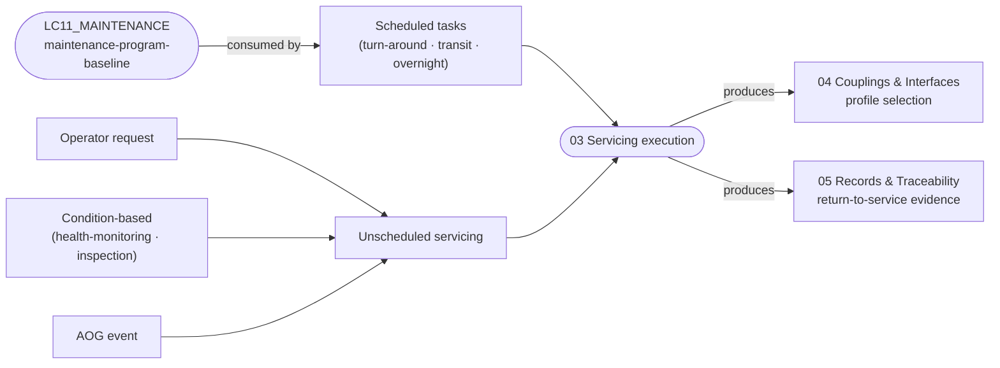

# ATLAS 010-019 · Section 01 · Subsection 020 · Subsubject 013 — Scheduled and Unscheduled Servicing

## 1. Purpose

Defines how *servicing* tasks are **scheduled** (per the maintenance program — AMM/MPD) and **triggered unscheduled** (operator request, condition-based monitoring, AOG events) within the *servicing* subsection (`020`) of ATLAS `010-019.01`. This subsubject is the **operational realisation** of the maintenance program defined in the AMPEL360-AIR-T `LC11_MAINTENANCE/` SSOT — the cross-reference is **bidirectional**: this file *consumes* the program baseline (via the YAML front-matter `consumes` field) and does **not** redefine intervals, task cards or AMM/MPD content. Anchored to **ATA 12** (Servicing)[^ata12], in conformance with the controlled Q+ATLANTIDE baseline[^baseline] and S1000D[^s1000d], with quality assurance per AS9100D[^as9100d].

## 2. Scope

- Covers the *Scheduled and Unscheduled Servicing* subsubject (`013`) of subsection `020` *servicing*.
- Inherits Q-Division authority and ORB support from the parent row in [`../../README.md` §3](../../README.md#3-architecture-table)[^archtable].
- **Scheduled servicing** — operational realisation:
  - Task selection per the active maintenance program baseline (`LC11_MAINTENANCE/maintenance-program-baseline`, machine-readable via the front-matter `consumes` field).
  - Mapping of program tasks to servicing regimes (turn-around / transit / overnight) defined in subsubject `011`.
  - Task-card execution evidence flows to subsubject `015` (records and traceability).
- **Unscheduled servicing** — trigger model:
  - **Operator request** — out-of-program top-up, asymmetry correction, or carrier-specified preparation.
  - **Condition-based** — triggered by health-monitoring or inspection finding (e.g. sensed oil quantity outside band, hydraulic-system anomaly, battery state-of-health threshold).
  - **AOG handling** — Aircraft-on-Ground escalation: priority service, parts/fluids logistics, return-to-service evidence chain (handover to subsubject `015`).
- **Bidirectional cross-reference contract.**
  - *Consumed (read-only here):* `LC11_MAINTENANCE/maintenance-program-baseline` — intervals, task definitions, AMM/MPD content.
  - *Produced (written here):* the operational mapping (task → regime → GSE/coupling profile → record schema). This output is consumed by subsubjects `014` and `015` and by the carrier's day-of-operations planning.
- Out of scope: definition of intervals or task cards (LC11_MAINTENANCE), coupling specifications (subsubject `014`), record format (subsubject `015`), and ground-handling positioning of GSE (`../010_Ground-handling/04`).

## 3. Diagram

The diagram below shows the bidirectional contract with the maintenance-program SSOT and the trigger model for unscheduled servicing.

## 4. Footprint

| Metric | Value |
|---|---|
| Architecture | `ATLAS` — Aircraft Top-Level Architecture System |
| Master range | `000–099` |
| Code range | `010-019` |
| Section | `01` — Manejo en Tierra & Servicio |
| Subject | `00` — General Information |
| Subsection | `020` — servicing |
| Subsubject | `013` — Scheduled and Unscheduled Servicing |
| Primary Q-Division | Q-GROUND[^qdiv] |
| Support Q-Divisions | Q-MECHANICS, Q-INDUSTRY |
| ORB support | ORB-PMO, ORB-FIN |
| Governance class | `baseline`[^gov] |
| Folder path | `Q+ATLANTIDE/000-099_ATLAS/010-019_Manejo-en-Tierra-Servicio/020_servicing/` |
| Document | `013_Scheduled-and-Unscheduled-Servicing.md` (this file) |
| Consumes (machine-readable) | `LC11_MAINTENANCE/maintenance-program-baseline` |
| Parent subsection | [`010_Overview.md`](./010_Overview.md) |
| Parent architecture | [`../../README.md`](../../README.md) |
| Parent baseline | [`organization/Q+ATLANTIDE.md`](../../../../organization/Q+ATLANTIDE.md) |

## 5. References & Citations

[^baseline]: **Q+ATLANTIDE controlled baseline (v1.0.0)** — [`organization/Q+ATLANTIDE.md`](../../../../organization/Q+ATLANTIDE.md). Defines the controlled `000-999` architecture-band taxonomy and the ATLAS-1000 register subpart.

[^archtable]: **ATLAS §3 Architecture Table** — [`../../README.md` §3](../../README.md#3-architecture-table). Authoritative source for the `010-019` row (Section `01` — Manejo en Tierra & Servicio, Primary Q-Division Q-GROUND).

[^qdiv]: **Q-Division authority** — Q-Divisions provide technical authority over an architecture row (Q+ATLANTIDE Note N-002). See [`organization/Q+ATLANTIDE.md` §4](../../../../organization/Q+ATLANTIDE.md#4-notes).

[^gov]: **Governance class** — Bands are classified as `baseline` or `restricted` per Q+ATLANTIDE §4 governance rules.

[^ata12]: **ATA Chapter 12 — Servicing** — Industry chapter covering routine servicing tasks performed during turn-around and overnight stops; canonical scope reference for ATLAS subsection `020`.

[^ata2200]: **ATA iSpec 2200 — Information Standards for Aviation Maintenance** — Industry standard for digital aircraft maintenance information; governs chapter / section / subject numbering inherited by ATLAS `000-099`.

[^ataspec100]: **ATA Spec 100 — Manufacturers' Technical Data** — Predecessor numbering scheme that established the 00–99 chapter map mirrored by ATLAS sub-ranges.

[^s1000d]: **S1000D Issue 6.0 — International specification for technical publications** — Common Source DataBase (CSDB) and Data Module Code (DMC) specification used across ATLAS technical publications.

[^as9100d]: **AS9100D — Quality Management Systems — Aviation, Space and Defense Organizations** — Quality-management baseline for all Q+ATLANTIDE deliverables.

### Applicable industry standards

The following ATA-family and industry standards apply to this subsubject in addition to the cross-cutting Q+ATLANTIDE governance:

- ATA Chapter 12 — Servicing[^ata12]
- ATA iSpec 2200 — Information Standards for Aviation Maintenance[^ata2200]
- ATA Spec 100 — Manufacturers' Technical Data[^ataspec100]
- S1000D Issue 6.0 — International specification for technical publications[^s1000d]
- AS9100D — Quality Management Systems — Aviation, Space and Defense Organizations[^as9100d]
