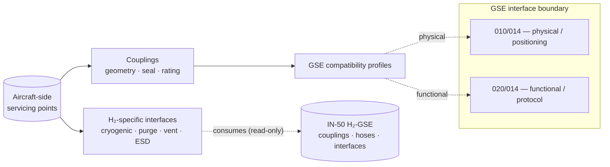

# ATLAS 010-019 · Section 01 · Subsection 020 · Subsubject 014 — Servicing Points, Couplings and Interfaces

## 1. Purpose

Catalogues the **aircraft-side servicing points** and the **coupling specifications** through which the consumables defined in subsubject `012` are delivered, and the **GSE compatibility profiles** consumed by the carrier's day-of-operations planning. Establishes the **functional servicing surface** of the aircraft (what flows, at what rate, under what protocol) — explicitly distinct from the **physical/positioning surface** owned by [`../010_Ground-handling/014_Ground-Support-Equipment-Interfaces.md`](../010_Ground-handling/014_Ground-Support-Equipment-Interfaces.md). Anchored to **ATA 12** (Servicing)[^ata12] with chapter overlays to **ATA 28 / 28-10**[^ata28], **ATA 38**[^ata38] and **ATA 47**[^ata47]; for AMPEL360 LH₂, the H₂-specific coupling spec is consumed (read-only here) from the WTW infrastructure overlay `OPT-INS_FRAMEWORK/I-INFRASTRUCTURES/ATA_IN_H2_GSE_AND_SUPPLY_CHAIN/IN-50-h2-gse-couplings-hoses-interfaces/`. In conformance with the controlled Q+ATLANTIDE baseline[^baseline] and S1000D[^s1000d].

## 2. Scope

- Covers the *Servicing Points, Couplings and Interfaces* subsubject (`014`) of subsection `020` *servicing*.
- Inherits Q-Division authority and ORB support from the parent row in [`../../README.md` §3](../../README.md#3-architecture-table)[^archtable].
- **Aircraft-side servicing points.** Per consumable family: location on the airframe, access door / panel reference, illumination/lighting requirement, marking and labelling per ATA iSpec 2200[^ata2200].
- **Coupling specifications.** Geometry, sealing class, pressure/temperature rating, electrical bonding/grounding, leak-detection and emergency-disconnect provisions. Each coupling is mapped to the consumable family it serves (subsubject `012`) and to the GSE-profile catalogue used by ground operations.
- **GSE compatibility.** Profile-matching matrix — for each aircraft servicing point, the set of GSE profiles known to be compatible (nozzle/coupling pairing, max flow, max pressure, electrical bonding interface). Day-of-operations selection logic is owned by the carrier's planning layer; this subsubject only defines the *compatibility surface*.
- **H₂-specific interfaces.** LH₂ servicing requires (a) cryogenic-rated coupling with vacuum-insulated transfer hose, (b) two-stage seal (process + secondary containment), (c) inert-purge interface for line conditioning, (d) vent-recapture connection where boil-off is recovered, (e) electrical bonding and ESD provisions matching the H₂-zone classification. The canonical hardware specification is **not** redefined here — it lives in `IN-50-h2-gse-couplings-hoses-interfaces/`. This subsubject defines only the *aircraft-side* interface and the cross-reference contract.
- **Boundary clause (re-stated for clarity).** `010/014` defines *where* the GSE parks and *how* it connects mechanically; `020/014` (this file) defines *what* flows through the connection, *at what rate* and *under what protocol*. See [`010_Overview.md` §2](./010_Overview.md#2-scope) for the authoritative statement of the boundary.
- Out of scope: replenishment regimes and limits (subsubject `012`), task scheduling (subsubject `013`), record formats (subsubject `015`), GSE positioning and exclusion zones (`../010_Ground-handling/03` and `04`), and H₂-GSE hardware design (owned by the supply-chain overlay).

## 3. Diagram

The diagram below shows the functional-vs-physical split with subsection `010` and the H₂-specific overlay consumed from the WTW infrastructure spec.

## 4. Footprint

| Metric | Value |
|---|---|
| Architecture | `ATLAS` — Aircraft Top-Level Architecture System |
| Master range | `000–099` |
| Code range | `010-019` |
| Section | `01` — Manejo en Tierra & Servicio |
| Subject | `00` — General Information |
| Subsection | `020` — servicing |
| Subsubject | `014` — Servicing Points, Couplings and Interfaces |
| Primary Q-Division | Q-GROUND[^qdiv] |
| Support Q-Divisions | Q-MECHANICS, Q-INDUSTRY |
| ORB support | ORB-PMO, ORB-FIN |
| Governance class | `baseline`[^gov] |
| Folder path | `Q+ATLANTIDE/000-099_ATLAS/010-019_Manejo-en-Tierra-Servicio/020_servicing/` |
| Document | `014_Servicing-Points-Couplings-and-Interfaces.md` (this file) |
| ATA chapters | `12`, `28`, `28-10`, `38`, `47` |
| Infrastructure overlay | `OPT-INS_FRAMEWORK/I-INFRASTRUCTURES/ATA_12-SERVICING_INFRA/` |
| H₂-GSE supply-chain ref | `OPT-INS_FRAMEWORK/I-INFRASTRUCTURES/ATA_IN_H2_GSE_AND_SUPPLY_CHAIN/IN-50-h2-gse-couplings-hoses-interfaces/` |
| Sibling boundary | [`../010_Ground-handling/014_Ground-Support-Equipment-Interfaces.md`](../010_Ground-handling/014_Ground-Support-Equipment-Interfaces.md) |
| Parent subsection | [`010_Overview.md`](./010_Overview.md) |
| Parent architecture | [`../../README.md`](../../README.md) |
| Parent baseline | [`organization/Q+ATLANTIDE.md`](../../../../organization/Q+ATLANTIDE.md) |

## 5. References & Citations

[^baseline]: **Q+ATLANTIDE controlled baseline (v1.0.0)** — [`organization/Q+ATLANTIDE.md`](../../../../organization/Q+ATLANTIDE.md). Defines the controlled `000-999` architecture-band taxonomy and the ATLAS-1000 register subpart.

[^archtable]: **ATLAS §3 Architecture Table** — [`../../README.md` §3](../../README.md#3-architecture-table). Authoritative source for the `010-019` row (Section `01` — Manejo en Tierra & Servicio, Primary Q-Division Q-GROUND).

[^qdiv]: **Q-Division authority** — Q-Divisions provide technical authority over an architecture row (Q+ATLANTIDE Note N-002). See [`organization/Q+ATLANTIDE.md` §4](../../../../organization/Q+ATLANTIDE.md#4-notes).

[^gov]: **Governance class** — Bands are classified as `baseline` or `restricted` per Q+ATLANTIDE §4 governance rules.

[^ata12]: **ATA Chapter 12 — Servicing** — Industry chapter covering routine servicing tasks performed during turn-around and overnight stops.

[^ata28]: **ATA Chapter 28 — Fuel** (incl. ATA 28-10 storage) — Industry chapter covering aircraft fuel systems and storage; ATA 28-10 is the canonical interface for the AMPEL360 LH₂ storage subsystem.

[^ata38]: **ATA Chapter 38 — Water/Waste** — Industry chapter covering potable-water uplift and lavatory/waste servicing.

[^ata47]: **ATA Chapter 47 — Inert-gas (N₂)** — Industry chapter covering nitrogen-generation and inerting servicing.

[^ata2200]: **ATA iSpec 2200 — Information Standards for Aviation Maintenance** — Industry standard for digital aircraft maintenance information; governs chapter / section / subject numbering inherited by ATLAS `000-099`.

[^ataspec100]: **ATA Spec 100 — Manufacturers' Technical Data** — Predecessor numbering scheme that established the 00–99 chapter map mirrored by ATLAS sub-ranges.

[^s1000d]: **S1000D Issue 6.0 — International specification for technical publications** — Common Source DataBase (CSDB) and Data Module Code (DMC) specification used across ATLAS technical publications.

[^as9100d]: **AS9100D — Quality Management Systems — Aviation, Space and Defense Organizations** — Quality-management baseline for all Q+ATLANTIDE deliverables.

### Applicable industry standards

The following ATA-family and industry standards apply to this subsubject in addition to the cross-cutting Q+ATLANTIDE governance:

- ATA Chapter 12 — Servicing[^ata12]
- ATA Chapter 28 — Fuel (incl. 28-10 storage)[^ata28]
- ATA Chapter 38 — Water/Waste[^ata38]
- ATA Chapter 47 — Inert-gas (N₂)[^ata47]
- ATA iSpec 2200 — Information Standards for Aviation Maintenance[^ata2200]
- ATA Spec 100 — Manufacturers' Technical Data[^ataspec100]
- S1000D Issue 6.0 — International specification for technical publications[^s1000d]
- AS9100D — Quality Management Systems — Aviation, Space and Defense Organizations[^as9100d]
