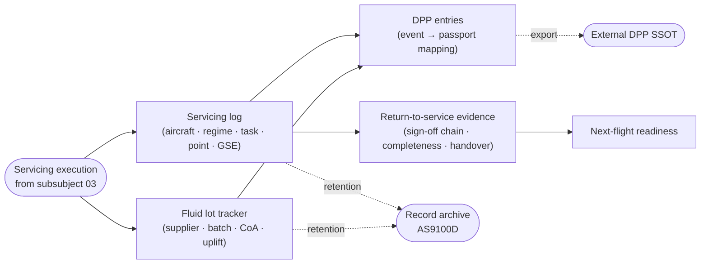

# ATLAS 010-019 · Section 01 · Subsection 020 · Subsubject 015 — Servicing Records and Traceability

## 1. Purpose

Defines the **servicing-log requirements**, **fluid lot tracking**, **DPP (Digital Product Passport) entries** and the **post-servicing return-to-service evidence** produced by the activities described in subsubjects `012`–`014`. Establishes the record schema, retention rules and chain-of-custody contract that downstream systems (carrier MIS, regulator audit, DPP exporter) consume. Anchored to **ATA 12** (Servicing)[^ata12] with quality assurance per AS9100D[^as9100d], in conformance with the controlled Q+ATLANTIDE baseline[^baseline] and S1000D[^s1000d].

## 2. Scope

- Covers the *Servicing Records and Traceability* subsubject (`015`) of subsection `020` *servicing*.
- Inherits Q-Division authority and ORB support from the parent row in [`../../README.md` §3](../../README.md#3-architecture-table)[^archtable].
- **Servicing log requirements.** For each servicing event: aircraft identification, regime (turn-around / transit / overnight / AOG — per subsubject `011`), task reference (scheduled program task or unscheduled trigger — per subsubject `013`), consumable family and quantity (per subsubject `012`), aircraft-side servicing point and coupling profile used (per subsubject `014`), GSE asset identifier, operator and supervisor identities, start/finish timestamps, environmental conditions where relevant.
- **Fluid lot tracking.** Per consumable batch: supplier, lot/batch identifier, certificate of analysis reference, uplift quantity per aircraft, residual quantity in GSE bowser. Mandatory for fuel (incl. LH₂), oil, hydraulic fluid, oxygen and nitrogen; optional but recommended for water.
- **DPP entries.** Servicing events that affect the aircraft's Digital Product Passport (e.g. cumulative cycles on a coupling, LH₂ uplift contributing to lifetime energy throughput, water-system sanitisation cycles) are written to the DPP via the controlled DPP-export contract. The DPP schema and exporter are external to this subsubject; this file defines only the *event-to-DPP mapping*.
- **Post-servicing return-to-service evidence.** Sign-off chain (operator → supervisor → release-to-service authority), mandatory-fields completeness check, anomaly handover to line-maintenance when servicing-time findings exceed the servicing scope, and the explicit pointer to the next-flight readiness check.
- **Retention.** Per AS9100D[^as9100d] and the carrier's record-retention policy; minimum retention durations for fluid-lot evidence and DPP entries are inherited from the parent baseline.
- Out of scope: definition of the maintenance-program task cards (LC11_MAINTENANCE), DPP schema and exporter (external SSOT), and audit/regulatory workflow (downstream of this subsubject).

## 3. Diagram

The diagram below shows the data flow from servicing execution into the log, the lot tracker, the DPP exporter and the return-to-service evidence chain.

## 4. Footprint

| Metric | Value |
|---|---|
| Architecture | `ATLAS` — Aircraft Top-Level Architecture System |
| Master range | `000–099` |
| Code range | `010-019` |
| Section | `01` — Manejo en Tierra & Servicio |
| Subject | `00` — General Information |
| Subsection | `020` — servicing |
| Subsubject | `015` — Servicing Records and Traceability |
| Primary Q-Division | Q-GROUND[^qdiv] |
| Support Q-Divisions | Q-MECHANICS, Q-INDUSTRY |
| ORB support | ORB-PMO, ORB-FIN |
| Governance class | `baseline`[^gov] |
| Folder path | `Q+ATLANTIDE/000-099_ATLAS/010-019_Manejo-en-Tierra-Servicio/020_servicing/` |
| Document | `015_Servicing-Records-and-Traceability.md` (this file) |
| Parent subsection | [`010_Overview.md`](./010_Overview.md) |
| Parent architecture | [`../../README.md`](../../README.md) |
| Parent baseline | [`organization/Q+ATLANTIDE.md`](../../../../organization/Q+ATLANTIDE.md) |

## 5. References & Citations

[^baseline]: **Q+ATLANTIDE controlled baseline (v1.0.0)** — [`organization/Q+ATLANTIDE.md`](../../../../organization/Q+ATLANTIDE.md). Defines the controlled `000-999` architecture-band taxonomy and the ATLAS-1000 register subpart.

[^archtable]: **ATLAS §3 Architecture Table** — [`../../README.md` §3](../../README.md#3-architecture-table). Authoritative source for the `010-019` row (Section `01` — Manejo en Tierra & Servicio, Primary Q-Division Q-GROUND).

[^qdiv]: **Q-Division authority** — Q-Divisions provide technical authority over an architecture row (Q+ATLANTIDE Note N-002). See [`organization/Q+ATLANTIDE.md` §4](../../../../organization/Q+ATLANTIDE.md#4-notes).

[^gov]: **Governance class** — Bands are classified as `baseline` or `restricted` per Q+ATLANTIDE §4 governance rules.

[^ata12]: **ATA Chapter 12 — Servicing** — Industry chapter covering routine servicing tasks performed during turn-around and overnight stops.

[^ata2200]: **ATA iSpec 2200 — Information Standards for Aviation Maintenance** — Industry standard for digital aircraft maintenance information; governs chapter / section / subject numbering inherited by ATLAS `000-099`.

[^ataspec100]: **ATA Spec 100 — Manufacturers' Technical Data** — Predecessor numbering scheme that established the 00–99 chapter map mirrored by ATLAS sub-ranges.

[^s1000d]: **S1000D Issue 6.0 — International specification for technical publications** — Common Source DataBase (CSDB) and Data Module Code (DMC) specification used across ATLAS technical publications.

[^as9100d]: **AS9100D — Quality Management Systems — Aviation, Space and Defense Organizations** — Quality-management baseline for all Q+ATLANTIDE deliverables.

### Applicable industry standards

The following ATA-family and industry standards apply to this subsubject in addition to the cross-cutting Q+ATLANTIDE governance:

- ATA Chapter 12 — Servicing[^ata12]
- ATA iSpec 2200 — Information Standards for Aviation Maintenance[^ata2200]
- ATA Spec 100 — Manufacturers' Technical Data[^ataspec100]
- S1000D Issue 6.0 — International specification for technical publications[^s1000d]
- AS9100D — Quality Management Systems — Aviation, Space and Defense Organizations[^as9100d]
