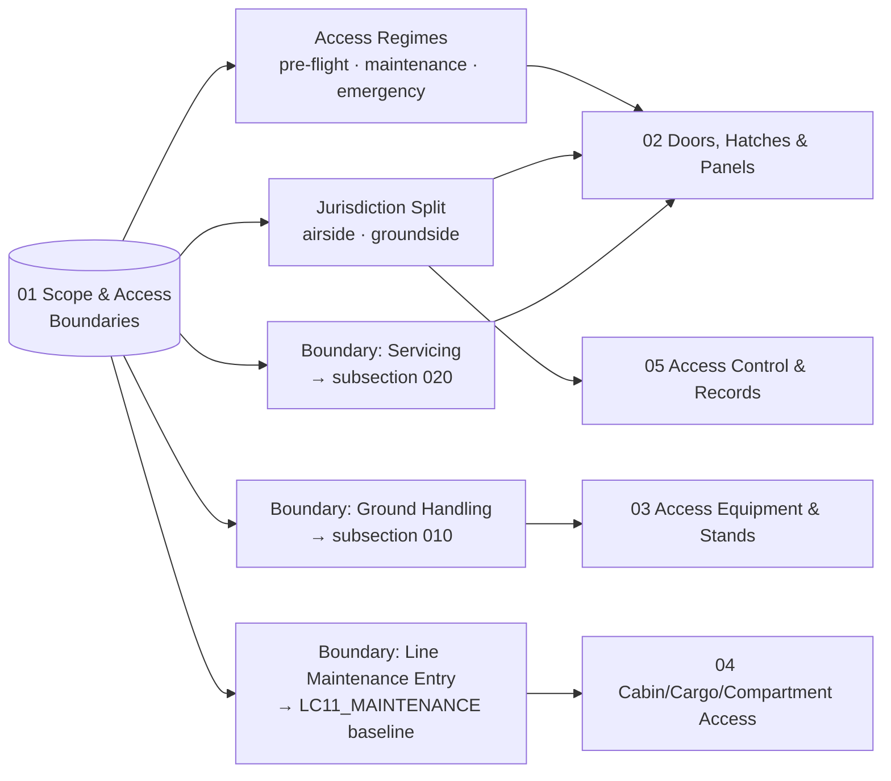

# ATLAS 010-019 · Section 01 · Subsection 030 · Subsubject 011 — Scope and Access Boundaries

## 1. Purpose

Establishes the **scope boundary** of the *acceso* subsection (`030`) within ATLAS `010-019.01` *Manejo en Tierra & Servicio* and the **boundary clauses** that separate *access* from adjacent activities — *ground handling* (subsection `010`), *servicing* (subsection `020`) and *line maintenance entry* (LC11_MAINTENANCE workflows). Fixes the controlled vocabulary for **pre-flight access**, **maintenance access** and **emergency access**, and for the **airside / groundside** split of the access perimeter, so that the downstream subsubjects (`012`–`015`) — doors/hatches/panels, access GSE, cabin/cargo/compartment access and access-control records — share a single semantic model on the ATA iSpec 2200 / Spec 100 information set[^ata2200][^ataspec100][^s1000d], in conformance with the controlled Q+ATLANTIDE baseline[^baseline] and the access-related ATA chapters[^ata06][^ata52][^ata50][^ata25].

## 2. Scope

- Covers the *Scope and Access Boundaries* subsubject (`011`) of subsection `030` *acceso* within section `01` *Manejo en Tierra & Servicio*.
- Inherits Q-Division authority and ORB support from the parent row in [`../../README.md` §3](../../README.md#3-architecture-table)[^archtable].
- **In scope** — the access activity boundary:
  - **Access vs. servicing.** *Access* opens the aircraft envelope (door, hatch, panel) to enable presence; *servicing* (subsection `020`) drives flow through a coupling once the access surface is open. Coupling engagement itself is *servicing*; opening the service door that exposes the coupling is *access*. The shared boundary is restated in [`../020_servicing/010_Overview.md` §2](../020_servicing/010_Overview.md#2-scope) and in the parent [`./010_Overview.md` §2](./010_Overview.md#2-scope).
  - **Access vs. ground handling.** *Ground handling* (subsection `010`) covers the *positioning* of GSE and the *safety perimeter* up to the aircraft skin; *access* takes over at the aircraft envelope and governs how that envelope is opened, by whom and under what conditions. GSE positioning *at* a door is ground handling; engaging the door, hatch or panel is access.
  - **Access vs. maintenance entry.** Maintenance *entry* (presence inside a compartment to perform a task) consumes the access surface defined here but executes against the maintenance program baseline at `AMPEL360-AIR-T/LC11_MAINTENANCE/`. The access decision (open/closed, authorized/not, safe/not) is owned by this subsection; the *task* performed once inside is owned by line maintenance.
  - **Access regimes.** *Pre-flight access* (boarding, catering, cabin preparation, cargo loading), *maintenance access* (scheduled and unscheduled bay/panel access for inspection or task execution), and *emergency access* (egress and rescue paths under abnormal conditions). Emergency access procedures are *consumed* from ATA 25 and the operator's emergency procedures and are not redefined here.
  - **Airside / groundside split.** The access perimeter is partitioned by the airside boundary: airside access (ramp side, requires airside authorization) vs. groundside access (terminal/jet-bridge head, governed by terminal operator). Door population that straddles the boundary (e.g. main pax door served by jet bridge) is treated under subsubject `012` with explicit jurisdiction tags.
- **Out of scope.** Towing/pushback (subsection `040`), parking configurations (subsection `050`), GSE pool management (subsection `060`), the maintenance-program *definition* itself (LC11_MAINTENANCE SSOT), and the active replenishment treated under subsection `020`. Upstream H₂-bay access procedures consumed from `OPT-INS_FRAMEWORK/I-INFRASTRUCTURES/ATA_85-FUEL_CELL_SYSTEMS_INFRA/85-20-h2-handling-safety-permits-for-fcs/` are referenced from subsubjects `012` and `014` but not redefined here.
- Boundary clauses are surfaced as S1000D `terminology` and `applicability` entries on the ATA iSpec 2200 information set[^ata2200][^s1000d] and quality-controlled per AS9100D[^as9100d].

## 3. Diagram

The diagram below shows how the *access* boundary partitions the activity space across adjacent subsections and the three access regimes.

## 4. Footprint

| Metric | Value |
|---|---|
| Architecture | `ATLAS` — Aircraft Top-Level Architecture System |
| Master range | `000–099` |
| Code range | `010-019` |
| Section | `01` — Manejo en Tierra & Servicio |
| Subject | `00` — General Information |
| Subsection | `030` — acceso |
| Subsubject | `011` — Scope and Access Boundaries |
| Primary Q-Division | Q-GROUND[^qdiv] |
| Support Q-Divisions | Q-MECHANICS, Q-INDUSTRY |
| ORB support | ORB-PMO, ORB-FIN |
| Governance class | `baseline`[^gov] |
| Folder path | `Q+ATLANTIDE/000-099_ATLAS/010-019_Manejo-en-Tierra-Servicio/030_acceso/` |
| Document | `011_Scope-and-Access-Boundaries.md` (this file) |
| Parent subsection | [`010_Overview.md`](./010_Overview.md) |
| Parent architecture | [`../../README.md`](../../README.md) |
| Parent baseline | [`organization/Q+ATLANTIDE.md`](../../../../organization/Q+ATLANTIDE.md) |

## 5. References & Citations

[^baseline]: **Q+ATLANTIDE controlled baseline (v1.0.0)** — [`organization/Q+ATLANTIDE.md`](../../../../organization/Q+ATLANTIDE.md). Defines the controlled `000-999` architecture-band taxonomy and the ATLAS-1000 register subpart.

[^archtable]: **ATLAS §3 Architecture Table** — [`../../README.md` §3](../../README.md#3-architecture-table). Authoritative source for the `010-019` row (Section `01` — Manejo en Tierra & Servicio, Primary Q-Division Q-GROUND).

[^qdiv]: **Q-Division authority** — Q-Divisions provide technical authority over an architecture row (Q+ATLANTIDE Note N-002). See [`organization/Q+ATLANTIDE.md` §4](../../../../organization/Q+ATLANTIDE.md#4-notes).

[^gov]: **Governance class** — Bands are classified as `baseline` or `restricted` per Q+ATLANTIDE §4 governance rules.

[^ata06]: **ATA Chapter 06 — Dimensions and Areas** — Industry chapter establishing the spatial geometry of the aircraft (stations, water-lines, buttock-lines, zones); canonical reference for what is physically reachable and from where.

[^ata25]: **ATA Chapter 25 — Equipment / Furnishings** — Industry chapter covering cabin equipment, monuments and furnishings; reference for cabin access paths and clearance.

[^ata50]: **ATA Chapter 50 — Cargo and Accessory Compartments** — Industry chapter covering cargo and accessory-compartment construction and access.

[^ata52]: **ATA Chapter 52 — Doors** — Industry chapter covering passenger, crew, service, cargo and emergency doors, including opening sequences and safety interlocks.

[^ata2200]: **ATA iSpec 2200 — Information Standards for Aviation Maintenance** — Industry standard for digital aircraft maintenance information; governs chapter / section / subject numbering inherited by ATLAS `000-099`.

[^ataspec100]: **ATA Spec 100 — Manufacturers' Technical Data** — Predecessor numbering scheme that established the 00–99 chapter map mirrored by ATLAS sub-ranges.

[^s1000d]: **S1000D Issue 6.0 — International specification for technical publications** — Common Source DataBase (CSDB) and Data Module Code (DMC) specification used across ATLAS technical publications.

[^as9100d]: **AS9100D — Quality Management Systems — Aviation, Space and Defense Organizations** — Quality-management baseline for all Q+ATLANTIDE deliverables.

### Applicable industry standards

The following ATA-family and industry standards apply to this subsubject in addition to the cross-cutting Q+ATLANTIDE governance:

- ATA Chapter 06 — Dimensions and Areas[^ata06]
- ATA Chapter 25 — Equipment / Furnishings[^ata25]
- ATA Chapter 50 — Cargo and Accessory Compartments[^ata50]
- ATA Chapter 52 — Doors[^ata52]
- ATA iSpec 2200 — Information Standards for Aviation Maintenance[^ata2200]
- ATA Spec 100 — Manufacturers' Technical Data[^ataspec100]
- S1000D Issue 6.0 — International specification for technical publications[^s1000d]
- AS9100D — Quality Management Systems — Aviation, Space and Defense Organizations[^as9100d]
