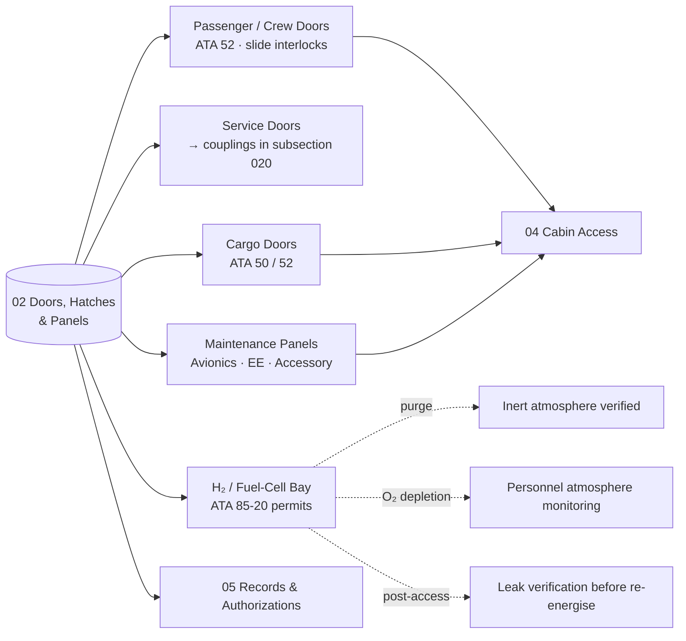

# ATLAS 010-019 · Section 01 · Subsection 030 · Subsubject 012 — Access: Doors, Hatches and Panels

## 1. Purpose

Defines the **door, hatch and panel population** of the AMPEL360 access surface and the **opening/closing procedures, sequences and safety interlocks** that govern their operation on the ramp, in the hangar and at maintenance bays. Fixes the access vocabulary for *passenger and crew doors*, *service doors*, *cargo doors* and *maintenance access panels* (avionics bay, fuel cell bay, H₂ bay), and the interlock and permit-to-open conditions that gate each opening event, in conformance with the controlled Q+ATLANTIDE baseline[^baseline] and ATA Chapter 52 — Doors[^ata52], with cargo-bay and accessory-compartment overlap referred to ATA Chapter 50[^ata50] and spatial geometry to ATA Chapter 06[^ata06]. H₂-bay access conditions are *consumed* from the upstream H₂-handling-and-permits baseline[^h2permits] and are not redefined here.

## 2. Scope

- Covers the *Doors, Hatches and Panels* subsubject (`012`) of subsection `030` *acceso* within section `01` *Manejo en Tierra & Servicio*.
- Inherits Q-Division authority and ORB support from the parent row in [`../../README.md` §3](../../README.md#3-architecture-table)[^archtable].
- **Door / hatch / panel families.**
  - **Passenger and crew doors** — main pax doors, overwing emergency exits, flight-crew entry. Opening sequencing tied to slide arming/disarming per ATA 52[^ata52]; jurisdiction tagging per the airside/groundside split stated in [`./011_Scope-and-Access-Boundaries.md` §2](./011_Scope-and-Access-Boundaries.md#2-scope).
  - **Service doors** — galley, cabin attendant, lavatory-service, potable-water and waste-service doors. The door itself is access; the coupling on the other side is *servicing* (subsection `020`).
  - **Cargo doors** — main, aft, bulk and accessory cargo. Cargo-door operation references ATA 50[^ata50] for the compartment construction and ATA 52[^ata52] for door mechanics; mutual-exclusion interlocks with adjacent loaders are surfaced in subsubject `014`.
  - **Maintenance access panels** — avionics bay, EE-bay, fuel-cell bay, **H₂ bay** (LH₂ storage and distribution), accessory compartments, control-surface inspection panels and aerodynamic fairings.
- **Opening sequences and interlocks.** Each access object declares an *open precondition set* (positioning state, system state, permit state) and a *post-open obligation set* (logging, status broadcast, scheduled re-close). The H₂-bay access object additionally declares:
  - a **purge precondition** (inert atmosphere verified) sourced from the upstream H₂ handling baseline[^h2permits];
  - an **oxygen-depletion permit** (personnel atmospheric monitoring active);
  - a **post-access leak verification** obligation prior to re-energising the bay.
  These three obligations have *no analogue on kerosene aircraft* and are mandatory for any LH₂ / fuel-cell bay access event under the AMPEL360 configuration.
- **Cross-references.**
  - Internal access paths reached *through* doors and panels are treated under [`./014_Cabin-Cargo-and-Compartment-Access.md`](./014_Cabin-Cargo-and-Compartment-Access.md).
  - Authorizations and event records for each opening are governed by [`./015_Access-Control-Authorizations-and-Records.md`](./015_Access-Control-Authorizations-and-Records.md).
  - External GSE used to reach a door (airstairs, work stand) is treated under [`./013_Access-Equipment-Stands-Platforms-and-Ladders.md`](./013_Access-Equipment-Stands-Platforms-and-Ladders.md).
- All door/hatch/panel definitions are surfaced as S1000D data modules per Issue 6.0[^s1000d] on the ATA iSpec 2200 information set[^ata2200][^ataspec100] and quality-controlled per AS9100D[^as9100d].

## 3. Diagram

The diagram below shows the access-object families and their interlock / permit chains.

## 4. Footprint

| Metric | Value |
|---|---|
| Architecture | `ATLAS` — Aircraft Top-Level Architecture System |
| Master range | `000–099` |
| Code range | `010-019` |
| Section | `01` — Manejo en Tierra & Servicio |
| Subject | `00` — General Information |
| Subsection | `030` — acceso |
| Subsubject | `012` — Access: Doors, Hatches and Panels |
| Primary Q-Division | Q-GROUND[^qdiv] |
| Support Q-Divisions | Q-MECHANICS, Q-INDUSTRY |
| ORB support | ORB-PMO, ORB-FIN |
| Governance class | `baseline`[^gov] |
| Folder path | `Q+ATLANTIDE/000-099_ATLAS/010-019_Manejo-en-Tierra-Servicio/030_acceso/` |
| Document | `012_Access-Doors-Hatches-and-Panels.md` (this file) |
| Parent subsection | [`010_Overview.md`](./010_Overview.md) |
| Parent architecture | [`../../README.md`](../../README.md) |
| Parent baseline | [`organization/Q+ATLANTIDE.md`](../../../../organization/Q+ATLANTIDE.md) |

## 5. References & Citations

[^baseline]: **Q+ATLANTIDE controlled baseline (v1.0.0)** — [`organization/Q+ATLANTIDE.md`](../../../../organization/Q+ATLANTIDE.md). Defines the controlled `000-999` architecture-band taxonomy and the ATLAS-1000 register subpart.

[^archtable]: **ATLAS §3 Architecture Table** — [`../../README.md` §3](../../README.md#3-architecture-table). Authoritative source for the `010-019` row (Section `01` — Manejo en Tierra & Servicio, Primary Q-Division Q-GROUND).

[^qdiv]: **Q-Division authority** — Q-Divisions provide technical authority over an architecture row (Q+ATLANTIDE Note N-002). See [`organization/Q+ATLANTIDE.md` §4](../../../../organization/Q+ATLANTIDE.md#4-notes).

[^gov]: **Governance class** — Bands are classified as `baseline` or `restricted` per Q+ATLANTIDE §4 governance rules.

[^ata06]: **ATA Chapter 06 — Dimensions and Areas** — Industry chapter establishing the spatial geometry of the aircraft; canonical reference for door-and-panel station/water-line/buttock-line coordinates.

[^ata50]: **ATA Chapter 50 — Cargo and Accessory Compartments** — Industry chapter covering cargo and accessory-compartment construction and access.

[^ata52]: **ATA Chapter 52 — Doors** — Industry chapter covering passenger, crew, service, cargo and emergency doors, including opening sequences and safety interlocks; canonical scope reference for this subsubject.

[^h2permits]: **AMPEL360 H₂ handling and safety permits (FCS)** — Upstream baseline at `OPT-INS_FRAMEWORK/I-INFRASTRUCTURES/ATA_85-FUEL_CELL_SYSTEMS_INFRA/85-20-h2-handling-safety-permits-for-fcs/`. Defines purge, oxygen-depletion and leak-verification permits that gate any access to the H₂ / fuel-cell bay.

[^ata2200]: **ATA iSpec 2200 — Information Standards for Aviation Maintenance** — Industry standard for digital aircraft maintenance information; governs chapter / section / subject numbering inherited by ATLAS `000-099`.

[^ataspec100]: **ATA Spec 100 — Manufacturers' Technical Data** — Predecessor numbering scheme that established the 00–99 chapter map mirrored by ATLAS sub-ranges.

[^s1000d]: **S1000D Issue 6.0 — International specification for technical publications** — Common Source DataBase (CSDB) and Data Module Code (DMC) specification used across ATLAS technical publications.

[^as9100d]: **AS9100D — Quality Management Systems — Aviation, Space and Defense Organizations** — Quality-management baseline for all Q+ATLANTIDE deliverables.

### Applicable industry standards

The following ATA-family and industry standards apply to this subsubject in addition to the cross-cutting Q+ATLANTIDE governance:

- ATA Chapter 06 — Dimensions and Areas[^ata06]
- ATA Chapter 50 — Cargo and Accessory Compartments[^ata50]
- ATA Chapter 52 — Doors[^ata52]
- ATA iSpec 2200 — Information Standards for Aviation Maintenance[^ata2200]
- ATA Spec 100 — Manufacturers' Technical Data[^ataspec100]
- S1000D Issue 6.0 — International specification for technical publications[^s1000d]
- AS9100D — Quality Management Systems — Aviation, Space and Defense Organizations[^as9100d]
