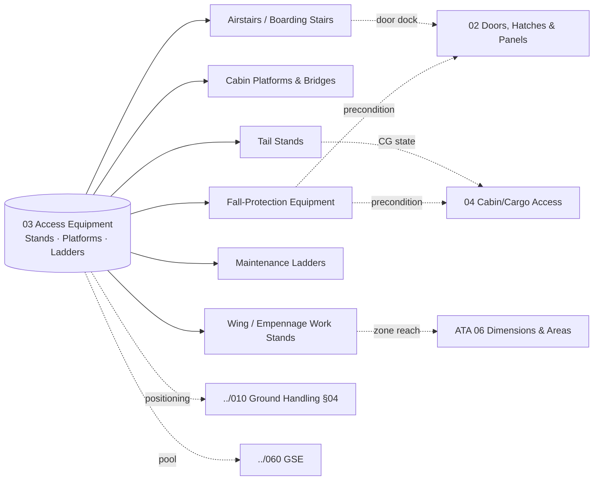

# ATLAS 010-019 · Section 01 · Subsection 030 · Subsubject 013 — Access Equipment: Stands, Platforms and Ladders

## 1. Purpose

Defines the **external access GSE population** that brings personnel to the aircraft access surface — *airstairs*, *cabin platforms*, *tail stands*, *wing/empennage work stands*, *maintenance ladders* and *fall-protection equipment* — and the conditions under which each is selected, positioned and used. The *positioning* of these GSE items as physical objects on the ramp is governed by subsection `010` *Ground handling*; this subsubject covers the *fitness-for-purpose* selection, the *envelope-side* engagement (e.g. airstair docking to a pax door, work stand contact at a fairing) and the *fall-protection* obligations that apply once personnel are at height. Aligned to the controlled Q+ATLANTIDE baseline[^baseline] and to ATA Chapter 06 — Dimensions and Areas[^ata06] for reachability geometry, with cross-references to ATA Chapter 52[^ata52] for door-side engagement.

## 2. Scope

- Covers the *Access Equipment, Stands, Platforms and Ladders* subsubject (`013`) of subsection `030` *acceso* within section `01` *Manejo en Tierra & Servicio*.
- Inherits Q-Division authority and ORB support from the parent row in [`../../README.md` §3](../../README.md#3-architecture-table)[^archtable].
- **GSE families covered.**
  - **Airstairs and boarding stairs** — fixed and self-propelled units serving passenger and crew doors; envelope-side dock requirements and slide-disarm preconditions per [`./012_Access-Doors-Hatches-and-Panels.md`](./012_Access-Doors-Hatches-and-Panels.md).
  - **Cabin platforms and bridges** — over-ramp transit platforms used for boarding without a jet bridge, including step transitions and gap-closing plates.
  - **Tail stands** — empennage support stands deployed for ground-stability when aft loading or aft-bay maintenance shifts CG.
  - **Wing and empennage work stands** — height-adjustable platforms enabling access to wing upper/lower surfaces, leading/trailing edges, fairings and the empennage; selection driven by zone reachability per ATA 06[^ata06].
  - **Maintenance ladders** — A-frame, extension and rolling ladders used for non-platform tasks; subject to fall-protection rules below 1.8 m only when over-edge exposure is present.
  - **Fall-protection equipment** — anchor points, harness systems, lanyards and self-retracting lifelines whose use becomes mandatory when working at height on stands, platforms or aircraft surfaces; the use envelope is a *precondition* of the corresponding access object in `012_` and `014_`.
- **Selection and engagement rules.** Each GSE family declares: (i) the door/panel/zone classes it serves, (ii) the surface-contact protections required (e.g. soft pads on fairings), (iii) the wind/weather thresholds that suspend its use, and (iv) the personnel competency required to operate it. Tail-stand requirement is *triggered by aircraft state* (e.g. heavy aft cargo loading) and is therefore a downstream consumer of the loading sequence in [`./014_Cabin-Cargo-and-Compartment-Access.md`](./014_Cabin-Cargo-and-Compartment-Access.md).
- **Boundary with subsection `010` and `060`.** Physical placement of these GSE items on the ramp (parking footprint, exclusion zone, marshalling) is governed by [`../010_Ground-handling/014_Ground-Support-Equipment-Interfaces.md`](../010_Ground-handling/014_Ground-Support-Equipment-Interfaces.md); fleet/pool management of the GSE inventory is governed by `../060_GSE/`. This subsubject covers the *use-at-the-aircraft* aspect only.
- All access-equipment definitions are surfaced as S1000D data modules per Issue 6.0[^s1000d] on the ATA iSpec 2200 information set[^ata2200][^ataspec100] and quality-controlled per AS9100D[^as9100d].

## 3. Diagram

## 4. Footprint

| Metric | Value |
|---|---|
| Architecture | `ATLAS` — Aircraft Top-Level Architecture System |
| Master range | `000–099` |
| Code range | `010-019` |
| Section | `01` — Manejo en Tierra & Servicio |
| Subject | `00` — General Information |
| Subsection | `030` — acceso |
| Subsubject | `013` — Access Equipment: Stands, Platforms and Ladders |
| Primary Q-Division | Q-GROUND[^qdiv] |
| Support Q-Divisions | Q-MECHANICS, Q-INDUSTRY |
| ORB support | ORB-PMO, ORB-FIN |
| Governance class | `baseline`[^gov] |
| Folder path | `Q+ATLANTIDE/000-099_ATLAS/010-019_Manejo-en-Tierra-Servicio/030_acceso/` |
| Document | `013_Access-Equipment-Stands-Platforms-and-Ladders.md` (this file) |
| Parent subsection | [`010_Overview.md`](./010_Overview.md) |
| Parent architecture | [`../../README.md`](../../README.md) |
| Parent baseline | [`organization/Q+ATLANTIDE.md`](../../../../organization/Q+ATLANTIDE.md) |

## 5. References & Citations

[^baseline]: **Q+ATLANTIDE controlled baseline (v1.0.0)** — [`organization/Q+ATLANTIDE.md`](../../../../organization/Q+ATLANTIDE.md). Defines the controlled `000-999` architecture-band taxonomy and the ATLAS-1000 register subpart.

[^archtable]: **ATLAS §3 Architecture Table** — [`../../README.md` §3](../../README.md#3-architecture-table). Authoritative source for the `010-019` row (Section `01` — Manejo en Tierra & Servicio, Primary Q-Division Q-GROUND).

[^qdiv]: **Q-Division authority** — Q-Divisions provide technical authority over an architecture row (Q+ATLANTIDE Note N-002). See [`organization/Q+ATLANTIDE.md` §4](../../../../organization/Q+ATLANTIDE.md#4-notes).

[^gov]: **Governance class** — Bands are classified as `baseline` or `restricted` per Q+ATLANTIDE §4 governance rules.

[^ata06]: **ATA Chapter 06 — Dimensions and Areas** — Industry chapter establishing aircraft spatial geometry; canonical reference for zone reachability driving stand and platform selection.

[^ata52]: **ATA Chapter 52 — Doors** — Industry chapter covering passenger, crew, service, cargo and emergency doors, including opening sequences and safety interlocks; reference for envelope-side engagement of airstairs and cabin platforms.

[^ata2200]: **ATA iSpec 2200 — Information Standards for Aviation Maintenance** — Industry standard for digital aircraft maintenance information; governs chapter / section / subject numbering inherited by ATLAS `000-099`.

[^ataspec100]: **ATA Spec 100 — Manufacturers' Technical Data** — Predecessor numbering scheme that established the 00–99 chapter map mirrored by ATLAS sub-ranges.

[^s1000d]: **S1000D Issue 6.0 — International specification for technical publications** — Common Source DataBase (CSDB) and Data Module Code (DMC) specification used across ATLAS technical publications.

[^as9100d]: **AS9100D — Quality Management Systems — Aviation, Space and Defense Organizations** — Quality-management baseline for all Q+ATLANTIDE deliverables.

### Applicable industry standards

The following ATA-family and industry standards apply to this subsubject in addition to the cross-cutting Q+ATLANTIDE governance:

- ATA Chapter 06 — Dimensions and Areas[^ata06]
- ATA Chapter 52 — Doors[^ata52]
- ATA iSpec 2200 — Information Standards for Aviation Maintenance[^ata2200]
- ATA Spec 100 — Manufacturers' Technical Data[^ataspec100]
- S1000D Issue 6.0 — International specification for technical publications[^s1000d]
- AS9100D — Quality Management Systems — Aviation, Space and Defense Organizations[^as9100d]
