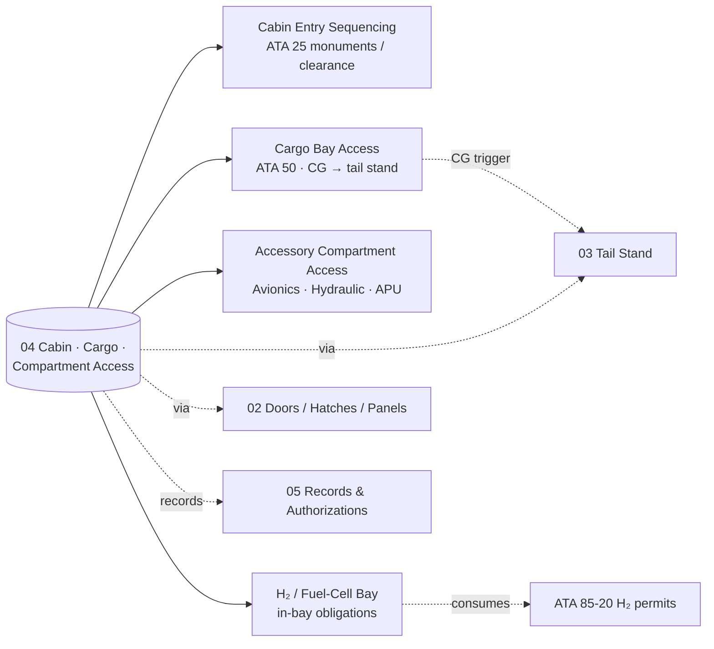

# ATLAS 010-019 · Section 01 · Subsection 030 · Subsubject 014 — Cabin, Cargo and Compartment Access

## 1. Purpose

Defines the **internal access paths** that personnel follow once an access object (door, hatch, panel) is open: *cabin entry sequencing*, *cargo bay access*, *accessory-compartment access* and the **fuel-cell / H₂ bay access procedure**. Establishes the order of operations, clearance and routing constraints, and the personnel-presence permits inside compartments, building on the door/hatch/panel population defined in [`./012_Access-Doors-Hatches-and-Panels.md`](./012_Access-Doors-Hatches-and-Panels.md). Aligned to the controlled Q+ATLANTIDE baseline[^baseline] with mappings to ATA Chapter 25 — Equipment / Furnishings[^ata25] for cabin paths, ATA Chapter 50 — Cargo and Accessory Compartments[^ata50] for cargo and accessory bays, ATA Chapter 06 — Dimensions and Areas[^ata06] for reachability, and the upstream H₂-handling-and-permits baseline[^h2permits] for any LH₂ / fuel-cell bay procedure.

## 2. Scope

- Covers the *Cabin, Cargo and Compartment Access* subsubject (`014`) of subsection `030` *acceso* within section `01` *Manejo en Tierra & Servicio*.
- Inherits Q-Division authority and ORB support from the parent row in [`../../README.md` §3](../../README.md#3-architecture-table)[^archtable].
- **Internal access paths.**
  - **Cabin entry sequencing.** Order of door opening for boarding and disembarkation, monument-clearance routing, jump-seat and crew-rest access, and the catering/cleaning entry windows. References ATA 25[^ata25] for monument geometry and seating clearance.
  - **Cargo bay access.** Entry sequencing for fwd/aft/bulk cargo bays, container loader engagement, manual-loading lanes, restraint-system status as a precondition for human presence, and the **CG-shift trigger** for tail-stand deployment per [`./013_Access-Equipment-Stands-Platforms-and-Ladders.md`](./013_Access-Equipment-Stands-Platforms-and-Ladders.md).
  - **Accessory-compartment access.** Avionics bay (EE-bay) entry, hydraulic-bay entry, APU compartment access; permit chain typically governed by maintenance task authorization under [`./015_Access-Control-Authorizations-and-Records.md`](./015_Access-Control-Authorizations-and-Records.md).
  - **Fuel-cell / H₂ bay access procedure.** *AMPEL360-specific.* The internal-presence procedure consumes the upstream permit set declared in [`./012_Access-Doors-Hatches-and-Panels.md` §2](./012_Access-Doors-Hatches-and-Panels.md#2-scope) and adds the *in-bay obligations*: continuous personnel atmospheric monitoring (O₂, H₂), maximum stay-time per the permit, two-person rule, and a structured exit/leak-check sequence. The bay procedure shall not be authored ahead of, and shall not redefine, the upstream H₂ handling baseline[^h2permits] or the LH₂-storage access procedure at the corresponding ATA 28-10 overlay.
- **Bidirectional cross-references.**
  - The *door/hatch/panel* used to enter is defined in [`./012_Access-Doors-Hatches-and-Panels.md`](./012_Access-Doors-Hatches-and-Panels.md).
  - The *external GSE* used to reach the door (airstair, work stand) is defined in [`./013_Access-Equipment-Stands-Platforms-and-Ladders.md`](./013_Access-Equipment-Stands-Platforms-and-Ladders.md).
  - The *authorization and event record* for any presence inside a compartment is defined in [`./015_Access-Control-Authorizations-and-Records.md`](./015_Access-Control-Authorizations-and-Records.md).
- All internal-access procedures are surfaced as S1000D data modules per Issue 6.0[^s1000d] on the ATA iSpec 2200 information set[^ata2200][^ataspec100] and quality-controlled per AS9100D[^as9100d].

## 3. Diagram

## 4. Footprint

| Metric | Value |
|---|---|
| Architecture | `ATLAS` — Aircraft Top-Level Architecture System |
| Master range | `000–099` |
| Code range | `010-019` |
| Section | `01` — Manejo en Tierra & Servicio |
| Subject | `00` — General Information |
| Subsection | `030` — acceso |
| Subsubject | `014` — Cabin, Cargo and Compartment Access |
| Primary Q-Division | Q-GROUND[^qdiv] |
| Support Q-Divisions | Q-MECHANICS, Q-INDUSTRY |
| ORB support | ORB-PMO, ORB-FIN |
| Governance class | `baseline`[^gov] |
| Folder path | `Q+ATLANTIDE/000-099_ATLAS/010-019_Manejo-en-Tierra-Servicio/030_acceso/` |
| Document | `014_Cabin-Cargo-and-Compartment-Access.md` (this file) |
| Parent subsection | [`010_Overview.md`](./010_Overview.md) |
| Parent architecture | [`../../README.md`](../../README.md) |
| Parent baseline | [`organization/Q+ATLANTIDE.md`](../../../../organization/Q+ATLANTIDE.md) |

## 5. References & Citations

[^baseline]: **Q+ATLANTIDE controlled baseline (v1.0.0)** — [`organization/Q+ATLANTIDE.md`](../../../../organization/Q+ATLANTIDE.md). Defines the controlled `000-999` architecture-band taxonomy and the ATLAS-1000 register subpart.

[^archtable]: **ATLAS §3 Architecture Table** — [`../../README.md` §3](../../README.md#3-architecture-table). Authoritative source for the `010-019` row (Section `01` — Manejo en Tierra & Servicio, Primary Q-Division Q-GROUND).

[^qdiv]: **Q-Division authority** — Q-Divisions provide technical authority over an architecture row (Q+ATLANTIDE Note N-002). See [`organization/Q+ATLANTIDE.md` §4](../../../../organization/Q+ATLANTIDE.md#4-notes).

[^gov]: **Governance class** — Bands are classified as `baseline` or `restricted` per Q+ATLANTIDE §4 governance rules.

[^ata06]: **ATA Chapter 06 — Dimensions and Areas** — Industry chapter establishing aircraft spatial geometry; canonical reference for internal-route reachability.

[^ata25]: **ATA Chapter 25 — Equipment / Furnishings** — Industry chapter covering cabin equipment, monuments and furnishings; canonical reference for cabin entry routing and clearance.

[^ata50]: **ATA Chapter 50 — Cargo and Accessory Compartments** — Industry chapter covering cargo and accessory-compartment construction and access; canonical reference for cargo and accessory-bay entry.

[^h2permits]: **AMPEL360 H₂ handling and safety permits (FCS)** — Upstream baseline at `OPT-INS_FRAMEWORK/I-INFRASTRUCTURES/ATA_85-FUEL_CELL_SYSTEMS_INFRA/85-20-h2-handling-safety-permits-for-fcs/`. Defines purge, oxygen-depletion, in-bay monitoring and post-access leak-verification permits that gate any presence inside the H₂ / fuel-cell bay.

[^ata2200]: **ATA iSpec 2200 — Information Standards for Aviation Maintenance** — Industry standard for digital aircraft maintenance information; governs chapter / section / subject numbering inherited by ATLAS `000-099`.

[^ataspec100]: **ATA Spec 100 — Manufacturers' Technical Data** — Predecessor numbering scheme that established the 00–99 chapter map mirrored by ATLAS sub-ranges.

[^s1000d]: **S1000D Issue 6.0 — International specification for technical publications** — Common Source DataBase (CSDB) and Data Module Code (DMC) specification used across ATLAS technical publications.

[^as9100d]: **AS9100D — Quality Management Systems — Aviation, Space and Defense Organizations** — Quality-management baseline for all Q+ATLANTIDE deliverables.

### Applicable industry standards

The following ATA-family and industry standards apply to this subsubject in addition to the cross-cutting Q+ATLANTIDE governance:

- ATA Chapter 06 — Dimensions and Areas[^ata06]
- ATA Chapter 25 — Equipment / Furnishings[^ata25]
- ATA Chapter 50 — Cargo and Accessory Compartments[^ata50]
- ATA iSpec 2200 — Information Standards for Aviation Maintenance[^ata2200]
- ATA Spec 100 — Manufacturers' Technical Data[^ataspec100]
- S1000D Issue 6.0 — International specification for technical publications[^s1000d]
- AS9100D — Quality Management Systems — Aviation, Space and Defense Organizations[^as9100d]
