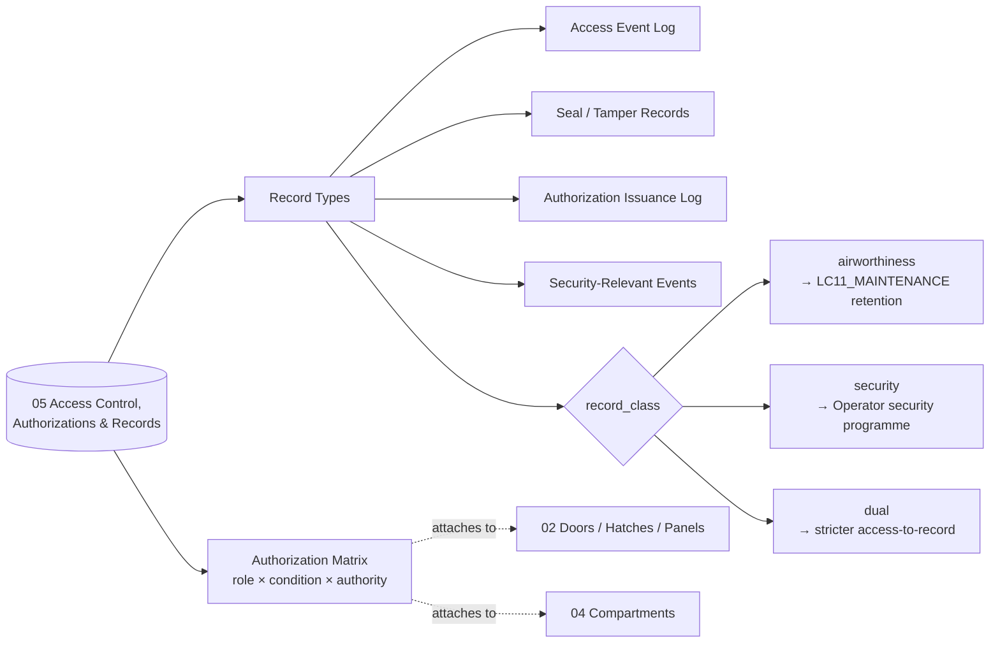

# ATLAS 010-019 · Section 01 · Subsection 030 · Subsubject 015 — Access Control, Authorizations and Records

## 1. Purpose

Defines **who may open what, under what conditions**, and the **records produced** by every access event on the AMPEL360 aircraft: access logs, seal/tamper records and security-relevant access events. Establishes the **dual-use record taxonomy** (airworthiness-mandatory vs. security-mandatory) and the `record_class:` field that disambiguates the two — because the *retention policies* and the *access-to-the-records-themselves* differ between domains. Aligned to the controlled Q+ATLANTIDE baseline[^baseline] and quality-managed per AS9100D[^as9100d], with cross-references to ATA Chapter 52 — Doors[^ata52] and ATA Chapter 50 — Cargo and Accessory Compartments[^ata50] for the access-object population to which the records attach.

## 2. Scope

- Covers the *Access Control, Authorizations and Records* subsubject (`015`) of subsection `030` *acceso* within section `01` *Manejo en Tierra & Servicio*.
- Inherits Q-Division authority and ORB support from the parent row in [`../../README.md` §3](../../README.md#3-architecture-table)[^archtable].
- **Authorization matrix.** Each access object declared in [`./012_Access-Doors-Hatches-and-Panels.md`](./012_Access-Doors-Hatches-and-Panels.md) and each internal compartment declared in [`./014_Cabin-Cargo-and-Compartment-Access.md`](./014_Cabin-Cargo-and-Compartment-Access.md) carries an authorization matrix: role × condition × authority. Conditions include flight phase (between flights, overnight, AOG), system state (powered/unpowered, purged/non-purged for the H₂ bay), and operational state (in-service, maintenance check, storage).
- **Record taxonomy — the `record_class:` field.** Every record-type definition in this subsubject declares a top-level YAML field:
  - `record_class: airworthiness` — required for traceability of maintenance-relevant access (e.g. who opened the avionics bay, when, against which task card). Retention and access governed by the maintenance-records regime (LC11_MAINTENANCE) and applicable airworthiness authority requirements.
  - `record_class: security` — required for unauthorized-access detection and security audit (e.g. tamper-seal status between flights, badge-reader events at the airside boundary). Retention and access governed by the operator security programme.
  - `record_class: dual` — applies where a single event is both airworthiness- and security-relevant (e.g. cargo-door opening at an unmanned overnight stop). Dual records are stored once but exposed under both retention regimes; the *access-to-the-record-itself* is the *more restrictive* of the two.
- **Record types covered.**
  - **Access event log** — door/hatch/panel open/close events with operator identity, role, authority basis, timestamp and (where applicable) the maintenance task card or boarding-process reference.
  - **Seal and tamper records** — physical and electronic seals applied at end of operations; status verified at next opening.
  - **Authorization issuance log** — permits to open H₂-bay, EE-bay or other restricted compartments, including the upstream permit reference (e.g. H₂ purge permit from `OPT-INS_FRAMEWORK/I-INFRASTRUCTURES/ATA_85-FUEL_CELL_SYSTEMS_INFRA/85-20-h2-handling-safety-permits-for-fcs/`).
  - **Security-relevant access events** — events occurring outside the authorization matrix (forced/abnormal opening, badge-without-permit attempts), automatically classified `record_class: security`.
- **Boundary with security domain.** This subsection *defines* the airworthiness-side of access records and *interfaces* with the security domain through the `record_class:` field. The security programme remains the SSOT for security-only artefacts (badge issuance, security clearances, threat-based access restrictions); this subsubject does not redefine it.
- All record-type definitions are surfaced as S1000D data modules per Issue 6.0[^s1000d] on the ATA iSpec 2200 information set[^ata2200][^ataspec100] and quality-controlled per AS9100D[^as9100d].

## 3. Diagram

## 4. Footprint

| Metric | Value |
|---|---|
| Architecture | `ATLAS` — Aircraft Top-Level Architecture System |
| Master range | `000–099` |
| Code range | `010-019` |
| Section | `01` — Manejo en Tierra & Servicio |
| Subject | `00` — General Information |
| Subsection | `030` — acceso |
| Subsubject | `015` — Access Control, Authorizations and Records |
| Primary Q-Division | Q-GROUND[^qdiv] |
| Support Q-Divisions | Q-MECHANICS, Q-INDUSTRY |
| ORB support | ORB-PMO, ORB-FIN |
| Governance class | `baseline`[^gov] |
| Folder path | `Q+ATLANTIDE/000-099_ATLAS/010-019_Manejo-en-Tierra-Servicio/030_acceso/` |
| Document | `015_Access-Control-Authorizations-and-Records.md` (this file) |
| Parent subsection | [`010_Overview.md`](./010_Overview.md) |
| Parent architecture | [`../../README.md`](../../README.md) |
| Parent baseline | [`organization/Q+ATLANTIDE.md`](../../../../organization/Q+ATLANTIDE.md) |

## 5. References & Citations

[^baseline]: **Q+ATLANTIDE controlled baseline (v1.0.0)** — [`organization/Q+ATLANTIDE.md`](../../../../organization/Q+ATLANTIDE.md). Defines the controlled `000-999` architecture-band taxonomy and the ATLAS-1000 register subpart.

[^archtable]: **ATLAS §3 Architecture Table** — [`../../README.md` §3](../../README.md#3-architecture-table). Authoritative source for the `010-019` row (Section `01` — Manejo en Tierra & Servicio, Primary Q-Division Q-GROUND).

[^qdiv]: **Q-Division authority** — Q-Divisions provide technical authority over an architecture row (Q+ATLANTIDE Note N-002). See [`organization/Q+ATLANTIDE.md` §4](../../../../organization/Q+ATLANTIDE.md#4-notes).

[^gov]: **Governance class** — Bands are classified as `baseline` or `restricted` per Q+ATLANTIDE §4 governance rules.

[^ata50]: **ATA Chapter 50 — Cargo and Accessory Compartments** — Industry chapter covering cargo and accessory-compartment construction and access; reference for the compartment population to which the records attach.

[^ata52]: **ATA Chapter 52 — Doors** — Industry chapter covering passenger, crew, service, cargo and emergency doors, including opening sequences and safety interlocks; reference for the door population to which the records attach.

[^ata2200]: **ATA iSpec 2200 — Information Standards for Aviation Maintenance** — Industry standard for digital aircraft maintenance information; governs chapter / section / subject numbering inherited by ATLAS `000-099`.

[^ataspec100]: **ATA Spec 100 — Manufacturers' Technical Data** — Predecessor numbering scheme that established the 00–99 chapter map mirrored by ATLAS sub-ranges.

[^s1000d]: **S1000D Issue 6.0 — International specification for technical publications** — Common Source DataBase (CSDB) and Data Module Code (DMC) specification used across ATLAS technical publications.

[^as9100d]: **AS9100D — Quality Management Systems — Aviation, Space and Defense Organizations** — Quality-management baseline for all Q+ATLANTIDE deliverables.

### Applicable industry standards

The following ATA-family and industry standards apply to this subsubject in addition to the cross-cutting Q+ATLANTIDE governance:

- ATA Chapter 50 — Cargo and Accessory Compartments[^ata50]
- ATA Chapter 52 — Doors[^ata52]
- ATA iSpec 2200 — Information Standards for Aviation Maintenance[^ata2200]
- ATA Spec 100 — Manufacturers' Technical Data[^ataspec100]
- S1000D Issue 6.0 — International specification for technical publications[^s1000d]
- AS9100D — Quality Management Systems — Aviation, Space and Defense Organizations[^as9100d]
