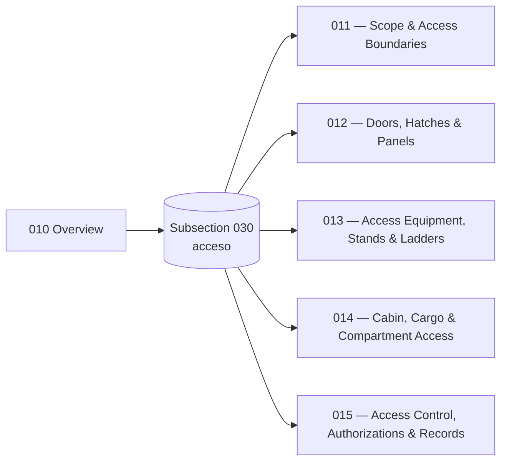

# ATLAS 010-019 · Section 01 · Subsection 030 — acceso

## 1. Purpose

Subsection-level index for *acceso* (`030`) within ATLAS `010-019` — *Manejo en Tierra & Servicio*. Aggregates the `010 Overview` and the detailed subsubjects (`011`–`015`) that extend it with the canonical scope/boundary clauses, the door/hatch/panel population and interlocks, the external access GSE (stands/platforms/ladders), the internal access paths (cabin/cargo/compartment, including the AMPEL360 LH₂ / fuel-cell bay procedure) and the access-control authorization and record taxonomy, in conformance with the controlled Q+ATLANTIDE baseline[^baseline] and S1000D Issue 6.0[^s1000d]. Maps to **ATA 06 — Dimensions and Areas**[^ata06], **ATA 25 — Equipment / Furnishings**[^ata25], **ATA 50 — Cargo and Accessory Compartments**[^ata50] and **ATA 52 — Doors**[^ata52]; the H₂-bay access overlay is *consumed* (read-only) from `OPT-INS_FRAMEWORK/I-INFRASTRUCTURES/ATA_85-FUEL_CELL_SYSTEMS_INFRA/85-20-h2-handling-safety-permits-for-fcs/`.

## 2. Scope

- Covers the full subsubject namespace `010`–`019` of subsection `030` *acceso*; subsubjects `011`–`015` are populated in this baseline release, the remaining `016`–`019` slots remain available for future extension per the Overview's authorisation[^archtable].
- Inherits Q-Division authority and ORB support from the parent row in [`../../README.md` §3](../../README.md#3-architecture-table)[^archtable].
- **Boundary triangulation with subsections `010` and `020`.** Restated for navigation:
  - **Ground handling** (`010`) = aircraft *positioning*, *safety perimeter*, GSE *physical placement*. See [`../010_Ground-handling/010_Overview.md`](../010_Ground-handling/010_Overview.md).
  - **Servicing** (`020`) = active *flow through coupling interfaces*. See [`../020_servicing/010_Overview.md`](../020_servicing/010_Overview.md).
  - **Access** (`030`, this) = *opening the aircraft envelope* to enable presence.

## 3. Diagram

The diagram below shows how this subsection's `00 Overview` aggregates the populated subsubjects (`011`–`015`) into the *acceso* slice of ATLAS `010-019`.

## 4. Subsubject Index

| 01N | Title | Document | Status |
|---:|---|---|---|
| 010 | Overview | [`010_Overview.md`](./010_Overview.md) | active |
| 011 | Scope and Access Boundaries | [`011_Scope-and-Access-Boundaries.md`](./011_Scope-and-Access-Boundaries.md) | active |
| 012 | Access: Doors, Hatches and Panels | [`012_Access-Doors-Hatches-and-Panels.md`](./012_Access-Doors-Hatches-and-Panels.md) | active |
| 013 | Access Equipment: Stands, Platforms and Ladders | [`013_Access-Equipment-Stands-Platforms-and-Ladders.md`](./013_Access-Equipment-Stands-Platforms-and-Ladders.md) | active |
| 014 | Cabin, Cargo and Compartment Access | [`014_Cabin-Cargo-and-Compartment-Access.md`](./014_Cabin-Cargo-and-Compartment-Access.md) | active |
| 015 | Access Control, Authorizations and Records | [`015_Access-Control-Authorizations-and-Records.md`](./015_Access-Control-Authorizations-and-Records.md) | active |

## 5. Sibling Subsections (010-019 range)

| Code | Subsection | Document |
|---|---|---|
| `010` | Ground handling | [`../010_Ground-handling/README.md`](../010_Ground-handling/README.md) |
| `020` | servicing | [`../020_servicing/README.md`](../020_servicing/README.md) |
| `030` | acceso (this) | [`./README.md`](./README.md) |
| `040` | remolque | [`../040_remolque/README.md`](../040_remolque/README.md) |
| `050` | parking | [`../050_parking/010_Overview.md`](../050_parking/010_Overview.md) |
| `060` | GSE | [`../060_GSE/010_Overview.md`](../060_GSE/010_Overview.md) |

## 6. Footprint

| Metric | Value |
|---|---|
| Architecture | `ATLAS` — Aircraft Top-Level Architecture System |
| Master range | `000–099` |
| Code range | `010-019` |
| Section | `01` — Manejo en Tierra & Servicio |
| Subject | `00` — General Information |
| Subsection | `030` — acceso |
| Subsubject namespace | `010`–`019` (`010` + `011`–`015` populated; canonical `01N_*.md` scheme) |
| Primary Q-Division | Q-GROUND[^qdiv] |
| Support Q-Divisions | Q-MECHANICS, Q-INDUSTRY |
| ORB support | ORB-PMO, ORB-FIN |
| Governance class | `baseline`[^gov] |
| Folder path | `Q+ATLANTIDE/000-099_ATLAS/010-019_Manejo-en-Tierra-Servicio/030_acceso/` |
| Document | `README.md` (this file) |
| Parent architecture | [`../../README.md`](../../README.md) |
| Parent baseline | [`organization/Q+ATLANTIDE.md`](../../../../organization/Q+ATLANTIDE.md) |

## Governance

Governed by [`organization/Q+ATLANTIDE.md`](../../../../organization/Q+ATLANTIDE.md)[^baseline]. All subsubjects under this subsection inherit `architecture_code = ATLAS`, `primary_q_division = Q-GROUND` and `governance_class = baseline` from the parent ATLAS band; extensions added under `016`–`019` shall preserve those header fields, follow the canonical `01N_*.md` naming scheme, and reuse the footnote set declared below. Cross-subsection references with `010_Ground-handling/` and `020_servicing/` shall preserve the *positioning vs. flow vs. envelope-opening* triangulation stated in [`./010_Overview.md` §2](./010_Overview.md#2-scope), in [`../010_Ground-handling/010_Overview.md` §2](../010_Ground-handling/010_Overview.md#2-scope) and in [`../020_servicing/010_Overview.md` §2](../020_servicing/010_Overview.md#2-scope). Subsubjects `012` and `014` consume the H₂-handling-and-permits baseline at `OPT-INS_FRAMEWORK/I-INFRASTRUCTURES/ATA_85-FUEL_CELL_SYSTEMS_INFRA/85-20-h2-handling-safety-permits-for-fcs/` (machine-readable via the documents' front-matter `consumes` field) and shall not redefine it. Subsubject `015` records carry a top-level `record_class:` field (`airworthiness` / `security` / `dual`) that determines retention regime and access-to-the-record-itself.

## 7. Change Log

| Version | Date | Author | Change |
|---|---|---|---|
| 1.0.0 | 2026-05-06 | Q-GROUND | Initial population of subsection `030 acceso`: README + Overview enrichment (diagram, ATA 06/25/50/52 cross-refs, H₂-bay flag, boundary triangulation with `010`/`020`) + subsubjects `011`–`015`. |

## 8. References & Citations

[^baseline]: **Q+ATLANTIDE controlled baseline (v1.0.0)** — [`organization/Q+ATLANTIDE.md`](../../../../organization/Q+ATLANTIDE.md). Defines the controlled `000-999` architecture-band taxonomy and the ATLAS-1000 register subpart.

[^archtable]: **ATLAS §3 Architecture Table** — [`../../README.md` §3](../../README.md#3-architecture-table). Authoritative source for the `010-019` row (Section `01` — Manejo en Tierra & Servicio, Primary Q-Division Q-GROUND).

[^qdiv]: **Q-Division authority** — Q-Divisions provide technical authority over an architecture row (Q+ATLANTIDE Note N-002). See [`organization/Q+ATLANTIDE.md` §4](../../../../organization/Q+ATLANTIDE.md#4-notes).

[^gov]: **Governance class** — Bands are classified as `baseline` or `restricted` per Q+ATLANTIDE §4 governance rules.

[^ata06]: **ATA Chapter 06 — Dimensions and Areas** — Industry chapter establishing the spatial geometry of the aircraft (stations, water-lines, buttock-lines, zones); canonical reference for what is physically reachable and from where.

[^ata25]: **ATA Chapter 25 — Equipment / Furnishings** — Industry chapter covering cabin equipment, monuments and furnishings; reference for cabin access paths and clearance.

[^ata50]: **ATA Chapter 50 — Cargo and Accessory Compartments** — Industry chapter covering cargo and accessory-compartment construction and access.

[^ata52]: **ATA Chapter 52 — Doors** — Industry chapter covering passenger, crew, service, cargo and emergency doors, including opening sequences and safety interlocks.

[^ata2200]: **ATA iSpec 2200 — Information Standards for Aviation Maintenance** — Industry standard for digital aircraft maintenance information; governs chapter / section / subject numbering inherited by ATLAS `000-099`.

[^ataspec100]: **ATA Spec 100 — Manufacturers' Technical Data** — Predecessor numbering scheme that established the 00–99 chapter map mirrored by ATLAS sub-ranges.

[^s1000d]: **S1000D Issue 6.0 — International specification for technical publications** — Common Source DataBase (CSDB) and Data Module Code (DMC) specification used across ATLAS technical publications.

[^as9100d]: **AS9100D — Quality Management Systems — Aviation, Space and Defense Organizations** — Quality-management baseline for all Q+ATLANTIDE deliverables.

### Applicable industry standards

The following ATA-family and industry standards apply to this subsection in addition to the cross-cutting Q+ATLANTIDE governance:

- ATA Chapter 06 — Dimensions and Areas[^ata06]
- ATA Chapter 25 — Equipment / Furnishings[^ata25]
- ATA Chapter 50 — Cargo and Accessory Compartments[^ata50]
- ATA Chapter 52 — Doors[^ata52]
- ATA iSpec 2200 — Information Standards for Aviation Maintenance[^ata2200]
- ATA Spec 100 — Manufacturers' Technical Data[^ataspec100]
- S1000D Issue 6.0 — International specification for technical publications[^s1000d]
- AS9100D — Quality Management Systems — Aviation, Space and Defense Organizations[^as9100d]
