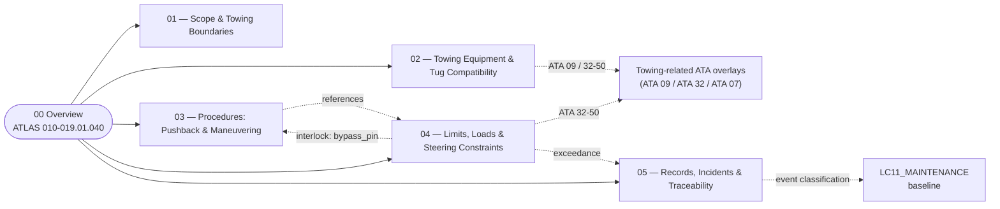

# ATLAS 010-019 · Section 01 · Subsection 040 — remolque

## 1. Purpose

Overview entry-point for the *remolque* subsection within the `010-019` code range (Section `01` — *Manejo en Tierra & Servicio*) of the **ATLAS** architecture band (*Aircraft Top-Level Architecture System*, master range `000–099`).

This subsubject (`00 Overview`) introduces the ATLAS 010-019.040.00 slice and links it to the controlled Q+ATLANTIDE baseline[^baseline] and to the applicable industry standards listed in §5. *Remolque* (towing) is the **controlled translation of the aircraft on the ground under external motive power** — pushback away from the gate, repositioning to/from the hangar, towing between maintenance bays. It is operationally and dimensionally distinct from *taxiing* (which is *self-powered* under engine thrust and is therefore **not** in this chapter).

## 2. Scope

- Covers the *remolque* slice of the parent code range `010-019` — i.e. **towbar and towbarless tow operations, pushback, maneuvering under external power, the tug/tractor compatibility matrix, the towing limits and steering interlocks, and the towing-event record set** that together define the controlled-translation regime of the AMPEL360 aircraft on the ground.
- Inherits Q-Division authority and ORB support from the parent row in [`../../README.md` §3](../../README.md#3-architecture-table)[^archtable].
- Maps to the following ATA chapters as canonical scope references:
  - **ATA 09 — Towing and Taxiing**[^ata09] for the primary towing/pushback procedural baseline. (Taxiing is referenced for boundary clarity but is owned upstream — see §2 boundary clauses.)
  - **ATA 32 — Landing Gear**[^ata32], in particular the **32-50 Steering** subchapter, for nose-gear steering limits, bypass-pin interlocks and torque-link integrity that bound any tow event.
  - **ATA 07 — Lifting and Shoring**[^ata07] for adjacency on related gear-load handling (jacking, weight-on-wheels considerations during ground moves).
- **Boundary triangulation with sibling subsections `010`, `020` and `030`.** Restated symmetrically across the lead Overviews so the partition stays clean:
  - **Ground handling** (`010`) = aircraft *positioning*, *safety perimeter*, GSE *physical placement*. See [`../010_Ground-handling/010_Overview.md`](../010_Ground-handling/010_Overview.md).
  - **Servicing** (`020`) = active *flow through coupling interfaces* (fluids, gases, energy). See [`../020_servicing/010_Overview.md`](../020_servicing/010_Overview.md).
  - **Access** (`030`) = *opening the aircraft envelope* to enable presence inside or at compartments. See [`../030_acceso/010_Overview.md`](../030_acceso/010_Overview.md).
  - **Remolque** (`040`, this) = *controlled translation* of the aircraft on the ground under *external* motive power.
  Worked examples: nose-gear bypass-pin insertion and towbar engagement belong to *remolque*; positioning the tug at the nose belongs to *ground handling*; opening the EE-bay panel for the tow brief belongs to *access*; coupling external power for tow lighting belongs to *servicing*.
- **Boundary with self-powered taxiing.** Taxiing under aircraft engine power is *outside* this subsection (it is governed by flight-operations procedures and the ATA 09 *taxiing* subchapter at the operator level). The handover point is the **bypass-pin removal and disconnect** at the end of a tow event, after which the aircraft transitions back to a taxi-capable state.
- **The nose-gear steering bypass is the highest-stakes element of this subsection.** Towing with the bypass pin uninstalled (or installed incorrectly) is one of the most common causes of expensive ground damage on commercial aircraft — sheared steering collars, damaged torque links, gear-retraction interference. Subsubject `014` therefore declares bypass-pin state as a **machine-checkable interlock** in a YAML invariant block at the top of the file, not just as procedural prose.
- **Towbarless tractor compatibility is non-trivial for AMPEL360.** Towbarless tractors clamp directly to the nose-gear and apply lifting forces; they are certified per aircraft type because the gear must tolerate the clamp loads. For a BWB with a non-conventional gear arrangement, the towbarless certification matrix may be sparse or non-existent in early service. Subsubject `012` therefore explicitly states the certified tractor classes and flags any towbarless prohibition, because operators *will* assume parity with conventional aircraft otherwise.
- **The `013_` ↔ `014_` ↔ `015_` chain closes the digital-twin loop.** Procedures (`013_`) reference limits (`014_`); when limits are approached or exceeded, the event is logged (`015_`) with an `event_classification:` field (`nominal` / `inspection_trigger` / `mandatory_inspection` / `damage_event`) and propagates bidirectionally to the maintenance program at `AMPEL360-AIR-T/LC11_MAINTENANCE/`.
- Subsequent subsubjects (`011`–`019`) under this subsection extend this Overview with detailed data modules per S1000D[^s1000d].

## 3. Diagram

The diagram below shows how this subsection's `00 Overview` aggregates the populated subsubjects (`011`–`015`) into the *remolque* slice of ATLAS `010-019`, and how the `013_` ↔ `014_` ↔ `015_` chain closes onto the maintenance program.

## 4. Footprint

| Metric | Value |
|---|---|
| Architecture | `ATLAS` — Aircraft Top-Level Architecture System |
| Master range | `000–099` |
| Code range | `010-019` |
| Section | `01` — Manejo en Tierra & Servicio |
| Subject | `00` — General Information |
| Subsection | `040` — remolque |
| Subsubject | `010` — Overview |
| Primary Q-Division | Q-GROUND[^qdiv] |
| Support Q-Divisions | Q-MECHANICS, Q-INDUSTRY |
| ORB support | ORB-PMO, ORB-FIN |
| Governance class | `baseline`[^gov] |
| Folder path | `Q+ATLANTIDE/000-099_ATLAS/010-019_Manejo-en-Tierra-Servicio/040_remolque/` |
| Document | `010_Overview.md` (this file) |
| Parent architecture | [`../../README.md`](../../README.md) |
| Parent baseline | [`organization/Q+ATLANTIDE.md`](../../../../organization/Q+ATLANTIDE.md) |

## 5. References & Citations

[^baseline]: **Q+ATLANTIDE controlled baseline (v1.0.0)** — [`organization/Q+ATLANTIDE.md`](../../../../organization/Q+ATLANTIDE.md). Defines the controlled `000-999` architecture-band taxonomy and the ATLAS-1000 register subpart.

[^archtable]: **ATLAS §3 Architecture Table** — [`../../README.md` §3](../../README.md#3-architecture-table). Authoritative source for the `010-019` row (Section `01` — Manejo en Tierra & Servicio, Primary Q-Division Q-GROUND).

[^qdiv]: **Q-Division authority** — Q-Divisions provide technical authority over an architecture row (Q+ATLANTIDE Note N-002). See [`organization/Q+ATLANTIDE.md` §4](../../../../organization/Q+ATLANTIDE.md#4-notes).

[^gov]: **Governance class** — Bands are classified as `baseline` or `restricted` per Q+ATLANTIDE §4 governance rules.

[^ata07]: **ATA Chapter 07 — Lifting and Shoring** — Industry chapter covering aircraft jacking, shoring and gear-load handling; adjacency reference for ground moves where weight-on-wheels and gear-load assumptions interact with the towing regime.

[^ata09]: **ATA Chapter 09 — Towing and Taxiing** — Industry chapter covering towing and taxiing operations, including pushback, maintenance towing and self-powered taxiing. Primary canonical reference for this subsection's towing-procedure baseline.

[^ata32]: **ATA Chapter 32 — Landing Gear** — Industry chapter covering landing-gear systems; sub-chapter **32-50 Steering** governs nose-gear steering, the steering bypass-pin interlock and torque-link integrity that constrain any tow event.

[^ata2200]: **ATA iSpec 2200 — Information Standards for Aviation Maintenance** — Industry standard for digital aircraft maintenance information; governs chapter / section / subject numbering inherited by ATLAS `000-099`.

[^ataspec100]: **ATA Spec 100 — Manufacturers' Technical Data** — Predecessor numbering scheme that established the 00–99 chapter map mirrored by ATLAS sub-ranges.

[^s1000d]: **S1000D Issue 6.0 — International specification for technical publications** — Common Source DataBase (CSDB) and Data Module Code (DMC) specification used across ATLAS technical publications.

[^as9100d]: **AS9100D — Quality Management Systems — Aviation, Space and Defense Organizations** — Quality-management baseline for all Q+ATLANTIDE deliverables.

### Applicable industry standards

The following ATA-family and industry standards apply to this subsection in addition to the cross-cutting Q+ATLANTIDE governance:

- ATA Chapter 07 — Lifting and Shoring[^ata07]
- ATA Chapter 09 — Towing and Taxiing[^ata09]
- ATA Chapter 32 — Landing Gear (sub-chapter 32-50 Steering)[^ata32]
- ATA iSpec 2200 — Information Standards for Aviation Maintenance[^ata2200]
- ATA Spec 100 — Manufacturers' Technical Data[^ataspec100]
- S1000D Issue 6.0 — International specification for technical publications[^s1000d]
- AS9100D — Quality Management Systems — Aviation, Space and Defense Organizations[^as9100d]

