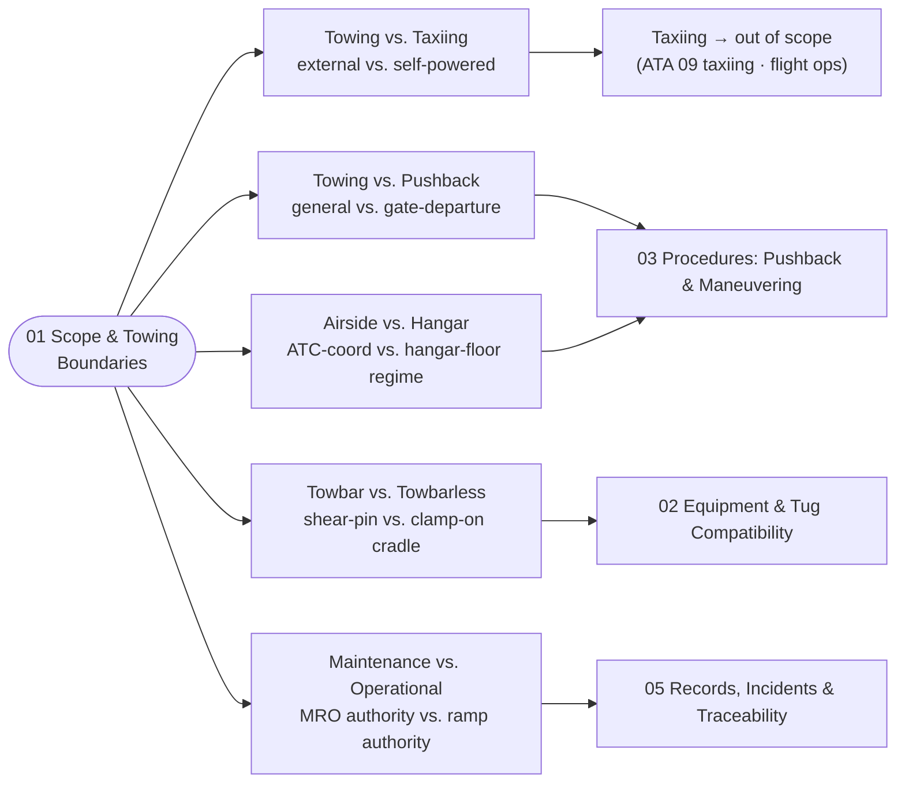

# ATLAS 010-019 · Section 01 · Subsection 040 · Subsubject 011 — Scope and Towing Boundaries

## 1. Purpose

Establishes the **scope boundary** of the *remolque* subsection (`040`) within ATLAS `010-019.01` *Manejo en Tierra & Servicio* and the **boundary clauses** that separate *towing* from adjacent activities — *ground handling* (subsection `010`), *servicing* (subsection `020`), *access* (subsection `030`) and *self-powered taxiing* (out of scope, owned by flight operations under ATA 09 *taxiing*[^ata09]). Fixes the controlled vocabulary for **towing vs. pushback vs. taxiing**, **powered vs. towbarless tugs**, **maintenance towing vs. operational pushback**, and the **airside vs. hangar** towing split, so that the downstream subsubjects (`012`–`015`) — equipment and tug compatibility, procedures, limits and records — share a single semantic model on the ATA iSpec 2200 / Spec 100 information set[^ata2200][^ataspec100][^s1000d], in conformance with the controlled Q+ATLANTIDE baseline[^baseline] and the towing-related ATA chapters[^ata09][^ata32][^ata07].

## 2. Scope

- Covers the *Scope and Towing Boundaries* subsubject (`011`) of subsection `040` *remolque* within section `01` *Manejo en Tierra & Servicio*.
- Inherits Q-Division authority and ORB support from the parent row in [`../../README.md` §3](../../README.md#3-architecture-table)[^archtable].
- **In scope** — the towing activity boundary:
  - **Towing vs. taxiing.** *Towing* is controlled translation of the aircraft on the ground under **external** motive power (a tug or tractor). *Taxiing* is controlled translation under the aircraft's **own** propulsion (engine thrust). The two regimes do not overlap: at the moment the bypass pin is removed and the towbar (or towbarless tractor) disconnected, the aircraft transitions out of the *towing* regime and into the *taxiing* regime. *Taxiing is **out of scope** of this subsection* and is governed by flight-operations procedures and the ATA 09 *taxiing* subchapter at the operator level.
  - **Towing vs. pushback.** *Pushback* is the specific operational sub-case of towing applied to depart the gate (rearward translation away from the parking position, normally short-distance, normally with the engines off, normally with a marshaller/headset). *Towing* is the general case (any direction, any distance, including hangar repositioning and inter-bay maintenance moves). All pushback is towing; not all towing is pushback. Both are governed by this subsection.
  - **Powered (towbarless) vs. towbar tow.** *Towbar tow* uses a rigid towbar with a calibrated shear-pin between the tug and the nose-gear attachment fitting. *Towbarless* (powered tractor) lifts and clamps the nose-gear directly on a cradle and applies traction without a towbar. Both regimes are in scope; the *certification matrix* of which towbarless tractors are approved per AMPEL360 variant is defined in subsubject `012` and may be empty (see Note 2 below).
  - **Maintenance towing vs. operational pushback.** *Operational pushback* (pre-flight, gate-departure) is governed by the operator's ground-handling SOP and is normally executed by ramp staff. *Maintenance towing* (movement to/from hangar, inter-bay moves, post-task repositioning) is governed by the maintenance organisation and may use different speed limits, different authority chains, and different recording requirements. Both regimes share the equipment and limit definitions of subsubjects `012` and `014`; the authority chain split is recorded in subsubject `015`.
  - **Airside vs. hangar towing.** *Airside towing* (ramp, taxiway crossing, remote stand) is conducted under airside operational control with ATC coordination and clearances where required. *Hangar towing* (inside or immediately around the hangar building) is conducted under maintenance-organisation control with the hangar-floor traffic regime. The handover at the hangar door is a coordination point, not a regime change in this subsection.
- **Out of scope.** Self-powered taxiing (ATA 09 *taxiing*, owned by flight operations), parking configurations once the aircraft is stationary (subsection `050`), GSE pool management (subsection `060`), opening the aircraft envelope for the tow brief (subsection `030`), the maintenance-program *definition* itself (`AMPEL360-AIR-T/LC11_MAINTENANCE/`), and crash/recovery towing under abnormal conditions (governed by the operator's emergency-recovery procedures and the airframer's recovery manual).
- Boundary clauses are surfaced as S1000D `terminology` and `applicability` entries on the ATA iSpec 2200 information set[^ata2200][^s1000d] and quality-controlled per AS9100D[^as9100d].

## 3. Diagram

The diagram below shows how the *towing* boundary partitions the activity space across adjacent subsections and the four boundary axes used by this subsubject.

## 4. Footprint

| Metric | Value |
|---|---|
| Architecture | `ATLAS` — Aircraft Top-Level Architecture System |
| Master range | `000–099` |
| Code range | `010-019` |
| Section | `01` — Manejo en Tierra & Servicio |
| Subject | `00` — General Information |
| Subsection | `040` — remolque |
| Subsubject | `011` — Scope and Towing Boundaries |
| Primary Q-Division | Q-GROUND[^qdiv] |
| Support Q-Divisions | Q-MECHANICS, Q-INDUSTRY |
| ORB support | ORB-PMO, ORB-FIN |
| Governance class | `baseline`[^gov] |
| Folder path | `Q+ATLANTIDE/000-099_ATLAS/010-019_Manejo-en-Tierra-Servicio/040_remolque/` |
| Document | `011_Scope-and-Towing-Boundaries.md` (this file) |
| Parent subsection | [`010_Overview.md`](./010_Overview.md) |
| Parent architecture | [`../../README.md`](../../README.md) |
| Parent baseline | [`organization/Q+ATLANTIDE.md`](../../../../organization/Q+ATLANTIDE.md) |

## 5. References & Citations

[^baseline]: **Q+ATLANTIDE controlled baseline (v1.0.0)** — [`organization/Q+ATLANTIDE.md`](../../../../organization/Q+ATLANTIDE.md). Defines the controlled `000-999` architecture-band taxonomy and the ATLAS-1000 register subpart.

[^archtable]: **ATLAS §3 Architecture Table** — [`../../README.md` §3](../../README.md#3-architecture-table). Authoritative source for the `010-019` row (Section `01` — Manejo en Tierra & Servicio, Primary Q-Division Q-GROUND).

[^qdiv]: **Q-Division authority** — Q-Divisions provide technical authority over an architecture row (Q+ATLANTIDE Note N-002). See [`organization/Q+ATLANTIDE.md` §4](../../../../organization/Q+ATLANTIDE.md#4-notes).

[^gov]: **Governance class** — Bands are classified as `baseline` or `restricted` per Q+ATLANTIDE §4 governance rules.

[^ata07]: **ATA Chapter 07 — Lifting and Shoring** — Industry chapter covering aircraft jacking, shoring and gear-load handling; adjacency reference for ground moves where weight-on-wheels and gear-load assumptions interact with the towing regime.

[^ata09]: **ATA Chapter 09 — Towing and Taxiing** — Industry chapter covering towing and taxiing operations, including pushback, maintenance towing and self-powered taxiing. Primary canonical reference for this subsection's towing-procedure baseline.

[^ata32]: **ATA Chapter 32 — Landing Gear** — Industry chapter covering landing-gear systems; sub-chapter **32-50 Steering** governs nose-gear steering, the steering bypass-pin interlock and torque-link integrity that constrain any tow event.

[^ata2200]: **ATA iSpec 2200 — Information Standards for Aviation Maintenance** — Industry standard for digital aircraft maintenance information; governs chapter / section / subject numbering inherited by ATLAS `000-099`.

[^ataspec100]: **ATA Spec 100 — Manufacturers' Technical Data** — Predecessor numbering scheme that established the 00–99 chapter map mirrored by ATLAS sub-ranges.

[^s1000d]: **S1000D Issue 6.0 — International specification for technical publications** — Common Source DataBase (CSDB) and Data Module Code (DMC) specification used across ATLAS technical publications.

[^as9100d]: **AS9100D — Quality Management Systems — Aviation, Space and Defense Organizations** — Quality-management baseline for all Q+ATLANTIDE deliverables.

### Applicable industry standards

The following ATA-family and industry standards apply to this subsubject in addition to the cross-cutting Q+ATLANTIDE governance:

- ATA Chapter 07 — Lifting and Shoring[^ata07]
- ATA Chapter 09 — Towing and Taxiing[^ata09]
- ATA Chapter 32 — Landing Gear (sub-chapter 32-50 Steering)[^ata32]
- ATA iSpec 2200 — Information Standards for Aviation Maintenance[^ata2200]
- ATA Spec 100 — Manufacturers' Technical Data[^ataspec100]
- S1000D Issue 6.0 — International specification for technical publications[^s1000d]
- AS9100D — Quality Management Systems — Aviation, Space and Defense Organizations[^as9100d]
