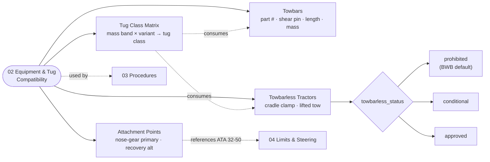

# ATLAS 010-019 · Section 01 · Subsection 040 · Subsubject 012 — Towing Equipment and Tug Compatibility

## 1. Purpose

Defines the **equipment population** used for AMPEL360 towing operations — towbars and their shear-pin ratings, towbarless (powered) tractors, the nose-gear and (where applicable) main-gear attachment points, and the **tug class compatibility matrix** keyed by aircraft mass and gear configuration. Aligned to the controlled Q+ATLANTIDE baseline[^baseline] and to ATA Chapter 09 — Towing and Taxiing[^ata09], with sub-chapter 32-50 Steering[^ata32] for nose-gear interface integrity and ATA Chapter 07 — Lifting and Shoring[^ata07] for adjacency on gear-load handling. Quality-managed per AS9100D[^as9100d] and structured for S1000D Issue 6.0[^s1000d] data-module export on the ATA iSpec 2200 information set[^ata2200][^ataspec100].

## 2. Scope

- Covers the *Towing Equipment and Tug Compatibility* subsubject (`012`) of subsection `040` *remolque* within section `01` *Manejo en Tierra & Servicio*.
- Inherits Q-Division authority and ORB support from the parent row in [`../../README.md` §3](../../README.md#3-architecture-table)[^archtable].
- **Towbar specifications.** Each approved towbar carries a controlled record with: aircraft applicability (variant/MSN range), nose-gear head-fitting type, **shear-pin part number and rated breaking load**, towbar working length, total mass, lighting and electrical bonding, and the calibration / inspection interval. The shear pin is the *designed* failure point: it protects the nose gear by failing before the gear does, so its rating is **not** an operator-tunable parameter.
- **Towbarless (powered) tractor compatibility.** Towbarless tractors clamp directly to the nose-gear and apply lifting forces during traction; they are **certified per aircraft type** because the nose-gear strut, axle, fork and tyre must tolerate the cradle clamp load and the lifted-tow vertical load. Each candidate tractor model carries a controlled record with: maker/model, certified aircraft variants/MSN range, certified mass envelope, maximum certified tow speed, and the supporting certification reference (airframer letter, type-certificate-holder approval or equivalent).
- **AMPEL360 towbarless flag (Note 2 of the Overview).** AMPEL360 is a BWB with a non-conventional gear arrangement, so the towbarless certification matrix may be **sparse or empty** in early service. Until an explicit positive entry exists in the matrix below, **towbarless tow is prohibited** for the affected variant. Operators shall not assume parity with conventional aircraft; a positive entry is required, an absence is a prohibition. The applicable record carries the explicit field:
  - `towbarless_status: prohibited | conditional | approved` (one of), with `prohibited` as the default until a certifying entry is recorded.
- **Attachment-point locations.** The nose-gear towing attachment (towbar head-fitting on the axle or fork, depending on variant) and any approved alternate attachment (e.g. main-gear axle attachment for recovery towing only) are documented with location reference (ATA 06 zones[^ata09] for the spatial geometry), load capacity, and any direction-of-pull restriction. *Recovery towing* attachment points are flagged as recovery-only and are not approved for routine maintenance towing.
- **Tug class compatibility matrix.** Tug classes are mass-capability bins (small / medium / large / heavy). The matrix in §3 maps each AMPEL360 variant and operating mass band to the **minimum tug class** required for towbar tow and to the **certified towbarless tractor models** (or the explicit prohibition).
- **Out of scope.** The actual towing procedure (subsubject `013`), the towing limits and steering interlocks (subsubject `014`), the records produced by an event (subsubject `015`), and GSE pool-management policies (subsection `060`).
- Equipment records are surfaced as S1000D data modules per Issue 6.0[^s1000d] on the ATA iSpec 2200 information set[^ata2200][^ataspec100] and quality-controlled per AS9100D[^as9100d].

## 3. Diagram

## 4. Footprint

| Metric | Value |
|---|---|
| Architecture | `ATLAS` — Aircraft Top-Level Architecture System |
| Master range | `000–099` |
| Code range | `010-019` |
| Section | `01` — Manejo en Tierra & Servicio |
| Subject | `00` — General Information |
| Subsection | `040` — remolque |
| Subsubject | `012` — Towing Equipment and Tug Compatibility |
| Primary Q-Division | Q-GROUND[^qdiv] |
| Support Q-Divisions | Q-MECHANICS, Q-INDUSTRY |
| ORB support | ORB-PMO, ORB-FIN |
| Governance class | `baseline`[^gov] |
| Folder path | `Q+ATLANTIDE/000-099_ATLAS/010-019_Manejo-en-Tierra-Servicio/040_remolque/` |
| Document | `012_Towing-Equipment-and-Tug-Compatibility.md` (this file) |
| Parent subsection | [`010_Overview.md`](./010_Overview.md) |
| Parent architecture | [`../../README.md`](../../README.md) |
| Parent baseline | [`organization/Q+ATLANTIDE.md`](../../../../organization/Q+ATLANTIDE.md) |

## 5. References & Citations

[^baseline]: **Q+ATLANTIDE controlled baseline (v1.0.0)** — [`organization/Q+ATLANTIDE.md`](../../../../organization/Q+ATLANTIDE.md). Defines the controlled `000-999` architecture-band taxonomy and the ATLAS-1000 register subpart.

[^archtable]: **ATLAS §3 Architecture Table** — [`../../README.md` §3](../../README.md#3-architecture-table). Authoritative source for the `010-019` row (Section `01` — Manejo en Tierra & Servicio, Primary Q-Division Q-GROUND).

[^qdiv]: **Q-Division authority** — Q-Divisions provide technical authority over an architecture row (Q+ATLANTIDE Note N-002). See [`organization/Q+ATLANTIDE.md` §4](../../../../organization/Q+ATLANTIDE.md#4-notes).

[^gov]: **Governance class** — Bands are classified as `baseline` or `restricted` per Q+ATLANTIDE §4 governance rules.

[^ata07]: **ATA Chapter 07 — Lifting and Shoring** — Industry chapter covering aircraft jacking, shoring and gear-load handling; adjacency reference for ground moves where weight-on-wheels and gear-load assumptions interact with the towing regime.

[^ata09]: **ATA Chapter 09 — Towing and Taxiing** — Industry chapter covering towing and taxiing operations, including pushback, maintenance towing and self-powered taxiing. Primary canonical reference for this subsection's towing-procedure baseline.

[^ata32]: **ATA Chapter 32 — Landing Gear** — Industry chapter covering landing-gear systems; sub-chapter **32-50 Steering** governs nose-gear steering, the steering bypass-pin interlock and torque-link integrity that constrain any tow event.

[^ata2200]: **ATA iSpec 2200 — Information Standards for Aviation Maintenance** — Industry standard for digital aircraft maintenance information; governs chapter / section / subject numbering inherited by ATLAS `000-099`.

[^ataspec100]: **ATA Spec 100 — Manufacturers' Technical Data** — Predecessor numbering scheme that established the 00–99 chapter map mirrored by ATLAS sub-ranges.

[^s1000d]: **S1000D Issue 6.0 — International specification for technical publications** — Common Source DataBase (CSDB) and Data Module Code (DMC) specification used across ATLAS technical publications.

[^as9100d]: **AS9100D — Quality Management Systems — Aviation, Space and Defense Organizations** — Quality-management baseline for all Q+ATLANTIDE deliverables.

### Applicable industry standards

The following ATA-family and industry standards apply to this subsubject in addition to the cross-cutting Q+ATLANTIDE governance:

- ATA Chapter 07 — Lifting and Shoring[^ata07]
- ATA Chapter 09 — Towing and Taxiing[^ata09]
- ATA Chapter 32 — Landing Gear (sub-chapter 32-50 Steering)[^ata32]
- ATA iSpec 2200 — Information Standards for Aviation Maintenance[^ata2200]
- ATA Spec 100 — Manufacturers' Technical Data[^ataspec100]
- S1000D Issue 6.0 — International specification for technical publications[^s1000d]
- AS9100D — Quality Management Systems — Aviation, Space and Defense Organizations[^as9100d]
