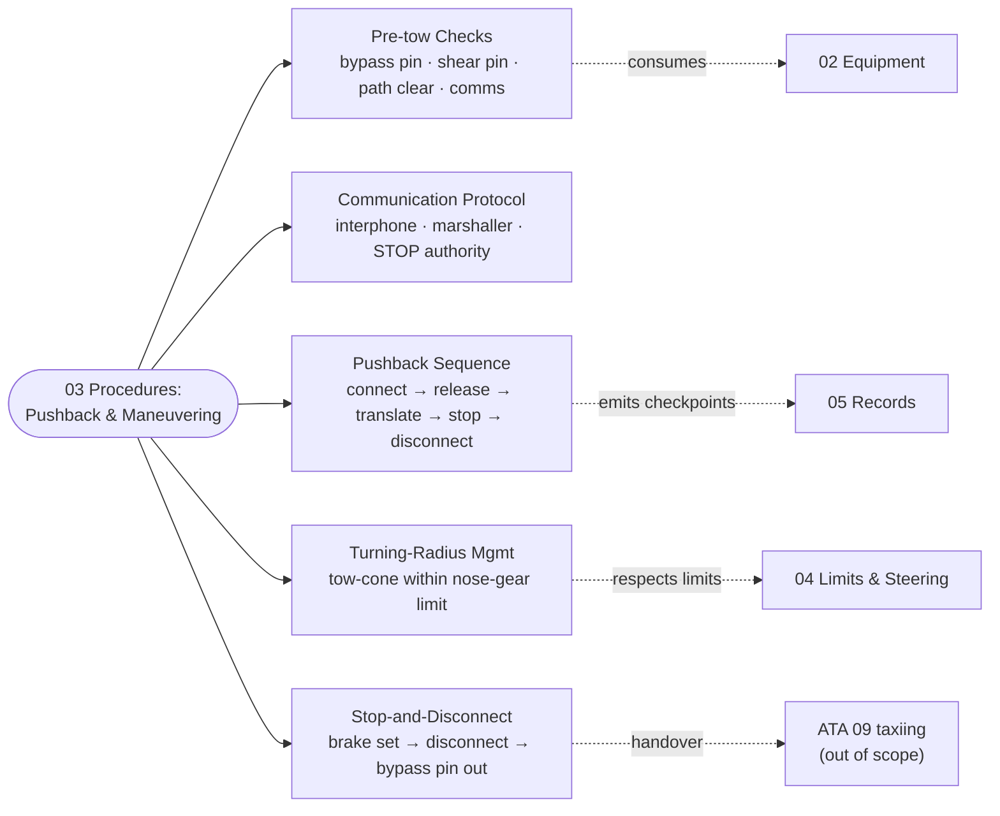

# ATLAS 010-019 · Section 01 · Subsection 040 · Subsubject 013 — Towing Procedures: Pushback and Maneuvering

## 1. Purpose

Defines the **procedural baseline** for AMPEL360 towing and pushback operations — pre-tow checks, the communication protocol between cockpit and ground crew, the pushback sequence, turning-radius management while under tow, and the controlled stop-and-disconnect procedure that hands the aircraft back to either the parking regime (subsection `050`) or the self-powered taxi regime (out of scope, ATA 09 *taxiing*). All procedural steps reference the equipment population from [`./012_Towing-Equipment-and-Tug-Compatibility.md`](./012_Towing-Equipment-and-Tug-Compatibility.md) and respect the limits and interlocks declared in [`./014_Towing-Limits-Loads-and-Steering-Constraints.md`](./014_Towing-Limits-Loads-and-Steering-Constraints.md). Aligned to ATA Chapter 09 — Towing and Taxiing[^ata09], ATA Chapter 32 sub-chapter 32-50 Steering[^ata32], the controlled Q+ATLANTIDE baseline[^baseline], S1000D Issue 6.0[^s1000d] on the ATA iSpec 2200 information set[^ata2200][^ataspec100], and quality-managed per AS9100D[^as9100d].

## 2. Scope

- Covers the *Towing Procedures: Pushback and Maneuvering* subsubject (`013`) of subsection `040` *remolque* within section `01` *Manejo en Tierra & Servicio*.
- Inherits Q-Division authority and ORB support from the parent row in [`../../README.md` §3](../../README.md#3-architecture-table)[^archtable].
- **Pre-tow checks.** The pre-tow checklist verifies, at minimum: (i) the **bypass pin is installed and verified**, (ii) the towbar shear pin is the correct part number and undamaged (or the towbarless tractor is one of the certified models for the variant per [`./012_Towing-Equipment-and-Tug-Compatibility.md` §2](./012_Towing-Equipment-and-Tug-Compatibility.md#2-scope)), (iii) the aircraft is unparked and the parking brake is in the agreed state (set / released per the procedure), (iv) hydraulics powering the brakes are available or the aircraft is on chocks, (v) the path is clear of GSE, FOD and personnel, and (vi) communication with the cockpit is established. The pre-tow checklist is *not optional* and is the first record entry of the tow event in [`./015_Towing-Records-Incidents-and-Traceability.md`](./015_Towing-Records-Incidents-and-Traceability.md).
- **Communication protocol (headset / marshaller).** Towing is conducted with continuous two-way communication between the tow-team leader and the cockpit. The primary mode is **interphone (headset)** plugged into the nose-gear access panel; the secondary mode is **visual marshalling** with standardised hand signals if interphone is unavailable. The protocol declares: who calls "release brakes" (cockpit, on tow-team request), who calls "set brakes" (cockpit, on tow-team request and at the controlled stop), who is authorised to stop the move (any crew member, by calling "STOP" on interphone or showing the stop signal), and the comm-loss reaction (immediate controlled stop and re-establish before resuming).
- **Pushback sequence.** The pushback sequence — connect tug & towbar (or engage towbarless cradle) → verify bypass pin → establish comms → release parking brake on cockpit call → controlled rearward translation under tug power → reach disconnect line → controlled stop → set parking brake → disconnect → remove bypass pin → confirm "all clear, ready to taxi". Each transition is a recordable checkpoint.
- **Turning-radius management.** During any tow that involves steering input (any non-straight push or pull), the tow-team leader monitors the **nose-gear deflection angle** against the limit declared in [`./014_Towing-Limits-Loads-and-Steering-Constraints.md`](./014_Towing-Limits-Loads-and-Steering-Constraints.md). The tug operator does **not** steer beyond a tow-cone that keeps the nose-gear within the certified angle envelope. Approaching the limit triggers a procedural slow-down; reaching the limit triggers an immediate controlled stop and a recorded *limit-approach* event per [`./015_Towing-Records-Incidents-and-Traceability.md`](./015_Towing-Records-Incidents-and-Traceability.md).
- **Stop-and-disconnect.** The disconnect sequence — controlled stop → cockpit sets parking brake → tug confirms forward force off the towbar / clamp → towbar disconnect (or towbarless cradle release) → tug withdraws clear of nose-gear arc → **bypass pin removal** → tow-team leader confirms "bypass pin removed, all clear" to cockpit → cockpit acknowledges → end-of-tow record entry. The bypass pin removal is the formal handover out of the tow regime.
- **Out of scope.** Equipment definition (subsubject `012`), numerical limits and interlocks (subsubject `014`), record taxonomy and event classification (subsubject `015`), and self-powered taxi after disconnect (ATA 09 *taxiing*, owned by flight operations).
- All procedural steps are surfaced as S1000D procedural data modules per Issue 6.0[^s1000d] on the ATA iSpec 2200 information set[^ata2200][^ataspec100] and quality-controlled per AS9100D[^as9100d].

## 3. Diagram

## 4. Footprint

| Metric | Value |
|---|---|
| Architecture | `ATLAS` — Aircraft Top-Level Architecture System |
| Master range | `000–099` |
| Code range | `010-019` |
| Section | `01` — Manejo en Tierra & Servicio |
| Subject | `00` — General Information |
| Subsection | `040` — remolque |
| Subsubject | `013` — Towing Procedures: Pushback and Maneuvering |
| Primary Q-Division | Q-GROUND[^qdiv] |
| Support Q-Divisions | Q-MECHANICS, Q-INDUSTRY |
| ORB support | ORB-PMO, ORB-FIN |
| Governance class | `baseline`[^gov] |
| Folder path | `Q+ATLANTIDE/000-099_ATLAS/010-019_Manejo-en-Tierra-Servicio/040_remolque/` |
| Document | `013_Towing-Procedures-Pushback-and-Maneuvering.md` (this file) |
| Parent subsection | [`010_Overview.md`](./010_Overview.md) |
| Parent architecture | [`../../README.md`](../../README.md) |
| Parent baseline | [`organization/Q+ATLANTIDE.md`](../../../../organization/Q+ATLANTIDE.md) |

## 5. References & Citations

[^baseline]: **Q+ATLANTIDE controlled baseline (v1.0.0)** — [`organization/Q+ATLANTIDE.md`](../../../../organization/Q+ATLANTIDE.md). Defines the controlled `000-999` architecture-band taxonomy and the ATLAS-1000 register subpart.

[^archtable]: **ATLAS §3 Architecture Table** — [`../../README.md` §3](../../README.md#3-architecture-table). Authoritative source for the `010-019` row (Section `01` — Manejo en Tierra & Servicio, Primary Q-Division Q-GROUND).

[^qdiv]: **Q-Division authority** — Q-Divisions provide technical authority over an architecture row (Q+ATLANTIDE Note N-002). See [`organization/Q+ATLANTIDE.md` §4](../../../../organization/Q+ATLANTIDE.md#4-notes).

[^gov]: **Governance class** — Bands are classified as `baseline` or `restricted` per Q+ATLANTIDE §4 governance rules.

[^ata07]: **ATA Chapter 07 — Lifting and Shoring** — Industry chapter covering aircraft jacking, shoring and gear-load handling; adjacency reference for ground moves where weight-on-wheels and gear-load assumptions interact with the towing regime.

[^ata09]: **ATA Chapter 09 — Towing and Taxiing** — Industry chapter covering towing and taxiing operations, including pushback, maintenance towing and self-powered taxiing. Primary canonical reference for this subsection's towing-procedure baseline.

[^ata32]: **ATA Chapter 32 — Landing Gear** — Industry chapter covering landing-gear systems; sub-chapter **32-50 Steering** governs nose-gear steering, the steering bypass-pin interlock and torque-link integrity that constrain any tow event.

[^ata2200]: **ATA iSpec 2200 — Information Standards for Aviation Maintenance** — Industry standard for digital aircraft maintenance information; governs chapter / section / subject numbering inherited by ATLAS `000-099`.

[^ataspec100]: **ATA Spec 100 — Manufacturers' Technical Data** — Predecessor numbering scheme that established the 00–99 chapter map mirrored by ATLAS sub-ranges.

[^s1000d]: **S1000D Issue 6.0 — International specification for technical publications** — Common Source DataBase (CSDB) and Data Module Code (DMC) specification used across ATLAS technical publications.

[^as9100d]: **AS9100D — Quality Management Systems — Aviation, Space and Defense Organizations** — Quality-management baseline for all Q+ATLANTIDE deliverables.

### Applicable industry standards

The following ATA-family and industry standards apply to this subsubject in addition to the cross-cutting Q+ATLANTIDE governance:

- ATA Chapter 07 — Lifting and Shoring[^ata07]
- ATA Chapter 09 — Towing and Taxiing[^ata09]
- ATA Chapter 32 — Landing Gear (sub-chapter 32-50 Steering)[^ata32]
- ATA iSpec 2200 — Information Standards for Aviation Maintenance[^ata2200]
- ATA Spec 100 — Manufacturers' Technical Data[^ataspec100]
- S1000D Issue 6.0 — International specification for technical publications[^s1000d]
- AS9100D — Quality Management Systems — Aviation, Space and Defense Organizations[^as9100d]
