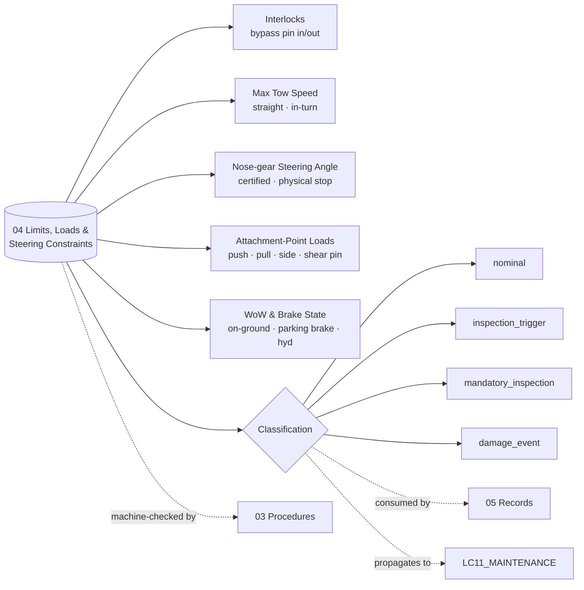

# ATLAS 010-019 · Section 01 · Subsection 040 · Subsubject 014 — Towing Limits, Loads and Steering Constraints

## 0. Invariants (machine-checkable)

The following YAML block declares the **hard interlocks** and the **limit categories** for any AMPEL360 tow event. It is the machine-readable surface of this subsubject and is consumed by the digital-twin tooling that validates a tow plan and by the event-classification engine in [`./015_Towing-Records-Incidents-and-Traceability.md`](./015_Towing-Records-Incidents-and-Traceability.md). **The bypass-pin interlock is not a procedural reminder — it is a hard interlock.** Tow plans that do not satisfy `interlocks` are rejected; tow events whose telemetry breaches a `limit_category` are classified upward in `015_`.

```yaml
# ATLAS 010-019.01.040.04 — Towing invariants
interlocks:
  - bypass_pin_installed_before_towbar_engagement
  - bypass_pin_removed_before_aircraft_taxi
limit_categories:
  - max_tow_speed                       # straight-line and in-turn ceilings
  - nose_gear_steering_angle            # certified deflection envelope
  - attachment_point_load               # towbar fitting / towbarless cradle
  - weight_on_wheels_state              # WoW must be valid for the regime
  - brake_state                         # parking brake / antiskid availability
classification_thresholds:
  nominal:               "all values within steady-state limit"
  inspection_trigger:    "value within 10% of limit (single axis)"
  mandatory_inspection:  "value reaches limit on any axis"
  damage_event:          "value exceeds limit OR shear pin failed OR audible/visible damage"
```

## 1. Purpose

Defines the **numerical limits, load envelopes and steering constraints** that bound any AMPEL360 tow event — maximum tow speed (straight and in turn), nose-gear steering angle limits, the **bypass-pin interlock** state required during all phases, attachment-point load limits, and the weight-on-wheels and brake-state preconditions. Establishes the four-level classification (`nominal` / `inspection_trigger` / `mandatory_inspection` / `damage_event`) consumed by [`./015_Towing-Records-Incidents-and-Traceability.md`](./015_Towing-Records-Incidents-and-Traceability.md). Aligned to ATA Chapter 09 — Towing and Taxiing[^ata09] and ATA Chapter 32 sub-chapter 32-50 Steering[^ata32], with ATA Chapter 07 — Lifting and Shoring[^ata07] for the gear-load adjacency. Conforms to the controlled Q+ATLANTIDE baseline[^baseline], S1000D Issue 6.0[^s1000d] on the ATA iSpec 2200 information set[^ata2200][^ataspec100], and AS9100D[^as9100d].

## 2. Scope

- Covers the *Towing Limits, Loads and Steering Constraints* subsubject (`014`) of subsection `040` *remolque* within section `01` *Manejo en Tierra & Servicio*.
- Inherits Q-Division authority and ORB support from the parent row in [`../../README.md` §3](../../README.md#3-architecture-table)[^archtable].
- **Bypass-pin interlock (Note 1 of the Overview).** The nose-gear steering bypass pin disconnects the steering hydraulics so that the nose-gear *can* castor under tug input without back-driving the steering actuator and shearing the steering collar or torque link. The interlock is bidirectional and binary:
  - `bypass_pin_installed_before_towbar_engagement` — the pin **must** be physically installed and verified *before* any towbar is engaged or any towbarless cradle is clamped. Tow plans that do not declare the pin-verified checkpoint are rejected by the digital-twin validator.
  - `bypass_pin_removed_before_aircraft_taxi` — the pin **must** be physically removed and verified *before* the aircraft is released for self-powered taxi. Failure to remove the pin disables steering authority on engine start and is itself a hard `damage_event` precursor.
  Both states are the responsibility of the tow-team leader and are recorded in the event log per [`./015_Towing-Records-Incidents-and-Traceability.md`](./015_Towing-Records-Incidents-and-Traceability.md).
- **Maximum tow speed.** A straight-line ceiling and a lower in-turn ceiling apply per variant and per tow regime (operational pushback vs. maintenance towing). The in-turn ceiling reduces with increasing nose-gear deflection. Exceeding either ceiling is a `damage_event` precursor and triggers an immediate stop.
- **Nose-gear steering angle limits.** Two limits apply: the **certified tow deflection** (the maximum angle the nose-gear may be deflected by tug input during tow, with bypass pin installed) and the **physical stop** (the absolute mechanical limit beyond which torque-link or steering-collar damage is presumed). Reaching the certified tow deflection is `mandatory_inspection`; passing it toward the physical stop is `damage_event`.
- **Attachment-point load limits.** The towbar head-fitting on the nose-gear and the towbarless cradle clamp each carry maximum push, pull and side-load envelopes. Shear-pin breakage on a towbar tow is a `damage_event` (a shear pin breaks *because* the limit was approached or exceeded — the pin protected the gear, but the event is recorded as such because root cause is in the move, not the pin).
- **Weight-on-wheels and brake-state constraints.** Tow operations require a valid weight-on-wheels signal (the aircraft must read as on-ground for the relevant systems), and the brake state must be either *parking brake set* (during connect/disconnect/stops) or *brakes available and operator-commanded* (during the controlled translation). Loss of brake hydraulic power during tow is a `mandatory_inspection` precondition for resuming.
- **Out of scope.** The procedural sequencing that *uses* these limits (subsubject `013`), the equipment that *carries* the load (subsubject `012`), the records that *capture* the events (subsubject `015`), and the maintenance task definitions triggered by an exceedance (`AMPEL360-AIR-T/LC11_MAINTENANCE/`).
- All limits and the four-level classification are surfaced as S1000D data modules per Issue 6.0[^s1000d] on the ATA iSpec 2200 information set[^ata2200][^ataspec100] and quality-controlled per AS9100D[^as9100d].

## 3. Diagram



## 4. Footprint

| Metric | Value |
|---|---|
| Architecture | `ATLAS` — Aircraft Top-Level Architecture System |
| Master range | `000–099` |
| Code range | `010-019` |
| Section | `01` — Manejo en Tierra & Servicio |
| Subject | `00` — General Information |
| Subsection | `040` — remolque |
| Subsubject | `014` — Towing Limits, Loads and Steering Constraints |
| Primary Q-Division | Q-GROUND[^qdiv] |
| Support Q-Divisions | Q-MECHANICS, Q-INDUSTRY |
| ORB support | ORB-PMO, ORB-FIN |
| Governance class | `baseline`[^gov] |
| Folder path | `Q+ATLANTIDE/000-099_ATLAS/010-019_Manejo-en-Tierra-Servicio/040_remolque/` |
| Document | `014_Towing-Limits-Loads-and-Steering-Constraints.md` (this file) |
| Parent subsection | [`010_Overview.md`](./010_Overview.md) |
| Parent architecture | [`../../README.md`](../../README.md) |
| Parent baseline | [`organization/Q+ATLANTIDE.md`](../../../../organization/Q+ATLANTIDE.md) |

## 5. References & Citations


[^baseline]: **Q+ATLANTIDE controlled baseline (v1.0.0)** — [`organization/Q+ATLANTIDE.md`](../../../../organization/Q+ATLANTIDE.md). Defines the controlled `000-999` architecture-band taxonomy and the ATLAS-1000 register subpart.

[^archtable]: **ATLAS §3 Architecture Table** — [`../../README.md` §3](../../README.md#3-architecture-table). Authoritative source for the `010-019` row (Section `01` — Manejo en Tierra & Servicio, Primary Q-Division Q-GROUND).

[^qdiv]: **Q-Division authority** — Q-Divisions provide technical authority over an architecture row (Q+ATLANTIDE Note N-002). See [`organization/Q+ATLANTIDE.md` §4](../../../../organization/Q+ATLANTIDE.md#4-notes).

[^gov]: **Governance class** — Bands are classified as `baseline` or `restricted` per Q+ATLANTIDE §4 governance rules.

[^ata07]: **ATA Chapter 07 — Lifting and Shoring** — Industry chapter covering aircraft jacking, shoring and gear-load handling; adjacency reference for ground moves where weight-on-wheels and gear-load assumptions interact with the towing regime.

[^ata09]: **ATA Chapter 09 — Towing and Taxiing** — Industry chapter covering towing and taxiing operations, including pushback, maintenance towing and self-powered taxiing. Primary canonical reference for this subsection's towing-procedure baseline.

[^ata32]: **ATA Chapter 32 — Landing Gear** — Industry chapter covering landing-gear systems; sub-chapter **32-50 Steering** governs nose-gear steering, the steering bypass-pin interlock and torque-link integrity that constrain any tow event.

[^ata2200]: **ATA iSpec 2200 — Information Standards for Aviation Maintenance** — Industry standard for digital aircraft maintenance information; governs chapter / section / subject numbering inherited by ATLAS `000-099`.

[^ataspec100]: **ATA Spec 100 — Manufacturers' Technical Data** — Predecessor numbering scheme that established the 00–99 chapter map mirrored by ATLAS sub-ranges.

[^s1000d]: **S1000D Issue 6.0 — International specification for technical publications** — Common Source DataBase (CSDB) and Data Module Code (DMC) specification used across ATLAS technical publications.

[^as9100d]: **AS9100D — Quality Management Systems — Aviation, Space and Defense Organizations** — Quality-management baseline for all Q+ATLANTIDE deliverables.

### Applicable industry standards

The following ATA-family and industry standards apply to this subsubject in addition to the cross-cutting Q+ATLANTIDE governance:

- ATA Chapter 07 — Lifting and Shoring[^ata07]
- ATA Chapter 09 — Towing and Taxiing[^ata09]
- ATA Chapter 32 — Landing Gear (sub-chapter 32-50 Steering)[^ata32]
- ATA iSpec 2200 — Information Standards for Aviation Maintenance[^ata2200]
- ATA Spec 100 — Manufacturers' Technical Data[^ataspec100]
- S1000D Issue 6.0 — International specification for technical publications[^s1000d]
- AS9100D — Quality Management Systems — Aviation, Space and Defense Organizations[^as9100d]
