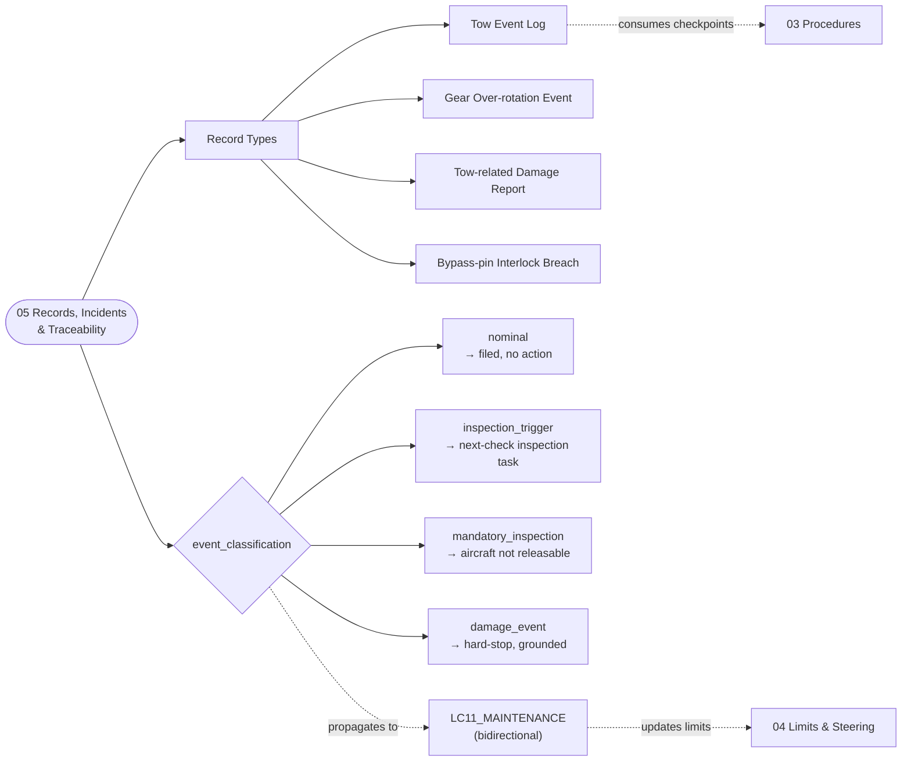

# ATLAS 010-019 · Section 01 · Subsection 040 · Subsubject 015 — Towing Records, Incidents and Traceability

## 1. Purpose

Defines the **record set produced by every AMPEL360 tow event** — the towing log, gear over-rotation event capture, tow-related damage reporting, and the propagation rule into the maintenance program at `AMPEL360-AIR-T/LC11_MAINTENANCE/`. Establishes the **`event_classification:` field** that closes the digital-twin loop with the limits declared in [`./014_Towing-Limits-Loads-and-Steering-Constraints.md`](./014_Towing-Limits-Loads-and-Steering-Constraints.md): every record carries one of `nominal`, `inspection_trigger`, `mandatory_inspection`, `damage_event`, and the value determines whether the maintenance program records a no-action entry, raises an inspection trigger, or hard-stops the aircraft pending mandatory inspection. Aligned to the controlled Q+ATLANTIDE baseline[^baseline] and to ATA Chapter 09 — Towing and Taxiing[^ata09], with ATA Chapter 32 sub-chapter 32-50 Steering[^ata32] for the gear-side cross-references and ATA Chapter 07 — Lifting and Shoring[^ata07] for the gear-load adjacency. Quality-managed per AS9100D[^as9100d] and structured for S1000D Issue 6.0[^s1000d] data-module export on the ATA iSpec 2200 information set[^ata2200][^ataspec100].

## 2. Scope

- Covers the *Towing Records, Incidents and Traceability* subsubject (`015`) of subsection `040` *remolque* within section `01` *Manejo en Tierra & Servicio*.
- Inherits Q-Division authority and ORB support from the parent row in [`../../README.md` §3](../../README.md#3-architecture-table)[^archtable].
- **The `event_classification:` field — the propagation key.** Every tow record-type definition declares a top-level YAML field `event_classification:` whose value is one of:
  - `nominal` — all telemetry within steady-state limit per [`./014_Towing-Limits-Loads-and-Steering-Constraints.md` §0](./014_Towing-Limits-Loads-and-Steering-Constraints.md#0-invariants-machine-checkable). The record is filed; **no maintenance action** is propagated.
  - `inspection_trigger` — telemetry within 10% of any limit on a single axis. The record is filed and an **inspection trigger** is raised in the maintenance program (non-blocking); the aircraft remains releasable but the next scheduled check absorbs the additional inspection task.
  - `mandatory_inspection` — telemetry reached the certified limit on any axis (e.g. nose-gear deflection touched the certified tow envelope). The record is filed and a **mandatory inspection** task is opened in the maintenance program; the aircraft is **not releasable** until the inspection is signed off.
  - `damage_event` — telemetry exceeded a limit, or shear pin failed, or visible/audible damage was reported, or the bypass-pin interlock was breached. The record is filed and a **hard-stop maintenance event** is opened; the aircraft is grounded pending damage assessment and rectification.
  This field makes the propagation rule explicit and machine-checkable. Without it, towing events become unstructured prose that humans have to triage.
- **Record types covered.**
  - **Tow event log** — start time, end time, regime (operational pushback / maintenance towing), tug operator and tow-team leader identities, tug make/model and class, towbar part number and shear-pin reference (or towbarless tractor model), pre-tow checklist outcome, **bypass-pin in/out timestamps**, route or pushback line, peak telemetry per limit category, and the resulting `event_classification:`.
  - **Gear over-rotation event** — captured when the nose-gear deflection reaches or exceeds the certified tow envelope. Carries the deflection trace, the steering-angle versus time, and a mandatory `event_classification:` of at least `mandatory_inspection`.
  - **Tow-related damage report** — captured when shear pin fails, visible damage is reported, or any `damage_event` classification is raised. Carries photographs, GSE damage-report form, witness statements, and propagates as a hard-stop into LC11_MAINTENANCE.
  - **Bypass-pin interlock breach** — captured when either of the [`./014_Towing-Limits-Loads-and-Steering-Constraints.md`](./014_Towing-Limits-Loads-and-Steering-Constraints.md#0-invariants-machine-checkable) interlocks is recorded as not satisfied (pin not installed before towbar engagement, or pin not removed before taxi). Always classified as `damage_event` precursor regardless of whether physical damage was observed, because the design assumption was violated.
- **Bidirectional link with `LC11_MAINTENANCE/`.** The propagation is bidirectional: tow records consumed by LC11 can in turn raise *additional* limit values (e.g. tightened envelope after a repair), which flow back as updated content for [`./014_Towing-Limits-Loads-and-Steering-Constraints.md`](./014_Towing-Limits-Loads-and-Steering-Constraints.md). This subsection is the canonical *producer* of tow events; LC11 is the canonical consumer for maintenance triggers.
- **Out of scope.** The numerical limits themselves (subsubject `014`), the procedural sequence that emits the checkpoints (subsubject `013`), the equipment definition (subsubject `012`), and the maintenance task content beyond the trigger interface (`AMPEL360-AIR-T/LC11_MAINTENANCE/` SSOT).
- All record-type definitions are surfaced as S1000D data modules per Issue 6.0[^s1000d] on the ATA iSpec 2200 information set[^ata2200][^ataspec100] and quality-controlled per AS9100D[^as9100d].

## 3. Diagram

## 4. Footprint

| Metric | Value |
|---|---|
| Architecture | `ATLAS` — Aircraft Top-Level Architecture System |
| Master range | `000–099` |
| Code range | `010-019` |
| Section | `01` — Manejo en Tierra & Servicio |
| Subject | `00` — General Information |
| Subsection | `040` — remolque |
| Subsubject | `015` — Towing Records, Incidents and Traceability |
| Primary Q-Division | Q-GROUND[^qdiv] |
| Support Q-Divisions | Q-MECHANICS, Q-INDUSTRY |
| ORB support | ORB-PMO, ORB-FIN |
| Governance class | `baseline`[^gov] |
| Folder path | `Q+ATLANTIDE/000-099_ATLAS/010-019_Manejo-en-Tierra-Servicio/040_remolque/` |
| Document | `015_Towing-Records-Incidents-and-Traceability.md` (this file) |
| Parent subsection | [`010_Overview.md`](./010_Overview.md) |
| Parent architecture | [`../../README.md`](../../README.md) |
| Parent baseline | [`organization/Q+ATLANTIDE.md`](../../../../organization/Q+ATLANTIDE.md) |

## 5. References & Citations

[^baseline]: **Q+ATLANTIDE controlled baseline (v1.0.0)** — [`organization/Q+ATLANTIDE.md`](../../../../organization/Q+ATLANTIDE.md). Defines the controlled `000-999` architecture-band taxonomy and the ATLAS-1000 register subpart.

[^archtable]: **ATLAS §3 Architecture Table** — [`../../README.md` §3](../../README.md#3-architecture-table). Authoritative source for the `010-019` row (Section `01` — Manejo en Tierra & Servicio, Primary Q-Division Q-GROUND).

[^qdiv]: **Q-Division authority** — Q-Divisions provide technical authority over an architecture row (Q+ATLANTIDE Note N-002). See [`organization/Q+ATLANTIDE.md` §4](../../../../organization/Q+ATLANTIDE.md#4-notes).

[^gov]: **Governance class** — Bands are classified as `baseline` or `restricted` per Q+ATLANTIDE §4 governance rules.

[^ata07]: **ATA Chapter 07 — Lifting and Shoring** — Industry chapter covering aircraft jacking, shoring and gear-load handling; adjacency reference for ground moves where weight-on-wheels and gear-load assumptions interact with the towing regime.

[^ata09]: **ATA Chapter 09 — Towing and Taxiing** — Industry chapter covering towing and taxiing operations, including pushback, maintenance towing and self-powered taxiing. Primary canonical reference for this subsection's towing-procedure baseline.

[^ata32]: **ATA Chapter 32 — Landing Gear** — Industry chapter covering landing-gear systems; sub-chapter **32-50 Steering** governs nose-gear steering, the steering bypass-pin interlock and torque-link integrity that constrain any tow event.

[^ata2200]: **ATA iSpec 2200 — Information Standards for Aviation Maintenance** — Industry standard for digital aircraft maintenance information; governs chapter / section / subject numbering inherited by ATLAS `000-099`.

[^ataspec100]: **ATA Spec 100 — Manufacturers' Technical Data** — Predecessor numbering scheme that established the 00–99 chapter map mirrored by ATLAS sub-ranges.

[^s1000d]: **S1000D Issue 6.0 — International specification for technical publications** — Common Source DataBase (CSDB) and Data Module Code (DMC) specification used across ATLAS technical publications.

[^as9100d]: **AS9100D — Quality Management Systems — Aviation, Space and Defense Organizations** — Quality-management baseline for all Q+ATLANTIDE deliverables.

### Applicable industry standards

The following ATA-family and industry standards apply to this subsubject in addition to the cross-cutting Q+ATLANTIDE governance:

- ATA Chapter 07 — Lifting and Shoring[^ata07]
- ATA Chapter 09 — Towing and Taxiing[^ata09]
- ATA Chapter 32 — Landing Gear (sub-chapter 32-50 Steering)[^ata32]
- ATA iSpec 2200 — Information Standards for Aviation Maintenance[^ata2200]
- ATA Spec 100 — Manufacturers' Technical Data[^ataspec100]
- S1000D Issue 6.0 — International specification for technical publications[^s1000d]
- AS9100D — Quality Management Systems — Aviation, Space and Defense Organizations[^as9100d]
