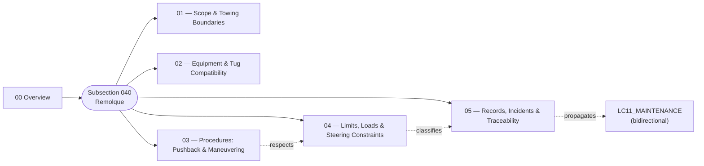

# ATLAS 010-019 · Section 01 · Subsection 040 — remolque

## 1. Purpose

Subsection-level index for *remolque* (`040`) within ATLAS `010-019` — *Manejo en Tierra & Servicio*. Aggregates the `010 Overview` and the detailed subsubjects (`011`–`015`) that extend it with the canonical scope/boundary clauses, the towing equipment and tug-compatibility matrix (with the explicit AMPEL360 BWB **towbarless** flag), the procedural baseline for pushback and maneuvering, the numerical limits and steering interlocks (including the machine-checkable **bypass-pin** invariant block), and the towing-event record taxonomy keyed by `event_classification:` for bidirectional propagation into `LC11_MAINTENANCE/`. Conforms to the controlled Q+ATLANTIDE baseline[^baseline] and S1000D Issue 6.0[^s1000d]. Maps to **ATA 09 — Towing and Taxiing**[^ata09], **ATA 32 — Landing Gear (32-50 Steering)**[^ata32] and **ATA 07 — Lifting and Shoring**[^ata07]; *taxiing under aircraft engine power is **not** in this subsection* and is governed by flight-operations procedures.

## 2. Scope

- Covers the full subsubject namespace `010`–`019` of subsection `040` *remolque*; subsubjects `011`–`015` are populated in this baseline release, the remaining `016`–`019` slots remain available for future extension per the Overview's authorisation[^archtable].
- Inherits Q-Division authority and ORB support from the parent row in [`../../README.md` §3](../../README.md#3-architecture-table)[^archtable].
- **Boundary triangulation with subsections `010`, `020` and `030`.** Restated for navigation:
  - **Ground handling** (`010`) = aircraft *positioning*, *safety perimeter*, GSE *physical placement*. See [`../010_Ground-handling/010_Overview.md`](../010_Ground-handling/010_Overview.md).
  - **Servicing** (`020`) = active *flow through coupling interfaces*. See [`../020_servicing/010_Overview.md`](../020_servicing/010_Overview.md).
  - **Access** (`030`) = *opening the aircraft envelope* to enable presence. See [`../030_acceso/README.md`](../030_acceso/README.md).
  - **Remolque** (`040`, this) = *controlled translation* of the aircraft on the ground under *external* motive power.

## 3. Diagram

The diagram below shows how this subsection's `010 Overview` aggregates the populated subsubjects (`011`–`015`) into the *remolque* slice of ATLAS `010-019` and how the limits/records chain closes onto the maintenance program.

## 4. Subsubject Index

| 01N | Title | Document | Status |
|---:|---|---|---|
| 010 | Overview | [`010_Overview.md`](./010_Overview.md) | active |
| 011 | Scope and Towing Boundaries | [`011_Scope-and-Towing-Boundaries.md`](./011_Scope-and-Towing-Boundaries.md) | active |
| 012 | Towing Equipment and Tug Compatibility | [`012_Towing-Equipment-and-Tug-Compatibility.md`](./012_Towing-Equipment-and-Tug-Compatibility.md) | active |
| 013 | Towing Procedures: Pushback and Maneuvering | [`013_Towing-Procedures-Pushback-and-Maneuvering.md`](./013_Towing-Procedures-Pushback-and-Maneuvering.md) | active |
| 014 | Towing Limits, Loads and Steering Constraints | [`014_Towing-Limits-Loads-and-Steering-Constraints.md`](./014_Towing-Limits-Loads-and-Steering-Constraints.md) | active |
| 015 | Towing Records, Incidents and Traceability | [`015_Towing-Records-Incidents-and-Traceability.md`](./015_Towing-Records-Incidents-and-Traceability.md) | active |

## 5. Sibling Subsections (010-019 range)

| Code | Subsection | Document |
|---|---|---|
| `010` | Ground handling | [`../010_Ground-handling/README.md`](../010_Ground-handling/README.md) |
| `020` | servicing | [`../020_servicing/README.md`](../020_servicing/README.md) |
| `030` | acceso | [`../030_acceso/README.md`](../030_acceso/README.md) |
| `040` | remolque (this) | [`./README.md`](./README.md) |
| `050` | parking | [`../050_parking/010_Overview.md`](../050_parking/010_Overview.md) |
| `060` | GSE | [`../060_GSE/010_Overview.md`](../060_GSE/010_Overview.md) |

## 6. Footprint

| Metric | Value |
|---|---|
| Architecture | `ATLAS` — Aircraft Top-Level Architecture System |
| Master range | `000–099` |
| Code range | `010-019` |
| Section | `01` — Manejo en Tierra & Servicio |
| Subject | `00` — General Information |
| Subsection | `040` — remolque |
| Subsubject namespace | `010`–`019` (`010` + `011`–`015` populated; canonical `01N_*.md` scheme) |
| Primary Q-Division | Q-GROUND[^qdiv] |
| Support Q-Divisions | Q-MECHANICS, Q-INDUSTRY |
| ORB support | ORB-PMO, ORB-FIN |
| Governance class | `baseline`[^gov] |
| Folder path | `Q+ATLANTIDE/000-099_ATLAS/010-019_Manejo-en-Tierra-Servicio/040_remolque/` |
| Document | `README.md` (this file) |
| Parent architecture | [`../../README.md`](../../README.md) |
| Parent baseline | [`organization/Q+ATLANTIDE.md`](../../../../organization/Q+ATLANTIDE.md) |

## Governance

Governed by [`organization/Q+ATLANTIDE.md`](../../../../organization/Q+ATLANTIDE.md)[^baseline]. All subsubjects under this subsection inherit `architecture_code = ATLAS`, `primary_q_division = Q-GROUND` and `governance_class = baseline` from the parent ATLAS band; extensions added under `016`–`019` shall preserve those header fields, follow the canonical `01N_*.md` naming scheme, and reuse the footnote set declared below. Cross-subsection references with `010_Ground-handling/`, `020_servicing/` and `030_acceso/` shall preserve the *positioning vs. flow vs. envelope-opening vs. controlled-translation* partition stated in [`./010_Overview.md` §2](./010_Overview.md#2-scope) and in the sibling Overviews. Subsubject `014` declares a top-level YAML `interlocks:` and `limit_categories:` invariant block that is **machine-checked** by digital-twin tooling — extensions must not silently weaken those invariants. Subsubject `015` records carry a top-level `event_classification:` field whose value (`nominal` / `inspection_trigger` / `mandatory_inspection` / `damage_event`) governs the bidirectional propagation rule into `AMPEL360-AIR-T/LC11_MAINTENANCE/`; this field is the canonical hand-off and shall not be omitted.

## 7. Change Log

| Version | Date | Author | Change |
|---|---|---|---|
| 1.0.0 | 2026-05-06 | Q-GROUND | Initial population of subsection `040 remolque`: README + Overview enrichment (diagram, ATA 09 / 32-50 / 07 cross-refs, taxiing-out-of-scope clause, triangulation with `010`/`020`/`030`) + subsubjects `011`–`015`, including the bypass-pin YAML invariant block in `014_` and the `event_classification:` propagation field in `015_`. |

## 8. References & Citations

[^baseline]: **Q+ATLANTIDE controlled baseline (v1.0.0)** — [`organization/Q+ATLANTIDE.md`](../../../../organization/Q+ATLANTIDE.md). Defines the controlled `000-999` architecture-band taxonomy and the ATLAS-1000 register subpart.

[^archtable]: **ATLAS §3 Architecture Table** — [`../../README.md` §3](../../README.md#3-architecture-table). Authoritative source for the `010-019` row (Section `01` — Manejo en Tierra & Servicio, Primary Q-Division Q-GROUND).

[^qdiv]: **Q-Division authority** — Q-Divisions provide technical authority over an architecture row (Q+ATLANTIDE Note N-002). See [`organization/Q+ATLANTIDE.md` §4](../../../../organization/Q+ATLANTIDE.md#4-notes).

[^gov]: **Governance class** — Bands are classified as `baseline` or `restricted` per Q+ATLANTIDE §4 governance rules.

[^ata07]: **ATA Chapter 07 — Lifting and Shoring** — Industry chapter covering aircraft jacking, shoring and gear-load handling; adjacency reference for ground moves where weight-on-wheels and gear-load assumptions interact with the towing regime.

[^ata09]: **ATA Chapter 09 — Towing and Taxiing** — Industry chapter covering towing and taxiing operations, including pushback, maintenance towing and self-powered taxiing. Primary canonical reference for this subsection's towing-procedure baseline.

[^ata32]: **ATA Chapter 32 — Landing Gear** — Industry chapter covering landing-gear systems; sub-chapter **32-50 Steering** governs nose-gear steering, the steering bypass-pin interlock and torque-link integrity that constrain any tow event.

[^ata2200]: **ATA iSpec 2200 — Information Standards for Aviation Maintenance** — Industry standard for digital aircraft maintenance information; governs chapter / section / subject numbering inherited by ATLAS `000-099`.

[^ataspec100]: **ATA Spec 100 — Manufacturers' Technical Data** — Predecessor numbering scheme that established the 00–99 chapter map mirrored by ATLAS sub-ranges.

[^s1000d]: **S1000D Issue 6.0 — International specification for technical publications** — Common Source DataBase (CSDB) and Data Module Code (DMC) specification used across ATLAS technical publications.

[^as9100d]: **AS9100D — Quality Management Systems — Aviation, Space and Defense Organizations** — Quality-management baseline for all Q+ATLANTIDE deliverables.

### Applicable industry standards

The following ATA-family and industry standards apply to this subsection in addition to the cross-cutting Q+ATLANTIDE governance:

- ATA Chapter 07 — Lifting and Shoring[^ata07]
- ATA Chapter 09 — Towing and Taxiing[^ata09]
- ATA Chapter 32 — Landing Gear (sub-chapter 32-50 Steering)[^ata32]
- ATA iSpec 2200 — Information Standards for Aviation Maintenance[^ata2200]
- ATA Spec 100 — Manufacturers' Technical Data[^ataspec100]
- S1000D Issue 6.0 — International specification for technical publications[^s1000d]
- AS9100D — Quality Management Systems — Aviation, Space and Defense Organizations[^as9100d]
