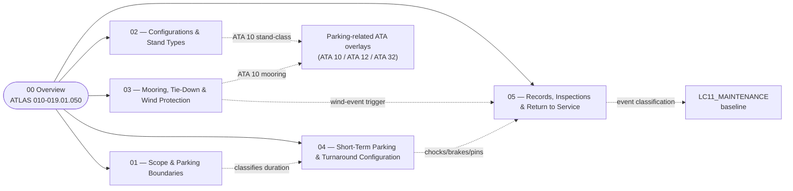

# ATLAS 010-019 · Section 01 · Subsection 050 — parking

## 1. Purpose

Overview entry-point for the *parking* subsection within the `010-019` code range (Section `01` — *Manejo en Tierra & Servicio*) of the **ATLAS** architecture band (*Aircraft Top-Level Architecture System*, master range `000–099`).

This subsubject (`00 Overview`) introduces the ATLAS 010-019.050.00 slice and links it to the controlled Q+ATLANTIDE baseline[^baseline] and to the applicable industry standards listed in §5. *Parking* is the **stationary state of the aircraft on the ground** — the resting state between operations, distinct from positioning, servicing, envelope opening, and controlled translation. It maps canonically to **ATA 10 — Parking, Mooring, Storage and Return to Service**[^ata10], with adjacency to **ATA 12 — Servicing**[^ata12] for servicing performed while the aircraft is parked, and to **ATA 32 — Landing Gear**[^ata32] for the gear-side configuration (chocks, brakes, gear pins) that defines a parked aircraft.

> **Numbering note.** The parent code-range is `010–019`, and `050_parking/` is the **fifth lead subdirectory** of that range (after `010_`, `020_`, `030_`, `040_`). The `050` token is therefore an **internal sequential index inside the `010-019` range**, not an ATA-50 chapter pointer. The same convention applies to `060_GSE/`. If a future global decision retires this convention in favour of denser increments (e.g. `011_/012_/013_/014_/015_`), it shall be applied to the entire `010–019` range, not just to this subsection.

## 2. Scope

- Covers the *parking* slice of the parent code range `010-019` — i.e. **the stationary-aircraft regime on the ground**: parking-stand classification, mooring/tie-down and wind protection, the short-term/turnaround parking configuration, and the records, inspections and return-to-service interface that closes the parked-state cycle for the AMPEL360 aircraft.
- Inherits Q-Division authority and ORB support from the parent row in [`../../README.md` §3](../../README.md#3-architecture-table)[^archtable].
- Maps to the following ATA chapters as canonical scope references:
  - **ATA 10 — Parking, Mooring, Storage and Return to Service**[^ata10] is the **primary** canonical chapter for this subsection. It governs short-term parking, mooring against wind, longer-term storage, and the formal return-to-service step.
  - **ATA 12 — Servicing**[^ata12] is the **adjacency** chapter for any servicing performed *while the aircraft is parked* (replenishment, lubrication, fluid checks performed at the stand). The flow itself is owned by [`../020_servicing/`](../020_servicing/010_Overview.md); the *parking-state preconditions* (chocks set, brakes set, GPU connected) are owned here.
  - **ATA 32 — Landing Gear**[^ata32] is the gear-side adjacency — wheel chocks, parking brake, ground-lock pins, and the weight-on-wheels signal that anchor the parked-state configuration. The gear hardware is owned by ATA 32; the *parked-state policy* over that hardware is owned here.
- **Boundary triangulation with sibling subsections `010`, `020`, `030`, `040`.** Restated symmetrically across the lead Overviews so the partition stays clean. Parking is the **resting state** of the aircraft on the ground:
  - **Ground handling** (`010`) = aircraft *positioning*, *safety perimeter*, GSE *physical placement*. See [`../010_Ground-handling/010_Overview.md`](../010_Ground-handling/010_Overview.md). *Ground handling* moves the aircraft into the parked state; *parking* defines the state itself.
  - **Servicing** (`020`) = active *flow through coupling interfaces* (fluids, gases, energy). See [`../020_servicing/010_Overview.md`](../020_servicing/010_Overview.md). *Servicing* is what flows; *parking* is the precondition state during which it can flow.
  - **Access** (`030`) = *opening the aircraft envelope* to enable presence inside or at compartments. See [`../030_acceso/010_Overview.md`](../030_acceso/010_Overview.md). *Access* is the envelope state; *parking* is the airframe state of the same aircraft.
  - **Remolque** (`040`) = *controlled translation* of the aircraft on the ground under *external* motive power. See [`../040_remolque/010_Overview.md`](../040_remolque/010_Overview.md). *Towing* ends when the aircraft comes to a stop with chocks placed and parking brake set — at which point the aircraft is in the *parking* regime governed here.
  - **Parking** (`050`, this) = the *resting state* of the aircraft on the ground between operations.
  Worked examples: setting chocks and the parking brake at the gate belong to *parking*; positioning the GPU at the gate belongs to *ground handling*; coupling the GPU to the aircraft and powering the bus belongs to *servicing*; opening the cargo door for unloading belongs to *access*; pushback away from the parked position belongs to *remolque*.
- **Boundary against ATA 50.** The fact that the subsection token reads `050` is **coincidence with ATA Chapter 50 (Cargo and Accessory Compartments)**. ATA 50 is **not** the canonical chapter for this subsection; the canonical chapter is **ATA 10**. See the *Numbering note* in §1 for the explanation of the internal indexing.
- **The `014_` ↔ `011_` boundary is deliberately the most carefully drawn line in this subsection.** "Short-term parking and turnaround configuration" overlaps philosophically with "turnaround vs. overnight" classification thresholds in `011_`. The clean split is: **`011_` defines *what kind of parking applies in what duration window* (the classification rule)**; **`014_` defines *what physical configuration the aircraft must be in for short-term/turnaround parking* (the operational state)**. This split is restated in [`./011_Scope-and-Parking-Boundaries.md` §2](./011_Scope-and-Parking-Boundaries.md) and at the top of [`./014_Short-Term-Parking-and-Turnaround-Configurations.md`](./014_Short-Term-Parking-and-Turnaround-Configurations.md), specifically to prevent two contributors from writing the same content twice in different files.
- **BWB stand geometry is the architectural differentiator.** Conventional jet-bridge geometry assumes a tube fuselage with the door at a predictable height and lateral offset. For AMPEL360-BWB-Q100 the door positions, the wingtip-to-stand-edge clearances, the tail-clearance behind, and the **H₂ exclusion zone** around the LH₂ bay change the geometry of compatible stands. Subsubject `012` therefore documents the BWB-compatible stand classes **and explicitly enumerates the standard ICAO stand classes the aircraft does *not* fit** — negative space matters, because telling an airport "this aircraft fits stand class C" is less useful than "this aircraft does not fit stand classes A, B, D, E, F" if that exclusion list is shorter and operationally more decisive.
- **Mooring is the operational expression of *agisco in anticipo*.** Tie-down decisions must precede full certainty: by the time the storm arrives it is too late. Subsubject `013` therefore declares the wind-action thresholds as a **decision matrix indexed by `forecast_confidence × forecast_severity × time_to_event`** and **not** as a single number, and surfaces that matrix as a **machine-checkable YAML invariant block** at the top of `013_`. The same `event_classification:` propagation that closes the digital-twin loop in `040_remolque/05_` also closes it here in `050_parking/05_`: an aircraft that experienced a forecast wind event has different inspection triggers than one that did not, and that linkage is recorded in `015_` so that `AMPEL360-AIR-T/LC11_MAINTENANCE/` consumes it bidirectionally.
- Subsequent subsubjects (`011`–`019`) under this subsection extend this Overview with detailed data modules per S1000D[^s1000d].

## 3. Diagram

The diagram below shows how this subsection's `00 Overview` aggregates the populated subsubjects (`011`–`015`) into the *parking* slice of ATLAS `010-019`, and how the `013_` ↔ `014_` ↔ `015_` chain closes onto the maintenance program.

## 4. Footprint

| Metric | Value |
|---|---|
| Architecture | `ATLAS` — Aircraft Top-Level Architecture System |
| Master range | `000–099` |
| Code range | `010-019` |
| Section | `01` — Manejo en Tierra & Servicio |
| Subject | `00` — General Information |
| Subsection | `050` — parking |
| Subsubject | `010` — Overview |
| Primary Q-Division | Q-GROUND[^qdiv] |
| Support Q-Divisions | Q-MECHANICS, Q-INDUSTRY |
| ORB support | ORB-PMO, ORB-FIN |
| Governance class | `baseline`[^gov] |
| Folder path | `Q+ATLANTIDE/000-099_ATLAS/010-019_Manejo-en-Tierra-Servicio/050_parking/` |
| Document | `010_Overview.md` (this file) |
| Parent architecture | [`../../README.md`](../../README.md) |
| Parent baseline | [`organization/Q+ATLANTIDE.md`](../../../../organization/Q+ATLANTIDE.md) |

## 5. References & Citations

[^baseline]: **Q+ATLANTIDE controlled baseline (v1.0.0)** — [`organization/Q+ATLANTIDE.md`](../../../../organization/Q+ATLANTIDE.md). Defines the controlled `000-999` architecture-band taxonomy and the ATLAS-1000 register subpart.

[^archtable]: **ATLAS §3 Architecture Table** — [`../../README.md` §3](../../README.md#3-architecture-table). Authoritative source for the `010-019` row (Section `01` — Manejo en Tierra & Servicio, Primary Q-Division Q-GROUND).

[^qdiv]: **Q-Division authority** — Q-Divisions provide technical authority over an architecture row (Q+ATLANTIDE Note N-002). See [`organization/Q+ATLANTIDE.md` §4](../../../../organization/Q+ATLANTIDE.md#4-notes).

[^gov]: **Governance class** — Bands are classified as `baseline` or `restricted` per Q+ATLANTIDE §4 governance rules.

[^ata10]: **ATA Chapter 10 — Parking, Mooring, Storage and Return to Service** — Industry chapter governing the stationary-aircraft regime on the ground, mooring against wind, longer-term storage and the formal return-to-service step. Primary canonical reference for this subsection.

[^ata12]: **ATA Chapter 12 — Servicing** — Industry chapter governing routine servicing (replenishment, lubrication, fluid checks); adjacency reference for servicing performed while the aircraft is parked (the *flow* is owned by `020_servicing/`, the *parked-state preconditions* are owned here).

[^ata32]: **ATA Chapter 32 — Landing Gear** — Industry chapter covering landing-gear systems; adjacency reference for the gear-side parked-state configuration (chocks, parking brake, ground-lock pins, weight-on-wheels).

[^ata2200]: **ATA iSpec 2200 — Information Standards for Aviation Maintenance** — Industry standard for digital aircraft maintenance information; governs chapter / section / subject numbering inherited by ATLAS `000-099`.

[^ataspec100]: **ATA Spec 100 — Manufacturers' Technical Data** — Predecessor numbering scheme that established the 00–99 chapter map mirrored by ATLAS sub-ranges.

[^s1000d]: **S1000D Issue 6.0 — International specification for technical publications** — Common Source DataBase (CSDB) and Data Module Code (DMC) specification used across ATLAS technical publications.

[^as9100d]: **AS9100D — Quality Management Systems — Aviation, Space and Defense Organizations** — Quality-management baseline for all Q+ATLANTIDE deliverables.

### Applicable industry standards

The following ATA-family and industry standards apply to this subsection in addition to the cross-cutting Q+ATLANTIDE governance:

- ATA Chapter 10 — Parking, Mooring, Storage and Return to Service[^ata10]
- ATA Chapter 12 — Servicing[^ata12]
- ATA Chapter 32 — Landing Gear[^ata32]
- ATA iSpec 2200 — Information Standards for Aviation Maintenance[^ata2200]
- ATA Spec 100 — Manufacturers' Technical Data[^ataspec100]
- S1000D Issue 6.0 — International specification for technical publications[^s1000d]
- AS9100D — Quality Management Systems — Aviation, Space and Defense Organizations[^as9100d]

