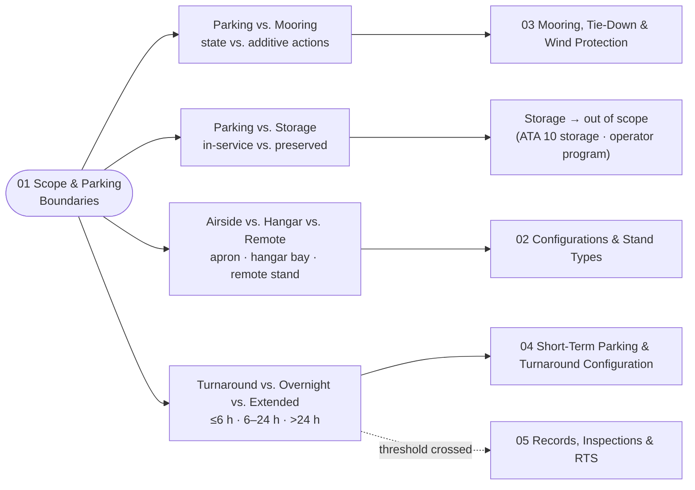

# ATLAS 010-019 · Section 01 · Subsection 050 · Subsubject 011 — Scope and Parking Boundaries

## 1. Purpose

Establishes the **scope boundary** of the *parking* subsection (`050`) within ATLAS `010-019.01` *Manejo en Tierra & Servicio* and the **boundary clauses** that separate *parking* from adjacent activities — *ground handling* (subsection `010`), *servicing* (subsection `020`), *access* (subsection `030`), *remolque* (subsection `040`), and *long-term storage* (handed off to ATA 10 *storage* / operator's storage program). Fixes the controlled vocabulary for **parking vs. mooring vs. storage vs. layover**, **airside vs. hangar vs. remote stand**, and **turnaround vs. overnight vs. extended parking** duration thresholds, so that the downstream subsubjects (`012`–`015`) — stand types and configurations, mooring and wind protection, short-term/turnaround configuration, and records/return-to-service — share a single semantic model on the ATA iSpec 2200 / Spec 100 information set[^ata2200][^ataspec100][^s1000d], in conformance with the controlled Q+ATLANTIDE baseline[^baseline] and the parking-related ATA chapters[^ata10][^ata12][^ata32].

This subsubject defines **the classification rule** (what kind of parking applies in what duration window). The corresponding **physical configuration** for each class is owned by [`./014_Short-Term-Parking-and-Turnaround-Configurations.md`](./014_Short-Term-Parking-and-Turnaround-Configurations.md). The split is deliberate; see §2 *Boundary with `014_`*.

## 2. Scope

- Covers the *Scope and Parking Boundaries* subsubject (`011`) of subsection `050` *parking* within section `01` *Manejo en Tierra & Servicio*.
- Inherits Q-Division authority and ORB support from the parent row in [`../../README.md` §3](../../README.md#3-architecture-table)[^archtable].
- **In scope** — the parking activity boundary:
  - **Parking vs. mooring vs. storage vs. layover.**
    - *Parking* is the **stationary state of an in-service aircraft on the ground between operations**, with the aircraft remaining ready (or rapidly returnable) to operate. It is the default state covered by this subsection.
    - *Mooring* is a **superset of physical actions** (tie-downs, gust locks, control-surface locks) applied **on top of** a parked configuration to resist wind and other environmental loads. Mooring is **always additive to parking** — an aircraft is never *moored without being parked* — and is detailed in [`./013_Mooring-Tie-Down-and-Wind-Protection.md`](./013_Mooring-Tie-Down-and-Wind-Protection.md).
    - *Storage* is a **distinct duration regime** in which the aircraft is removed from the active flight schedule and prepared for extended preservation (engine inhibit, system desiccants, periodic checks). Storage is **out of scope** of this subsection and is owned by ATA 10 *storage* and the operator's storage program. The handoff threshold from *extended parking* into *storage* is defined below.
    - *Layover* is a **commercial term** for an overnight-or-similar parking event between scheduled flights at a non-base station. It is a *use case of parking*, not a separate regime, and is covered by the *overnight* duration window below.
  - **Airside vs. hangar vs. remote stand.**
    - *Airside (apron / contact gate / hardstand)* — parked under airside operational control, with apron-traffic regime, jet-bridge or self-boarding, and access for ramp staff and GSE.
    - *Hangar* — parked inside a maintenance hangar under maintenance-organisation control; the wind-and-precipitation envelope is removed, but mooring may still apply for hangar-bay traffic and seismic considerations.
    - *Remote stand* — parked airside but away from a contact gate; boarding via stairs and bus, GPU/ACU via wheeled units, and a wider safety perimeter for GSE positioning.
  - **Turnaround vs. overnight vs. extended parking — duration thresholds (classification rule).** This is the **canonical classification** that subsubject `014` keys its physical-configuration tables off:
    - **Turnaround** (≤ ~6 h, typically 30 min – 4 h between scheduled flights) — engine-off, chocks set, parking brake set, **APU or GPU live**, doors open per loading state, ACU hookup likely, **gear pin not normally installed** (because the aircraft is about to operate again).
    - **Overnight** (~6 h to ~24 h, single-night layover) — chocks set, parking brake set, **GPU normally preferred over APU** for fuel and noise, doors closed and sealed, **gear ground-lock pins normally installed** and recorded, control-surface locks per local wind forecast.
    - **Extended parking** (> ~24 h up to the *storage* threshold) — full mooring per [`./03`](./013_Mooring-Tie-Down-and-Wind-Protection.md) when wind forecast warrants, periodic walk-around inspections per [`./05`](./015_Parking-Records-Inspections-and-Return-to-Service.md), GPU disconnection and aircraft on internal battery between checks, environmental covers for sensors/probes.
    - **Storage threshold (handoff out of this subsection).** When the planned-out-of-service duration exceeds the operator's storage threshold (typically ≥ 7 days for short-term storage, or per the operator's program), the aircraft transitions out of *extended parking* and into *storage* (ATA 10 *storage*), governed by the storage program and **not** by this subsection. The handoff is recorded per [`./05`](./015_Parking-Records-Inspections-and-Return-to-Service.md) so that maintenance, configuration and inspection histories are continuous across the handoff.
- **Boundary with `014_` — classification rule vs. physical configuration.** This subsubject (`011_`) defines **what kind of parking applies in what duration window**. Subsubject [`./014_Short-Term-Parking-and-Turnaround-Configurations.md`](./014_Short-Term-Parking-and-Turnaround-Configurations.md) defines **what physical configuration the aircraft must be in for the short-term/turnaround class** (chocks, brakes, gear pin status, APU vs. GPU, doors, ACU). The two views are orthogonal and are kept separate so that a change to a duration threshold (here) does not silently change a physical-configuration entry (there), and vice versa. This split is restated symmetrically in the `014_` document and in [`./010_Overview.md` §2](./010_Overview.md#2-scope).
- **Out of scope.** Long-term storage (ATA 10 *storage*, owned by the operator's storage program), the parking-stand classification matrix and BWB stand geometry (subsubject `012`), the mooring/wind-action thresholds themselves (subsubject `013`), the records and return-to-service interface (subsubject `015`), and the maintenance-program *definition* itself (`AMPEL360-AIR-T/LC11_MAINTENANCE/`).
- Boundary clauses are surfaced as S1000D `terminology` and `applicability` entries on the ATA iSpec 2200 information set[^ata2200][^s1000d] and quality-controlled per AS9100D[^as9100d].

## 3. Diagram

The diagram below shows how the *parking* boundary partitions the activity space across adjacent subsections, the four boundary axes, and the duration-band classification consumed by subsubject `014`.

## 4. Footprint

| Metric | Value |
|---|---|
| Architecture | `ATLAS` — Aircraft Top-Level Architecture System |
| Master range | `000–099` |
| Code range | `010-019` |
| Section | `01` — Manejo en Tierra & Servicio |
| Subject | `00` — General Information |
| Subsection | `050` — parking |
| Subsubject | `011` — Scope and Parking Boundaries |
| Primary Q-Division | Q-GROUND[^qdiv] |
| Support Q-Divisions | Q-MECHANICS, Q-INDUSTRY |
| ORB support | ORB-PMO, ORB-FIN |
| Governance class | `baseline`[^gov] |
| Folder path | `Q+ATLANTIDE/000-099_ATLAS/010-019_Manejo-en-Tierra-Servicio/050_parking/` |
| Document | `011_Scope-and-Parking-Boundaries.md` (this file) |
| Parent subsection | [`010_Overview.md`](./010_Overview.md) |
| Parent architecture | [`../../README.md`](../../README.md) |
| Parent baseline | [`organization/Q+ATLANTIDE.md`](../../../../organization/Q+ATLANTIDE.md) |

## 5. References & Citations

[^baseline]: **Q+ATLANTIDE controlled baseline (v1.0.0)** — [`organization/Q+ATLANTIDE.md`](../../../../organization/Q+ATLANTIDE.md). Defines the controlled `000-999` architecture-band taxonomy and the ATLAS-1000 register subpart.

[^archtable]: **ATLAS §3 Architecture Table** — [`../../README.md` §3](../../README.md#3-architecture-table). Authoritative source for the `010-019` row (Section `01` — Manejo en Tierra & Servicio, Primary Q-Division Q-GROUND).

[^qdiv]: **Q-Division authority** — Q-Divisions provide technical authority over an architecture row (Q+ATLANTIDE Note N-002). See [`organization/Q+ATLANTIDE.md` §4](../../../../organization/Q+ATLANTIDE.md#4-notes).

[^gov]: **Governance class** — Bands are classified as `baseline` or `restricted` per Q+ATLANTIDE §4 governance rules.

[^ata10]: **ATA Chapter 10 — Parking, Mooring, Storage and Return to Service** — Industry chapter governing the stationary-aircraft regime on the ground, mooring against wind, longer-term storage and the formal return-to-service step. Primary canonical reference for this subsection.

[^ata12]: **ATA Chapter 12 — Servicing** — Industry chapter governing routine servicing; adjacency reference for servicing performed while the aircraft is parked.

[^ata32]: **ATA Chapter 32 — Landing Gear** — Industry chapter covering landing-gear systems; adjacency reference for the gear-side parked-state configuration (chocks, parking brake, ground-lock pins, weight-on-wheels).

[^ata2200]: **ATA iSpec 2200 — Information Standards for Aviation Maintenance** — Industry standard for digital aircraft maintenance information; governs chapter / section / subject numbering inherited by ATLAS `000-099`.

[^ataspec100]: **ATA Spec 100 — Manufacturers' Technical Data** — Predecessor numbering scheme that established the 00–99 chapter map mirrored by ATLAS sub-ranges.

[^s1000d]: **S1000D Issue 6.0 — International specification for technical publications** — Common Source DataBase (CSDB) and Data Module Code (DMC) specification used across ATLAS technical publications.

[^as9100d]: **AS9100D — Quality Management Systems — Aviation, Space and Defense Organizations** — Quality-management baseline for all Q+ATLANTIDE deliverables.

### Applicable industry standards

The following ATA-family and industry standards apply to this subsubject in addition to the cross-cutting Q+ATLANTIDE governance:

- ATA Chapter 10 — Parking, Mooring, Storage and Return to Service[^ata10]
- ATA Chapter 12 — Servicing[^ata12]
- ATA Chapter 32 — Landing Gear[^ata32]
- ATA iSpec 2200 — Information Standards for Aviation Maintenance[^ata2200]
- ATA Spec 100 — Manufacturers' Technical Data[^ataspec100]
- S1000D Issue 6.0 — International specification for technical publications[^s1000d]
- AS9100D — Quality Management Systems — Aviation, Space and Defense Organizations[^as9100d]
