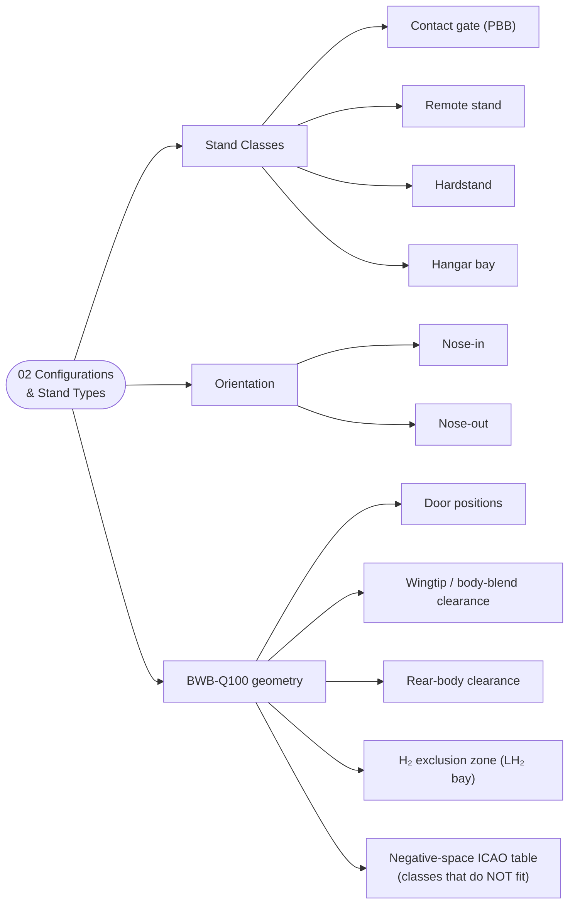

# ATLAS 010-019 · Section 01 · Subsection 050 · Subsubject 02 — Parking Configurations and Stand Types

## 1. Purpose

Defines the **parking-stand classification matrix** for the AMPEL360 aircraft — stand types (contact gate / remote / hardstand / hangar bay), nose-in vs. nose-out parking, jet-bridge vs. self-boarding, the GSE positions implied by the parked configuration, and — critically — the **BWB-specific stand geometry constraints** for AMPEL360-BWB-Q100, including the **H₂ exclusion zone** around the LH₂ bay and the **negative-space enumeration** of standard ICAO stand classes the aircraft does *not* fit. Aligned to ATA Chapter 10 — Parking, Mooring, Storage and Return to Service[^ata10] with adjacency to ATA Chapter 12 — Servicing[^ata12] for the GSE positions associated with servicing-while-parked. Conforms to the controlled Q+ATLANTIDE baseline[^baseline], S1000D Issue 6.0[^s1000d] on the ATA iSpec 2200 information set[^ata2200][^ataspec100], and AS9100D[^as9100d].

## 2. Scope

- Covers the *Parking Configurations and Stand Types* subsubject (`02`) of subsection `050` *parking* within section `01` *Manejo en Tierra & Servicio*.
- Inherits Q-Division authority and ORB support from the parent row in [`../../README.md` §3](../../README.md#3-architecture-table)[^archtable].
- **Stand types covered:**
  - **Contact gate (jet-bridge stand)** — adjacent to the terminal, served by one or more passenger boarding bridges (PBB). Door height, door longitudinal position and lateral offset must match the PBB envelope.
  - **Remote stand** — airside but away from the terminal; boarding via stairs and bus, GPU/ACU via wheeled units.
  - **Hardstand** — a paved parking position not normally used for boarding (extended parking, light maintenance, overflow). No PBB; ground equipment positions per the local airport plan.
  - **Hangar bay** — inside a maintenance hangar, with hangar-floor traffic regime and overhead clearance constraints; mooring may still apply for hangar-bay traffic and seismic considerations.
- **Nose orientation, boarding modality, GSE positions:**
  - **Nose-in vs. nose-out.** *Nose-in* parking (aircraft nose pointing toward the terminal) is the default for jet-bridge stands and requires pushback (`040`) on departure. *Nose-out* (or angled) parking is used at remote stands and hardstands, allowing self-powered taxi-out and reducing dependence on tugs but requiring more pavement area.
  - **Jet-bridge vs. self-boarding.** Jet-bridge boarding requires PBB compatibility (door height, door position, structural reach). Self-boarding (stairs, bus) imposes no PBB constraint but adds GSE positions for the stairs, bus(es) and the boarding-bridge replacement marshalling area.
  - **Ground equipment positions while parked.** The GSE positions implied by each stand type — GPU, ACU, fuel truck, lavatory truck, water truck, catering trucks, baggage carts, belt loader — are documented as **stand-position diagrams** keyed to the stand class, with the safety perimeter inherited from [`../010_Ground-handling/`](../010_Ground-handling/00_Overview.md). Servicing flow itself remains owned by [`../020_servicing/`](../020_servicing/00_Overview.md); this subsubject defines only the *positions GSE occupies while the aircraft is parked*.
- **AMPEL360-BWB-Q100 stand geometry constraints (the differentiator).** The BWB planform breaks several assumptions baked into conventional ICAO stand classifications:
  - **Door positions.** BWB door longitudinal positions and heights do not coincide with the door positions PBBs are designed around for tube-fuselage aircraft. PBB compatibility shall be evaluated stand-by-stand and aircraft-variant-by-variant.
  - **Wingtip-to-stand-edge clearance.** The BWB wing root blends into the body and the wing geometry differs from a tube-and-wing aircraft of equivalent maximum wingspan; lateral clearances measured to wingtip alone are **not** sufficient to demonstrate compatibility — clearance to the trailing-edge body blend at the planform's widest chord shall be evaluated.
  - **Tail clearance behind.** BWB has no conventional tail; the rear-body planform and the engine inlet/exhaust positions define the rear clearance envelope, which differs from the tail-cone-driven envelope assumed by stand-design rules of thumb.
  - **H₂ exclusion zone (LH₂ bay).** A safety exclusion zone around the LH₂ bay shall be free of GSE during parked operations (and shall enforce additional constraints during fueling, governed by [`../020_servicing/`](../020_servicing/00_Overview.md)). The zone is documented as a polygon in the stand-position diagrams and is binding regardless of stand class.
- **Negative-space enumeration (the operationally decisive output).** It is **more useful** to tell a destination airport which standard ICAO stand classes AMPEL360-BWB-Q100 **does not fit** than to list the classes it does fit, because the "does-not-fit" list is shorter and prevents incorrect default-class assignment. Subsubject `02` therefore declares an **explicit negative-space table** (illustrative below; the certified values per variant are owned by Q-AIR / Q-GROUND and updated as PBB geometry data is collected from candidate airports):

  | ICAO stand class | AMPEL360-BWB-Q100 compatibility | Notes |
  |---|---|---|
  | A | TBD — preliminarily *does not fit* | Wingspan envelope incompatible with class-A geometry; H₂ exclusion zone exceeds class-A clearances. |
  | B | TBD — preliminarily *does not fit* | As class A. |
  | C | TBD — *case by case* | Some class-C stands may accommodate the BWB planform with reduced lateral clearance margins; PBB door reach must be verified per stand. |
  | D | TBD — preliminarily *does not fit* | Door longitudinal positions incompatible with class-D PBB geometry. |
  | E | TBD — preliminarily *does not fit* | As class D, plus rear-body clearance issues. |
  | F | TBD — *case by case* | Class-F stands have the lateral clearance margin but PBB door positions remain to be verified. |

  Values marked TBD are placeholders pending the AMPEL360-BWB-Q100 stand-compatibility characterisation; the negative-space table shall be updated as a unit and never partially filled, to prevent silent misclassification.
- **Out of scope.** Mooring and wind-protection actions applied on top of the parked configuration (subsubject `03`), the short-term/turnaround physical configuration of the aircraft itself (subsubject `04`), the records and return-to-service interface (subsubject `05`), and the GSE pool management (subsection `060`).

## 3. Diagram

The diagram below shows the stand-type taxonomy and the BWB-geometry constraints applied on top of it.

## 4. Footprint

| Metric | Value |
|---|---|
| Architecture | `ATLAS` — Aircraft Top-Level Architecture System |
| Master range | `000–099` |
| Code range | `010-019` |
| Section | `01` — Manejo en Tierra & Servicio |
| Subject | `00` — General Information |
| Subsection | `050` — parking |
| Subsubject | `02` — Parking Configurations and Stand Types |
| Primary Q-Division | Q-GROUND[^qdiv] |
| Support Q-Divisions | Q-MECHANICS, Q-INDUSTRY |
| ORB support | ORB-PMO, ORB-FIN |
| Governance class | `baseline`[^gov] |
| Folder path | `Q+ATLANTIDE/000-099_ATLAS/010-019_Manejo-en-Tierra-Servicio/050_parking/` |
| Document | `02_Parking-Configurations-and-Stand-Types.md` (this file) |
| Parent subsection | [`00_Overview.md`](./00_Overview.md) |
| Parent architecture | [`../../README.md`](../../README.md) |
| Parent baseline | [`organization/Q+ATLANTIDE.md`](../../../../organization/Q+ATLANTIDE.md) |

## 5. References & Citations

[^baseline]: **Q+ATLANTIDE controlled baseline (v1.0.0)** — [`organization/Q+ATLANTIDE.md`](../../../../organization/Q+ATLANTIDE.md). Defines the controlled `000-999` architecture-band taxonomy and the ATLAS-1000 register subpart.

[^archtable]: **ATLAS §3 Architecture Table** — [`../../README.md` §3](../../README.md#3-architecture-table). Authoritative source for the `010-019` row (Section `01` — Manejo en Tierra & Servicio, Primary Q-Division Q-GROUND).

[^qdiv]: **Q-Division authority** — Q-Divisions provide technical authority over an architecture row (Q+ATLANTIDE Note N-002). See [`organization/Q+ATLANTIDE.md` §4](../../../../organization/Q+ATLANTIDE.md#4-notes).

[^gov]: **Governance class** — Bands are classified as `baseline` or `restricted` per Q+ATLANTIDE §4 governance rules.

[^ata10]: **ATA Chapter 10 — Parking, Mooring, Storage and Return to Service** — Industry chapter governing the stationary-aircraft regime on the ground, mooring against wind, longer-term storage and the formal return-to-service step. Primary canonical reference for this subsection.

[^ata12]: **ATA Chapter 12 — Servicing** — Industry chapter governing routine servicing; adjacency reference for the GSE positions associated with servicing performed while the aircraft is parked.

[^ata2200]: **ATA iSpec 2200 — Information Standards for Aviation Maintenance** — Industry standard for digital aircraft maintenance information; governs chapter / section / subject numbering inherited by ATLAS `000-099`.

[^ataspec100]: **ATA Spec 100 — Manufacturers' Technical Data** — Predecessor numbering scheme that established the 00–99 chapter map mirrored by ATLAS sub-ranges.

[^s1000d]: **S1000D Issue 6.0 — International specification for technical publications** — Common Source DataBase (CSDB) and Data Module Code (DMC) specification used across ATLAS technical publications.

[^as9100d]: **AS9100D — Quality Management Systems — Aviation, Space and Defense Organizations** — Quality-management baseline for all Q+ATLANTIDE deliverables.

### Applicable industry standards

The following ATA-family and industry standards apply to this subsubject in addition to the cross-cutting Q+ATLANTIDE governance:

- ATA Chapter 10 — Parking, Mooring, Storage and Return to Service[^ata10]
- ATA Chapter 12 — Servicing[^ata12]
- ATA iSpec 2200 — Information Standards for Aviation Maintenance[^ata2200]
- ATA Spec 100 — Manufacturers' Technical Data[^ataspec100]
- S1000D Issue 6.0 — International specification for technical publications[^s1000d]
- AS9100D — Quality Management Systems — Aviation, Space and Defense Organizations[^as9100d]
