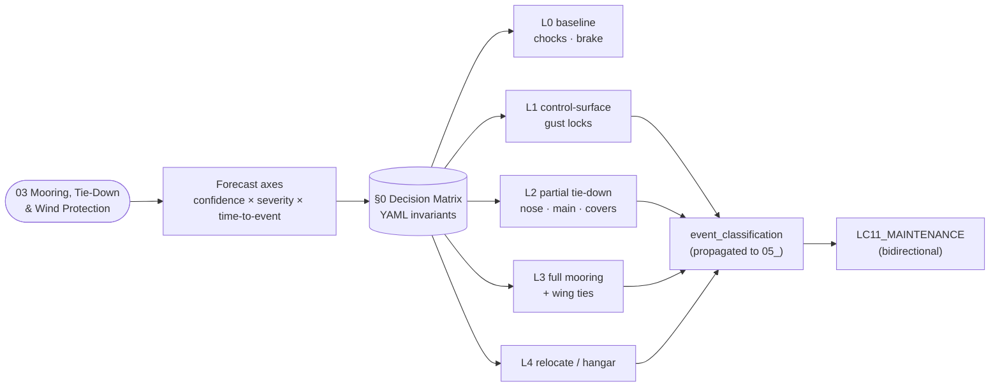

# ATLAS 010-019 · Section 01 · Subsection 050 · Subsubject 03 — Mooring, Tie-Down and Wind Protection

## 0. Invariants (machine-checkable)

The following YAML block declares the **wind-action decision matrix** for the AMPEL360 parked-state regime. It is the machine-readable surface of this subsubject and is consumed by the digital-twin tooling that validates a parking plan against the local weather forecast and by the event-classification engine in [`./05_Parking-Records-Inspections-and-Return-to-Service.md`](./05_Parking-Records-Inspections-and-Return-to-Service.md). **Wind-action thresholds are *not* a single number** — they are a function of forecast confidence, forecast severity, and time to event. The doctrine of *agisco in anticipo* (act in anticipation) is encoded by requiring action **at the earliest cell** of the matrix where any axis crosses its trigger; the inverse direction is **not** symmetric because the cost of unwarranted action is much smaller than the cost of belated action.

```yaml
# ATLAS 010-019.01.050.03 — Wind-action decision matrix
forecast_axes:
  forecast_confidence:           # operator weather-service confidence band
    - low                        # < 50%
    - medium                     # 50–80%
    - high                       # > 80%
  forecast_severity:             # peak sustained wind in the forecast window
    - calm                       # < 25 kt
    - moderate                   # 25–40 kt
    - strong                     # 40–65 kt
    - severe                     # > 65 kt (incl. convective gust fronts)
  time_to_event:                 # forecast lead time to peak wind
    - imminent                   # < 1 h
    - short                      # 1–6 h
    - medium                     # 6–24 h
    - long                       # > 24 h
action_levels:
  L0_baseline:                   # no additional mooring beyond turnaround config
    triggers: ["forecast_severity == calm OR (forecast_confidence == low AND forecast_severity <= moderate AND time_to_event >= medium)"]
    actions:  ["chocks_set", "parking_brake_set"]
  L1_control_locks:              # control-surface gust locks engaged
    triggers: ["forecast_severity >= moderate AND time_to_event <= medium",
               "forecast_severity >= strong AND time_to_event <= long"]
    actions:  ["L0", "control_surface_gust_locks_engaged"]
  L2_partial_tie_down:           # nose tie + main-gear ties; covers on probes
    triggers: ["forecast_severity >= strong AND time_to_event <= medium",
               "forecast_severity == moderate AND forecast_confidence == high AND time_to_event <= short"]
    actions:  ["L1", "nose_tie_down_engaged", "main_gear_tie_down_engaged", "probe_covers_installed"]
  L3_full_mooring:               # wing ties + nose tie + main-gear ties
    triggers: ["forecast_severity == severe AND time_to_event <= medium",
               "forecast_severity >= strong AND forecast_confidence == high AND time_to_event <= short"]
    actions:  ["L2", "wing_tie_down_engaged"]
  L4_relocate_or_hangar:         # relocate to hangar or to leeward stand
    triggers: ["forecast_severity == severe AND forecast_confidence >= medium AND time_to_event <= short",
               "convective_gust_front_warning == true"]
    actions:  ["L3", "relocate_to_hangar_or_leeward_stand"]
anticipation_rule:
  description: "Act at the earliest cell where ANY axis crosses its trigger. Down-grading the action level requires forecast revision documented in the event log."
  asymmetry: "Cost of unwarranted action << cost of belated action; therefore the matrix is biased toward earlier action."
record_propagation:
  field: event_classification    # consumed by ./05_; mandatory in any moored-and-released event
```

## 1. Purpose

Defines the **mooring requirements, tie-down configurations, control-surface gust locks and wind-protection actions** for the AMPEL360 aircraft in the parked state. Establishes the wind-action **decision matrix** declared in §0 above as a function of `forecast_confidence × forecast_severity × time_to_event`, and links the *moored-and-released* event log into the records and propagation interface of [`./05`](./05_Parking-Records-Inspections-and-Return-to-Service.md). Aligned to ATA Chapter 10 — Parking, Mooring, Storage and Return to Service[^ata10], with adjacency to ATA Chapter 32 — Landing Gear[^ata32] for the gear-side tie-down points and chock policy. Conforms to the controlled Q+ATLANTIDE baseline[^baseline], S1000D Issue 6.0[^s1000d] on the ATA iSpec 2200 information set[^ata2200][^ataspec100], and AS9100D[^as9100d].

## 2. Scope

- Covers the *Mooring, Tie-Down and Wind Protection* subsubject (`03`) of subsection `050` *parking* within section `01` *Manejo en Tierra & Servicio*.
- Inherits Q-Division authority and ORB support from the parent row in [`../../README.md` §3](../../README.md#3-architecture-table)[^archtable].
- **Mooring point locations.** The aircraft mooring points — nose tie-down lug, main-gear tie-down lugs, and (for severe wind) wing tie-down attachments — are documented per AMPEL360 variant. Mooring lugs are dedicated structural fittings; **no mooring force shall be reacted through non-mooring fittings** (cargo door rails, fairings, sensor housings) under any circumstances.
- **Tie-down configurations.**
  - **Nose tie-down** — single tie from the nose-gear lug to a forward apron tie-down ring; primary purpose is to limit weather-vaning and yaw under quartering wind.
  - **Main-gear tie-downs** — symmetric ties from the main-gear lugs to the corresponding apron rings; primary purpose is to limit lateral and longitudinal translation.
  - **Wing tie-downs** — for severe-wind regimes only; ties from the certified wing tie-down attachments to apron rings, configured to limit lift and roll moments.
- **Control-surface gust locks.** Internal gust-lock devices and external control-surface locks shall be engaged per the L1+ action levels of the §0 matrix. The absence of an engaged gust lock during a forecast moderate-or-stronger wind event is logged in [`./05`](./05_Parking-Records-Inspections-and-Return-to-Service.md) with `event_classification: inspection_trigger` at minimum.
- **Probe covers and exclusion measures.** Pitot covers, static-port covers, AOA-vane locks, engine inlet/exhaust covers, and (where applicable) H₂ vent covers shall be installed per L2+ action levels. Their installation and removal are recorded; **release-to-service shall not occur with any of these covers installed** — the cross-check is part of the [`./05`](./05_Parking-Records-Inspections-and-Return-to-Service.md) walk-around.
- **Predicted-weather thresholds for action.** As declared in §0, action thresholds are **not** a single wind-speed number; they are the cell of the §0 matrix in which the current forecast lies. The matrix is consulted **at every forecast update**, and the action level is **monotonically non-decreasing** within a given event window unless an explicit forecast-revision entry is recorded.
- **Bidirectional link with `LC11_MAINTENANCE/`.** A parked aircraft that experienced a *forecast wind event* (regardless of action level reached) carries different inspection triggers than one that did not — fastener checks, fairing checks, control-surface free-play checks. The linkage is recorded in [`./05`](./05_Parking-Records-Inspections-and-Return-to-Service.md) with `event_classification:` and propagates into `AMPEL360-AIR-T/LC11_MAINTENANCE/` machine-readably, so the maintenance program is never asked to *re-derive* the wind history of the aircraft from prose.
- **Out of scope.** The classification of *what kind of parking* the aircraft is in (subsubject `01`), the stand-geometry (subsubject `02`), the short-term/turnaround physical configuration (subsubject `04`), the records and return-to-service interface itself (subsubject `05`), the maintenance task definitions triggered by an event (`AMPEL360-AIR-T/LC11_MAINTENANCE/`).

## 3. Diagram

The diagram below shows how the §0 decision matrix drives the action-level cascade and how the event-classification field closes the loop into `LC11_MAINTENANCE/`.



## 4. Footprint

| Metric | Value |
|---|---|
| Architecture | `ATLAS` — Aircraft Top-Level Architecture System |
| Master range | `000–099` |
| Code range | `010-019` |
| Section | `01` — Manejo en Tierra & Servicio |
| Subject | `00` — General Information |
| Subsection | `050` — parking |
| Subsubject | `03` — Mooring, Tie-Down and Wind Protection |
| Primary Q-Division | Q-GROUND[^qdiv] |
| Support Q-Divisions | Q-MECHANICS, Q-INDUSTRY |
| ORB support | ORB-PMO, ORB-FIN |
| Governance class | `baseline`[^gov] |
| Folder path | `Q+ATLANTIDE/000-099_ATLAS/010-019_Manejo-en-Tierra-Servicio/050_parking/` |
| Document | `03_Mooring-Tie-Down-and-Wind-Protection.md` (this file) |
| Parent subsection | [`00_Overview.md`](./00_Overview.md) |
| Parent architecture | [`../../README.md`](../../README.md) |
| Parent baseline | [`organization/Q+ATLANTIDE.md`](../../../../organization/Q+ATLANTIDE.md) |

## 5. References & Citations


[^baseline]: **Q+ATLANTIDE controlled baseline (v1.0.0)** — [`organization/Q+ATLANTIDE.md`](../../../../organization/Q+ATLANTIDE.md). Defines the controlled `000-999` architecture-band taxonomy and the ATLAS-1000 register subpart.

[^archtable]: **ATLAS §3 Architecture Table** — [`../../README.md` §3](../../README.md#3-architecture-table). Authoritative source for the `010-019` row (Section `01` — Manejo en Tierra & Servicio, Primary Q-Division Q-GROUND).

[^qdiv]: **Q-Division authority** — Q-Divisions provide technical authority over an architecture row (Q+ATLANTIDE Note N-002). See [`organization/Q+ATLANTIDE.md` §4](../../../../organization/Q+ATLANTIDE.md#4-notes).

[^gov]: **Governance class** — Bands are classified as `baseline` or `restricted` per Q+ATLANTIDE §4 governance rules.

[^ata10]: **ATA Chapter 10 — Parking, Mooring, Storage and Return to Service** — Industry chapter governing the stationary-aircraft regime on the ground, mooring against wind, longer-term storage and the formal return-to-service step. Primary canonical reference for this subsection.

[^ata32]: **ATA Chapter 32 — Landing Gear** — Industry chapter covering landing-gear systems; adjacency reference for the gear-side tie-down points and chock policy.

[^ata2200]: **ATA iSpec 2200 — Information Standards for Aviation Maintenance** — Industry standard for digital aircraft maintenance information; governs chapter / section / subject numbering inherited by ATLAS `000-099`.

[^ataspec100]: **ATA Spec 100 — Manufacturers' Technical Data** — Predecessor numbering scheme that established the 00–99 chapter map mirrored by ATLAS sub-ranges.

[^s1000d]: **S1000D Issue 6.0 — International specification for technical publications** — Common Source DataBase (CSDB) and Data Module Code (DMC) specification used across ATLAS technical publications.

[^as9100d]: **AS9100D — Quality Management Systems — Aviation, Space and Defense Organizations** — Quality-management baseline for all Q+ATLANTIDE deliverables.

### Applicable industry standards

The following ATA-family and industry standards apply to this subsubject in addition to the cross-cutting Q+ATLANTIDE governance:

- ATA Chapter 10 — Parking, Mooring, Storage and Return to Service[^ata10]
- ATA Chapter 32 — Landing Gear[^ata32]
- ATA iSpec 2200 — Information Standards for Aviation Maintenance[^ata2200]
- ATA Spec 100 — Manufacturers' Technical Data[^ataspec100]
- S1000D Issue 6.0 — International specification for technical publications[^s1000d]
- AS9100D — Quality Management Systems — Aviation, Space and Defense Organizations[^as9100d]
