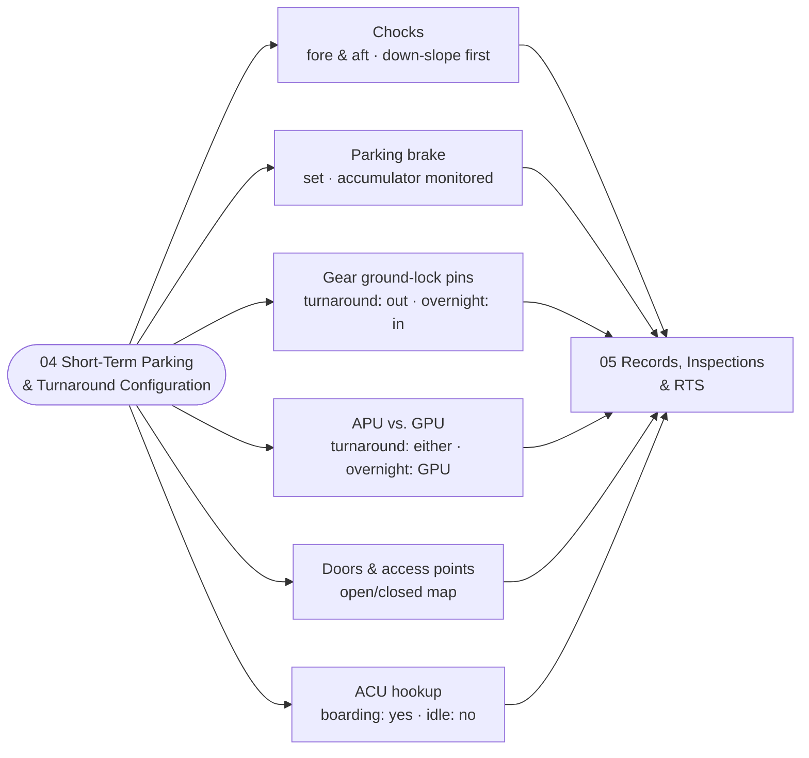

# ATLAS 010-019 · Section 01 · Subsection 050 · Subsubject 04 — Short-Term Parking and Turnaround Configurations

## 1. Purpose

Defines the **physical configuration** the AMPEL360 aircraft must be in for the short-term / turnaround parking class — chocks placement and policy, parking-brake state, gear ground-lock pin status, APU vs. GPU power-state policy, doors and access-points open/closed map, and air-conditioning unit (ACU) hookup. Covers also the **overnight** transition envelope where the configuration deltas (gear pins, GPU vs. APU preference, control-surface locks per [`./03`](./03_Mooring-Tie-Down-and-Wind-Protection.md)) take effect. Aligned to ATA Chapter 10 — Parking, Mooring, Storage and Return to Service[^ata10] with adjacency to ATA Chapter 12 — Servicing[^ata12] for the GPU/ACU/lavatory/water hookups, and to ATA Chapter 32 — Landing Gear[^ata32] for the chocks / parking brake / gear-pin hardware. Conforms to the controlled Q+ATLANTIDE baseline[^baseline], S1000D Issue 6.0[^s1000d] on the ATA iSpec 2200 information set[^ata2200][^ataspec100], and AS9100D[^as9100d].

> **Boundary with `01_` — physical configuration vs. classification rule.** This subsubject defines **what physical configuration the aircraft must be in for short-term/turnaround parking** (the operational state). The corresponding **classification rule** (what duration window counts as turnaround vs. overnight vs. extended) is owned by [`./01_Scope-and-Parking-Boundaries.md` §2](./01_Scope-and-Parking-Boundaries.md#2-scope). The two views are kept orthogonal to prevent contributors from writing the same content twice in different files. Restated here per the directive in [`./00_Overview.md` §2](./00_Overview.md#2-scope).

## 2. Scope

- Covers the *Short-Term Parking and Turnaround Configurations* subsubject (`04`) of subsection `050` *parking* within section `01` *Manejo en Tierra & Servicio*.
- Inherits Q-Division authority and ORB support from the parent row in [`../../README.md` §3](../../README.md#3-architecture-table)[^archtable].
- **Chocks.**
  - Both nose-gear and main-gear wheels shall be chocked **fore and aft** before any GSE coupling and before the parking brake is released for periodic exercise. Chocks are the *primary* anti-roll defence; the parking brake is the *secondary* defence and shall **never** be relied on alone in the parked state.
  - On a sloped stand, **down-slope chocks** shall be installed first.
  - Chock-installed and chock-removed timestamps are recorded in [`./05`](./05_Parking-Records-Inspections-and-Return-to-Service.md).
- **Parking brake.**
  - Set during turnaround except when explicitly required to be released for a periodic check. Released only with chocks confirmed installed.
  - Parking-brake hydraulic-accumulator pressure shall be monitored; loss of pressure with the brake set is an `inspection_trigger` event in [`./05`](./05_Parking-Records-Inspections-and-Return-to-Service.md).
- **Gear ground-lock pins.**
  - **Turnaround (≤ ~6 h)** — gear ground-lock pins are **not normally installed** because the aircraft is about to operate again and the cost of accidentally departing with pins in is significantly greater than the marginal safety gain over the short window. The decision is recorded.
  - **Overnight (~6–24 h)** — gear ground-lock pins **are normally installed** and recorded; their installation and the matching removal-before-pushback are mandatory checklist items in [`./05`](./05_Parking-Records-Inspections-and-Return-to-Service.md). Departure with pins still installed is a hard `damage_event` precursor.
  - **Extended (> ~24 h)** — gear pins installed; release-to-service ([`./05` §3](./05_Parking-Records-Inspections-and-Return-to-Service.md)) verifies removal cross-check.
- **APU vs. GPU power state.**
  - **Turnaround** — APU **or** GPU, per operator policy and station availability. APU permits autonomy; GPU is preferred where fuel and noise constraints apply.
  - **Overnight** — GPU **strongly preferred** over APU for fuel-burn and noise reasons; APU shut down once GPU is on the bus.
  - **Extended (between checks)** — disconnected from external power; aircraft on internal battery with periodic GPU re-energisation per the operator's program.
  - The preferred-source decision and the actual source used are recorded in [`./05`](./05_Parking-Records-Inspections-and-Return-to-Service.md).
- **Doors and access points open/closed.**
  - **Turnaround during loading/unloading** — passenger door(s) open per the active jet-bridge or stairs side; cargo doors open per the loading state; service doors (galley, water, lavatory) open per the active service.
  - **Turnaround between operations (idle window)** — passenger and cargo doors closed; service doors closed unless service is active. Door state is checklist-verified before pushback.
  - **Overnight** — all doors closed and sealed; door-seal degradation due to extended open positions during overnight is an `inspection_trigger`.
- **Air-conditioning unit (ACU) hookup.**
  - **Turnaround with passengers boarding or being unloaded** — ACU hookup or APU bleed required to maintain cabin temperature; the choice is per operator policy and stand-equipment availability.
  - **Turnaround idle / overnight idle** — ACU disconnected unless equipment-cooling requirements (avionics, cabin equipment in test) explicitly require it.
- **Out of scope.** The classification rule that selects turnaround vs. overnight vs. extended (subsubject `01`), the stand classification and BWB stand geometry (subsubject `02`), the mooring and wind-protection actions on top of this configuration (subsubject `03`), the records and return-to-service interface (subsubject `05`), the active fluid/gas/energy flows themselves (`020_servicing/`).
- All configuration items are surfaced as S1000D data modules per Issue 6.0[^s1000d] on the ATA iSpec 2200 information set[^ata2200][^ataspec100] and quality-controlled per AS9100D[^as9100d].

## 3. Diagram

## 4. Footprint

| Metric | Value |
|---|---|
| Architecture | `ATLAS` — Aircraft Top-Level Architecture System |
| Master range | `000–099` |
| Code range | `010-019` |
| Section | `01` — Manejo en Tierra & Servicio |
| Subject | `00` — General Information |
| Subsection | `050` — parking |
| Subsubject | `04` — Short-Term Parking and Turnaround Configurations |
| Primary Q-Division | Q-GROUND[^qdiv] |
| Support Q-Divisions | Q-MECHANICS, Q-INDUSTRY |
| ORB support | ORB-PMO, ORB-FIN |
| Governance class | `baseline`[^gov] |
| Folder path | `Q+ATLANTIDE/000-099_ATLAS/010-019_Manejo-en-Tierra-Servicio/050_parking/` |
| Document | `04_Short-Term-Parking-and-Turnaround-Configurations.md` (this file) |
| Parent subsection | [`00_Overview.md`](./00_Overview.md) |
| Parent architecture | [`../../README.md`](../../README.md) |
| Parent baseline | [`organization/Q+ATLANTIDE.md`](../../../../organization/Q+ATLANTIDE.md) |

## 5. References & Citations

[^baseline]: **Q+ATLANTIDE controlled baseline (v1.0.0)** — [`organization/Q+ATLANTIDE.md`](../../../../organization/Q+ATLANTIDE.md). Defines the controlled `000-999` architecture-band taxonomy and the ATLAS-1000 register subpart.

[^archtable]: **ATLAS §3 Architecture Table** — [`../../README.md` §3](../../README.md#3-architecture-table). Authoritative source for the `010-019` row (Section `01` — Manejo en Tierra & Servicio, Primary Q-Division Q-GROUND).

[^qdiv]: **Q-Division authority** — Q-Divisions provide technical authority over an architecture row (Q+ATLANTIDE Note N-002). See [`organization/Q+ATLANTIDE.md` §4](../../../../organization/Q+ATLANTIDE.md#4-notes).

[^gov]: **Governance class** — Bands are classified as `baseline` or `restricted` per Q+ATLANTIDE §4 governance rules.

[^ata10]: **ATA Chapter 10 — Parking, Mooring, Storage and Return to Service** — Industry chapter governing the stationary-aircraft regime on the ground, mooring against wind, longer-term storage and the formal return-to-service step. Primary canonical reference for this subsection.

[^ata12]: **ATA Chapter 12 — Servicing** — Industry chapter governing routine servicing; adjacency reference for the GPU/ACU/lavatory/water hookups associated with the parked-state physical configuration.

[^ata32]: **ATA Chapter 32 — Landing Gear** — Industry chapter covering landing-gear systems; adjacency reference for chocks, parking brake and ground-lock pin hardware.

[^ata2200]: **ATA iSpec 2200 — Information Standards for Aviation Maintenance** — Industry standard for digital aircraft maintenance information; governs chapter / section / subject numbering inherited by ATLAS `000-099`.

[^ataspec100]: **ATA Spec 100 — Manufacturers' Technical Data** — Predecessor numbering scheme that established the 00–99 chapter map mirrored by ATLAS sub-ranges.

[^s1000d]: **S1000D Issue 6.0 — International specification for technical publications** — Common Source DataBase (CSDB) and Data Module Code (DMC) specification used across ATLAS technical publications.

[^as9100d]: **AS9100D — Quality Management Systems — Aviation, Space and Defense Organizations** — Quality-management baseline for all Q+ATLANTIDE deliverables.

### Applicable industry standards

The following ATA-family and industry standards apply to this subsubject in addition to the cross-cutting Q+ATLANTIDE governance:

- ATA Chapter 10 — Parking, Mooring, Storage and Return to Service[^ata10]
- ATA Chapter 12 — Servicing[^ata12]
- ATA Chapter 32 — Landing Gear[^ata32]
- ATA iSpec 2200 — Information Standards for Aviation Maintenance[^ata2200]
- ATA Spec 100 — Manufacturers' Technical Data[^ataspec100]
- S1000D Issue 6.0 — International specification for technical publications[^s1000d]
- AS9100D — Quality Management Systems — Aviation, Space and Defense Organizations[^as9100d]
