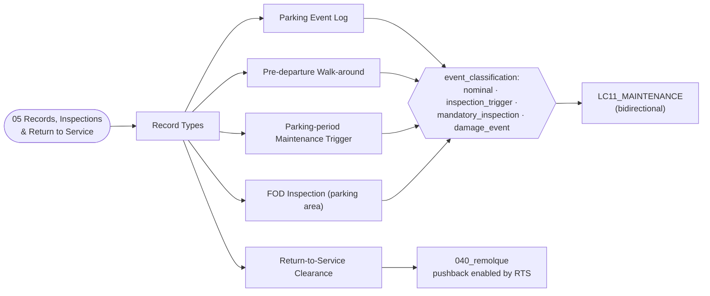

# ATLAS 010-019 · Section 01 · Subsection 050 · Subsubject 05 — Parking Records, Inspections and Return to Service

## 1. Purpose

Defines the **record set produced by every AMPEL360 parking event** — the parking log, the pre-departure walk-around inspection from the parked state, the parking-period maintenance triggers, the FOD inspection of the parking area, and the formal **return-to-service (RTS) clearance** that releases the aircraft back to operations. Establishes the **`event_classification:` field** that closes the digital-twin loop with the wind-action decision matrix declared in [`./03_Mooring-Tie-Down-and-Wind-Protection.md` §0](./03_Mooring-Tie-Down-and-Wind-Protection.md#0-invariants-machine-checkable) and with the configuration items defined in [`./04_Short-Term-Parking-and-Turnaround-Configurations.md`](./04_Short-Term-Parking-and-Turnaround-Configurations.md): every record carries one of `nominal`, `inspection_trigger`, `mandatory_inspection`, `damage_event`, and the value determines whether the maintenance program records a no-action entry, raises an inspection trigger, or hard-stops the aircraft pending mandatory inspection. Aligned to the controlled Q+ATLANTIDE baseline[^baseline] and to ATA Chapter 10 — Parking, Mooring, Storage and Return to Service[^ata10] (the formal *return to service* step), with adjacency to ATA Chapter 12 — Servicing[^ata12] for the servicing-while-parked traceability and ATA Chapter 32 — Landing Gear[^ata32] for the gear-side cross-references. Quality-managed per AS9100D[^as9100d] and structured for S1000D Issue 6.0[^s1000d] data-module export on the ATA iSpec 2200 information set[^ata2200][^ataspec100].

## 2. Scope

- Covers the *Parking Records, Inspections and Return to Service* subsubject (`05`) of subsection `050` *parking* within section `01` *Manejo en Tierra & Servicio*.
- Inherits Q-Division authority and ORB support from the parent row in [`../../README.md` §3](../../README.md#3-architecture-table)[^archtable].
- **The `event_classification:` field — the propagation key.** Every parking record-type definition declares a top-level YAML field `event_classification:` whose value is one of:
  - `nominal` — all parameters within steady-state limits; no environmental event reached the L1+ action level of [`./03` §0](./03_Mooring-Tie-Down-and-Wind-Protection.md#0-invariants-machine-checkable); walk-around clean; no FOD found. The record is filed; **no maintenance action** is propagated.
  - `inspection_trigger` — a non-blocking anomaly was observed (e.g. door-seal degradation due to extended open position, parking-brake accumulator pressure drift, L1 control-surface gust-locks engaged during the event). The record is filed and an **inspection trigger** is raised in the maintenance program; the aircraft remains releasable but the next scheduled check absorbs the additional inspection task.
  - `mandatory_inspection` — a parameter reached its limit, or a wind event reached L2+ action level, or FOD was found in the immediate parking area. The record is filed and a **mandatory inspection** task is opened in the maintenance program; the aircraft is **not releasable** until the inspection is signed off.
  - `damage_event` — visible damage observed (hail, GSE strike, fairing damage), or the wind event reached L4 (relocate / hangar) and exceedance was recorded, or release-to-service cross-checks failed (gear pin not removed, probe cover not removed, a door is not in the expected state). The record is filed and a **hard-stop maintenance event** is opened; the aircraft is grounded pending damage assessment and rectification.
  This field makes the propagation rule explicit and machine-checkable. Without it, parking events become unstructured prose that humans have to triage.
- **Record types covered.**
  - **Parking event log** — start time, end time, parking class per [`./01`](./01_Scope-and-Parking-Boundaries.md) (turnaround / overnight / extended), stand identifier and stand class per [`./02`](./02_Parking-Configurations-and-Stand-Types.md), configuration snapshot per [`./04`](./04_Short-Term-Parking-and-Turnaround-Configurations.md) (chocks in/out timestamps, parking-brake state, gear-pin in/out timestamps, APU/GPU source and switch-over timestamps, door states, ACU hookup timestamps), wind action level reached per [`./03`](./03_Mooring-Tie-Down-and-Wind-Protection.md), and the resulting `event_classification:`.
  - **Pre-departure walk-around inspection (from the parked state)** — checklist outcome covering: chocks removed, gear ground-lock pins removed, probe and inlet covers removed, control-surface gust locks released, parking-brake state, no FOD around the aircraft, no fluid leaks under the aircraft, no visible damage. **Release-to-service is gated on a clean walk-around.** Any non-clean line item drives the `event_classification:` upward as appropriate.
  - **Parking-period maintenance trigger** — captured when the §0 wind-action level reached at least L1, or when a configuration item entered an `inspection_trigger`/`mandatory_inspection`/`damage_event` state during the parked window. Carries the classification, the trigger source (`./03_` wind / `./04_` config / walk-around), and the proposed task identifier into `LC11_MAINTENANCE/`.
  - **FOD inspection of the parking area** — captured each time the aircraft moves out of a parking position. FOD found is at minimum `mandatory_inspection` for the engine inlets and `inspection_trigger` for the surrounding area; FOD strike to the aircraft is `damage_event`.
  - **Return-to-service (RTS) clearance** — the formal record that closes the parking event. Required: walk-around clean (or all anomalies cleared), all configuration cross-checks passed (gear pins out, probe covers off, control locks released, doors in expected state, parking brake released only after chocks removed), `event_classification:` recorded. Without an RTS record the aircraft is not considered released; pushback per [`../040_remolque/`](../040_remolque/00_Overview.md) shall not commence.
- **Bidirectional link with `LC11_MAINTENANCE/`.** The propagation is bidirectional: parking records consumed by LC11 can in turn raise *additional* inspection items (e.g. tightened wind-event inspection scope after a fleet-wide finding), which flow back as updated content for [`./03`](./03_Mooring-Tie-Down-and-Wind-Protection.md) and [`./04`](./04_Short-Term-Parking-and-Turnaround-Configurations.md). This subsection is the canonical *producer* of parking events; LC11 is the canonical consumer for maintenance triggers.
- **Out of scope.** The wind-action decision matrix itself (subsubject `03`), the physical-configuration definitions (subsubject `04`), the stand classification (subsubject `02`), the parking-class duration thresholds (subsubject `01`), and the maintenance task content beyond the trigger interface (`AMPEL360-AIR-T/LC11_MAINTENANCE/` SSOT).
- All record-type definitions are surfaced as S1000D data modules per Issue 6.0[^s1000d] on the ATA iSpec 2200 information set[^ata2200][^ataspec100] and quality-controlled per AS9100D[^as9100d].

## 3. Diagram

## 4. Footprint

| Metric | Value |
|---|---|
| Architecture | `ATLAS` — Aircraft Top-Level Architecture System |
| Master range | `000–099` |
| Code range | `010-019` |
| Section | `01` — Manejo en Tierra & Servicio |
| Subject | `00` — General Information |
| Subsection | `050` — parking |
| Subsubject | `05` — Parking Records, Inspections and Return to Service |
| Primary Q-Division | Q-GROUND[^qdiv] |
| Support Q-Divisions | Q-MECHANICS, Q-INDUSTRY |
| ORB support | ORB-PMO, ORB-FIN |
| Governance class | `baseline`[^gov] |
| Folder path | `Q+ATLANTIDE/000-099_ATLAS/010-019_Manejo-en-Tierra-Servicio/050_parking/` |
| Document | `05_Parking-Records-Inspections-and-Return-to-Service.md` (this file) |
| Parent subsection | [`00_Overview.md`](./00_Overview.md) |
| Parent architecture | [`../../README.md`](../../README.md) |
| Parent baseline | [`organization/Q+ATLANTIDE.md`](../../../../organization/Q+ATLANTIDE.md) |

## 5. References & Citations

[^baseline]: **Q+ATLANTIDE controlled baseline (v1.0.0)** — [`organization/Q+ATLANTIDE.md`](../../../../organization/Q+ATLANTIDE.md). Defines the controlled `000-999` architecture-band taxonomy and the ATLAS-1000 register subpart.

[^archtable]: **ATLAS §3 Architecture Table** — [`../../README.md` §3](../../README.md#3-architecture-table). Authoritative source for the `010-019` row (Section `01` — Manejo en Tierra & Servicio, Primary Q-Division Q-GROUND).

[^qdiv]: **Q-Division authority** — Q-Divisions provide technical authority over an architecture row (Q+ATLANTIDE Note N-002). See [`organization/Q+ATLANTIDE.md` §4](../../../../organization/Q+ATLANTIDE.md#4-notes).

[^gov]: **Governance class** — Bands are classified as `baseline` or `restricted` per Q+ATLANTIDE §4 governance rules.

[^ata10]: **ATA Chapter 10 — Parking, Mooring, Storage and Return to Service** — Industry chapter governing the stationary-aircraft regime on the ground, mooring against wind, longer-term storage and the formal return-to-service step. Primary canonical reference for this subsection.

[^ata12]: **ATA Chapter 12 — Servicing** — Industry chapter governing routine servicing; adjacency reference for servicing-while-parked traceability.

[^ata32]: **ATA Chapter 32 — Landing Gear** — Industry chapter covering landing-gear systems; adjacency reference for the gear-side parked-state configuration (chocks, parking brake, ground-lock pins, weight-on-wheels).

[^ata2200]: **ATA iSpec 2200 — Information Standards for Aviation Maintenance** — Industry standard for digital aircraft maintenance information; governs chapter / section / subject numbering inherited by ATLAS `000-099`.

[^ataspec100]: **ATA Spec 100 — Manufacturers' Technical Data** — Predecessor numbering scheme that established the 00–99 chapter map mirrored by ATLAS sub-ranges.

[^s1000d]: **S1000D Issue 6.0 — International specification for technical publications** — Common Source DataBase (CSDB) and Data Module Code (DMC) specification used across ATLAS technical publications.

[^as9100d]: **AS9100D — Quality Management Systems — Aviation, Space and Defense Organizations** — Quality-management baseline for all Q+ATLANTIDE deliverables.

### Applicable industry standards

The following ATA-family and industry standards apply to this subsubject in addition to the cross-cutting Q+ATLANTIDE governance:

- ATA Chapter 10 — Parking, Mooring, Storage and Return to Service[^ata10]
- ATA Chapter 12 — Servicing[^ata12]
- ATA Chapter 32 — Landing Gear[^ata32]
- ATA iSpec 2200 — Information Standards for Aviation Maintenance[^ata2200]
- ATA Spec 100 — Manufacturers' Technical Data[^ataspec100]
- S1000D Issue 6.0 — International specification for technical publications[^s1000d]
- AS9100D — Quality Management Systems — Aviation, Space and Defense Organizations[^as9100d]
