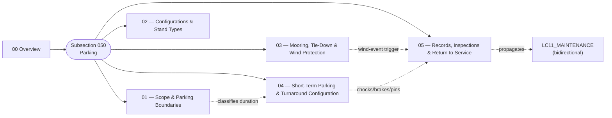

# ATLAS 010-019 · Section 01 · Subsection 050 — parking

## 1. Purpose

Subsection-level index for *parking* (`050`) within ATLAS `010-019` — *Manejo en Tierra & Servicio*. Aggregates the `00 Overview` and the detailed subsubjects (`01`–`05`) that extend it with the canonical scope/boundary clauses (parking vs. mooring vs. storage vs. layover; turnaround vs. overnight vs. extended), the parking-stand classification matrix (including the **negative-space** enumeration of ICAO stand classes the AMPEL360-BWB-Q100 does *not* fit and the **H₂ exclusion zone** around the LH₂ bay), the mooring and wind-protection regime (with the machine-checkable **`forecast_confidence × forecast_severity × time_to_event` decision matrix** at the top of `03_`), the short-term/turnaround physical configuration (chocks, brakes, gear pin status, APU/GPU power state, doors and access points, ACU hookup), and the records and return-to-service interface keyed by `event_classification:` for bidirectional propagation into `LC11_MAINTENANCE/`. Conforms to the controlled Q+ATLANTIDE baseline[^baseline] and S1000D Issue 6.0[^s1000d]. Maps to **ATA 10 — Parking, Mooring, Storage and Return to Service**[^ata10] as the primary canonical chapter, with adjacency to **ATA 12 — Servicing**[^ata12] for servicing-while-parked and **ATA 32 — Landing Gear**[^ata32] for the gear-side parked-state hardware. *The token `050` is an internal sequential index inside the `010-019` range and is **not** a pointer to ATA Chapter 50 — see [`./00_Overview.md` §1](./00_Overview.md#1-purpose).*

## 2. Scope

- Covers the full subsubject namespace `00`–`99` of subsection `050` *parking*; subsubjects `01`–`05` are populated in this baseline release, the remaining `06`–`99` slots remain available for future extension per the Overview's authorisation[^archtable].
- Inherits Q-Division authority and ORB support from the parent row in [`../../README.md` §3](../../README.md#3-architecture-table)[^archtable].
- **Boundary triangulation with subsections `010`, `020`, `030` and `040`.** Restated for navigation:
  - **Ground handling** (`010`) = aircraft *positioning*, *safety perimeter*, GSE *physical placement*. See [`../010_Ground-handling/00_Overview.md`](../010_Ground-handling/00_Overview.md).
  - **Servicing** (`020`) = active *flow through coupling interfaces*. See [`../020_servicing/00_Overview.md`](../020_servicing/00_Overview.md).
  - **Access** (`030`) = *opening the aircraft envelope* to enable presence. See [`../030_acceso/README.md`](../030_acceso/README.md).
  - **Remolque** (`040`) = *controlled translation* of the aircraft on the ground under *external* motive power. See [`../040_remolque/README.md`](../040_remolque/README.md).
  - **Parking** (`050`, this) = the *resting state* of the aircraft on the ground between operations.

## 3. Diagram

The diagram below shows how this subsection's `00 Overview` aggregates the populated subsubjects (`01`–`05`) into the *parking* slice of ATLAS `010-019`, and how the wind-event and configuration chains close onto the maintenance program.

## 4. Subsubject Index

| NN | Title | Document | Status |
|---:|---|---|---|
| 00 | Overview | [`00_Overview.md`](./00_Overview.md) | active |
| 01 | Scope and Parking Boundaries | [`01_Scope-and-Parking-Boundaries.md`](./01_Scope-and-Parking-Boundaries.md) | active |
| 02 | Parking Configurations and Stand Types | [`02_Parking-Configurations-and-Stand-Types.md`](./02_Parking-Configurations-and-Stand-Types.md) | active |
| 03 | Mooring, Tie-Down and Wind Protection | [`03_Mooring-Tie-Down-and-Wind-Protection.md`](./03_Mooring-Tie-Down-and-Wind-Protection.md) | active |
| 04 | Short-Term Parking and Turnaround Configurations | [`04_Short-Term-Parking-and-Turnaround-Configurations.md`](./04_Short-Term-Parking-and-Turnaround-Configurations.md) | active |
| 05 | Parking Records, Inspections and Return to Service | [`05_Parking-Records-Inspections-and-Return-to-Service.md`](./05_Parking-Records-Inspections-and-Return-to-Service.md) | active |

## 5. Sibling Subsections (010-019 range)

| Code | Subsection | Document |
|---|---|---|
| `010` | Ground handling | [`../010_Ground-handling/README.md`](../010_Ground-handling/README.md) |
| `020` | servicing | [`../020_servicing/README.md`](../020_servicing/README.md) |
| `030` | acceso | [`../030_acceso/README.md`](../030_acceso/README.md) |
| `040` | remolque | [`../040_remolque/README.md`](../040_remolque/README.md) |
| `050` | parking (this) | [`./README.md`](./README.md) |
| `060` | GSE | [`../060_GSE/00_Overview.md`](../060_GSE/00_Overview.md) |

## 6. Footprint

| Metric | Value |
|---|---|
| Architecture | `ATLAS` — Aircraft Top-Level Architecture System |
| Master range | `000–099` |
| Code range | `010-019` |
| Section | `01` — Manejo en Tierra & Servicio |
| Subject | `00` — General Information |
| Subsection | `050` — parking |
| Subsubject namespace | `00`–`99` (`00` + `01`–`05` populated) |
| Primary Q-Division | Q-GROUND[^qdiv] |
| Support Q-Divisions | Q-MECHANICS, Q-INDUSTRY |
| ORB support | ORB-PMO, ORB-FIN |
| Governance class | `baseline`[^gov] |
| Folder path | `Q+ATLANTIDE/000-099_ATLAS/010-019_Manejo-en-Tierra-Servicio/050_parking/` |
| Document | `README.md` (this file) |
| Parent architecture | [`../../README.md`](../../README.md) |
| Parent baseline | [`organization/Q+ATLANTIDE.md`](../../../../organization/Q+ATLANTIDE.md) |

## Governance

Governed by [`organization/Q+ATLANTIDE.md`](../../../../organization/Q+ATLANTIDE.md)[^baseline]. All subsubjects under this subsection inherit `architecture_code = ATLAS`, `primary_q_division = Q-GROUND` and `governance_class = baseline` from the parent ATLAS band; extensions added under `06`–`99` shall preserve those header fields and reuse the footnote set declared below. Cross-subsection references with `010_Ground-handling/`, `020_servicing/`, `030_acceso/` and `040_remolque/` shall preserve the *positioning vs. flow vs. envelope-opening vs. controlled-translation vs. resting-state* partition stated in [`./00_Overview.md` §2](./00_Overview.md#2-scope) and in the sibling Overviews. Subsubject `03` declares a top-level YAML decision matrix indexed by `forecast_confidence × forecast_severity × time_to_event` that is **machine-checked** by digital-twin tooling — extensions must not silently weaken those thresholds. Subsubject `05` records carry a top-level `event_classification:` field whose value (`nominal` / `inspection_trigger` / `mandatory_inspection` / `damage_event`) governs the bidirectional propagation rule into `AMPEL360-AIR-T/LC11_MAINTENANCE/`; this field is the canonical hand-off and shall not be omitted. The `04_` ↔ `01_` boundary (classification rule vs. operational state) is restated symmetrically in both files and shall not be collapsed by future edits.

## 7. Change Log

| Version | Date | Author | Change |
|---|---|---|---|
| 1.0.0 | 2026-05-07 | Q-GROUND | Initial population of subsection `050 parking`: README + Overview enrichment (diagram, ATA 10 / 12 / 32 cross-refs, numbering note disambiguating against ATA 50, triangulation with `010`/`020`/`030`/`040`) + subsubjects `01`–`05`, including the BWB-stand negative-space enumeration in `02_`, the wind-action decision-matrix YAML invariant block in `03_`, the `04_` ↔ `01_` boundary restated in both files, and the `event_classification:` propagation field in `05_`. |

## 8. References & Citations

[^baseline]: **Q+ATLANTIDE controlled baseline (v1.0.0)** — [`organization/Q+ATLANTIDE.md`](../../../../organization/Q+ATLANTIDE.md). Defines the controlled `000-999` architecture-band taxonomy and the ATLAS-1000 register subpart.

[^archtable]: **ATLAS §3 Architecture Table** — [`../../README.md` §3](../../README.md#3-architecture-table). Authoritative source for the `010-019` row (Section `01` — Manejo en Tierra & Servicio, Primary Q-Division Q-GROUND).

[^qdiv]: **Q-Division authority** — Q-Divisions provide technical authority over an architecture row (Q+ATLANTIDE Note N-002). See [`organization/Q+ATLANTIDE.md` §4](../../../../organization/Q+ATLANTIDE.md#4-notes).

[^gov]: **Governance class** — Bands are classified as `baseline` or `restricted` per Q+ATLANTIDE §4 governance rules.

[^ata10]: **ATA Chapter 10 — Parking, Mooring, Storage and Return to Service** — Industry chapter governing the stationary-aircraft regime on the ground, mooring against wind, longer-term storage and the formal return-to-service step. Primary canonical reference for this subsection.

[^ata12]: **ATA Chapter 12 — Servicing** — Industry chapter governing routine servicing (replenishment, lubrication, fluid checks); adjacency reference for servicing performed while the aircraft is parked.

[^ata32]: **ATA Chapter 32 — Landing Gear** — Industry chapter covering landing-gear systems; adjacency reference for the gear-side parked-state configuration (chocks, parking brake, ground-lock pins, weight-on-wheels).

[^ata2200]: **ATA iSpec 2200 — Information Standards for Aviation Maintenance** — Industry standard for digital aircraft maintenance information; governs chapter / section / subject numbering inherited by ATLAS `000-099`.

[^ataspec100]: **ATA Spec 100 — Manufacturers' Technical Data** — Predecessor numbering scheme that established the 00–99 chapter map mirrored by ATLAS sub-ranges.

[^s1000d]: **S1000D Issue 6.0 — International specification for technical publications** — Common Source DataBase (CSDB) and Data Module Code (DMC) specification used across ATLAS technical publications.

[^as9100d]: **AS9100D — Quality Management Systems — Aviation, Space and Defense Organizations** — Quality-management baseline for all Q+ATLANTIDE deliverables.

### Applicable industry standards

The following ATA-family and industry standards apply to this subsection in addition to the cross-cutting Q+ATLANTIDE governance:

- ATA Chapter 10 — Parking, Mooring, Storage and Return to Service[^ata10]
- ATA Chapter 12 — Servicing[^ata12]
- ATA Chapter 32 — Landing Gear[^ata32]
- ATA iSpec 2200 — Information Standards for Aviation Maintenance[^ata2200]
- ATA Spec 100 — Manufacturers' Technical Data[^ataspec100]
- S1000D Issue 6.0 — International specification for technical publications[^s1000d]
- AS9100D — Quality Management Systems — Aviation, Space and Defense Organizations[^as9100d]
