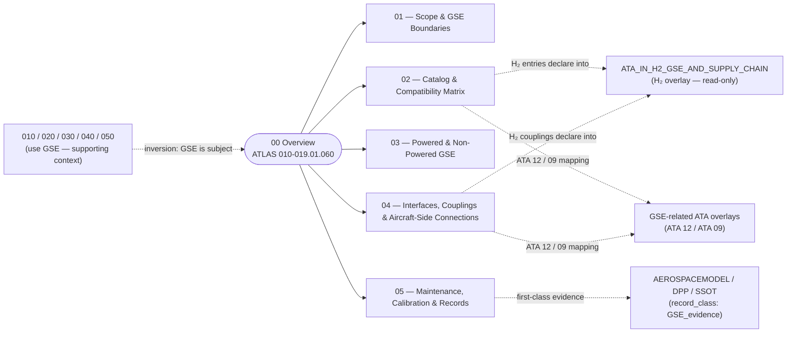

# ATLAS 010-019 · Section 01 · Subsection 060 — GSE

> **Inversion rule (canonical, opening line).** *If the chapter is about **what the aircraft does** with the GSE present, it belongs in subsections `010`–`050`; if the chapter is about **what the GSE is, what it costs, what it is compatible with, and when it is itself serviced**, it belongs here in `060`.* Every prior chapter in the `010-019` range touches GSE — `010_` for physical placement, `020_` through servicing flows, `030_` for access stands, `040_` for towing tractors, `050_` for GSE positioning at parked stands — but in all five of those chapters GSE is **supporting context**. Here, in `060_GSE/`, GSE is **the subject**: an engineered object in its own right, with its own catalog, lifecycle, compatibility envelope, and certification regime. Contributors **shall** apply this inversion test before adding content to either side of the boundary.

## 1. Purpose

Overview entry-point for the *GSE* (Ground Support Equipment) subsection within the `010-019` code range (Section `01` — *Manejo en Tierra & Servicio*) of the **ATLAS** architecture band (*Aircraft Top-Level Architecture System*, master range `000–099`).

This subsubject (`00 Overview`) introduces the ATLAS 010-019.060.00 slice and links it to the controlled Q+ATLANTIDE baseline[^baseline] and to the applicable industry standards listed in §5. *GSE* is the **engineered population of ground equipment** that the AMPEL360 family interfaces with on the airside and at the maintenance hangar — the equipment itself, not the aircraft activities performed in its presence. It maps adjacently to **ATA 12 — Servicing**[^ata12] (because GSE is the upstream side of every servicing coupling), to **ATA 09 — Towing and Taxiing**[^ata09] (because the towing tractors and towbars that subsection `040` *uses* are the engineered equipment owned and certified here), and to the existing infrastructure namespace **`OPT-INS_FRAMEWORK/I-INFRASTRUCTURES/ATA_IN_H2_GSE_AND_SUPPLY_CHAIN/`** which holds the H₂-specific GSE and supply-chain overlays consumed (read-only) from this subsection's catalog.

> **Numbering note.** The parent code-range is `010–019`, and `060_GSE/` is the **sixth lead subdirectory** of that range (after `010_`, `020_`, `030_`, `040_`, `050_`). The `060` token is therefore an **internal sequential index inside the `010-019` range**, not an ATA-60 chapter pointer (ATA Chapter 60 covers Standard Practices — Propeller/Rotor and is unrelated). The same convention applies to the rest of the range; see [`../050_parking/00_Overview.md` §1](../050_parking/00_Overview.md#1-purpose). If a future global decision retires the `0X0_` step in favour of denser increments, it shall be applied to the entire `010–019` range, not just to this subsection.

## 2. Scope

- Covers the *GSE* slice of the parent code range `010-019` — i.e. **the engineered population of ground equipment** used to support AMPEL360 operations: catalog, compatibility matrix, powered/non-powered classification, aircraft-side coupling specifications, and the GSE-side lifecycle (maintenance, calibration, records).
- Inherits Q-Division authority and ORB support from the parent row in [`../../README.md` §3](../../README.md#3-architecture-table)[^archtable].
- Maps to the following ATA chapters and infrastructure namespaces as canonical scope and adjacency references:
  - **ATA 12 — Servicing**[^ata12] — adjacency on the *flow* side of every servicing coupling. The flow regime (replenishment, fluids/gases/energy) is owned by [`../020_servicing/`](../020_servicing/00_Overview.md); the engineered GSE that *delivers* the flow (fuel trucks, GPUs, ASUs, ACUs, water/lavatory carts, deicers) is owned here.
  - **ATA 09 — Towing and Taxiing**[^ata09] — adjacency on the *procedure* side. The towing/pushback procedures are owned by [`../040_remolque/`](../040_remolque/00_Overview.md); the engineered tractors, towbars and bypass-pin tooling are owned here.
  - **`OPT-INS_FRAMEWORK/I-INFRASTRUCTURES/ATA_IN_H2_GSE_AND_SUPPLY_CHAIN/`**[^h2ns] — infrastructure overlay for the H₂-specific GSE population (LH₂ fuel trucks, H₂ couplings/hoses, vapour-recovery and inerting equipment, H₂ supply-chain traceability). This subsection's catalog (`02_`) and coupling specification (`04_`) **declare** the H₂ entries; the H₂ overlay namespace **details** them. The relationship is: catalog and couplings are authored here, H₂-specific compliance evidence is overlaid there.
- **Boundary inversion against sibling subsections `010`, `020`, `030`, `040`, `050` — restated.** This is structurally the hardest boundary in the range, and the most important. Each prior chapter *uses* GSE; this one *is* GSE.
  - **Ground handling** (`010`) — *uses* GSE for physical placement and safety-perimeter geometry. See [`../010_Ground-handling/00_Overview.md`](../010_Ground-handling/00_Overview.md).
  - **Servicing** (`020`) — *uses* GSE as the upstream side of fluid/gas/energy flow. See [`../020_servicing/00_Overview.md`](../020_servicing/00_Overview.md).
  - **Access** (`030`) — *uses* GSE for access stands, stairs and platforms. See [`../030_acceso/00_Overview.md`](../030_acceso/00_Overview.md).
  - **Remolque** (`040`) — *uses* GSE (specifically: tractors, towbars) for controlled translation. See [`../040_remolque/00_Overview.md`](../040_remolque/00_Overview.md).
  - **Parking** (`050`) — *uses* GSE for parked-stand support (chocks, GPU, ACU). See [`../050_parking/00_Overview.md`](../050_parking/00_Overview.md).
  - **GSE** (`060`, this) — **is** the engineered equipment behind all five of the above.
  Worked examples that test the inversion: *"the GPU is positioned within the safety perimeter at the gate"* belongs in `010_`; *"the GPU coupling delivers 115 V AC 400 Hz to the aircraft external power receptacle"* belongs in `020_`; *"the AMPEL360-compatible GPU class is unit type GSE-EP-090, electric, 90 kVA, with the AMPEL360-specific connector keying"* belongs **here in `060_`**, specifically in [`./02_GSE-Catalog-and-Compatibility-Matrix.md`](./02_GSE-Catalog-and-Compatibility-Matrix.md) and [`./04_GSE-Interfaces-Couplings-and-Aircraft-Side-Connections.md`](./04_GSE-Interfaces-Couplings-and-Aircraft-Side-Connections.md).
- **The compatibility matrix in `02_` is the most operationally consequential file in the chapter — and arguably in the range.** It is what airports, ground handlers, and operators will consult to decide whether they can support the AMPEL360 family at all. The matrix is required to carry **at minimum three columns**: `compatible` / `compatible-with-mod` / `incompatible-A360`. The third column is what makes the document operationally useful: a regional airport that supports the A220 / E2 family will have ICAO-standard GSE that *probably* works for AMPEL360 conventional servicing but *certainly* does not work for LH₂ refueling, the BWB door geometry, or the H₂ exclusion zone. The third column is the explicit list of those gaps.
- **GSE has its own digital twin and audit trail, and `05_` makes them first-class.** A torque wrench has a calibration history, a usage history and an event chain. A fuel truck has fuel-lot traceability, a meter calibration certificate and a driver-event log. When a downstream maintenance issue is traced back through the audit trail, the answer is often *"GSE was out of calibration on date X"* or *"fuel from lot Y was used during the event in question."* Subsubject [`./05_GSE-Maintenance-Calibration-and-Records.md`](./05_GSE-Maintenance-Calibration-and-Records.md) **shall** require GSE records to be carried as **first-class evidence** in the AEROSPACEMODEL / DPP / SSOT evidence chain — flagged with `record_class: GSE_evidence` so that they can be filtered, queried and joined against aircraft records — rather than left in the ground handler's siloed system where they are typically invisible to the operator and manufacturer at the moment of root-cause analysis.
- **Transition roadmap (electric / H₂) is owned by `03_`.** The decarbonisation of GSE is a programme axis in its own right (diesel → electric → H₂), and is the natural place where AMPEL360-specific GSE (LH₂ fuel trucks, H₂-compatible GPUs/ASUs) appears as a population entry rather than a one-off interface. Subsubject `03` therefore owns the powered/non-powered split *and* the energy-source roadmap; the H₂-specific coupling specification is owned by `04_`; the certification regime for H₂ couplings is overlaid from the `ATA_IN_H2_GSE_AND_SUPPLY_CHAIN/` namespace.
- Subsequent subsubjects (`01`–`99`) under this subsection extend this Overview with detailed data modules per S1000D[^s1000d]; subsubjects `01`–`05` are populated in this baseline release.

## 3. Diagram

The diagram below shows how this subsection's `00 Overview` aggregates the populated subsubjects (`01`–`05`) into the *GSE* slice of ATLAS `010-019`, the inversion against the five prior subsections (which **use** GSE), and the bidirectional flow of GSE-evidence records into the AEROSPACEMODEL / DPP / SSOT evidence chain.

## 4. Footprint

| Metric | Value |
|---|---|
| Architecture | `ATLAS` — Aircraft Top-Level Architecture System |
| Master range | `000–099` |
| Code range | `010-019` |
| Section | `01` — Manejo en Tierra & Servicio |
| Subject | `00` — General Information |
| Subsection | `060` — GSE |
| Subsubject | `00` — Overview |
| Primary Q-Division | Q-GROUND[^qdiv] |
| Support Q-Divisions | Q-MECHANICS, Q-INDUSTRY |
| ORB support | ORB-PMO, ORB-FIN |
| Governance class | `baseline`[^gov] |
| Folder path | `Q+ATLANTIDE/000-099_ATLAS/010-019_Manejo-en-Tierra-Servicio/060_GSE/` |
| Document | `00_Overview.md` (this file) |
| Parent architecture | [`../../README.md`](../../README.md) |
| Parent baseline | [`organization/Q+ATLANTIDE.md`](../../../../organization/Q+ATLANTIDE.md) |

## 5. References & Citations

[^baseline]: **Q+ATLANTIDE controlled baseline (v1.0.0)** — [`organization/Q+ATLANTIDE.md`](../../../../organization/Q+ATLANTIDE.md). Defines the controlled `000-999` architecture-band taxonomy and the ATLAS-1000 register subpart.

[^archtable]: **ATLAS §3 Architecture Table** — [`../../README.md` §3](../../README.md#3-architecture-table). Authoritative source for the `010-019` row (Section `01` — Manejo en Tierra & Servicio, Primary Q-Division Q-GROUND).

[^qdiv]: **Q-Division authority** — Q-Divisions provide technical authority over an architecture row (Q+ATLANTIDE Note N-002). See [`organization/Q+ATLANTIDE.md` §4](../../../../organization/Q+ATLANTIDE.md#4-notes).

[^gov]: **Governance class** — Bands are classified as `baseline` or `restricted` per Q+ATLANTIDE §4 governance rules.

[^ata09]: **ATA Chapter 09 — Towing and Taxiing** — Industry chapter covering towing and taxiing operations, including pushback, maintenance towing and self-powered taxiing. Adjacency reference for the engineered tractors, towbars and bypass-pin tooling owned by this subsection.

[^ata12]: **ATA Chapter 12 — Servicing** — Industry chapter governing routine servicing (replenishment, lubrication, fluid checks); adjacency reference for the upstream-side GSE that delivers the flows (fuel trucks, GPUs, ASUs, ACUs, water/lavatory carts, deicers).

[^h2ns]: **`ATA_IN_H2_GSE_AND_SUPPLY_CHAIN/`** — Infrastructure namespace at `OPT-INS_FRAMEWORK/I-INFRASTRUCTURES/ATA_IN_H2_GSE_AND_SUPPLY_CHAIN/` carrying the H₂-specific GSE and supply-chain overlays (LH₂ fuel trucks, H₂ couplings/hoses, vapour-recovery and inerting equipment, H₂ supply-chain traceability). Consumed read-only from this subsection's catalog (`02_`) and coupling specification (`04_`).

[^ata2200]: **ATA iSpec 2200 — Information Standards for Aviation Maintenance** — Industry standard for digital aircraft maintenance information; governs chapter / section / subject numbering inherited by ATLAS `000-099`.

[^ataspec100]: **ATA Spec 100 — Manufacturers' Technical Data** — Predecessor numbering scheme that established the 00–99 chapter map mirrored by ATLAS sub-ranges.

[^s1000d]: **S1000D Issue 6.0 — International specification for technical publications** — Common Source DataBase (CSDB) and Data Module Code (DMC) specification used across ATLAS technical publications.

[^as9100d]: **AS9100D — Quality Management Systems — Aviation, Space and Defense Organizations** — Quality-management baseline for all Q+ATLANTIDE deliverables.

### Applicable industry standards

The following ATA-family and industry standards apply to this subsection in addition to the cross-cutting Q+ATLANTIDE governance:

- ATA Chapter 09 — Towing and Taxiing[^ata09]
- ATA Chapter 12 — Servicing[^ata12]
- ATA iSpec 2200 — Information Standards for Aviation Maintenance[^ata2200]
- ATA Spec 100 — Manufacturers' Technical Data[^ataspec100]
- S1000D Issue 6.0 — International specification for technical publications[^s1000d]
- AS9100D — Quality Management Systems — Aviation, Space and Defense Organizations[^as9100d]
