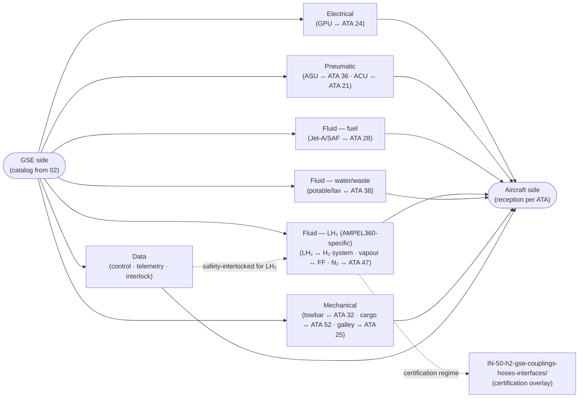

# ATLAS 010-019 · Section 01 · Subsection 060 · Subsubject 014 — GSE Interfaces, Couplings and Aircraft-Side Connections

## 1. Purpose

Specifies the **aircraft-side reception points** for each GSE class in the catalog (`012_`) and the **GSE-side counterpart** that mates to each reception point. Covers the coupling specifications — electrical, pneumatic, hydraulic, fluid (Jet-A / SAF / LH₂ / potable water / lavatory), and data — for the AMPEL360 family, including the **H₂-specific couplings** introduced for the AMPEL360-BWB-Q100 and the **certification regime** under which they are qualified. The aircraft-side reception is owned by the airframe ATA chapter that carries the system; the GSE-side counterpart is owned here. The two views are bridged by this subsubject so that a contributor can find both ends of a coupling in one place and so that a station-qualification engineer can read off, per row, what hardware is required on each side. Conforms to the controlled Q+ATLANTIDE baseline[^baseline], to ATA iSpec 2200 / Spec 100[^ata2200][^ataspec100][^s1000d], and to the GSE-related ATA chapters[^ata09][^ata12]; H₂ couplings are overlaid from `OPT-INS_FRAMEWORK/I-INFRASTRUCTURES/ATA_IN_H2_GSE_AND_SUPPLY_CHAIN/IN-50-h2-gse-couplings-hoses-interfaces/`[^h2ns].

This subsubject defines **the coupling specification, on both sides**. It does not duplicate the **flow regime** (replenishment volumes, schedules, fluids list — owned by [`../020_servicing/012_Replenishment-Fluids-Gases-and-Energy.md`](../020_servicing/012_Replenishment-Fluids-Gases-and-Energy.md)); it duplicates only the **hardware** that lets the flow happen.

## 2. Scope

- Covers the *GSE Interfaces, Couplings and Aircraft-Side Connections* subsubject (`014`) of subsection `060` *GSE* within section `01` *Manejo en Tierra & Servicio*.
- Inherits Q-Division authority and ORB support from the parent row in [`../../README.md` §3](../../README.md#3-architecture-table)[^archtable].

### 2.1 Coupling table — aircraft-side reception × GSE-side counterpart

The table below pairs each catalog class (`012_`) with its aircraft-side reception (owned by the listed ATA chapter on the airframe) and the GSE-side counterpart (owned here). The **Coupling spec** column is the contractual specification that both sides must meet; the **Anti-misconnect** column is the keying / interlock that prevents an incompatible counterpart from mating.

| Catalog class | Coupling domain | Aircraft-side reception (ATA owner) | GSE-side counterpart | Coupling spec | Anti-misconnect |
|---|---|---|---|---|---|
| GSE-EP-* (GPU) | Electrical | External-power receptacle (ATA 24 — Electrical Power) | GPU plug (3-phase + neutral + control pins) | 115 V AC 400 Hz, 3-phase + N; AMPEL360 connector per AMPEL360-OEM PN | Connector keying + voltage / frequency interlock; AMPEL360-specific anti-misconnect key on BWB-Q100 |
| GSE-AS-* (ASU) | Pneumatic | LP pneumatic ground connector (ATA 36 — Pneumatic) | ASU hose with quick-disconnect coupling | LP pneumatic, per ATA 36 ground-connect spec | Mechanical keying on QD coupling |
| GSE-AC-* (ACU / PCA) | Pneumatic (conditioned air) | Conditioned-air ground connector (ATA 21 — Air Conditioning) | PCA duct with cuff coupling | Per ATA 21 PCA spec; BWB-Q100 requires AMPEL360 duct connector geometry | Geometric keying of duct cuff |
| GSE-FT-* (Jet-A / SAF) | Fluid (fuel) | Underwing single-point pressure refuel (ATA 28 — Fuel) | Refuel nozzle (Carter-style or equivalent) per ATA 28 | Per ATA 28 single-point refuel spec; SAF blend per fuel-spec | Mechanical pressure-refuel coupling interlock + dead-man control |
| GSE-FH-* (LH₂ truck/dispenser) | Fluid (cryogenic LH₂) | LH₂ refuel port on the LH₂ bay (AMPEL360 H₂ system) | Cryogenic LH₂ coupling with vacuum-jacketed line and vapour-recovery return | **AMPEL360-specific** cryogenic LH₂ coupling per `IN-50-h2-gse-couplings-hoses-interfaces/`[^h2ns]; certified per the H₂ regime (see §2.3) | Cryogenic-keyed coupling + double-block-and-bleed + vapour-recovery interlock + earthing-bonding interlock |
| GSE-WT-* (potable water) | Fluid (potable) | Water service panel (ATA 38 — Water/Waste) | Potable-water hose with quick-disconnect | Per ATA 38 potable-water coupling spec | Mechanical keying; potable-water-only colour code (typically blue) |
| GSE-LT-* (lavatory) | Fluid (waste / flush) | Lavatory service panel (ATA 38 — Water/Waste) | Lavatory drain coupling + flush-water coupling | Per ATA 38 lavatory coupling spec | Mechanical keying distinct from potable; waste-side colour code (typically green/red) |
| GSE-DI-* (de-ice) | Fluid (de-ice fluid) | External application — no aircraft-side coupling | Spray boom / nozzle on a high-reach truck | Per ISO/SAE de-ice fluid spec (Type I/II/III/IV) | n/a — no coupling; procedural exclusion zone |
| GSE-CT-* (catering) | Mechanical (galley access) | Galley service door (ATA 25 — Equipment/Furnishings) | High-lift platform with sill-matching deck | Per door-sill geometry; BWB-Q100 sill adapter required | Mechanical sill alignment; door-open interlock with platform position |
| GSE-CS-* (cargo loader) | Mechanical (cargo door) | Cargo door (ATA 52 — Doors) | Cargo loader with sill-matching deck | Per cargo-door sill geometry; BWB-Q100 sill adapter required | Mechanical sill alignment; door-open interlock |
| GSE-N2-* (N₂ / inerting) | Fluid (gaseous N₂) | N₂ service connector (ATA 47 — Inert Gas / ATA 28) | N₂ service hose with QD coupling | Per ATA 47 / ATA 28 service-coupling spec | Mechanical keying distinct from O₂ and air |
| GSE-FF-* (spill / vapour recovery) | Fluid (recovery, gas/liquid) | n/a (containment) **or** H₂ vapour-recovery coupling on LH₂ bay | Vacuum / vapour-recovery hose | Per spill-response spec; H₂ branch per `IN-50-h2-gse-couplings-hoses-interfaces/`[^h2ns] | H₂ branch: cryogenic-keyed vapour-recovery coupling |
| GSE-TB-* (towbar) | Mechanical (NLG attachment) | NLG tow fitting (ATA 32 — Landing Gear) | Towbar head (NLG-side); shear pin sized per a/c family | Per ATA 32 NLG tow-fitting spec; BWB-Q100 requires AMPEL360 head | Shear-pin sizing acts as overload-protection interlock |
| GSE-TR-* (tractor) | Mechanical (towbar interface) | n/a — mates to towbar, not to aircraft | Tractor-side towbar coupling | Per tractor manufacturer spec | n/a |
| GSE-CH-*, GSE-CN-*, GSE-PS-*, GSE-DL-*, GSE-AS-AX | Mechanical (passive contact) | Various | Passive contact, no coupling spec beyond geometry | Geometry per [`./02`](./012_GSE-Catalog-and-Compatibility-Matrix.md) | n/a |

Note on the column "Coupling domain": the five domains called out by this subsection are **electrical, pneumatic, hydraulic, fluid (Jet-A / SAF / LH₂ / potable water / lavatory), and data**. *Hydraulic* (e.g. ground hydraulic test rigs) is not a routine operational class for AMPEL360 line operations and is therefore covered as a maintenance-bay extension rather than as a primary catalog row; the coupling domain itself is recognised here for completeness.

### 2.2 Data couplings

Beyond the energy/fluid couplings, the AMPEL360 family carries one or more **data couplings** that allow the GSE to exchange status, telemetry, and interlock signals with the aircraft and/or with the airport's airside management system. These are called out separately because they are typically overlooked in incumbent GSE documentation:

- **GPU control / telemetry** — the GPU coupling (`GSE-EP-*`) carries control pins (ground-power-available, voltage/frequency healthy) that close the aircraft-side contactor only when the GPU's output is in spec. On AMPEL360-BWB-Q100 these pins are extended to carry GPU **identity** (unit serial + calibration-currency token), so that the aircraft refuses external power from a GPU whose calibration has lapsed.
- **LH₂ refuel telemetry** — the LH₂ coupling (`GSE-FH-*`) carries a **mandatory** data coupling for vapour-recovery interlock, earthing-bonding verification, fill-rate control, and fill-stop. Refuel cannot start without the data coupling being healthy. This is one of the strongest deviations from the incumbent Jet-A regime, where the data path is typically advisory; for LH₂ it is **safety-interlocked**.
- **Driver-event log** for powered GSE in the H₂ exclusion zone — the unit's driver-event log (speed, position, prime-mover state) is required to flow into the airport's airside management system for any unit operating in the H₂ exclusion zone, so that an out-of-envelope event is detectable in real time and recorded for the audit trail in [`./05`](./015_GSE-Maintenance-Calibration-and-Records.md).

### 2.3 H₂-specific couplings and their certification regime

The H₂ couplings introduced for AMPEL360-BWB-Q100 are **AMPEL360-specific** and have **no incumbent ICAO baseline**. They are governed by the certification regime overlaid from `OPT-INS_FRAMEWORK/I-INFRASTRUCTURES/ATA_IN_H2_GSE_AND_SUPPLY_CHAIN/IN-50-h2-gse-couplings-hoses-interfaces/`[^h2ns]:

- **Cryogenic LH₂ coupling** (`GSE-FH-*` ↔ LH₂ refuel port) — vacuum-jacketed line, double-block-and-bleed, vapour-recovery return, earthing-bonding circuit, and the safety-interlocked data coupling per §2.2. Certification regime: cryogenic pressure-equipment regulations + H₂-specific compatibility (material, seal, ignition source) + the AMPEL360 OEM's H₂ system qualification.
- **H₂ vapour-recovery coupling** (`GSE-FF-*` H₂ branch ↔ LH₂ bay vapour port) — cryogenic-keyed vapour-recovery coupling. Same certification regime as the LH₂ coupling.
- **H₂ duty-cycle inerting coupling** (`GSE-N2-*` H₂ variant ↔ aircraft N₂ service connector) — extended-duty N₂ delivery for H₂ bay purge. Certification regime: ATA 47 inerting + H₂-specific compatibility.

The certification regime requires that **each coupling instance** carries a calibration token (mating force, leak-rate, electrical bonding resistance) which is verified at each connection cycle and which flows into the GSE-evidence chain in [`./05`](./015_GSE-Maintenance-Calibration-and-Records.md). A coupling whose calibration token has lapsed shall be **rejected** by the data-coupling interlock; this is what makes the H₂ refuel safety case different in kind from the Jet-A case.

- Out of scope: the flow regime / replenishment volumes themselves (owned by `020_servicing/02_`); the powered/non-powered classification (owned by `013_`); the lifecycle and records (owned by `015_`); the airframe-side internal architecture of the receiving system (owned by the relevant airframe ATA chapter — 21, 24, 28, 32, 36, 38, 47, 52).

## 3. Diagram

The diagram below shows how each GSE class crosses the aircraft-side / GSE-side boundary, clustered by coupling domain, with the H₂ branches declaring into the H₂ namespace and the safety-interlock data coupling for LH₂ called out explicitly.

## 4. Footprint

| Metric | Value |
|---|---|
| Architecture | `ATLAS` — Aircraft Top-Level Architecture System |
| Master range | `000–099` |
| Code range | `010-019` |
| Section | `01` — Manejo en Tierra & Servicio |
| Subject | `00` — General Information |
| Subsection | `060` — GSE |
| Subsubject | `014` — GSE Interfaces, Couplings and Aircraft-Side Connections |
| Primary Q-Division | Q-GROUND[^qdiv] |
| Support Q-Divisions | Q-MECHANICS, Q-INDUSTRY |
| ORB support | ORB-PMO, ORB-FIN |
| Governance class | `baseline`[^gov] |
| Folder path | `Q+ATLANTIDE/000-099_ATLAS/010-019_Manejo-en-Tierra-Servicio/060_GSE/` |
| Document | `014_GSE-Interfaces-Couplings-and-Aircraft-Side-Connections.md` (this file) |
| Parent subsection | [`010_Overview.md`](./010_Overview.md) |
| Parent architecture | [`../../README.md`](../../README.md) |
| Parent baseline | [`organization/Q+ATLANTIDE.md`](../../../../organization/Q+ATLANTIDE.md) |

## 5. References & Citations

[^baseline]: **Q+ATLANTIDE controlled baseline (v1.0.0)** — [`organization/Q+ATLANTIDE.md`](../../../../organization/Q+ATLANTIDE.md). Defines the controlled `000-999` architecture-band taxonomy and the ATLAS-1000 register subpart.

[^archtable]: **ATLAS §3 Architecture Table** — [`../../README.md` §3](../../README.md#3-architecture-table). Authoritative source for the `010-019` row (Section `01` — Manejo en Tierra & Servicio, Primary Q-Division Q-GROUND).

[^qdiv]: **Q-Division authority** — Q-Divisions provide technical authority over an architecture row (Q+ATLANTIDE Note N-002). See [`organization/Q+ATLANTIDE.md` §4](../../../../organization/Q+ATLANTIDE.md#4-notes).

[^gov]: **Governance class** — Bands are classified as `baseline` or `restricted` per Q+ATLANTIDE §4 governance rules.

[^ata09]: **ATA Chapter 09 — Towing and Taxiing** — Industry chapter covering towing and taxiing operations; adjacency reference for the towbar ↔ NLG coupling.

[^ata12]: **ATA Chapter 12 — Servicing** — Industry chapter governing routine servicing; adjacency reference for the upstream-side GSE coupling specifications.

[^h2ns]: **`ATA_IN_H2_GSE_AND_SUPPLY_CHAIN/IN-50-h2-gse-couplings-hoses-interfaces/`** — Sub-namespace at `OPT-INS_FRAMEWORK/I-INFRASTRUCTURES/ATA_IN_H2_GSE_AND_SUPPLY_CHAIN/IN-50-h2-gse-couplings-hoses-interfaces/` carrying the H₂-specific coupling, hose and interface specifications and the certification overlay for AMPEL360 LH₂ refuel.

[^ata2200]: **ATA iSpec 2200 — Information Standards for Aviation Maintenance** — Industry standard for digital aircraft maintenance information; governs chapter / section / subject numbering inherited by ATLAS `000-099`.

[^ataspec100]: **ATA Spec 100 — Manufacturers' Technical Data** — Predecessor numbering scheme that established the 00–99 chapter map mirrored by ATLAS sub-ranges.

[^s1000d]: **S1000D Issue 6.0 — International specification for technical publications** — Common Source DataBase (CSDB) and Data Module Code (DMC) specification used across ATLAS technical publications.

[^as9100d]: **AS9100D — Quality Management Systems — Aviation, Space and Defense Organizations** — Quality-management baseline for all Q+ATLANTIDE deliverables.

### Applicable industry standards

The following ATA-family and industry standards apply to this subsubject in addition to the cross-cutting Q+ATLANTIDE governance:

- ATA Chapter 09 — Towing and Taxiing[^ata09]
- ATA Chapter 12 — Servicing[^ata12]
- ATA iSpec 2200 — Information Standards for Aviation Maintenance[^ata2200]
- ATA Spec 100 — Manufacturers' Technical Data[^ataspec100]
- S1000D Issue 6.0 — International specification for technical publications[^s1000d]
- AS9100D — Quality Management Systems — Aviation, Space and Defense Organizations[^as9100d]
