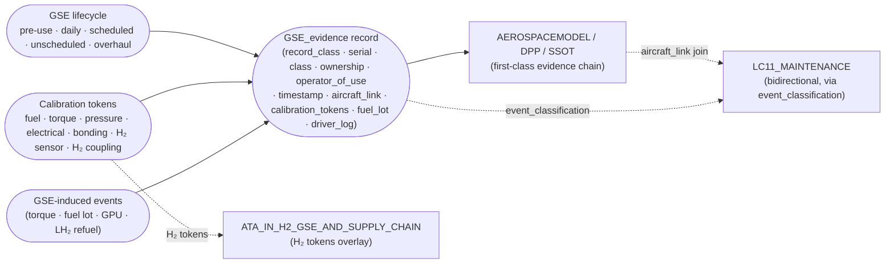

# ATLAS 010-019 · Section 01 · Subsection 060 · Subsubject 015 — GSE Maintenance, Calibration and Records

## 1. Purpose

Establishes the **lifecycle regime of the GSE population itself** — scheduled maintenance, calibration of metered equipment, inspection regime, records retention, and traceability of GSE-induced events on the aircraft — and **mandates that GSE records flow into the AEROSPACEMODEL / DPP / SSOT evidence chain as first-class evidence**, flagged with `record_class: GSE_evidence`, so that they are filterable, queryable, and joinable against aircraft records at the moment of root-cause analysis. GSE has its own digital twin and audit trail; this subsubject is what makes them visible to the operator and manufacturer rather than siloed in the ground handler's CMMS. Conforms to the controlled Q+ATLANTIDE baseline[^baseline], to ATA iSpec 2200 / Spec 100[^ata2200][^ataspec100][^s1000d], to AS9100D quality management[^as9100d], and to the GSE-related ATA chapters[^ata09][^ata12]; H₂-specific calibration tokens overlay from `OPT-INS_FRAMEWORK/I-INFRASTRUCTURES/ATA_IN_H2_GSE_AND_SUPPLY_CHAIN/`[^h2ns].

This subsubject defines **the GSE-side lifecycle and the records contract**. The corresponding aircraft-side maintenance program is owned by `AMPEL360-AIR-T/LC11_MAINTENANCE/`; this subsubject is the *hand-off point* between the two.

## 2. Scope

- Covers the *GSE Maintenance, Calibration and Records* subsubject (`015`) of subsection `060` *GSE* within section `01` *Manejo en Tierra & Servicio*.
- Inherits Q-Division authority and ORB support from the parent row in [`../../README.md` §3](../../README.md#3-architecture-table)[^archtable].

### 2.1 Scheduled maintenance regime

Each GSE class in the catalog ([`012_GSE-Catalog-and-Compatibility-Matrix.md`](./012_GSE-Catalog-and-Compatibility-Matrix.md)) carries a maintenance schedule keyed on the manufacturer's service manual, the operator's CMMS rules, and any AMPEL360-specific overlay (notably for the H₂ classes). The regime is structured as:

- **Pre-use check** — performed before the unit is brought into service for a shift; documented as a check-list against the unit serial; non-conformity prevents release into service.
- **Daily / weekly inspection** — performed by GSE technicians on a calendar cadence; documented as an inspection record against the unit serial.
- **Scheduled maintenance** (interval-based) — performed at hour / cycle / calendar intervals per the manufacturer's service manual and any operator overlay.
- **Unscheduled maintenance** — corrective action after a finding from any of the above, or after an event recorded in §2.4.
- **Overhaul / mid-life** — major work at the unit-level mid-life, including replacement of seals, recertification of pressure components, and re-keying of any AMPEL360-specific anti-misconnect features.

The cadence of each level is owned by the GSE manufacturer's service manual; this subsection does not duplicate those numbers, but it does require that the cadence and the actual completion dates be carried in the records contract in §2.3.

### 2.2 Calibration of metered equipment

A subset of GSE classes carries **metered or torque-controlled** equipment whose accuracy directly affects the aircraft. The calibration of these meters is a first-class concern, because a meter that has drifted out of specification will silently apply the wrong fuel quantity, the wrong torque, or the wrong pressure to the aircraft, and the aircraft cannot detect the drift on its own.

The metered equipment recognised by this subsection is:

| Equipment | Carried by class | Calibration cadence | Calibration token in records |
|---|---|---|---|
| Fuel quantity meter | `GSE-FT-*`, `GSE-FH-*` | Per regulatory cadence; re-verify on suspicion | `gse_meter_calibration:` (date, certificate ref, valid-until) |
| Torque tools (calibrated wrenches) | Maintenance / GSE shared | Per manufacturer cadence; re-verify on drop / overload | `gse_torque_calibration:` (date, certificate ref, valid-until) |
| Pressure / vacuum gauges | `GSE-AS-*`, `GSE-AC-*`, `GSE-N2-*`, `GSE-FF-*` | Annual or per cadence | `gse_pressure_calibration:` (date, certificate ref, valid-until) |
| Electrical instrumentation (V / Hz / Z) | `GSE-EP-*` | Annual or per cadence | `gse_electrical_calibration:` (date, certificate ref, valid-until) |
| Earthing-bonding resistance verifier | `GSE-FT-*`, `GSE-FH-*`, `GSE-FF-*` | Per regulatory cadence; re-verify on drop | `gse_bonding_calibration:` (date, certificate ref, valid-until) |
| H₂ leak / vapour sensor | `GSE-FH-*`, `GSE-FF-*` (H₂ branch), `GSE-N2-*` (H₂ variant) | Per H₂ overlay regime[^h2ns] | `gse_h2sensor_calibration:` (date, certificate ref, valid-until) |
| Cryogenic mating-force / leak-rate verifier | `GSE-FH-*` coupling | Per H₂ overlay regime[^h2ns]; verified at each connection cycle | `gse_h2coupling_calibration:` (date, certificate ref, valid-until) |

The calibration tokens above are the same tokens that the data couplings in [`./04`](./014_GSE-Interfaces-Couplings-and-Aircraft-Side-Connections.md) §2.2 / §2.3 verify at connection time. A unit whose token has lapsed is **rejected by the data coupling interlock** for the safety-critical classes (LH₂, vapour-recovery, H₂ inerting, and electrical to BWB-Q100); for the other classes the lapse is recorded as a non-conformity and the unit is taken out of service until re-calibrated.

### 2.3 Records contract — GSE records as first-class evidence

This is the operationally most important clause in the chapter. It is what makes the difference between a GSE event being recoverable at the moment of root-cause analysis and being silently lost in a ground handler's siloed CMMS.

**Mandate.** Every GSE record (pre-use check, inspection, scheduled / unscheduled maintenance, calibration, event in §2.4) **shall** be carried in the AEROSPACEMODEL / DPP / SSOT evidence chain as **first-class evidence**, with the top-level field:

```yaml
record_class: GSE_evidence
```

This flag is what allows the evidence chain to filter, query, and join GSE records against aircraft records (which carry `record_class: aircraft_evidence` or equivalent). Without this flag the records would still exist in some system, but they would not be visible to the join-against-aircraft queries that root-cause analysis needs.

**Required record fields.** Every `record_class: GSE_evidence` record shall carry, at minimum:

- `gse_unit_serial:` — the unit serial (the `*` in the catalog class code).
- `gse_class:` — the catalog class from [`./02`](./012_GSE-Catalog-and-Compatibility-Matrix.md) (e.g. `GSE-EP-*`, `GSE-FH-*`).
- `ownership:` — `operator-owned` / `airport-owned` / `leased` / `shared-pool` per [`./01`](./011_Scope-and-GSE-Boundaries.md).
- `operator_of_use:` — the operator under whose airside permit the unit was operating at the moment of the record (critical for shared-pool units, where the unit may belong to one party and the operator-of-use to another).
- `event_timestamp:` — ISO 8601 timestamp of the event being recorded.
- `event_classification:` — mandatory for any event that touched an aircraft, triggered an inspection, or is propagated into `LC11_MAINTENANCE`; optional for purely administrative records that do not drive maintenance routing.
- `aircraft_link:` — when the record describes an event that touched an aircraft (servicing, refuel, towing, etc.), the aircraft tail / MSN, the flight leg, and the coupling cycle id, so that a join from the aircraft side can pick it up.
- `calibration_tokens:` — the calibration tokens from §2.2 in effect at the time of the event (snapshot, not pointer, so that retrospective queries return the truth at the time).
- `fuel_lot:` — for `GSE-FT-*` / `GSE-FH-*`, the fuel lot from which fuel was drawn (so that a fuel-quality investigation can scope the affected aircraft set).
- `driver_event_log_ref:` — for powered units, a pointer to the driver-event log segment covering the record.

**Contractual hook.** Where GSE is *not* operator-owned (airport-owned / leased / shared-pool per [`./01`](./011_Scope-and-GSE-Boundaries.md)), the operator's contract with the unit owner **shall** require that the records above flow into the operator's evidence chain in the format above, with no later than a defined SLA (typically end-of-shift for routine records, real-time for safety-critical records). Without this contractual hook the `record_class: GSE_evidence` mandate is unenforceable, because the records simply do not reach the chain. This is the single most important contractual clause that the GSE chapter generates downstream.

**Retention.** GSE evidence records are retained for at least the same period as the aircraft records they may be joined against (typically the airframe life + a regulatory tail). The retention is not a separate clock from the airframe clock; it is the same clock, applied to a different `record_class:`.

### 2.4 Traceability of GSE-induced events on the aircraft

Some events affect the aircraft and can only be reconstructed if the GSE side of the event is recoverable. Examples:

- A torque wrench out of calibration on date X tightened a fastener on aircraft Y at coupling cycle Z. The downstream maintenance issue is *"fastener under-torqued"*; the root cause is on the GSE side.
- Fuel from lot Y was used during the event in question on aircraft Z. The downstream issue is *"fuel-system contamination"*; the root cause is on the GSE side.
- A GPU with lapsed electrical calibration delivered out-of-spec voltage to aircraft W on date V. The downstream issue is *"avionics anomaly"*; the root cause is on the GSE side.

For each of these, the **GSE-induced event** is recorded with the fields in §2.3, including `aircraft_link:`, so that a query starting from the aircraft side (*"what GSE evidence touched this aircraft on this leg?"*) returns the joined GSE records. This is the operational expression of *GSE records as first-class evidence*: not a documentation note, but a queryable join.

The `event_classification:` field used in [`../050_parking/015_Parking-Records-Inspections-and-Return-to-Service.md`](../050_parking/015_Parking-Records-Inspections-and-Return-to-Service.md) is preserved in this subsection's records: a GSE-induced event that triggers an aircraft-side inspection carries the same `event_classification:` value (`nominal` / `inspection_trigger` / `mandatory_inspection` / `damage_event`) so that the bidirectional propagation into `AMPEL360-AIR-T/LC11_MAINTENANCE/` is symmetric across the GSE and parking sides.

- Out of scope: the aircraft-side maintenance program itself (`AMPEL360-AIR-T/LC11_MAINTENANCE/`); the GSE manufacturer's service-manual content (consumed by reference); the airport's GSE-management system internals; the operator's CMMS internals (consumed by reference).

## 3. Diagram

The diagram below shows how GSE lifecycle records and calibration tokens flow into the AEROSPACEMODEL / DPP / SSOT evidence chain as `record_class: GSE_evidence`, how the `aircraft_link:` join enables root-cause analysis, and how the `event_classification:` field propagates bidirectionally into the maintenance program.



## 4. Footprint

| Metric | Value |
|---|---|
| Architecture | `ATLAS` — Aircraft Top-Level Architecture System |
| Master range | `000–099` |
| Code range | `010-019` |
| Section | `01` — Manejo en Tierra & Servicio |
| Subject | `00` — General Information |
| Subsection | `060` — GSE |
| Subsubject | `015` — GSE Maintenance, Calibration and Records |
| Primary Q-Division | Q-GROUND[^qdiv] |
| Support Q-Divisions | Q-MECHANICS, Q-INDUSTRY |
| ORB support | ORB-PMO, ORB-FIN |
| Governance class | `baseline`[^gov] |
| Folder path | `Q+ATLANTIDE/000-099_ATLAS/010-019_Manejo-en-Tierra-Servicio/060_GSE/` |
| Document | `015_GSE-Maintenance-Calibration-and-Records.md` (this file) |
| Parent subsection | [`010_Overview.md`](./010_Overview.md) |
| Parent architecture | [`../../README.md`](../../README.md) |
| Parent baseline | [`organization/Q+ATLANTIDE.md`](../../../../organization/Q+ATLANTIDE.md) |

## 5. References & Citations


[^baseline]: **Q+ATLANTIDE controlled baseline (v1.0.0)** — [`organization/Q+ATLANTIDE.md`](../../../../organization/Q+ATLANTIDE.md). Defines the controlled `000-999` architecture-band taxonomy and the ATLAS-1000 register subpart.

[^archtable]: **ATLAS §3 Architecture Table** — [`../../README.md` §3](../../README.md#3-architecture-table). Authoritative source for the `010-019` row (Section `01` — Manejo en Tierra & Servicio, Primary Q-Division Q-GROUND).

[^qdiv]: **Q-Division authority** — Q-Divisions provide technical authority over an architecture row (Q+ATLANTIDE Note N-002). See [`organization/Q+ATLANTIDE.md` §4](../../../../organization/Q+ATLANTIDE.md#4-notes).

[^gov]: **Governance class** — Bands are classified as `baseline` or `restricted` per Q+ATLANTIDE §4 governance rules.

[^ata09]: **ATA Chapter 09 — Towing and Taxiing** — Industry chapter covering towing and taxiing operations; adjacency reference for towing-tractor lifecycle records.

[^ata12]: **ATA Chapter 12 — Servicing** — Industry chapter governing routine servicing; adjacency reference for servicing-side GSE lifecycle records.

[^h2ns]: **`ATA_IN_H2_GSE_AND_SUPPLY_CHAIN/`** — Infrastructure namespace at `OPT-INS_FRAMEWORK/I-INFRASTRUCTURES/ATA_IN_H2_GSE_AND_SUPPLY_CHAIN/` carrying the H₂-specific calibration tokens (H₂ leak/vapour sensor, cryogenic coupling mating-force / leak-rate verifier) overlaid into the records contract in §2.2 and §2.3.

[^ata2200]: **ATA iSpec 2200 — Information Standards for Aviation Maintenance** — Industry standard for digital aircraft maintenance information; governs chapter / section / subject numbering inherited by ATLAS `000-099`.

[^ataspec100]: **ATA Spec 100 — Manufacturers' Technical Data** — Predecessor numbering scheme that established the 00–99 chapter map mirrored by ATLAS sub-ranges.

[^s1000d]: **S1000D Issue 6.0 — International specification for technical publications** — Common Source DataBase (CSDB) and Data Module Code (DMC) specification used across ATLAS technical publications.

[^as9100d]: **AS9100D — Quality Management Systems — Aviation, Space and Defense Organizations** — Quality-management baseline for all Q+ATLANTIDE deliverables, including the records-and-traceability clauses inherited by this subsubject.

### Applicable industry standards

The following ATA-family and industry standards apply to this subsubject in addition to the cross-cutting Q+ATLANTIDE governance:

- ATA Chapter 09 — Towing and Taxiing[^ata09]
- ATA Chapter 12 — Servicing[^ata12]
- ATA iSpec 2200 — Information Standards for Aviation Maintenance[^ata2200]
- ATA Spec 100 — Manufacturers' Technical Data[^ataspec100]
- S1000D Issue 6.0 — International specification for technical publications[^s1000d]
- AS9100D — Quality Management Systems — Aviation, Space and Defense Organizations[^as9100d]
