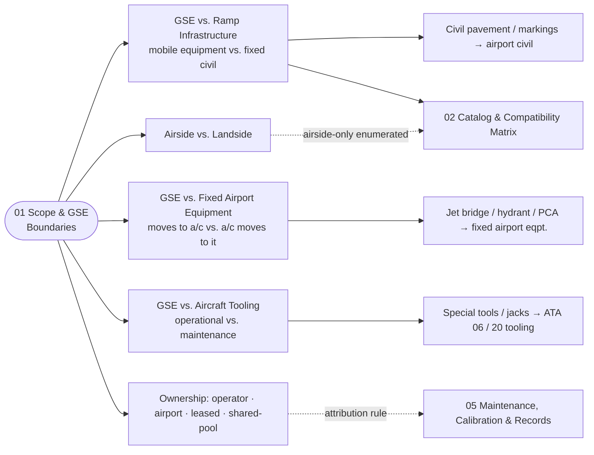

# ATLAS 010-019 · Section 01 · Subsection 060 · Subsubject 01 — Scope and GSE Boundaries

## 1. Purpose

Establishes the **scope boundary** of the *GSE* subsection (`060`) within ATLAS `010-019.01` *Manejo en Tierra & Servicio* and the **boundary clauses** that separate *GSE as engineered subject* from adjacent concepts that look superficially similar but are owned elsewhere — *ramp infrastructure* (fixed assets owned by the airport), *fixed airport equipment* (jet bridges, fuel hydrants, in-pavement systems), *aircraft tooling* (special tools owned by maintenance, governed by ATA 06 / ATA 20 in the operator's tooling program), and *the aircraft activities performed in the presence of GSE* (already covered by sibling subsections `010`–`050`). Fixes the controlled vocabulary for **GSE vs. ramp infrastructure vs. fixed airport equipment vs. tooling**, **operator-owned vs. airport-owned vs. leased vs. shared-pool** ownership models, and **airside vs. landside** GSE, so that the downstream subsubjects (`02`–`05`) — catalog/compatibility matrix, powered/non-powered classification, interfaces and couplings, and lifecycle/records — share a single semantic model on the ATA iSpec 2200 / Spec 100 information set[^ata2200][^ataspec100][^s1000d], in conformance with the controlled Q+ATLANTIDE baseline[^baseline] and the GSE-related ATA chapters[^ata09][^ata12].

This subsubject defines **what is and is not GSE**. The corresponding **catalog of GSE units** that pass that test is owned by [`./02_GSE-Catalog-and-Compatibility-Matrix.md`](./02_GSE-Catalog-and-Compatibility-Matrix.md).

## 2. Scope

- Covers the *Scope and GSE Boundaries* subsubject (`01`) of subsection `060` *GSE* within section `01` *Manejo en Tierra & Servicio*.
- Inherits Q-Division authority and ORB support from the parent row in [`../../README.md` §3](../../README.md#3-architecture-table)[^archtable].
- **In scope — the GSE definitional boundary:**
  - **GSE vs. ramp infrastructure vs. fixed airport equipment vs. tooling.**
    - *GSE* is **mobile or transportable engineered equipment** that interfaces with the aircraft on the ground for the purpose of supporting an operational or maintenance activity, and whose population is enumerable, certifiable, and replaceable as a unit. Towbars, GPUs, ASUs, ACUs, fuel trucks, deicers, catering trucks, water and lavatory carts, baggage tractors and dollies, passenger stairs, chocks, cones, and tow tractors are GSE.
    - *Ramp infrastructure* is **fixed civil infrastructure on the apron** — pavement classes, painted markings, lead-in lines, stand-edge lines, hydrant pits in the pavement, lighting masts, FOD bins. It is owned by the airport's civil-engineering function and is **not** GSE. (The aircraft *interacts with* ramp infrastructure during stand entry per `010_`; the infrastructure itself is governed by the airport, not by this subsection.)
    - *Fixed airport equipment* is **non-mobile mechanical/electrical equipment fixed to the apron or to a structure** — jet bridges, in-pavement fuel hydrant systems, fixed 400 Hz GPU substations, pre-conditioned air (PCA) plants. It is owned by the airport (or by a concessionaire) and is **not** GSE. The boundary rule is mobility: if the unit is wheeled, towed or driven to the aircraft it is GSE; if the aircraft is positioned to it, it is fixed airport equipment. The aircraft-side coupling specification in [`./04`](./04_GSE-Interfaces-Couplings-and-Aircraft-Side-Connections.md) is the same on both sides of this boundary, so contributors must be careful to attribute the *upstream-side hardware* to the correct owner.
    - *Aircraft tooling* (special tools, calibrated wrenches, jacks at the maintenance bay, alignment fixtures) is governed by the operator's tooling program under ATA 06 *Dimensions and Areas* / ATA 20 *Standard Practices* and is **not** GSE in the operational sense. The boundary rule is *purpose*: GSE supports an *operational* activity (turnaround, servicing, towing, parking); tooling supports a *maintenance* activity at a workstand. **Exception** — calibrated metered equipment that crosses both worlds (the torque tools and fuel meters whose calibration history flows into the GSE-evidence chain in [`./05`](./05_GSE-Maintenance-Calibration-and-Records.md)) is governed by `05_` regardless of which program owns the physical asset, because the calibration evidence is what matters at the moment of root-cause analysis.
  - **Ownership model — operator-owned vs. airport-owned vs. leased vs. shared-pool.** GSE rarely lives in a single ownership regime. The four canonical patterns this subsection recognises are:
    - *Operator-owned* — the airline or maintenance organisation owns the unit outright; calibration and lifecycle records sit in the operator's CMMS.
    - *Airport-owned* — the airport authority owns the unit and rents it (or its use) to the operator; lifecycle records sit in the airport's GSE-management system, and the airline must consume them by reference.
    - *Leased* — a third-party leasing company owns the unit and supplies it under contract; lifecycle records sit with the lessor and are **mandatorily** mirrored to the operator's evidence chain per the contractual hooks specified in [`./05`](./05_GSE-Maintenance-Calibration-and-Records.md).
    - *Shared-pool* — common-use GSE shared across multiple operators at a station (typical for non-base stations); the records-attribution problem is hardest here, and `05_` requires that any GSE event be tied to (i) the unit serial number and (ii) the operator-of-use at the moment of the event.
  - **Airside vs. landside GSE.**
    - *Airside GSE* operates inside the airport's controlled airside perimeter (apron, taxiway-adjacent areas), is subject to airside driving permits, has aircraft-side couplings, and is in scope of every aircraft-touching activity in `010`–`050`.
    - *Landside GSE* operates on the landside (cargo terminal, catering facility, fuel farm, GSE depot) and does not directly couple to the aircraft; it is in scope of this subsection only for the *upstream supply* (e.g. the LH₂ supply truck that fills the airside LH₂ dispenser) and for the *return-to-depot* lifecycle steps in `05_`. Pure landside-only equipment that never touches an aircraft-bound chain is **out of scope**.
- **Boundary with `02_` — definitional rule vs. enumerated catalog.** This subsubject (`01_`) defines **what test a unit must pass to be classified as GSE**. Subsubject [`./02_GSE-Catalog-and-Compatibility-Matrix.md`](./02_GSE-Catalog-and-Compatibility-Matrix.md) defines **the enumerated population that passes the test, plus the per-aircraft compatibility matrix**. The two views are orthogonal and are kept separate so that adding a new unit to the catalog (there) does not silently change the definitional rule (here), and vice versa.
- **Out of scope.** The aircraft-side activities performed in the presence of GSE (already covered by `010_/020_/030_/040_/050_` per the inversion rule restated in [`./00_Overview.md`](./00_Overview.md)); the operator's tooling program (ATA 06 / ATA 20); the airport's civil-engineering and pavement program; the H₂ supply-chain compliance regime as such (overlaid from `OPT-INS_FRAMEWORK/I-INFRASTRUCTURES/ATA_IN_H2_GSE_AND_SUPPLY_CHAIN/`[^h2ns]); the maintenance-program *definition* itself (`AMPEL360-AIR-T/LC11_MAINTENANCE/`).
- Boundary clauses are surfaced as S1000D `terminology` and `applicability` entries on the ATA iSpec 2200 information set[^ata2200][^s1000d] and quality-controlled per AS9100D[^as9100d].

## 3. Diagram

The diagram below shows how the GSE definitional boundary partitions the equipment space across adjacent owners (airport civil, fixed airport equipment, operator tooling) and across the four ownership-model patterns and the airside/landside split.

## 4. Footprint

| Metric | Value |
|---|---|
| Architecture | `ATLAS` — Aircraft Top-Level Architecture System |
| Master range | `000–099` |
| Code range | `010-019` |
| Section | `01` — Manejo en Tierra & Servicio |
| Subject | `00` — General Information |
| Subsection | `060` — GSE |
| Subsubject | `01` — Scope and GSE Boundaries |
| Primary Q-Division | Q-GROUND[^qdiv] |
| Support Q-Divisions | Q-MECHANICS, Q-INDUSTRY |
| ORB support | ORB-PMO, ORB-FIN |
| Governance class | `baseline`[^gov] |
| Folder path | `Q+ATLANTIDE/000-099_ATLAS/010-019_Manejo-en-Tierra-Servicio/060_GSE/` |
| Document | `01_Scope-and-GSE-Boundaries.md` (this file) |
| Parent subsection | [`00_Overview.md`](./00_Overview.md) |
| Parent architecture | [`../../README.md`](../../README.md) |
| Parent baseline | [`organization/Q+ATLANTIDE.md`](../../../../organization/Q+ATLANTIDE.md) |

## 5. References & Citations

[^baseline]: **Q+ATLANTIDE controlled baseline (v1.0.0)** — [`organization/Q+ATLANTIDE.md`](../../../../organization/Q+ATLANTIDE.md). Defines the controlled `000-999` architecture-band taxonomy and the ATLAS-1000 register subpart.

[^archtable]: **ATLAS §3 Architecture Table** — [`../../README.md` §3](../../README.md#3-architecture-table). Authoritative source for the `010-019` row (Section `01` — Manejo en Tierra & Servicio, Primary Q-Division Q-GROUND).

[^qdiv]: **Q-Division authority** — Q-Divisions provide technical authority over an architecture row (Q+ATLANTIDE Note N-002). See [`organization/Q+ATLANTIDE.md` §4](../../../../organization/Q+ATLANTIDE.md#4-notes).

[^gov]: **Governance class** — Bands are classified as `baseline` or `restricted` per Q+ATLANTIDE §4 governance rules.

[^ata09]: **ATA Chapter 09 — Towing and Taxiing** — Industry chapter covering towing and taxiing operations; adjacency reference for the engineered tractors, towbars and bypass-pin tooling owned by this subsection.

[^ata12]: **ATA Chapter 12 — Servicing** — Industry chapter governing routine servicing; adjacency reference for the upstream-side GSE that delivers the flows (fuel trucks, GPUs, ASUs, ACUs, water/lavatory carts, deicers).

[^h2ns]: **`ATA_IN_H2_GSE_AND_SUPPLY_CHAIN/`** — Infrastructure namespace at `OPT-INS_FRAMEWORK/I-INFRASTRUCTURES/ATA_IN_H2_GSE_AND_SUPPLY_CHAIN/` carrying the H₂-specific GSE and supply-chain overlays.

[^ata2200]: **ATA iSpec 2200 — Information Standards for Aviation Maintenance** — Industry standard for digital aircraft maintenance information; governs chapter / section / subject numbering inherited by ATLAS `000-099`.

[^ataspec100]: **ATA Spec 100 — Manufacturers' Technical Data** — Predecessor numbering scheme that established the 00–99 chapter map mirrored by ATLAS sub-ranges.

[^s1000d]: **S1000D Issue 6.0 — International specification for technical publications** — Common Source DataBase (CSDB) and Data Module Code (DMC) specification used across ATLAS technical publications.

[^as9100d]: **AS9100D — Quality Management Systems — Aviation, Space and Defense Organizations** — Quality-management baseline for all Q+ATLANTIDE deliverables.

### Applicable industry standards

The following ATA-family and industry standards apply to this subsubject in addition to the cross-cutting Q+ATLANTIDE governance:

- ATA Chapter 09 — Towing and Taxiing[^ata09]
- ATA Chapter 12 — Servicing[^ata12]
- ATA iSpec 2200 — Information Standards for Aviation Maintenance[^ata2200]
- ATA Spec 100 — Manufacturers' Technical Data[^ataspec100]
- S1000D Issue 6.0 — International specification for technical publications[^s1000d]
- AS9100D — Quality Management Systems — Aviation, Space and Defense Organizations[^as9100d]
