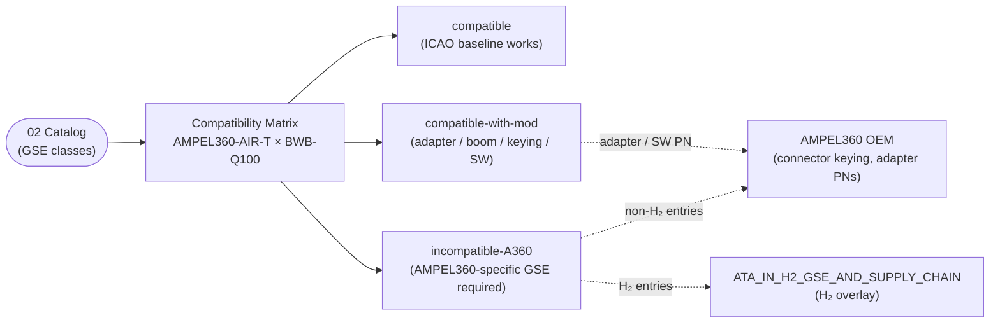

# ATLAS 010-019 · Section 01 · Subsection 060 · Subsubject 02 — GSE Catalog and Compatibility Matrix

## 1. Purpose

Establishes the **enumerated catalog** of GSE classes relevant to the AMPEL360 family and the **per-aircraft compatibility matrix** that maps each catalog entry to each AMPEL360 variant. This is the most operationally consequential subsubject in the chapter: airports, ground handlers and operators consult this matrix to decide whether they can support the AMPEL360 family at all on their existing GSE fleet, or whether AMPEL360-specific GSE is required (and if so, which classes). The matrix anchors the catalog on the ICAO standard equipment classes[^icao] and the SAE/AS GSE specification family[^saeas], and surfaces the **deviations** where AMPEL360 — and especially the AMPEL360-BWB-Q100 with its LH₂ propulsion and BWB door geometry — requires equipment that the ICAO baseline does not provide. Conforms to the controlled Q+ATLANTIDE baseline[^baseline], to ATA iSpec 2200 / Spec 100[^ata2200][^ataspec100][^s1000d], and to the GSE-related ATA chapters[^ata09][^ata12].

This subsubject defines **what the population is and how compatible it is**. The corresponding **powered/non-powered classification and energy-source roadmap** for catalog entries is owned by [`./03_Powered-and-Non-Powered-GSE.md`](./03_Powered-and-Non-Powered-GSE.md). The **coupling/interface specification** for each catalog entry is owned by [`./04_GSE-Interfaces-Couplings-and-Aircraft-Side-Connections.md`](./04_GSE-Interfaces-Couplings-and-Aircraft-Side-Connections.md). The **lifecycle, calibration and records** for each catalog entry are owned by [`./05_GSE-Maintenance-Calibration-and-Records.md`](./05_GSE-Maintenance-Calibration-and-Records.md).

## 2. Scope

- Covers the *GSE Catalog and Compatibility Matrix* subsubject (`02`) of subsection `060` *GSE* within section `01` *Manejo en Tierra & Servicio*.
- Inherits Q-Division authority and ORB support from the parent row in [`../../README.md` §3](../../README.md#3-architecture-table)[^archtable].

### 2.1 Catalog of GSE classes relevant to AMPEL360

The catalog is structured by **functional class**, not by manufacturer. Each functional class is a row in the compatibility matrix in §2.2. The classes below are the canonical population recognised by this subsection; manufacturer-specific units are enumerated under each class in the operator's CMMS and tied back to a class via the `gse_class:` field.

| Class code | Functional class | Primary purpose | ICAO baseline class[^icao] |
|---|---|---|---|
| GSE-CH-* | Wheel chocks | Restrain aircraft against rolling | ICAO baseline (universal) |
| GSE-TB-* | Towbar / towbarless tractor head | Mate towing tractor to NLG | ICAO baseline (per a/c family) |
| GSE-TR-* | Towing tractor (tug) | Pushback / maintenance towing | ICAO baseline (per MTOW class) |
| GSE-PS-* | Passenger stairs | Boarding/disembarkation at remote stand | ICAO baseline (per door height) |
| GSE-CS-* | Cargo loader / belt loader | Loading/unloading of holds | ICAO baseline (per hold sill height) |
| GSE-DL-* | Baggage / ULD dollies | Move ULDs between aircraft and terminal | ICAO baseline (universal) |
| GSE-EP-* | Ground Power Unit (GPU) | External AC/DC electrical power | ICAO baseline (115 V AC 400 Hz / 28 V DC) |
| GSE-AS-* | Air Start Unit (ASU) | Pneumatic engine start | ICAO baseline (per engine class) |
| GSE-AC-* | Air Conditioning Unit (ACU / PCA cart) | Conditioned-air supply | ICAO baseline (per cabin volume) |
| GSE-FT-* | Fuel truck / hydrant dispenser | Jet-A / SAF refuel | ICAO baseline (Jet-A); **AMPEL360-specific for SAF blends** |
| GSE-FH-* | LH₂ fuel truck / LH₂ dispenser | LH₂ refuel | **AMPEL360-specific (no ICAO baseline)** |
| GSE-DI-* | De-icing / anti-icing truck | Type I/II/III/IV fluid application | ICAO baseline (universal) |
| GSE-CT-* | Catering truck (high-lift) | Galley servicing | ICAO baseline (per door height) |
| GSE-WT-* | Potable-water cart | Replenish potable water | ICAO baseline (per coupling) |
| GSE-LT-* | Lavatory-service cart | Empty/replenish lavatory tanks | ICAO baseline (per coupling) |
| GSE-AX-* | Aircraft access stand / maintenance platform | Crew/maintainer access at altitude | ICAO baseline (per access point) |
| GSE-N2-* | Nitrogen / inerting cart | N₂ purge / inerting | ICAO baseline; **extended duty cycle for H₂ ops** |
| GSE-FF-* | Fuel-fluid recovery / spill-response unit | Spill containment, including H₂ vapour-recovery | **AMPEL360-specific extension for H₂** |
| GSE-CN-* | Cones / safety perimeter markers | Define safety perimeter | ICAO baseline (universal) |

Notes on the catalog:

- The wildcard `*` in the class code is filled in by the operator's CMMS with the manufacturer / model / serial.
- Classes **GSE-FH-***, **GSE-FF-*** (H₂ extension) and the H₂ duty-cycle variants of **GSE-N2-*** have **no ICAO baseline class**; they declare into `OPT-INS_FRAMEWORK/I-INFRASTRUCTURES/ATA_IN_H2_GSE_AND_SUPPLY_CHAIN/`[^h2ns] for the H₂ overlay.
- The catalog covers the GSE classes relevant to **operational** support. Maintenance-bay-only equipment (jacks, hangar cranes, alignment fixtures) is owned by the operator's tooling program per the boundary in [`./01`](./01_Scope-and-GSE-Boundaries.md).

### 2.2 Compatibility matrix — AMPEL360 family × GSE classes

The compatibility matrix carries **at minimum three columns** (per the Overview's mandate restated in [`./00_Overview.md` §2](./00_Overview.md#2-scope)):

- **Compatible (`compatible`)** — the ICAO-baseline GSE in this class works for the AMPEL360 variant without modification. A regional airport that already supports the A220 / E2 family can use its existing units.
- **Compatible-with-modification (`compatible-with-mod`)** — the ICAO-baseline GSE works only after a defined modification (typically: adapter, extended boom, software update for the coupling interlock, or recertification for the AMPEL360 keying). The modification is enumerated per row.
- **Incompatible — requires-AMPEL360-specific-GSE (`incompatible-A360`)** — no ICAO-baseline GSE in this class can support the AMPEL360 variant; an AMPEL360-specific class is required, and the responsible authority is the H₂ namespace[^h2ns] or the AMPEL360 OEM.

Variants in this matrix:

- **AMPEL360-AIR-T** — conventional tube-fuselage AMPEL360 family member (Jet-A / SAF).
- **AMPEL360-BWB-Q100** — Blended-Wing-Body variant (LH₂ propulsion, BWB door geometry, H₂ exclusion zone around the LH₂ bay).

| Class code | Functional class | AMPEL360-AIR-T | AMPEL360-BWB-Q100 | Notes / required modification |
|---|---|---|---|---|
| GSE-CH-* | Wheel chocks | `compatible` | `compatible` | Standard chocks; size per MLG tyre. |
| GSE-TB-* | Towbar | `compatible` | `compatible-with-mod` | BWB-Q100 NLG attachment requires AMPEL360-specific shear-pin towbar head; ICAO towbar with adapter is acceptable for short tows only. |
| GSE-TR-* | Tractor (tug) | `compatible` | `compatible` | Per MTOW class; standard tug for both. |
| GSE-PS-* | Passenger stairs | `compatible` | `compatible-with-mod` | BWB-Q100 door sill height differs from tube-fuselage baseline; standard stairs require an AMPEL360 sill-height extension and a wider top platform to clear the BWB skin curvature. |
| GSE-CS-* | Cargo loader | `compatible` | `compatible-with-mod` | BWB-Q100 cargo sill is at non-standard height; standard loader requires an AMPEL360 sill adapter. |
| GSE-DL-* | ULD dollies | `compatible` | `compatible` | Standard ULD interfaces. |
| GSE-EP-* | GPU | `compatible` | `compatible-with-mod` | Standard 115 V AC 400 Hz GPU; BWB-Q100 receptacle keying differs (AMPEL360-specific anti-misconnect key) — connector-side adapter required. Software interlock per [`./04`](./04_GSE-Interfaces-Couplings-and-Aircraft-Side-Connections.md). |
| GSE-AS-* | ASU | `compatible` | `compatible` | Standard pneumatic ASU; BWB-Q100 if equipped with conventional starting. |
| GSE-AC-* | ACU / PCA | `compatible` | `compatible-with-mod` | BWB-Q100 cabin volume and duct-entry geometry require a higher-throughput PCA cart and an AMPEL360 duct connector. |
| GSE-FT-* | Fuel truck (Jet-A / SAF) | `compatible` | n/a | AIR-T uses standard hydrant / truck refuel. BWB-Q100 does not consume Jet-A. |
| GSE-FH-* | LH₂ fuel truck / dispenser | n/a | `incompatible-A360` | **No ICAO baseline.** AMPEL360-specific LH₂ dispenser required, with H₂ coupling per [`./04`](./04_GSE-Interfaces-Couplings-and-Aircraft-Side-Connections.md) and certification overlay from `ATA_IN_H2_GSE_AND_SUPPLY_CHAIN/`[^h2ns]. |
| GSE-DI-* | De-icing truck | `compatible` | `compatible-with-mod` | BWB-Q100 wing surface is wider per side than tube wing; standard truck requires longer boom reach (or two trucks per side per pass). |
| GSE-CT-* | Catering truck | `compatible` | `compatible-with-mod` | BWB-Q100 galley door height and lateral offset differ; sill adapter required as for passenger stairs. |
| GSE-WT-* | Potable-water cart | `compatible` | `compatible` | Standard coupling. |
| GSE-LT-* | Lavatory cart | `compatible` | `compatible` | Standard coupling. |
| GSE-AS-AX | Access stand | `compatible` | `compatible-with-mod` | BWB skin curvature requires variable-geometry stand top to maintain safe gap-to-skin; standard access stand acceptable only for engine-cowl access on BWB-Q100. |
| GSE-N2-* | Nitrogen / inerting cart | `compatible` | `compatible-with-mod` | BWB-Q100 H₂ ops require extended duty-cycle inerting (H₂ bay purge); standard cart capacity is insufficient — H₂-rated cart per `ATA_IN_H2_GSE_AND_SUPPLY_CHAIN/`[^h2ns]. |
| GSE-FF-* | Spill / vapour recovery | `compatible` (Jet-A / SAF) | `incompatible-A360` (H₂ vapour) | **No ICAO baseline for H₂ vapour recovery.** AMPEL360-specific H₂ vapour-recovery and inerting unit required. |
| GSE-CN-* | Cones | `compatible` | `compatible-with-mod` | BWB-Q100 H₂ exclusion zone and wider footprint require an AMPEL360-specific perimeter geometry; standard cones are reusable but the perimeter geometry definition is AMPEL360-specific (see `010_Ground-handling/` for placement). |

**Interpreting the matrix.** A regional airport that supports the A220 / E2 family will read this matrix and learn that *most* of its existing GSE works for the AMPEL360-AIR-T (`compatible` column dominates), but that the AMPEL360-BWB-Q100 cannot be supported with the existing fleet alone — the LH₂ refuel, the H₂ vapour recovery and the H₂-rated inerting require **AMPEL360-specific GSE** that is **not** part of any ICAO baseline. The compatibility matrix is therefore the **go / no-go gate** for station qualification, and the explicit `incompatible-A360` cells are the items that an airport must procure (or that the operator must bring) before AMPEL360-BWB-Q100 service can be opened at that station.

### 2.3 Where AMPEL360 deviates from ICAO standard equipment classes

The deviations from the ICAO baseline are not cosmetic; they are the items that distinguish AMPEL360 from a paper airplane:

1. **LH₂ refuel** — `GSE-FH-*` has no ICAO baseline class. The whole sub-population is AMPEL360-specific and is overlaid from the H₂ namespace[^h2ns].
2. **H₂ vapour recovery and H₂-rated inerting** — `GSE-FF-*` (H₂ branch) and the H₂ duty-cycle variant of `GSE-N2-*` are AMPEL360-specific.
3. **BWB door / sill geometry** — `GSE-PS-*`, `GSE-CT-*`, `GSE-CS-*` (BWB-Q100) require sill / boom modifications.
4. **BWB wing-surface area for de-icing** — `GSE-DI-*` (BWB-Q100) requires extended boom reach.
5. **AMPEL360 connector keying** — `GSE-EP-*` requires AMPEL360-specific anti-misconnect keying on the BWB-Q100 (see [`./04`](./04_GSE-Interfaces-Couplings-and-Aircraft-Side-Connections.md)).
6. **H₂ exclusion zone / perimeter geometry** — `GSE-CN-*` placement geometry on BWB-Q100 is AMPEL360-specific (the cones are standard; the geometry is not).

- Out of scope for this subsubject: the procedural use of these units (already covered by `010`–`050`); the powered/non-powered taxonomy (owned by `03_`); the per-row coupling specification (owned by `04_`); the lifecycle and records (owned by `05_`).

## 3. Diagram

The diagram below shows how the catalog (§2.1) projects through the compatibility matrix (§2.2) into the three-column verdict and how the `incompatible-A360` cells declare into the H₂ namespace overlay.

## 4. Footprint

| Metric | Value |
|---|---|
| Architecture | `ATLAS` — Aircraft Top-Level Architecture System |
| Master range | `000–099` |
| Code range | `010-019` |
| Section | `01` — Manejo en Tierra & Servicio |
| Subject | `00` — General Information |
| Subsection | `060` — GSE |
| Subsubject | `02` — GSE Catalog and Compatibility Matrix |
| Primary Q-Division | Q-GROUND[^qdiv] |
| Support Q-Divisions | Q-MECHANICS, Q-INDUSTRY |
| ORB support | ORB-PMO, ORB-FIN |
| Governance class | `baseline`[^gov] |
| Folder path | `Q+ATLANTIDE/000-099_ATLAS/010-019_Manejo-en-Tierra-Servicio/060_GSE/` |
| Document | `02_GSE-Catalog-and-Compatibility-Matrix.md` (this file) |
| Parent subsection | [`00_Overview.md`](./00_Overview.md) |
| Parent architecture | [`../../README.md`](../../README.md) |
| Parent baseline | [`organization/Q+ATLANTIDE.md`](../../../../organization/Q+ATLANTIDE.md) |

## 5. References & Citations

[^baseline]: **Q+ATLANTIDE controlled baseline (v1.0.0)** — [`organization/Q+ATLANTIDE.md`](../../../../organization/Q+ATLANTIDE.md). Defines the controlled `000-999` architecture-band taxonomy and the ATLAS-1000 register subpart.

[^archtable]: **ATLAS §3 Architecture Table** — [`../../README.md` §3](../../README.md#3-architecture-table). Authoritative source for the `010-019` row (Section `01` — Manejo en Tierra & Servicio, Primary Q-Division Q-GROUND).

[^qdiv]: **Q-Division authority** — Q-Divisions provide technical authority over an architecture row (Q+ATLANTIDE Note N-002). See [`organization/Q+ATLANTIDE.md` §4](../../../../organization/Q+ATLANTIDE.md#4-notes).

[^gov]: **Governance class** — Bands are classified as `baseline` or `restricted` per Q+ATLANTIDE §4 governance rules.

[^icao]: **ICAO Doc 9137 — Airport Services Manual, Part 8 (Airport Operational Services)** — Industry baseline for the standard equipment classes used to support civil aircraft on the apron. The `compatible` column of the compatibility matrix in §2.2 is anchored on the ICAO baseline classes.

[^saeas]: **SAE / AS GSE specification family** — SAE Aerospace Standards covering ground support equipment (e.g. AS6360 family for GSE design and operating practice). Used as the canonical engineering reference for GSE-side hardware design where the ICAO operational baseline is silent.

[^ata09]: **ATA Chapter 09 — Towing and Taxiing** — Industry chapter covering towing and taxiing operations; adjacency reference for the engineered tractors, towbars and bypass-pin tooling owned by this subsection.

[^ata12]: **ATA Chapter 12 — Servicing** — Industry chapter governing routine servicing; adjacency reference for the upstream-side GSE that delivers the flows.

[^h2ns]: **`ATA_IN_H2_GSE_AND_SUPPLY_CHAIN/`** — Infrastructure namespace at `OPT-INS_FRAMEWORK/I-INFRASTRUCTURES/ATA_IN_H2_GSE_AND_SUPPLY_CHAIN/` carrying the H₂-specific GSE and supply-chain overlays. The `incompatible-A360` cells with H₂ rationale declare into this namespace.

[^ata2200]: **ATA iSpec 2200 — Information Standards for Aviation Maintenance** — Industry standard for digital aircraft maintenance information; governs chapter / section / subject numbering inherited by ATLAS `000-099`.

[^ataspec100]: **ATA Spec 100 — Manufacturers' Technical Data** — Predecessor numbering scheme that established the 00–99 chapter map mirrored by ATLAS sub-ranges.

[^s1000d]: **S1000D Issue 6.0 — International specification for technical publications** — Common Source DataBase (CSDB) and Data Module Code (DMC) specification used across ATLAS technical publications.

[^as9100d]: **AS9100D — Quality Management Systems — Aviation, Space and Defense Organizations** — Quality-management baseline for all Q+ATLANTIDE deliverables.

### Applicable industry standards

The following ATA-family and industry standards apply to this subsubject in addition to the cross-cutting Q+ATLANTIDE governance:

- ICAO Doc 9137 — Airport Services Manual, Part 8[^icao]
- SAE / AS GSE specification family[^saeas]
- ATA Chapter 09 — Towing and Taxiing[^ata09]
- ATA Chapter 12 — Servicing[^ata12]
- ATA iSpec 2200 — Information Standards for Aviation Maintenance[^ata2200]
- ATA Spec 100 — Manufacturers' Technical Data[^ataspec100]
- S1000D Issue 6.0 — International specification for technical publications[^s1000d]
- AS9100D — Quality Management Systems — Aviation, Space and Defense Organizations[^as9100d]
