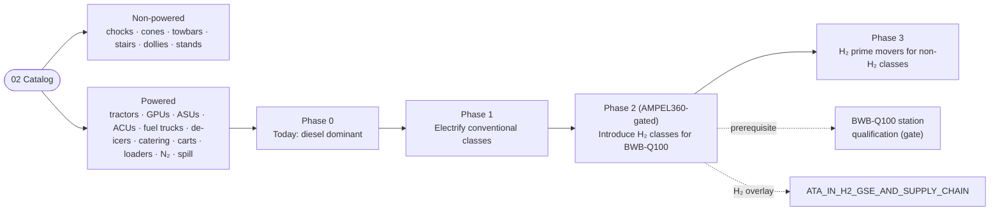

# ATLAS 010-019 · Section 01 · Subsection 060 · Subsubject 03 — Powered and Non-Powered GSE

## 1. Purpose

Establishes the **powered vs. non-powered split** of the GSE catalog (`02_`), the **fuel/energy source per powered class** (diesel, electric, H₂), and the **transition roadmap** from incumbent diesel-driven GSE to electric and (where applicable) H₂-fuelled GSE. This split is the natural place where the *engineered* nature of GSE — its energy bill, its emissions footprint, its ground-handling-charge category, its airside-driving-permit class — is made explicit, and it is the natural place where AMPEL360-specific GSE (LH₂ fuel trucks, H₂-rated GPUs/ASUs) appears as an enumerated population entry rather than a one-off interface in the coupling spec. Conforms to the controlled Q+ATLANTIDE baseline[^baseline], to ATA iSpec 2200 / Spec 100[^ata2200][^ataspec100][^s1000d], and to the GSE-related ATA chapters[^ata09][^ata12].

This subsubject defines **how each catalog entry is energised**. It does **not** define the per-row coupling specification (owned by [`./04`](./04_GSE-Interfaces-Couplings-and-Aircraft-Side-Connections.md)) and does **not** define the per-row lifecycle (owned by [`./05`](./05_GSE-Maintenance-Calibration-and-Records.md)).

## 2. Scope

- Covers the *Powered and Non-Powered GSE* subsubject (`03`) of subsection `060` *GSE* within section `01` *Manejo en Tierra & Servicio*.
- Inherits Q-Division authority and ORB support from the parent row in [`../../README.md` §3](../../README.md#3-architecture-table)[^archtable].

### 2.1 Powered vs. non-powered classification

The split is binary at the unit level: a unit is *powered* if it carries an on-board energy source (combustion engine, battery, fuel cell, etc.) used to either drive the unit itself or to deliver a flow/output to the aircraft; otherwise it is *non-powered*.

**Non-powered GSE** (passive equipment — no on-board energy source; deployed and recovered by hand or by tow):

- Wheel chocks (`GSE-CH-*`) — passive restraint against rolling.
- Cones / safety perimeter markers (`GSE-CN-*`) — passive perimeter definition.
- Towbars (`GSE-TB-*`) — passive mechanical link between tractor and NLG (the *tractor* is powered; the *bar* is not).
- Passenger stairs (`GSE-PS-*`) — when manually towed and self-supported (powered self-propelled stairs are the powered variant).
- Baggage / ULD dollies (`GSE-DL-*`) — passive transport, towed in trains by a tractor.
- Aircraft access stands / maintenance platforms (`GSE-AS-AX`) when manually positioned (motorised platforms are the powered variant).

**Powered GSE** (carry an on-board energy source; covered in §2.2 by powered class):

- Towing tractors (`GSE-TR-*`).
- Ground Power Units (`GSE-EP-*`).
- Air Start Units (`GSE-AS-*`).
- Air Conditioning / PCA carts (`GSE-AC-*`).
- Fuel trucks — Jet-A / SAF (`GSE-FT-*`) and LH₂ (`GSE-FH-*`).
- De-icing / anti-icing trucks (`GSE-DI-*`).
- Catering high-lift trucks (`GSE-CT-*`).
- Potable-water carts (`GSE-WT-*`) when motorised; and lavatory-service carts (`GSE-LT-*`) when motorised.
- Cargo loaders / belt loaders (`GSE-CS-*`).
- Nitrogen / inerting carts (`GSE-N2-*`).
- Spill / vapour-recovery units (`GSE-FF-*`).

Boundary note: a *passive* unit (e.g. a towbar) does not become *powered* by virtue of being attached to a powered unit. The classification is at the unit level, not the train level. This matters because the airside-driving permit, the maintenance regime in [`./05`](./05_GSE-Maintenance-Calibration-and-Records.md), and the energy-source roadmap in §2.3 all key off the unit-level classification.

### 2.2 Fuel / energy source per powered class

For each powered class, the table lists the **incumbent** energy source (the source dominant in today's GSE fleets), the **transition target** (the source the AMPEL360 programme expects the class to use within the planning horizon of this baseline release), and any **AMPEL360-specific constraint** that closes off otherwise-acceptable options.

| Powered class | Incumbent | Transition target | AMPEL360-specific constraint |
|---|---|---|---|
| GSE-TR-* (tractor) | Diesel | **Electric** | None (electric tractors widely available; no AMPEL360-specific blocker). |
| GSE-EP-* (GPU) | Diesel-genset | **Electric (mains-fed) / Battery** | BWB-Q100 receptacle keying must be honoured (see [`./04`](./04_GSE-Interfaces-Couplings-and-Aircraft-Side-Connections.md)). |
| GSE-AS-* (ASU) | Diesel-driven compressor | **Electric compressor / mains-fed** | None. |
| GSE-AC-* (ACU / PCA) | Diesel-driven chiller | **Electric / mains-fed** | BWB-Q100 cabin volume requires higher throughput (see `02_`). |
| GSE-FT-* (Jet-A / SAF truck) | Diesel chassis + Jet-A / SAF cargo | **Electric chassis + SAF cargo** | SAF blend compatibility per the truck's seal/elastomer set; no AMPEL360-specific blocker on the truck itself. |
| GSE-FH-* (LH₂ truck) | n/a — new class | **H₂-rated electric chassis + LH₂ cargo** | Whole class is AMPEL360-specific. Certification overlay from `ATA_IN_H2_GSE_AND_SUPPLY_CHAIN/`[^h2ns]. Diesel chassis is **prohibited** for the LH₂ dispenser by the H₂ exclusion-zone rule. |
| GSE-DI-* (de-ice truck) | Diesel chassis + heated fluid | **Electric chassis + heated fluid (mains-warmed)** | BWB-Q100 wing area requires extended boom (see `02_`); no energy-source blocker. |
| GSE-CT-* (catering truck) | Diesel chassis | **Electric chassis** | None. |
| GSE-WT-* / GSE-LT-* (water/lav carts, motorised) | Diesel | **Electric** | None. |
| GSE-CS-* (cargo loader) | Diesel | **Electric** | None. |
| GSE-N2-* (N₂ / inerting cart) | Diesel-driven compressor for self-fill; cylinder bank for delivery | **Electric / mains-fed compressor; cylinder bank** | H₂ duty-cycle variant required for BWB-Q100 (extended runtime / higher throughput). |
| GSE-FF-* (spill / vapour recovery) | Diesel-driven vacuum pump | **Electric vacuum pump** | H₂ vapour-recovery variant is AMPEL360-specific; H₂-rated equipment per `ATA_IN_H2_GSE_AND_SUPPLY_CHAIN/`[^h2ns]. Diesel prime mover **prohibited** in the H₂ exclusion zone. |

### 2.3 Transition roadmap to electric / H₂ GSE

The AMPEL360 programme's GSE strategy follows a three-phase trajectory that is read **per class**, not per fleet (different classes will move at different speeds based on technology readiness, operational duty cycle, and station-level infrastructure).

- **Phase 0 — Today (incumbent baseline).** Diesel dominates the powered population at most stations. Electric variants exist for tractors, GPUs and water/lav carts at major hubs. LH₂ refuel does not exist as a commercial class.
- **Phase 1 — Electrification of conventional classes.** All classes whose incumbent is "diesel" with no AMPEL360-specific blocker (`GSE-TR-*`, `GSE-EP-*`, `GSE-AS-*`, `GSE-AC-*`, `GSE-CT-*`, `GSE-WT-*`, `GSE-LT-*`, `GSE-CS-*`) are expected to migrate to electric drive within the planning horizon. This phase is **not** AMPEL360-gated; it tracks the broader airport-decarbonisation roadmap, and AMPEL360 stations inherit it.
- **Phase 2 — Introduction of H₂ classes for BWB-Q100.** `GSE-FH-*` (LH₂ truck/dispenser), the H₂ duty-cycle variant of `GSE-N2-*`, and the H₂ vapour-recovery variant of `GSE-FF-*` are introduced **per station** as BWB-Q100 service is opened at that station. This phase **is** AMPEL360-gated and is the critical-path item for station qualification (see [`./02`](./02_GSE-Catalog-and-Compatibility-Matrix.md) §2.2).
- **Phase 3 — H₂-fuelled prime movers for non-H₂ classes.** Where a station decarbonises further, the prime movers of conventional classes (tractors, fuel trucks, de-ice trucks) may themselves become H₂-fuelled (fuel-cell-electric). This phase is **out of scope** for AMPEL360 station qualification per se, but is recognised here so that the catalog metadata in `02_` can carry an `energy_source:` field that captures the actual fuel used by the unit.

The roadmap is consumed by station-qualification planning and by procurement; it is **not** a hard schedule and shall not be cited as a regulatory commitment. The hard requirement is the **gating** in Phase 2 for BWB-Q100 service.

- Out of scope: the per-row coupling specification (`04_`); the per-row maintenance/calibration regime (`05_`); the procurement contract templates (owned by ORB-FIN); the airport-decarbonisation regulatory framework as such.

## 3. Diagram

The diagram below shows the powered vs. non-powered split of the catalog and the three-phase electric / H₂ transition trajectory, with the gating relationship to BWB-Q100 station qualification.

## 4. Footprint

| Metric | Value |
|---|---|
| Architecture | `ATLAS` — Aircraft Top-Level Architecture System |
| Master range | `000–099` |
| Code range | `010-019` |
| Section | `01` — Manejo en Tierra & Servicio |
| Subject | `00` — General Information |
| Subsection | `060` — GSE |
| Subsubject | `03` — Powered and Non-Powered GSE |
| Primary Q-Division | Q-GROUND[^qdiv] |
| Support Q-Divisions | Q-MECHANICS, Q-INDUSTRY |
| ORB support | ORB-PMO, ORB-FIN |
| Governance class | `baseline`[^gov] |
| Folder path | `Q+ATLANTIDE/000-099_ATLAS/010-019_Manejo-en-Tierra-Servicio/060_GSE/` |
| Document | `03_Powered-and-Non-Powered-GSE.md` (this file) |
| Parent subsection | [`00_Overview.md`](./00_Overview.md) |
| Parent architecture | [`../../README.md`](../../README.md) |
| Parent baseline | [`organization/Q+ATLANTIDE.md`](../../../../organization/Q+ATLANTIDE.md) |

## 5. References & Citations

[^baseline]: **Q+ATLANTIDE controlled baseline (v1.0.0)** — [`organization/Q+ATLANTIDE.md`](../../../../organization/Q+ATLANTIDE.md). Defines the controlled `000-999` architecture-band taxonomy and the ATLAS-1000 register subpart.

[^archtable]: **ATLAS §3 Architecture Table** — [`../../README.md` §3](../../README.md#3-architecture-table). Authoritative source for the `010-019` row (Section `01` — Manejo en Tierra & Servicio, Primary Q-Division Q-GROUND).

[^qdiv]: **Q-Division authority** — Q-Divisions provide technical authority over an architecture row (Q+ATLANTIDE Note N-002). See [`organization/Q+ATLANTIDE.md` §4](../../../../organization/Q+ATLANTIDE.md#4-notes).

[^gov]: **Governance class** — Bands are classified as `baseline` or `restricted` per Q+ATLANTIDE §4 governance rules.

[^ata09]: **ATA Chapter 09 — Towing and Taxiing** — Industry chapter covering towing and taxiing operations; adjacency reference for the engineered tractors owned by this subsection.

[^ata12]: **ATA Chapter 12 — Servicing** — Industry chapter governing routine servicing; adjacency reference for the upstream-side GSE that delivers the flows.

[^h2ns]: **`ATA_IN_H2_GSE_AND_SUPPLY_CHAIN/`** — Infrastructure namespace at `OPT-INS_FRAMEWORK/I-INFRASTRUCTURES/ATA_IN_H2_GSE_AND_SUPPLY_CHAIN/` carrying the H₂-specific GSE and supply-chain overlays.

[^ata2200]: **ATA iSpec 2200 — Information Standards for Aviation Maintenance** — Industry standard for digital aircraft maintenance information; governs chapter / section / subject numbering inherited by ATLAS `000-099`.

[^ataspec100]: **ATA Spec 100 — Manufacturers' Technical Data** — Predecessor numbering scheme that established the 00–99 chapter map mirrored by ATLAS sub-ranges.

[^s1000d]: **S1000D Issue 6.0 — International specification for technical publications** — Common Source DataBase (CSDB) and Data Module Code (DMC) specification used across ATLAS technical publications.

[^as9100d]: **AS9100D — Quality Management Systems — Aviation, Space and Defense Organizations** — Quality-management baseline for all Q+ATLANTIDE deliverables.

### Applicable industry standards

The following ATA-family and industry standards apply to this subsubject in addition to the cross-cutting Q+ATLANTIDE governance:

- ATA Chapter 09 — Towing and Taxiing[^ata09]
- ATA Chapter 12 — Servicing[^ata12]
- ATA iSpec 2200 — Information Standards for Aviation Maintenance[^ata2200]
- ATA Spec 100 — Manufacturers' Technical Data[^ataspec100]
- S1000D Issue 6.0 — International specification for technical publications[^s1000d]
- AS9100D — Quality Management Systems — Aviation, Space and Defense Organizations[^as9100d]
