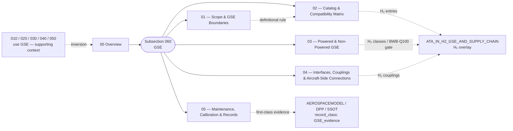

# ATLAS 010-019 · Section 01 · Subsection 060 — GSE

## 1. Purpose

Subsection-level index for *GSE* (Ground Support Equipment, `060`) within ATLAS `010-019` — *Manejo en Tierra & Servicio*. Aggregates the `00 Overview` and the detailed subsubjects (`01`–`05`) that extend it with the canonical inversion rule (GSE-as-subject vs. GSE-as-supporting-context against `010_/020_/030_/040_/050_`), the GSE definitional boundary (vs. ramp infrastructure, fixed airport equipment, aircraft tooling) with the four-pattern ownership model and the airside/landside split, the enumerated catalog and the **three-column compatibility matrix** (`compatible` / `compatible-with-mod` / `incompatible-A360`) for the AMPEL360 family, the powered/non-powered split with the diesel → electric → H₂ transition roadmap (gating BWB-Q100 station qualification), the aircraft-side reception × GSE-side counterpart coupling table including the AMPEL360-specific **H₂ couplings** and their certification regime, and the lifecycle/calibration/records contract that **mandates GSE records as first-class evidence** in the AEROSPACEMODEL / DPP / SSOT chain (`record_class: GSE_evidence`) with the contractual hook for non-operator-owned units. Conforms to the controlled Q+ATLANTIDE baseline[^baseline] and S1000D Issue 6.0[^s1000d]. Maps adjacently to **ATA 12 — Servicing**[^ata12] (upstream side of every servicing coupling) and **ATA 09 — Towing and Taxiing**[^ata09] (engineered tractors / towbars), and overlays from `OPT-INS_FRAMEWORK/I-INFRASTRUCTURES/ATA_IN_H2_GSE_AND_SUPPLY_CHAIN/`[^h2ns] for the H₂-specific GSE population. *The token `060` is an internal sequential index inside the `010-019` range and is **not** a pointer to ATA Chapter 60 — see [`./00_Overview.md` §1](./00_Overview.md#1-purpose).*

## 2. Scope

- Covers the full subsubject namespace `00`–`99` of subsection `060` *GSE*; subsubjects `01`–`05` are populated in this baseline release, the remaining `06`–`99` slots remain available for future extension per the Overview's authorisation[^archtable].
- Inherits Q-Division authority and ORB support from the parent row in [`../../README.md` §3](../../README.md#3-architecture-table)[^archtable].
- **Inversion rule against subsections `010`, `020`, `030`, `040`, `050` — restated here as it is the structurally hardest boundary in the range.** Every prior chapter *uses* GSE as supporting context; this one *is* GSE. *If the chapter is about **what the aircraft does** with the GSE present, it belongs in `010`–`050`; if the chapter is about **what the GSE is, what it costs, what it is compatible with, when it is itself serviced**, it belongs in `060`.* Worked examples and the per-chapter restatement are in [`./00_Overview.md` §2](./00_Overview.md#2-scope).
  - **Ground handling** (`010`) — uses GSE for physical placement / safety perimeter. See [`../010_Ground-handling/00_Overview.md`](../010_Ground-handling/00_Overview.md).
  - **Servicing** (`020`) — uses GSE as the upstream side of fluid/gas/energy flow. See [`../020_servicing/00_Overview.md`](../020_servicing/00_Overview.md).
  - **Access** (`030`) — uses GSE for stands / stairs / platforms. See [`../030_acceso/README.md`](../030_acceso/README.md).
  - **Remolque** (`040`) — uses GSE (tractors, towbars) for controlled translation. See [`../040_remolque/README.md`](../040_remolque/README.md).
  - **Parking** (`050`) — uses GSE for parked-stand support. See [`../050_parking/README.md`](../050_parking/README.md).
  - **GSE** (`060`, this) — **is** the engineered equipment behind all five.

## 3. Diagram

The diagram below shows how this subsection's `00 Overview` aggregates the populated subsubjects (`01`–`05`) into the *GSE* slice of ATLAS `010-019`, the inversion against the five prior subsections, and the `02_` / `04_` H₂ declarations and the `05_` first-class evidence hand-off.

## 4. Subsubject Index

| NN | Title | Document | Status |
|---:|---|---|---|
| 00 | Overview | [`00_Overview.md`](./00_Overview.md) | active |
| 01 | Scope and GSE Boundaries | [`01_Scope-and-GSE-Boundaries.md`](./01_Scope-and-GSE-Boundaries.md) | active |
| 02 | GSE Catalog and Compatibility Matrix | [`02_GSE-Catalog-and-Compatibility-Matrix.md`](./02_GSE-Catalog-and-Compatibility-Matrix.md) | active |
| 03 | Powered and Non-Powered GSE | [`03_Powered-and-Non-Powered-GSE.md`](./03_Powered-and-Non-Powered-GSE.md) | active |
| 04 | GSE Interfaces, Couplings and Aircraft-Side Connections | [`04_GSE-Interfaces-Couplings-and-Aircraft-Side-Connections.md`](./04_GSE-Interfaces-Couplings-and-Aircraft-Side-Connections.md) | active |
| 05 | GSE Maintenance, Calibration and Records | [`05_GSE-Maintenance-Calibration-and-Records.md`](./05_GSE-Maintenance-Calibration-and-Records.md) | active |

## 5. Sibling Subsections (010-019 range)

| Code | Subsection | Document |
|---|---|---|
| `010` | Ground handling | [`../010_Ground-handling/README.md`](../010_Ground-handling/README.md) |
| `020` | servicing | [`../020_servicing/README.md`](../020_servicing/README.md) |
| `030` | acceso | [`../030_acceso/README.md`](../030_acceso/README.md) |
| `040` | remolque | [`../040_remolque/README.md`](../040_remolque/README.md) |
| `050` | parking | [`../050_parking/README.md`](../050_parking/README.md) |
| `060` | GSE (this) | [`./README.md`](./README.md) |

## 6. Footprint

| Metric | Value |
|---|---|
| Architecture | `ATLAS` — Aircraft Top-Level Architecture System |
| Master range | `000–099` |
| Code range | `010-019` |
| Section | `01` — Manejo en Tierra & Servicio |
| Subject | `00` — General Information |
| Subsection | `060` — GSE |
| Subsubject namespace | `00`–`99` (`00` + `01`–`05` populated) |
| Primary Q-Division | Q-GROUND[^qdiv] |
| Support Q-Divisions | Q-MECHANICS, Q-INDUSTRY |
| ORB support | ORB-PMO, ORB-FIN |
| Governance class | `baseline`[^gov] |
| Folder path | `Q+ATLANTIDE/000-099_ATLAS/010-019_Manejo-en-Tierra-Servicio/060_GSE/` |
| Document | `README.md` (this file) |
| Parent architecture | [`../../README.md`](../../README.md) |
| Parent baseline | [`organization/Q+ATLANTIDE.md`](../../../../organization/Q+ATLANTIDE.md) |

## Governance

Governed by [`organization/Q+ATLANTIDE.md`](../../../../organization/Q+ATLANTIDE.md)[^baseline]. All subsubjects under this subsection inherit `architecture_code = ATLAS`, `primary_q_division = Q-GROUND` and `governance_class = baseline` from the parent ATLAS band; extensions added under `06`–`99` shall preserve those header fields and reuse the footnote set declared below. The **inversion rule** against `010`–`050` (GSE-as-subject vs. GSE-as-supporting-context) stated in [`./00_Overview.md`](./00_Overview.md) and restated above is the structurally hardest boundary in the range and shall not be weakened by future edits; contributors shall apply the inversion test before adding GSE content to either side. Subsubject `02` carries a **three-column** compatibility matrix (`compatible` / `compatible-with-mod` / `incompatible-A360`); the third column is mandatory and shall not be collapsed, because it is what makes the matrix operationally useful for station qualification. Subsubject `05` declares the records contract `record_class: GSE_evidence` and the contractual hook for non-operator-owned units; both shall be treated as binding clauses on the GSE evidence chain into AEROSPACEMODEL / DPP / SSOT, not as advisory text. H₂-specific entries in `02_` / `03_` / `04_` / `05_` declare into `OPT-INS_FRAMEWORK/I-INFRASTRUCTURES/ATA_IN_H2_GSE_AND_SUPPLY_CHAIN/`[^h2ns] for the certification overlay; the catalog and coupling specifications are authored here, the H₂-specific compliance evidence is overlaid there, and that direction shall be preserved.

## 7. Change Log

| Version | Date | Author | Change |
|---|---|---|---|
| 1.0.0 | 2026-05-07 | Q-GROUND | Initial population of subsection `060 GSE`: README + Overview enrichment (inversion-rule opening line, diagram, ATA 12 / ATA 09 cross-refs, `ATA_IN_H2_GSE_AND_SUPPLY_CHAIN/` adjacency, numbering note disambiguating against ATA 60, triangulation against `010`/`020`/`030`/`040`/`050`) + subsubjects `01`–`05`, including the four-pattern ownership model and airside/landside split in `01_`, the enumerated catalog with three-column compatibility matrix and the H₂ deviation list in `02_`, the powered/non-powered split with the diesel → electric → H₂ transition roadmap (BWB-Q100 station-qualification gate) in `03_`, the aircraft-side × GSE-side coupling table with the AMPEL360-specific H₂ couplings and certification regime in `04_`, and the records contract mandating `record_class: GSE_evidence` in the AEROSPACEMODEL / DPP / SSOT evidence chain with the contractual hook for non-operator-owned units in `05_`. |

## 8. References & Citations

[^baseline]: **Q+ATLANTIDE controlled baseline (v1.0.0)** — [`organization/Q+ATLANTIDE.md`](../../../../organization/Q+ATLANTIDE.md). Defines the controlled `000-999` architecture-band taxonomy and the ATLAS-1000 register subpart.

[^archtable]: **ATLAS §3 Architecture Table** — [`../../README.md` §3](../../README.md#3-architecture-table). Authoritative source for the `010-019` row (Section `01` — Manejo en Tierra & Servicio, Primary Q-Division Q-GROUND).

[^qdiv]: **Q-Division authority** — Q-Divisions provide technical authority over an architecture row (Q+ATLANTIDE Note N-002). See [`organization/Q+ATLANTIDE.md` §4](../../../../organization/Q+ATLANTIDE.md#4-notes).

[^gov]: **Governance class** — Bands are classified as `baseline` or `restricted` per Q+ATLANTIDE §4 governance rules.

[^ata09]: **ATA Chapter 09 — Towing and Taxiing** — Industry chapter covering towing and taxiing operations; adjacency reference for the engineered tractors, towbars and bypass-pin tooling owned by this subsection.

[^ata12]: **ATA Chapter 12 — Servicing** — Industry chapter governing routine servicing; adjacency reference for the upstream-side GSE that delivers the flows.

[^h2ns]: **`ATA_IN_H2_GSE_AND_SUPPLY_CHAIN/`** — Infrastructure namespace at `OPT-INS_FRAMEWORK/I-INFRASTRUCTURES/ATA_IN_H2_GSE_AND_SUPPLY_CHAIN/` carrying the H₂-specific GSE and supply-chain overlays (LH₂ fuel trucks, H₂ couplings/hoses, vapour-recovery and inerting equipment, H₂ supply-chain traceability, H₂ calibration tokens).

[^ata2200]: **ATA iSpec 2200 — Information Standards for Aviation Maintenance** — Industry standard for digital aircraft maintenance information; governs chapter / section / subject numbering inherited by ATLAS `000-099`.

[^ataspec100]: **ATA Spec 100 — Manufacturers' Technical Data** — Predecessor numbering scheme that established the 00–99 chapter map mirrored by ATLAS sub-ranges.

[^s1000d]: **S1000D Issue 6.0 — International specification for technical publications** — Common Source DataBase (CSDB) and Data Module Code (DMC) specification used across ATLAS technical publications.

[^as9100d]: **AS9100D — Quality Management Systems — Aviation, Space and Defense Organizations** — Quality-management baseline for all Q+ATLANTIDE deliverables.

### Applicable industry standards

The following ATA-family and industry standards apply to this subsection in addition to the cross-cutting Q+ATLANTIDE governance:

- ATA Chapter 09 — Towing and Taxiing[^ata09]
- ATA Chapter 12 — Servicing[^ata12]
- ATA iSpec 2200 — Information Standards for Aviation Maintenance[^ata2200]
- ATA Spec 100 — Manufacturers' Technical Data[^ataspec100]
- S1000D Issue 6.0 — International specification for technical publications[^s1000d]
- AS9100D — Quality Management Systems — Aviation, Space and Defense Organizations[^as9100d]
