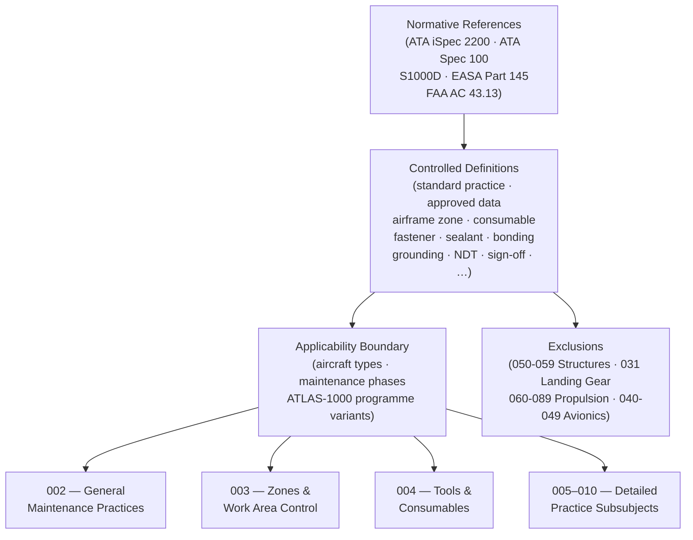

# ATLAS 020-029 · Section 02 · Subsection 020 · Subsubject 001 — Standard Practices Airframe — Controlled Definition

## 1. Purpose

Establishes the **normative scope and controlled terminology** for all standard airframe maintenance practices within the Q+ATLANTIDE programme. Defines the applicability limits, key terms, and regulatory references that all downstream subsubjects, procedures, and data modules in subsection `020` *Standard Practices Airframe* depend upon, in conformance with ATA iSpec 2200[^ata2200], EASA Part 145[^part145], and FAA AC 43.13[^ac4313].

## 2. Scope

- Covers the *Controlled Definition* subsubject (`001`) of subsection `020` *Standard Practices Airframe* within section `02` *Sistemas Core de Aeronave*.
- Inherits Q-Division authority and ORB support from the parent row in [`../../README.md` §3](../../README.md#3-architecture-table)[^archtable].
- Concepts in scope:
  - **Applicability** — aircraft types, airframe configurations, and maintenance phases (line, base, heavy maintenance) to which this subsection applies, including all Q+ATLANTIDE programme variants under ATLAS-1000 control.
  - **Normative references** — the binding standards, regulations, and Q+ATLANTIDE documents this subsubject draws from, including ATA iSpec 2200[^ata2200], ATA Spec 100[^ataspec100], S1000D[^s1000d], EASA Part 145[^part145], and FAA AC 43.13[^ac4313].
  - **Defined terms** — controlled vocabulary entries (e.g., *standard practice*, *approved data*, *airframe zone*, *consumable*, *fastener*, *sealant*, *bonding*, *grounding*, *NDT*, *sign-off*, *traceability*) used consistently across all `020` subsubjects.
  - **Exclusions** — activities explicitly outside this subsection's scope: structural repair and modification (ATLAS 050-059), landing-gear-specific practices (ATLAS 031), propulsion standard practices (ATLAS 060–089), and avionics wiring practices (ATLAS 040-049).
  - **Relationship to regulatory framework** — cross-map from Q+ATLANTIDE definitions to EASA Part 145, FAA Part 43, ATA iSpec 2200, and S1000D data-module applicability categories.
- Out of scope: detailed maintenance procedures (`002_`), zone and access management (`003_`), tooling specifications (`004_`), fastener torque tables (`005_`), sealant application procedures (`006_`), surface-treatment details (`007_`), NDT method protocols (`008_`), safety advisory text (`009_`), and traceability record formats (`010_`).

## 3. Diagram — Scope Boundary and Definition Flow

Normative references flow into the controlled definition set; definitions govern operational scope, which bounds all downstream subsubjects in subsection `020`.

## 4. Footprint

| Metric | Value |
|---|---|
| Architecture | `ATLAS` — Aircraft Top Level Architecture Schema/System (controlled term) |
| Master range | `000–099` |
| Code range | `020-029` |
| Section | `02` — Sistemas Core de Aeronave |
| Subsection | `020` — Standard Practices Airframe |
| Subsubject | `001` — Standard Practices Airframe — Controlled Definition |
| Primary Q-Division | Q-GROUND[^qdiv] |
| Support Q-Divisions | Q-STRUCTURES, Q-DATAGOV, Q-AIR, Q-INDUSTRY, Q-MECHANICS |
| ORB support | ORB-PMO, ORB-LEG |
| Governance class | `baseline`[^gov] |
| Folder path | `Q+ATLANTIDE/000-099_ATLAS/020-029_Sistemas-Core-de-Aeronave/020_Standard-Practices-Airframe/` |
| Document | `001_Standard-Practices-Airframe-Controlled-Definition.md` (this file) |
| Parent subsection | [`README.md`](./README.md) · [`000_Overview.md`](./000_Overview.md) |
| Parent architecture | [`../../README.md`](../../README.md) |
| Parent baseline | [`organization/Q+ATLANTIDE.md`](../../../../organization/Q+ATLANTIDE.md) |

## 5. References & Citations

[^baseline]: **Q+ATLANTIDE controlled baseline (v1.0.0)** — [`organization/Q+ATLANTIDE.md`](../../../../organization/Q+ATLANTIDE.md). Defines the controlled `000-999` architecture-band taxonomy and the ATLAS-1000 register subpart.

[^archtable]: **ATLAS §3 Architecture Table** — [`../../README.md` §3](../../README.md#3-architecture-table). Authoritative source for the `020-029` row.

[^qdiv]: **Q-Division authority** — Q-Divisions provide technical authority over an architecture row (Q+ATLANTIDE Note N-002). See [`organization/Q+ATLANTIDE.md` §4](../../../../organization/Q+ATLANTIDE.md#4-notes).

[^gov]: **Governance class** — `baseline` denotes documents under controlled change management within the Q+ATLANTIDE baseline.

[^ata2200]: **ATA iSpec 2200 — Information Standards for Aviation Maintenance** — Governs document structure, data-module scope, normative reference conventions, and applicability expressions for ATLAS maintenance artefacts.

[^ataspec100]: **ATA Spec 100 — Manufacturers Technical Data** — Baseline standard for document numbering, applicability conventions, and manufacturer code references.

[^s1000d]: **S1000D Issue 6.0 — International specification for technical publications** — Common Source DataBase (CSDB) and Data Module Code (DMC) specification used for all Q+ATLANTIDE artefacts.

[^part145]: **EASA Part 145 — Approved Maintenance Organisations** — Regulatory framework defining approved data, maintenance categories, personnel authorisation, and controlled terminology for airframe maintenance.

[^ac4313]: **FAA AC 43.13-1B/2B — Acceptable Methods, Techniques and Practices** — Advisory circular defining standard practice applicability, procedure format, and maintenance scope for general aviation and transport-category airframes.

### Applicable industry standards

The following standards apply to this subsubject in addition to the cross-cutting Q+ATLANTIDE governance:

- ATA iSpec 2200 — Information Standards for Aviation Maintenance[^ata2200]
- ATA Spec 100 — Manufacturers Technical Data[^ataspec100]
- S1000D Issue 6.0 — International specification for technical publications[^s1000d]
- EASA Part 145 — Approved Maintenance Organisations[^part145]
- FAA AC 43.13-1B/2B — Acceptable Methods, Techniques and Practices[^ac4313]
