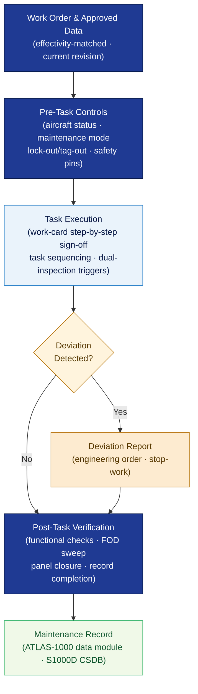

# ATLAS 020-029 · Section 02 · Subsection 020 · Subsubject 002 — Airframe General Maintenance Practices

## 1. Purpose

Defines the **universal airframe maintenance procedures, work-card discipline, and task-sequencing rules** applicable across all airframe systems and structures within the Q+ATLANTIDE programme. Establishes the controlled procedural framework — pre-task checks, task sequencing, work-card sign-off disciplines, and post-task verification — that all maintenance personnel and data modules in subsection `020` *Standard Practices Airframe* and downstream ATA chapters shall follow, in conformance with ATA iSpec 2200[^ata2200] and EASA Part 145[^part145].

## 2. Scope

- Covers the *Airframe General Maintenance Practices* subsubject (`002`) of subsection `020` *Standard Practices Airframe* within section `02` *Sistemas Core de Aeronave*.
- Inherits Q-Division authority and ORB support from the parent row in [`../../README.md` §3](../../README.md#3-architecture-table)[^archtable].
- Concepts in scope:
  - **Pre-task controls** — aircraft status confirmation, maintenance mode entry, safety-pin and lock-out/tag-out application, and work-order validity check prior to commencing any airframe task.
  - **Work-card discipline** — mandatory use of approved maintenance data, step-by-step sign-off, dual-inspection triggers, and deviation reporting per EASA Part 145[^part145] and AS9100D[^as9100d].
  - **Task sequencing** — general ordering rules for concurrent maintenance activities, access dependencies, and structural loading considerations during open-access work.
  - **Post-task verification** — functional checks, foreign-object debris (FOD) sweeps, access-panel closure confirmation, and maintenance-record completion per S1000D[^s1000d].
  - **Maintenance error prevention** — error-proofing conventions, check-call procedures, and distraction-management rules derived from human-factors best practice (see `009_`).
  - **Cross-reference to approved data** — the obligation to use current, effectivity-matched approved data for every task; handling of temporary revisions and engineering orders.
- Out of scope: normative definitions (`001_`), physical zone and access-panel management (`003_`), tool calibration and consumable specifications (`004_`), fastener torque procedures (`005_`), sealant and bonding application (`006_`), surface treatment (`007_`), NDT protocols (`008_`), safety advisory text (`009_`), and traceability record formats (`010_`).

## 3. Diagram — General Maintenance Practice Flow

Pre-task controls gate task execution; work-card discipline and task sequencing govern the maintenance activity; post-task verification closes the loop.

## 4. Footprint

| Metric | Value |
|---|---|
| Architecture | `ATLAS` — Aircraft Top Level Architecture Schema/System (controlled term) |
| Master range | `000–099` |
| Code range | `020-029` |
| Section | `02` — Sistemas Core de Aeronave |
| Subsection | `020` — Standard Practices Airframe |
| Subsubject | `002` — Airframe General Maintenance Practices |
| Primary Q-Division | Q-GROUND[^qdiv] |
| Support Q-Divisions | Q-STRUCTURES, Q-DATAGOV, Q-AIR, Q-INDUSTRY, Q-MECHANICS |
| ORB support | ORB-PMO, ORB-LEG |
| Governance class | `baseline`[^gov] |
| Folder path | `Q+ATLANTIDE/000-099_ATLAS/020-029_Sistemas-Core-de-Aeronave/020_Standard-Practices-Airframe/` |
| Document | `002_Airframe-General-Maintenance-Practices.md` (this file) |
| Parent subsection | [`README.md`](./README.md) · [`000_Overview.md`](./000_Overview.md) |
| Parent architecture | [`../../README.md`](../../README.md) |
| Parent baseline | [`organization/Q+ATLANTIDE.md`](../../../../organization/Q+ATLANTIDE.md) |

## 5. References & Citations

[^baseline]: **Q+ATLANTIDE controlled baseline (v1.0.0)** — [`organization/Q+ATLANTIDE.md`](../../../../organization/Q+ATLANTIDE.md). Defines the controlled `000-999` architecture-band taxonomy and the ATLAS-1000 register subpart.

[^archtable]: **ATLAS §3 Architecture Table** — [`../../README.md` §3](../../README.md#3-architecture-table). Authoritative source for the `020-029` row.

[^qdiv]: **Q-Division authority** — Q-Divisions provide technical authority over an architecture row (Q+ATLANTIDE Note N-002). See [`organization/Q+ATLANTIDE.md` §4](../../../../organization/Q+ATLANTIDE.md#4-notes).

[^gov]: **Governance class** — `baseline` denotes documents under controlled change management within the Q+ATLANTIDE baseline.

[^ata2200]: **ATA iSpec 2200 — Information Standards for Aviation Maintenance** — Governs work-card format, task-sequencing conventions, sign-off discipline, and post-task verification requirements for ATLAS maintenance artefacts.

[^s1000d]: **S1000D Issue 6.0 — International specification for technical publications** — Defines Data Module structure, CSDB cross-links, and record-completion requirements for maintenance tasks.

[^part145]: **EASA Part 145 — Approved Maintenance Organisations** — Regulatory framework for work-card discipline, dual-inspection requirements, deviation reporting, and maintenance-record obligations.

[^as9100d]: **AS9100D — Quality Management Systems — Aviation, Space and Defense Organizations** — Quality-management baseline for work-order control, record keeping, and non-conformance management.

### Applicable industry standards

The following standards apply to this subsubject in addition to the cross-cutting Q+ATLANTIDE governance:

- ATA iSpec 2200 — Information Standards for Aviation Maintenance[^ata2200]
- S1000D Issue 6.0 — International specification for technical publications[^s1000d]
- EASA Part 145 — Approved Maintenance Organisations[^part145]
- AS9100D — Quality Management Systems — Aviation, Space and Defense Organizations[^as9100d]
