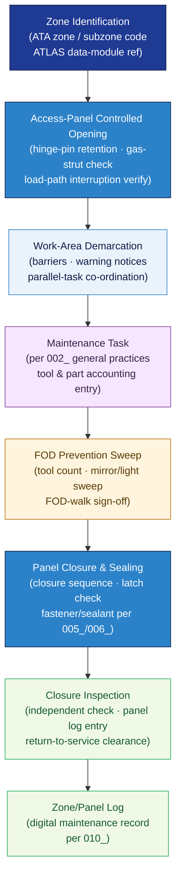

# ATLAS 020-029 · Section 02 · Subsection 020 · Subsubject 003 — Airframe Zones, Access and Work Area Control

## 1. Purpose

Defines the **aircraft zone numbering scheme, access-panel management procedures, and controlled work-area protocols** for all airframe maintenance activities within the Q+ATLANTIDE programme. Establishes the controlled framework — ATA zone identifiers, access-panel controlled-opening sequences, work-area demarcation, and post-maintenance closure verification — that ensures personnel safety, FOD prevention, and structural integrity during open-access airframe work, in conformance with S1000D[^s1000d] and ATA iSpec 2200[^ata2200].

## 2. Scope

- Covers the *Airframe Zones, Access and Work Area Control* subsubject (`003`) of subsection `020` *Standard Practices Airframe* within section `02` *Sistemas Core de Aeronave*.
- Inherits Q-Division authority and ORB support from the parent row in [`../../README.md` §3](../../README.md#3-architecture-table)[^archtable].
- Concepts in scope:
  - **Zone numbering** — the controlled ATA zone and subzone identifier scheme applied to the Q+ATLANTIDE airframe, mapping physical locations to ATLAS data-module codes and work-card references.
  - **Access-panel controlled-opening** — approved sequences for opening, supporting, and making safe structural access panels and doors, including hinge-pin retention, gas-strut checks, and load-path interruption verification.
  - **Work-area demarcation** — physical and procedural boundaries around open-access zones, including barrier requirements, warning notices, and co-ordination with adjacent parallel-task teams.
  - **Foreign-object debris (FOD) prevention** — controlled-entry tool and part accounting, mirror/light sweep requirements, and FOD-walk completion sign-off before closure.
  - **Access-panel closure and sealing** — closure sequence, latch engagement checks, and sealant/fastener re-installation per `005_` and `006_`, with mandatory inspection before returning the aircraft to service.
  - **Zone/panel log integration** — linkage of panel open/close events to the digital maintenance record (per `010_`) to maintain an auditable access history.
- Out of scope: normative definitions (`001_`), general maintenance task sequencing (`002_`), tool calibration and consumable specifications (`004_`), fastener torque procedures (`005_`), sealant application (`006_`), surface treatment (`007_`), NDT method protocols (`008_`), safety advisory text (`009_`), and traceability record formats (`010_`).

## 3. Diagram — Zone, Access and Work Area Control Flow

Zone identification drives access-panel selection; opening, work, FOD sweep, and closure are gated by sequential sign-off steps.

## 4. Footprint

| Metric | Value |
|---|---|
| Architecture | `ATLAS` — Aircraft Top Level Architecture Schema/System (controlled term) |
| Master range | `000–099` |
| Code range | `020-029` |
| Section | `02` — Sistemas Core de Aeronave |
| Subsection | `020` — Standard Practices Airframe |
| Subsubject | `003` — Airframe Zones, Access and Work Area Control |
| Primary Q-Division | Q-GROUND[^qdiv] |
| Support Q-Divisions | Q-STRUCTURES, Q-DATAGOV, Q-AIR, Q-INDUSTRY, Q-MECHANICS |
| ORB support | ORB-PMO, ORB-LEG |
| Governance class | `baseline`[^gov] |
| Folder path | `Q+ATLANTIDE/000-099_ATLAS/020-029_Sistemas-Core-de-Aeronave/020_Standard-Practices-Airframe/` |
| Document | `003_Airframe-Zones-Access-and-Work-Area-Control.md` (this file) |
| Parent subsection | [`README.md`](./README.md) · [`000_Overview.md`](./000_Overview.md) |
| Parent architecture | [`../../README.md`](../../README.md) |
| Parent baseline | [`organization/Q+ATLANTIDE.md`](../../../../organization/Q+ATLANTIDE.md) |

## 5. References & Citations

[^baseline]: **Q+ATLANTIDE controlled baseline (v1.0.0)** — [`organization/Q+ATLANTIDE.md`](../../../../organization/Q+ATLANTIDE.md). Defines the controlled `000-999` architecture-band taxonomy and the ATLAS-1000 register subpart.

[^archtable]: **ATLAS §3 Architecture Table** — [`../../README.md` §3](../../README.md#3-architecture-table). Authoritative source for the `020-029` row.

[^qdiv]: **Q-Division authority** — Q-Divisions provide technical authority over an architecture row (Q+ATLANTIDE Note N-002). See [`organization/Q+ATLANTIDE.md` §4](../../../../organization/Q+ATLANTIDE.md#4-notes).

[^gov]: **Governance class** — `baseline` denotes documents under controlled change management within the Q+ATLANTIDE baseline.

[^ata2200]: **ATA iSpec 2200 — Information Standards for Aviation Maintenance** — Defines zone numbering conventions, access-panel reference schemes, and data-module location coding for all ATLAS maintenance artefacts.

[^s1000d]: **S1000D Issue 6.0 — International specification for technical publications** — Governs zone-code integration in Data Module Codes, panel-log linkage, and access-event traceability in the CSDB.

[^part145]: **EASA Part 145 — Approved Maintenance Organisations** — Regulatory requirements for FOD prevention programmes, access control, and independent inspection on closure.

### Applicable industry standards

The following standards apply to this subsubject in addition to the cross-cutting Q+ATLANTIDE governance:

- ATA iSpec 2200 — Information Standards for Aviation Maintenance[^ata2200]
- S1000D Issue 6.0 — International specification for technical publications[^s1000d]
- EASA Part 145 — Approved Maintenance Organisations[^part145]
