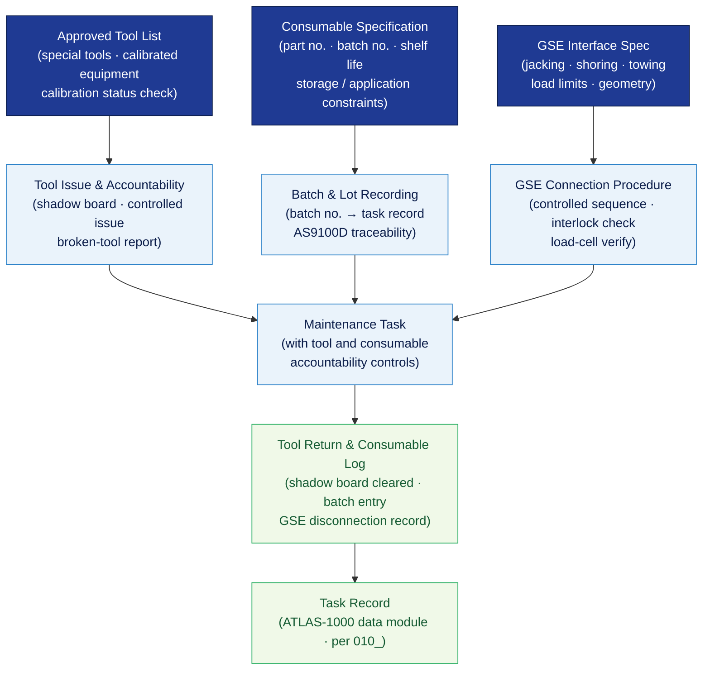

# ATLAS 020-029 · Section 02 · Subsection 020 · Subsubject 004 — Tools, Consumables and GSE Interfaces

## 1. Purpose

Defines the **approved tooling lists, consumable material specifications, and ground support equipment (GSE) mechanical interface requirements** for all standard airframe maintenance activities within the Q+ATLANTIDE programme. Establishes the controlled framework for tool calibration control, consumable batch traceability, and GSE connection/disconnection procedures that safeguard aircraft structural integrity and personnel safety, in conformance with ATA Spec 100[^ataspec100], ATA iSpec 2200[^ata2200], and EASA Part 145[^part145].

## 2. Scope

- Covers the *Tools, Consumables and GSE Interfaces* subsubject (`004`) of subsection `020` *Standard Practices Airframe* within section `02` *Sistemas Core de Aeronave*.
- Inherits Q-Division authority and ORB support from the parent row in [`../../README.md` §3](../../README.md#3-architecture-table)[^archtable].
- Concepts in scope:
  - **Approved tooling** — the controlled list of special tools, standard tools, and calibrated measuring equipment authorised for standard airframe maintenance; calibration status requirements and out-of-calibration handling.
  - **Tool accountability** — controlled-issue and return procedures, tool-shadow boards, and broken-tool reporting to prevent FOD (cross-reference `003_` FOD prevention).
  - **Consumable specifications** — approved consumable materials (sealants, lubricants, cleaning agents, adhesives, coatings) with part number, shelf life, storage, and application constraints; cross-linked to `006_` and `007_`.
  - **Batch and lot traceability** — consumable batch number recording and linkage to the task record for full material traceability per AS9100D[^as9100d].
  - **GSE mechanical interfaces** — interface specifications for ground jacking, shoring, towing attachments, and aircraft-specific support equipment; load limits and interface geometry per ATA Spec 100[^ataspec100].
  - **GSE connection/disconnection procedures** — controlled sequences for attaching/detaching jacks, support fixtures, and handling equipment; interlock and load-cell verification requirements.
- Out of scope: normative definitions (`001_`), general task sequencing (`002_`), zone and access management (`003_`), fastener torque specification (`005_`), sealant and bonding application procedures (`006_`), surface treatment details (`007_`), NDT instruments (`008_`), safety advisory text (`009_`), and lifecycle record formats (`010_`).

## 3. Diagram — Tool, Consumable and GSE Control Flow

Tool issue and consumable selection are gated by approval and calibration/batch checks; GSE interfaces are verified before use; all events feed the task record.

## 4. Footprint

| Metric | Value |
|---|---|
| Architecture | `ATLAS` — Aircraft Top Level Architecture Schema/System (controlled term) |
| Master range | `000–099` |
| Code range | `020-029` |
| Section | `02` — Sistemas Core de Aeronave |
| Subsection | `020` — Standard Practices Airframe |
| Subsubject | `004` — Tools, Consumables and GSE Interfaces |
| Primary Q-Division | Q-GROUND[^qdiv] |
| Support Q-Divisions | Q-STRUCTURES, Q-DATAGOV, Q-AIR, Q-INDUSTRY, Q-MECHANICS |
| ORB support | ORB-PMO, ORB-LEG |
| Governance class | `baseline`[^gov] |
| Folder path | `Q+ATLANTIDE/000-099_ATLAS/020-029_Sistemas-Core-de-Aeronave/020_Standard-Practices-Airframe/` |
| Document | `004_Tools-Consumables-and-GSE-Interfaces.md` (this file) |
| Parent subsection | [`README.md`](./README.md) · [`000_Overview.md`](./000_Overview.md) |
| Parent architecture | [`../../README.md`](../../README.md) |
| Parent baseline | [`organization/Q+ATLANTIDE.md`](../../../../organization/Q+ATLANTIDE.md) |

## 5. References & Citations

[^baseline]: **Q+ATLANTIDE controlled baseline (v1.0.0)** — [`organization/Q+ATLANTIDE.md`](../../../../organization/Q+ATLANTIDE.md). Defines the controlled `000-999` architecture-band taxonomy and the ATLAS-1000 register subpart.

[^archtable]: **ATLAS §3 Architecture Table** — [`../../README.md` §3](../../README.md#3-architecture-table). Authoritative source for the `020-029` row.

[^qdiv]: **Q-Division authority** — Q-Divisions provide technical authority over an architecture row (Q+ATLANTIDE Note N-002). See [`organization/Q+ATLANTIDE.md` §4](../../../../organization/Q+ATLANTIDE.md#4-notes).

[^gov]: **Governance class** — `baseline` denotes documents under controlled change management within the Q+ATLANTIDE baseline.

[^ata2200]: **ATA iSpec 2200 — Information Standards for Aviation Maintenance** — Governs approved-tool list format, consumable specification data-module structure, and GSE interface reference conventions.

[^ataspec100]: **ATA Spec 100 — Manufacturers Technical Data** — Baseline standard for GSE interface geometry, load limits, and ground-support equipment identification conventions.

[^part145]: **EASA Part 145 — Approved Maintenance Organisations** — Regulatory requirements for tool calibration control, consumable material approval, and GSE interface authorisation.

[^as9100d]: **AS9100D — Quality Management Systems — Aviation, Space and Defense Organizations** — Quality-management baseline for consumable batch traceability, calibration records, and material-conformance control.

### Applicable industry standards

The following standards apply to this subsubject in addition to the cross-cutting Q+ATLANTIDE governance:

- ATA iSpec 2200 — Information Standards for Aviation Maintenance[^ata2200]
- ATA Spec 100 — Manufacturers Technical Data[^ataspec100]
- EASA Part 145 — Approved Maintenance Organisations[^part145]
- AS9100D — Quality Management Systems — Aviation, Space and Defense Organizations[^as9100d]
