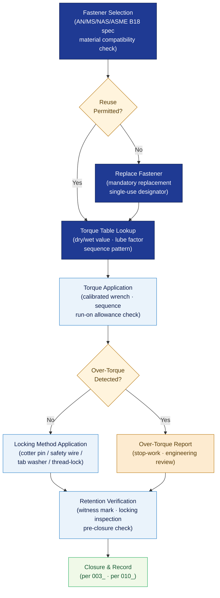

# ATLAS 020-029 · Section 02 · Subsection 020 · Subsubject 005 — Fasteners, Torque, Locking and Retention Practices

## 1. Purpose

Defines the **fastener standards, torque table conventions, locking methods, and retention practices** applicable to all standard airframe maintenance activities within the Q+ATLANTIDE programme. Establishes the controlled framework for fastener selection, installation sequence, torque application, and anti-rotation/retention verification that ensures structural integrity and airworthiness compliance, in conformance with ASME B18[^asmeb18], FAA AC 43.13[^ac4313], and EASA Part 145[^part145].

## 2. Scope

- Covers the *Fasteners, Torque, Locking and Retention Practices* subsubject (`005`) of subsection `020` *Standard Practices Airframe* within section `02` *Sistemas Core de Aeronave*.
- Inherits Q-Division authority and ORB support from the parent row in [`../../README.md` §3](../../README.md#3-architecture-table)[^archtable].
- Concepts in scope:
  - **Fastener standards and selection** — approved fastener specifications (AN, MS, NAS, ASME B18), material compatibility with airframe structure, and prohibited substitutions.
  - **Torque table conventions** — dry vs. wet torque values, lubrication compensation factors, and the torque table format referenced by work cards and data modules.
  - **Torque application procedures** — calibrated torque wrench requirements (per `004_`), torque sequence patterns (e.g., star pattern for flange joints), run-on torque allowances, and over-torque reporting.
  - **Locking methods** — classification and selection of locking methods: mechanical (castellated nuts/cotter pins, safety wire, tab washers) and chemical (thread-locking compounds, per `006_`); applicability limits for each method.
  - **Retention verification** — post-torque retention checks, witness-mark application, and locking-method inspection criteria prior to access-panel closure (cross-reference `003_`).
  - **Fastener reuse rules** — controlled criteria for fastener reuse or mandatory replacement; single-use designators; reuse prohibition for critical flight-structure fasteners.
- Out of scope: normative definitions (`001_`), general task sequencing (`002_`), zone/access management (`003_`), tool calibration and consumable lists (`004_`), sealant and bonding application (`006_`), surface treatment (`007_`), NDT protocols (`008_`), safety advisory text (`009_`), and lifecycle record formats (`010_`).

## 3. Diagram — Fastener Installation and Retention Flow

Fastener selection and torque table lookup gate installation; post-torque locking and retention verification must be completed before closure.

## 4. Footprint

| Metric | Value |
|---|---|
| Architecture | `ATLAS` — Aircraft Top Level Architecture Schema/System (controlled term) |
| Master range | `000–099` |
| Code range | `020-029` |
| Section | `02` — Sistemas Core de Aeronave |
| Subsection | `020` — Standard Practices Airframe |
| Subsubject | `005` — Fasteners, Torque, Locking and Retention Practices |
| Primary Q-Division | Q-GROUND[^qdiv] |
| Support Q-Divisions | Q-STRUCTURES, Q-DATAGOV, Q-AIR, Q-INDUSTRY, Q-MECHANICS |
| ORB support | ORB-PMO, ORB-LEG |
| Governance class | `baseline`[^gov] |
| Folder path | `Q+ATLANTIDE/000-099_ATLAS/020-029_Sistemas-Core-de-Aeronave/020_Standard-Practices-Airframe/` |
| Document | `005_Fasteners-Torque-Locking-and-Retention-Practices.md` (this file) |
| Parent subsection | [`README.md`](./README.md) · [`000_Overview.md`](./000_Overview.md) |
| Parent architecture | [`../../README.md`](../../README.md) |
| Parent baseline | [`organization/Q+ATLANTIDE.md`](../../../../organization/Q+ATLANTIDE.md) |

## 5. References & Citations

[^baseline]: **Q+ATLANTIDE controlled baseline (v1.0.0)** — [`organization/Q+ATLANTIDE.md`](../../../../organization/Q+ATLANTIDE.md). Defines the controlled `000-999` architecture-band taxonomy and the ATLAS-1000 register subpart.

[^archtable]: **ATLAS §3 Architecture Table** — [`../../README.md` §3](../../README.md#3-architecture-table). Authoritative source for the `020-029` row.

[^qdiv]: **Q-Division authority** — Q-Divisions provide technical authority over an architecture row (Q+ATLANTIDE Note N-002). See [`organization/Q+ATLANTIDE.md` §4](../../../../organization/Q+ATLANTIDE.md#4-notes).

[^gov]: **Governance class** — `baseline` denotes documents under controlled change management within the Q+ATLANTIDE baseline.

[^asmeb18]: **ASME B18 — Fastener Standards** — Dimensional and material standards for aerospace fasteners; source of approved fastener specifications referenced in torque tables and selection criteria.

[^ac4313]: **FAA AC 43.13-1B/2B — Acceptable Methods, Techniques and Practices** — Advisory circular providing torque values, locking method guidance, and fastener reuse criteria for transport-category and general aviation airframes.

[^part145]: **EASA Part 145 — Approved Maintenance Organisations** — Regulatory requirements for approved torque data usage, over-torque reporting, and retention verification before return to service.

[^ata2200]: **ATA iSpec 2200 — Information Standards for Aviation Maintenance** — Governs torque table format, data-module torque-value conventions, and fastener specification referencing in ATLAS maintenance artefacts.

### Applicable industry standards

The following standards apply to this subsubject in addition to the cross-cutting Q+ATLANTIDE governance:

- ASME B18 — Fastener Standards[^asmeb18]
- FAA AC 43.13-1B/2B — Acceptable Methods, Techniques and Practices[^ac4313]
- EASA Part 145 — Approved Maintenance Organisations[^part145]
- ATA iSpec 2200 — Information Standards for Aviation Maintenance[^ata2200]
