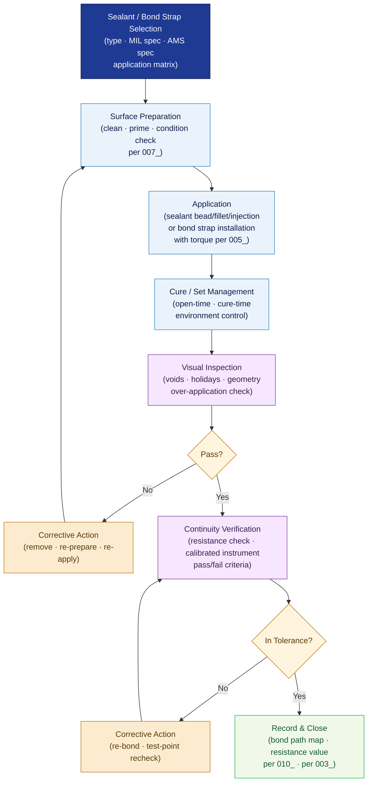

# ATLAS 020-029 · Section 02 · Subsection 020 · Subsubject 006 — Sealing, Bonding, Grounding and Continuity Practices

## 1. Purpose

Defines the **sealant application procedures, electrical bonding path requirements, grounding practices, and continuity verification methods** for all standard airframe maintenance activities within the Q+ATLANTIDE programme. Establishes the controlled framework for pressure-sealing, fuel-sealing, EMC bonding, lightning-protection grounding, and post-installation continuity checks that protect structural integrity, fuel-system safety, and electromagnetic compatibility, in conformance with MIL-DTL-81706[^mildtl], MIL-PRF-81733[^milprf], and EASA Part 145[^part145].

## 2. Scope

- Covers the *Sealing, Bonding, Grounding and Continuity Practices* subsubject (`006`) of subsection `020` *Standard Practices Airframe* within section `02` *Sistemas Core de Aeronave*.
- Inherits Q-Division authority and ORB support from the parent row in [`../../README.md` §3](../../README.md#3-architecture-table)[^archtable].
- Concepts in scope:
  - **Sealant types and selection** — classification of approved sealants (pressure seals, fuel-tank sealants, fillet sealants, injection sealants) per MIL-PRF-81733[^milprf] and AMS 3276[^ams3276]; selection matrix by application type and cure environment.
  - **Sealant surface preparation** — cleaning, priming, and surface-condition requirements (cross-reference `007_`) before sealant application; open-time and cure-time management.
  - **Sealant application procedures** — bead geometry, fillet dimensions, injection technique, and tool-off procedures; inspection criteria for voids, holidays, and over-application.
  - **Electrical bonding paths** — the Q+ATLANTIDE bonding path hierarchy: primary structure bonding, equipment bonding jumpers, and component-level bond straps; resistance limits per MIL-DTL-81706[^mildtl] and SAE ARP1870[^arp1870].
  - **Lightning-protection grounding** — grounding strap specification, installation torque (cross-reference `005_`), and continuity test requirements for lightning-strike protection networks.
  - **Continuity and resistance verification** — post-installation bonding resistance checks with calibrated instruments (per `004_`); pass/fail criteria, test-point identification, and corrective action for out-of-tolerance readings.
- Out of scope: normative definitions (`001_`), general task sequencing (`002_`), zone/access management (`003_`), tool calibration and GSE (`004_`), fastener torque (`005_`), surface treatment and corrosion protection (`007_`), NDT protocols (`008_`), safety advisory (`009_`), and lifecycle records (`010_`).

## 3. Diagram — Sealing, Bonding and Continuity Flow

Surface preparation, sealant application, bonding installation, and continuity verification are sequential gated steps; failures at any gate require corrective action before proceeding.

## 4. Footprint

| Metric | Value |
|---|---|
| Architecture | `ATLAS` — Aircraft Top Level Architecture Schema/System (controlled term) |
| Master range | `000–099` |
| Code range | `020-029` |
| Section | `02` — Sistemas Core de Aeronave |
| Subsection | `020` — Standard Practices Airframe |
| Subsubject | `006` — Sealing, Bonding, Grounding and Continuity Practices |
| Primary Q-Division | Q-GROUND[^qdiv] |
| Support Q-Divisions | Q-STRUCTURES, Q-DATAGOV, Q-AIR, Q-INDUSTRY, Q-MECHANICS |
| ORB support | ORB-PMO, ORB-LEG |
| Governance class | `baseline`[^gov] |
| Folder path | `Q+ATLANTIDE/000-099_ATLAS/020-029_Sistemas-Core-de-Aeronave/020_Standard-Practices-Airframe/` |
| Document | `006_Sealing-Bonding-Grounding-and-Continuity-Practices.md` (this file) |
| Parent subsection | [`README.md`](./README.md) · [`000_Overview.md`](./000_Overview.md) |
| Parent architecture | [`../../README.md`](../../README.md) |
| Parent baseline | [`organization/Q+ATLANTIDE.md`](../../../../organization/Q+ATLANTIDE.md) |

## 5. References & Citations

[^baseline]: **Q+ATLANTIDE controlled baseline (v1.0.0)** — [`organization/Q+ATLANTIDE.md`](../../../../organization/Q+ATLANTIDE.md). Defines the controlled `000-999` architecture-band taxonomy and the ATLAS-1000 register subpart.

[^archtable]: **ATLAS §3 Architecture Table** — [`../../README.md` §3](../../README.md#3-architecture-table). Authoritative source for the `020-029` row.

[^qdiv]: **Q-Division authority** — Q-Divisions provide technical authority over an architecture row (Q+ATLANTIDE Note N-002). See [`organization/Q+ATLANTIDE.md` §4](../../../../organization/Q+ATLANTIDE.md#4-notes).

[^gov]: **Governance class** — `baseline` denotes documents under controlled change management within the Q+ATLANTIDE baseline.

[^mildtl]: **MIL-DTL-81706 — Chemical Conversion Materials for Coating Aluminum** — Specification for surface conversion treatment used as bonding preparation; defines resistance and adhesion requirements for bonding surfaces.

[^milprf]: **MIL-PRF-81733 — Sealing and Coating Compound, Corrosion Inhibitive** — Performance specification for aerospace sealants covering fuel-tank, pressure-sealing, and fillet sealant classifications.

[^ams3276]: **AMS 3276 — Sealing Compound, Integral Fuel Tanks and Fuel Cell Cavities** — SAE Aerospace Material Specification for fuel-tank sealant selection, cure performance, and application requirements.

[^arp1870]: **SAE ARP1870 — Aerospace Systems Electrical Bonding and Grounding** — Recommended practice defining bonding path hierarchy, resistance limits, test-point methodology, and grounding system design for aerospace vehicles.

[^part145]: **EASA Part 145 — Approved Maintenance Organisations** — Regulatory requirements for sealant and bonding material approval, application personnel authorisation, and continuity-check recording.

### Applicable industry standards

The following standards apply to this subsubject in addition to the cross-cutting Q+ATLANTIDE governance:

- MIL-DTL-81706 — Chemical Conversion Materials for Coating Aluminum[^mildtl]
- MIL-PRF-81733 — Sealing and Coating Compound, Corrosion Inhibitive[^milprf]
- AMS 3276 — Sealing Compound, Integral Fuel Tanks[^ams3276]
- SAE ARP1870 — Aerospace Systems Electrical Bonding and Grounding[^arp1870]
- EASA Part 145 — Approved Maintenance Organisations[^part145]
