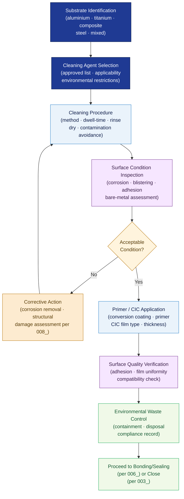

# ATLAS 020-029 · Section 02 · Subsection 020 · Subsubject 007 — Cleaning, Protection and Surface Condition Control

## 1. Purpose

Defines the **approved cleaning agents, corrosion-inhibiting compounds, surface-protection treatment procedures, and surface inspection criteria** for all standard airframe maintenance activities within the Q+ATLANTIDE programme. Establishes the controlled framework for surface preparation before bonding or sealing (cross-reference `006_`), corrosion-prevention application, and post-treatment condition verification that preserves airframe structural life and appearance, in conformance with AMS specifications[^ams], MIL-PRF-85582[^milprf85582], and EASA Part 145[^part145].

## 2. Scope

- Covers the *Cleaning, Protection and Surface Condition Control* subsubject (`007`) of subsection `020` *Standard Practices Airframe* within section `02` *Sistemas Core de Aeronave*.
- Inherits Q-Division authority and ORB support from the parent row in [`../../README.md` §3](../../README.md#3-architecture-table)[^archtable].
- Concepts in scope:
  - **Approved cleaning agents** — the controlled list of approved cleaning solvents, aqueous cleaners, and wipe materials; applicability by substrate (aluminium, titanium, composite, steel); environmental and health restrictions.
  - **Cleaning procedures** — mechanical and chemical cleaning methods, dwell-time controls, rinse and dry requirements, and contamination-avoidance protocols prior to bonding or sealant application (cross-reference `006_`).
  - **Corrosion-inhibiting compounds (CIC)** — approved CIC types (water-displacing, soft-film, hard-film) per MIL-PRF-81309[^milprf81309] and AMS 3150[^ams3150]; application area, film thickness, and reapplication intervals.
  - **Primer and surface treatment** — chemical conversion coating per MIL-DTL-81706[^mildtl] (cross-reference `006_`), epoxy primer application sequences, and compatibility with adjacent sealants.
  - **Surface condition inspection** — visual assessment criteria for corrosion, blistering, adhesion loss, and bare-metal areas; minimum acceptable surface quality before returning to service or applying protective treatment.
  - **Environmental and waste controls** — handling, containment, and disposal of spent cleaning materials and chemical-conversion waste in accordance with applicable environmental regulations.
- Out of scope: normative definitions (`001_`), general task sequencing (`002_`), zone/access management (`003_`), tool calibration (`004_`), fastener torque (`005_`), sealant application and bonding (`006_`), NDT protocols (`008_`), safety advisory (`009_`), and lifecycle records (`010_`).

## 3. Diagram — Surface Cleaning and Protection Flow

Substrate identification drives cleaning agent selection; cleaning, priming, and protection application are sequential steps gated by surface condition inspection.

## 4. Footprint

| Metric | Value |
|---|---|
| Architecture | `ATLAS` — Aircraft Top Level Architecture Schema/System (controlled term) |
| Master range | `000–099` |
| Code range | `020-029` |
| Section | `02` — Sistemas Core de Aeronave |
| Subsection | `020` — Standard Practices Airframe |
| Subsubject | `007` — Cleaning, Protection and Surface Condition Control |
| Primary Q-Division | Q-GROUND[^qdiv] |
| Support Q-Divisions | Q-STRUCTURES, Q-DATAGOV, Q-AIR, Q-INDUSTRY, Q-MECHANICS |
| ORB support | ORB-PMO, ORB-LEG |
| Governance class | `baseline`[^gov] |
| Folder path | `Q+ATLANTIDE/000-099_ATLAS/020-029_Sistemas-Core-de-Aeronave/020_Standard-Practices-Airframe/` |
| Document | `007_Cleaning-Protection-and-Surface-Condition-Control.md` (this file) |
| Parent subsection | [`README.md`](./README.md) · [`000_Overview.md`](./000_Overview.md) |
| Parent architecture | [`../../README.md`](../../README.md) |
| Parent baseline | [`organization/Q+ATLANTIDE.md`](../../../../organization/Q+ATLANTIDE.md) |

## 5. References & Citations

[^baseline]: **Q+ATLANTIDE controlled baseline (v1.0.0)** — [`organization/Q+ATLANTIDE.md`](../../../../organization/Q+ATLANTIDE.md). Defines the controlled `000-999` architecture-band taxonomy and the ATLAS-1000 register subpart.

[^archtable]: **ATLAS §3 Architecture Table** — [`../../README.md` §3](../../README.md#3-architecture-table). Authoritative source for the `020-029` row.

[^qdiv]: **Q-Division authority** — Q-Divisions provide technical authority over an architecture row (Q+ATLANTIDE Note N-002). See [`organization/Q+ATLANTIDE.md` §4](../../../../organization/Q+ATLANTIDE.md#4-notes).

[^gov]: **Governance class** — `baseline` denotes documents under controlled change management within the Q+ATLANTIDE baseline.

[^ams]: **AMS (SAE Aerospace Material Specifications)** — Material specifications for approved cleaning agents, corrosion-inhibiting compounds, and surface-protection treatments applicable to Q+ATLANTIDE airframe maintenance.

[^milprf85582]: **MIL-PRF-85582 — Primer Coatings: Epoxy, Waterborne** — Performance specification for waterborne epoxy primer applied as corrosion-protection primer layer on airframe structures.

[^milprf81309]: **MIL-PRF-81309 — Corrosion Preventive Compounds, Water Displacing, Ultra-Thin Film** — Specification for water-displacing CIC; defines film type, application, and reapplication intervals.

[^ams3150]: **AMS 3150 — Corrosion Preventive Compound, Solvent Cutback, Cold Application** — SAE AMS specification for soft-film and hard-film CIC used in interior airframe cavity protection.

[^mildtl]: **MIL-DTL-81706 — Chemical Conversion Materials for Coating Aluminum** — Specification for chemical conversion coating; cross-referenced in surface preparation prior to sealant or primer application (per `006_`).

[^part145]: **EASA Part 145 — Approved Maintenance Organisations** — Regulatory requirements for approved cleaning material usage, surface-treatment personnel authorisation, and environmental waste management obligations.

### Applicable industry standards

The following standards apply to this subsubject in addition to the cross-cutting Q+ATLANTIDE governance:

- AMS (SAE Aerospace Material Specifications)[^ams]
- MIL-PRF-85582 — Primer Coatings: Epoxy, Waterborne[^milprf85582]
- MIL-PRF-81309 — Corrosion Preventive Compounds, Water Displacing[^milprf81309]
- AMS 3150 — Corrosion Preventive Compound[^ams3150]
- MIL-DTL-81706 — Chemical Conversion Materials for Coating Aluminum[^mildtl]
- EASA Part 145 — Approved Maintenance Organisations[^part145]
