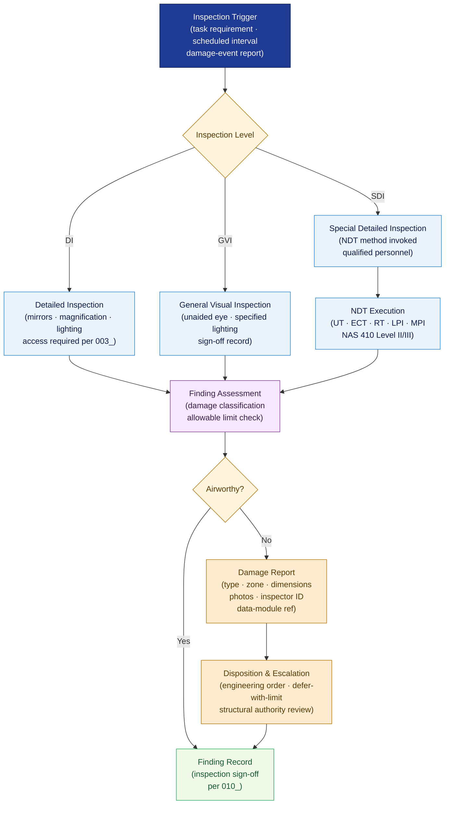

# ATLAS 020-029 · Section 02 · Subsection 020 · Subsubject 008 — Inspection, NDT and Damage Reporting Interfaces

## 1. Purpose

Defines the **general visual inspection protocols, non-destructive testing (NDT) method interfaces, and damage reporting linkage** for all standard airframe maintenance activities within the Q+ATLANTIDE programme. Establishes the controlled framework for inspection classification, NDT method selection, personnel qualification requirements, and the structured damage-report schema that feeds the ATLAS-1000 data module registry and traceability chain, in conformance with NAS 410[^nas410], EASA Part 145[^part145], and ATA iSpec 2200[^ata2200].

## 2. Scope

- Covers the *Inspection, NDT and Damage Reporting Interfaces* subsubject (`008`) of subsection `020` *Standard Practices Airframe* within section `02` *Sistemas Core de Aeronave*.
- Inherits Q-Division authority and ORB support from the parent row in [`../../README.md` §3](../../README.md#3-architecture-table)[^archtable].
- Concepts in scope:
  - **Inspection classification** — the three-level inspection hierarchy: General Visual Inspection (GVI), Detailed Inspection (DI), and Special Detailed Inspection (SDI); applicability triggers and documentation requirements for each level.
  - **NDT method interfaces** — the approved NDT methods available within the Q+ATLANTIDE programme (Ultrasonic Testing, Eddy Current Testing, Radiographic Testing, Liquid Penetrant Inspection, Magnetic Particle Inspection) and the standard interface between a maintenance task's inspection requirement and the method-specific procedure.
  - **NDT personnel qualification** — qualification level requirements (NAS 410 Level I/II/III per method), certification evidence, and recurrence-training intervals.
  - **Damage classification** — the controlled taxonomy of airframe damage categories (dent, scratch, gouge, crack, delamination, corrosion) and the allowable/not-allowable damage limit reference mechanism linking to structural repair data.
  - **Damage report schema** — the structured data fields (damage type, location by zone/zone code, dimensions, photographs, finding date, inspector ID, data-module reference) used to create a damage report linked to the ATLAS-1000 traceability chain (per `010_`).
  - **Disposition and escalation** — classification of findings as airworthy/not-airworthy, engineering-order triggers, and defer-with-limitation conditions; escalation path to structural engineering authority.
- Out of scope: normative definitions (`001_`), general task sequencing (`002_`), zone/access management (`003_`), tooling and consumable specs (`004_`), fastener torque (`005_`), sealant and bonding (`006_`), surface treatment (`007_`), safety advisory text (`009_`), and full lifecycle record formats (`010_`).

## 3. Diagram — Inspection, NDT and Damage Reporting Flow

Inspection trigger drives inspection level selection; NDT is invoked for detailed inspections; findings flow to damage classification and disposition; damage reports feed the traceability chain.

## 4. Footprint

| Metric | Value |
|---|---|
| Architecture | `ATLAS` — Aircraft Top Level Architecture Schema/System (controlled term) |
| Master range | `000–099` |
| Code range | `020-029` |
| Section | `02` — Sistemas Core de Aeronave |
| Subsection | `020` — Standard Practices Airframe |
| Subsubject | `008` — Inspection, NDT and Damage Reporting Interfaces |
| Primary Q-Division | Q-GROUND[^qdiv] |
| Support Q-Divisions | Q-STRUCTURES, Q-DATAGOV, Q-AIR, Q-INDUSTRY, Q-MECHANICS |
| ORB support | ORB-PMO, ORB-LEG |
| Governance class | `baseline`[^gov] |
| Folder path | `Q+ATLANTIDE/000-099_ATLAS/020-029_Sistemas-Core-de-Aeronave/020_Standard-Practices-Airframe/` |
| Document | `008_Inspection-NDT-and-Damage-Reporting-Interfaces.md` (this file) |
| Parent subsection | [`README.md`](./README.md) · [`000_Overview.md`](./000_Overview.md) |
| Parent architecture | [`../../README.md`](../../README.md) |
| Parent baseline | [`organization/Q+ATLANTIDE.md`](../../../../organization/Q+ATLANTIDE.md) |

## 5. References & Citations

[^baseline]: **Q+ATLANTIDE controlled baseline (v1.0.0)** — [`organization/Q+ATLANTIDE.md`](../../../../organization/Q+ATLANTIDE.md). Defines the controlled `000-999` architecture-band taxonomy and the ATLAS-1000 register subpart.

[^archtable]: **ATLAS §3 Architecture Table** — [`../../README.md` §3](../../README.md#3-architecture-table). Authoritative source for the `020-029` row.

[^qdiv]: **Q-Division authority** — Q-Divisions provide technical authority over an architecture row (Q+ATLANTIDE Note N-002). See [`organization/Q+ATLANTIDE.md` §4](../../../../organization/Q+ATLANTIDE.md#4-notes).

[^gov]: **Governance class** — `baseline` denotes documents under controlled change management within the Q+ATLANTIDE baseline.

[^nas410]: **NAS 410 — Certification & Qualification of Nondestructive Test Personnel** — Standard governing NDT personnel qualification levels (I/II/III), method-specific certification, and recurrence training for aerospace NDT.

[^part145]: **EASA Part 145 — Approved Maintenance Organisations** — Regulatory requirements for inspection classification, damage-report obligations, airworthy/not-airworthy disposition, and escalation to engineering authority.

[^ata2200]: **ATA iSpec 2200 — Information Standards for Aviation Maintenance** — Defines inspection level terminology (GVI/DI/SDI), damage-category classification, and data-module linkage requirements for inspection findings.

### Applicable industry standards

The following standards apply to this subsubject in addition to the cross-cutting Q+ATLANTIDE governance:

- NAS 410 — Certification & Qualification of Nondestructive Test Personnel[^nas410]
- EASA Part 145 — Approved Maintenance Organisations[^part145]
- ATA iSpec 2200 — Information Standards for Aviation Maintenance[^ata2200]
