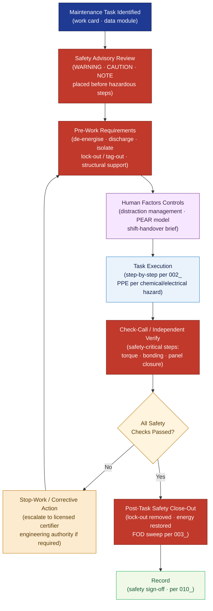

# ATLAS 020-029 · Section 02 · Subsection 020 · Subsubject 009 — Safety, Warnings, Cautions and Human Factors

## 1. Purpose

Defines the **safety advisory hierarchy, WARNING/CAUTION/NOTE classification rules, hazardous-task pre-work requirements, and human-factors controls** applicable to all standard airframe maintenance tasks within the Q+ATLANTIDE programme. Establishes the controlled framework — WARN/CAU/NOTE placement discipline, lock-out/tag-out interfaces, chemical/electrical/structural hazard controls, distraction management, and check-call procedures — that protects personnel and aircraft during open-access airframe maintenance, in conformance with EASA Part 145[^part145], FAA AC 43.13[^ac4313], and EASA Human Factors guidelines[^hf].

## 2. Scope

- Covers the *Safety, Warnings, Cautions and Human Factors* subsubject (`009`) of subsection `020` *Standard Practices Airframe* within section `02` *Sistemas Core de Aeronave*.
- Inherits Q-Division authority and ORB support from the parent row in [`../../README.md` §3](../../README.md#3-architecture-table)[^archtable].
- Concepts in scope:
  - **Safety advisory hierarchy** — the three-tier advisory system: WARNING (risk of personal injury or death), CAUTION (risk of equipment damage or unairworthy condition), and NOTE (important information requiring emphasis); placement rules requiring all WARNINGs and CAUTIONs to appear before the hazardous step in any procedure or data module.
  - **Hazardous-task pre-work requirements** — mandatory pre-task checks before any hazardous step: aircraft systems de-energised, pressure discharged, fuel isolated, hydraulic pressure vented, and lock-out/tag-out applied per general practices (cross-reference `002_`).
  - **Chemical hazard controls** — personal protective equipment (PPE) requirements for sealants, cleaning agents, and CICs (cross-reference `006_`, `007_`); emergency spill procedures; Safety Data Sheet (SDS) access requirements.
  - **Electrical and structural hazard controls** — shock-risk identification, bonding strap removal sequence (cross-reference `006_`), and structural-support verification before load-path interruption (cross-reference `003_`).
  - **Human-factors error management** — distraction management protocols, maintenance shift-handover procedures, PEAR model application (People, Environment, Actions, Resources), and error-capture checklists per EASA Human Factors guidelines[^hf].
  - **Check-call and independent verification** — mandatory check-call discipline for safety-critical steps (torque-critical fasteners, bonding paths, panel closure); triggers for independent inspection as opposed to self-certification.
- Out of scope: normative definitions (`001_`), general task sequencing (`002_`), zone/access management (`003_`), tool calibration (`004_`), fastener torque (`005_`), sealant and bonding (`006_`), surface treatment (`007_`), NDT protocols (`008_`), and lifecycle record formats (`010_`).

## 3. Diagram — Safety Advisory and Human Factors Control Flow

All hazardous tasks must clear pre-work safety requirements before execution; WARNING/CAUTION placement gates procedure steps; human-factors controls wrap the entire maintenance activity.

## 4. Footprint

| Metric | Value |
|---|---|
| Architecture | `ATLAS` — Aircraft Top Level Architecture Schema/System (controlled term) |
| Master range | `000–099` |
| Code range | `020-029` |
| Section | `02` — Sistemas Core de Aeronave |
| Subsection | `020` — Standard Practices Airframe |
| Subsubject | `009` — Safety, Warnings, Cautions and Human Factors |
| Primary Q-Division | Q-GROUND[^qdiv] |
| Support Q-Divisions | Q-STRUCTURES, Q-DATAGOV, Q-AIR, Q-INDUSTRY, Q-MECHANICS |
| ORB support | ORB-PMO, ORB-LEG |
| Governance class | `baseline`[^gov] |
| Folder path | `Q+ATLANTIDE/000-099_ATLAS/020-029_Sistemas-Core-de-Aeronave/020_Standard-Practices-Airframe/` |
| Document | `009_Safety-Warnings-Cautions-and-Human-Factors.md` (this file) |
| Parent subsection | [`README.md`](./README.md) · [`000_Overview.md`](./000_Overview.md) |
| Parent architecture | [`../../README.md`](../../README.md) |
| Parent baseline | [`organization/Q+ATLANTIDE.md`](../../../../organization/Q+ATLANTIDE.md) |

## 5. References & Citations

[^baseline]: **Q+ATLANTIDE controlled baseline (v1.0.0)** — [`organization/Q+ATLANTIDE.md`](../../../../organization/Q+ATLANTIDE.md). Defines the controlled `000-999` architecture-band taxonomy and the ATLAS-1000 register subpart.

[^archtable]: **ATLAS §3 Architecture Table** — [`../../README.md` §3](../../README.md#3-architecture-table). Authoritative source for the `020-029` row.

[^qdiv]: **Q-Division authority** — Q-Divisions provide technical authority over an architecture row (Q+ATLANTIDE Note N-002). See [`organization/Q+ATLANTIDE.md` §4](../../../../organization/Q+ATLANTIDE.md#4-notes).

[^gov]: **Governance class** — `baseline` denotes documents under controlled change management within the Q+ATLANTIDE baseline.

[^part145]: **EASA Part 145 — Approved Maintenance Organisations** — Regulatory requirements for safety advisory placement, lock-out/tag-out, hazardous task controls, and independent inspection triggers in approved maintenance organisations.

[^ac4313]: **FAA AC 43.13-1B/2B — Acceptable Methods, Techniques and Practices** — Advisory circular defining WARNING/CAUTION/NOTE classification and pre-work safety requirements for airframe maintenance tasks.

[^hf]: **EASA Human Factors Guidelines for Aircraft Maintenance** — Advisory material on PEAR model application, distraction management, shift-handover protocols, and error-capture checklists in maintenance environments.

### Applicable industry standards

The following standards apply to this subsubject in addition to the cross-cutting Q+ATLANTIDE governance:

- EASA Part 145 — Approved Maintenance Organisations[^part145]
- FAA AC 43.13-1B/2B — Acceptable Methods, Techniques and Practices[^ac4313]
- EASA Human Factors Guidelines for Aircraft Maintenance[^hf]
