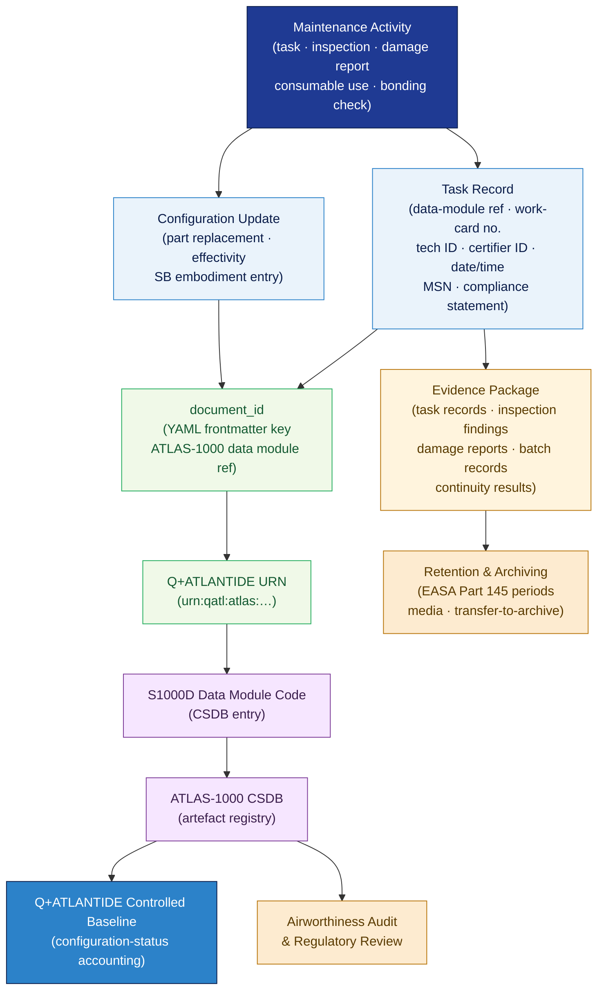

# ATLAS 020-029 · Section 02 · Subsection 020 · Subsubject 010 — Traceability, Evidence and Lifecycle Governance

## 1. Purpose

Defines the **sign-off evidence schema, lifecycle record linkage, and digital traceability chain** for all standard airframe maintenance activities within the Q+ATLANTIDE programme. Establishes the controlled framework for maintenance-record completion, evidence packaging, configuration-status accounting, and end-to-end digital traceability from a physical maintenance event to the ATLAS-1000 CSDB and the Q+ATLANTIDE controlled baseline, in conformance with AS9100D[^as9100d], S1000D[^s1000d], and EASA Part 145[^part145].

## 2. Scope

- Covers the *Traceability, Evidence and Lifecycle Governance* subsubject (`010`) of subsection `020` *Standard Practices Airframe* within section `02` *Sistemas Core de Aeronave*.
- Inherits Q-Division authority and ORB support from the parent row in [`../../README.md` §3](../../README.md#3-architecture-table)[^archtable].
- Concepts in scope:
  - **Sign-off evidence schema** — the mandatory evidence fields for each maintenance task record: task identification (data-module reference, work-card number), technician and certifier IDs, completion date/time, aircraft MSN/tail, component part numbers (where applicable), and compliance statement.
  - **Lifecycle record linkage** — the directed link from a maintenance task record to the applicable ATLAS-1000 data module (via `document_id`), the Q+ATLANTIDE URN, and the S1000D Data Module Code (DMC), creating an auditable, forward- and reverse-traversable record chain.
  - **Configuration-status accounting** — maintenance-action driven updates to the aircraft configuration baseline: part-replacement records, effectivity changes, and service-bulletin embodiment entries linked to the configuration-management authority.
  - **Retention and archiving** — minimum record-retention periods (per EASA Part 145 Subpart B requirements), storage media standards, and transfer-to-archive protocols for both paper and digital records.
  - **Digital traceability chain** — the structured graph from physical maintenance event → task record → ATLAS data module → CSDB entry → Q+ATLANTIDE URN → controlled baseline, enabling full reverse traceability for airworthiness audit, regulatory review, and lifecycle analysis.
  - **Evidence package integration** — the packaging of task records, inspection findings (per `008_`), damage reports, consumable batch records (per `004_`), and continuity-check results (per `006_`) into a coherent evidence package per work order.
- Out of scope: normative definitions (`001_`), general task sequencing (`002_`), zone/access management (`003_`), tooling and consumable control (`004_`), fastener torque (`005_`), sealant and bonding (`006_`), surface treatment (`007_`), NDT protocols (`008_`), and safety advisory text (`009_`).

## 3. Diagram — Traceability and Lifecycle Record Chain

Each maintenance activity generates task records; records are linked to ATLAS data modules and the Q+ATLANTIDE baseline via the digital traceability chain; evidence packages are formed per work order for retention and audit.

## 4. Footprint

| Metric | Value |
|---|---|
| Architecture | `ATLAS` — Aircraft Top Level Architecture Schema/System (controlled term) |
| Master range | `000–099` |
| Code range | `020-029` |
| Section | `02` — Sistemas Core de Aeronave |
| Subsection | `020` — Standard Practices Airframe |
| Subsubject | `010` — Traceability, Evidence and Lifecycle Governance |
| Primary Q-Division | Q-GROUND[^qdiv] |
| Support Q-Divisions | Q-STRUCTURES, Q-DATAGOV, Q-AIR, Q-INDUSTRY, Q-MECHANICS |
| ORB support | ORB-PMO, ORB-LEG |
| Governance class | `baseline`[^gov] |
| Folder path | `Q+ATLANTIDE/000-099_ATLAS/020-029_Sistemas-Core-de-Aeronave/020_Standard-Practices-Airframe/` |
| Document | `010_Traceability-Evidence-and-Lifecycle-Governance.md` (this file) |
| Parent subsection | [`README.md`](./README.md) · [`000_Overview.md`](./000_Overview.md) |
| Parent architecture | [`../../README.md`](../../README.md) |
| Parent baseline | [`organization/Q+ATLANTIDE.md`](../../../../organization/Q+ATLANTIDE.md) |

## 5. References & Citations

[^baseline]: **Q+ATLANTIDE controlled baseline (v1.0.0)** — [`organization/Q+ATLANTIDE.md`](../../../../organization/Q+ATLANTIDE.md). Defines the controlled `000-999` architecture-band taxonomy and the ATLAS-1000 register subpart; the ultimate traceability anchor for all ATLAS maintenance records.

[^archtable]: **ATLAS §3 Architecture Table** — [`../../README.md` §3](../../README.md#3-architecture-table). Authoritative source for the `020-029` row.

[^qdiv]: **Q-Division authority** — Q-Divisions provide technical authority over an architecture row (Q+ATLANTIDE Note N-002). See [`organization/Q+ATLANTIDE.md` §4](../../../../organization/Q+ATLANTIDE.md#4-notes).

[^gov]: **Governance class** — `baseline` denotes documents under controlled change management within the Q+ATLANTIDE baseline.

[^as9100d]: **AS9100D — Quality Management Systems — Aviation, Space and Defense Organizations** — Defines record-control requirements: identification, storage, protection, retrieval, retention period, and disposition of quality records, including all standard-practices maintenance artefacts.

[^s1000d]: **S1000D Issue 6.0 — International specification for technical publications** — Defines the Data Module Code (DMC) structure, CSDB key conventions, and identifier-lifecycle rules used to link maintenance records to the ATLAS-1000 registry.

[^part145]: **EASA Part 145 — Approved Maintenance Organisations** — Subpart B record-keeping requirements: minimum retention periods, storage media, electronic record management, and transfer to archive obligations for all maintenance records.

[^iso15459]: **ISO 15459 — Unique Identification of Transport Units and Unit Loads** — UID standard applied to ATLAS digital artefact traceability; governs Q+ATLANTIDE URN construction and cross-link from physical components to CSDB records.

### Applicable industry standards

The following standards apply to this subsubject in addition to the cross-cutting Q+ATLANTIDE governance:

- AS9100D — Quality Management Systems — Aviation, Space and Defense Organizations[^as9100d]
- S1000D Issue 6.0 — International specification for technical publications[^s1000d]
- EASA Part 145 — Approved Maintenance Organisations[^part145]
- ISO 15459 — Unique Identification of Transport Units and Unit Loads[^iso15459]
