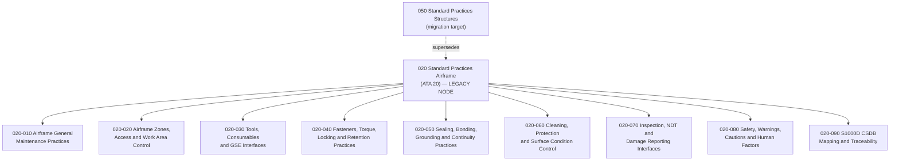

# ATLAS 020-029 · 02.020 · 020-000 — General

> **⚠ DEPRECATED / LEGACY COMPATIBILITY NODE**
> This subsection is preserved as a historical alias and migration reference.
> Active Standard Practices Airframe content shall migrate to
> `Q+ATLANTIDE/000-099_ATLAS/050-059_Estructuras-Primarias-e-Interfaces-de-Programa-Q-Division/050_Standard-Practices-Structures/`.
> New content shall not be authored under this node.

## 1. Purpose

Provide the general architectural definition for *Standard Practices Airframe* (ATA 20) within ATLAS subsection `020`. This section establishes the scope boundary, system family, Q-Division authority, and top-level structural context for all standard airframe practice sections `020-010` through `020-090`.

This node is a **legacy compatibility bridge** maintained for migration traceability. It preserves the ATA chapter 20 scope definition (airframe general maintenance practices, tooling, fasteners, sealing, inspection, and safety warnings) as an historical alias until all cross-references are redirected to the canonical structures path.

## 2. Scope

- Defines the Standard Practices Airframe system family within the ATLAS-1000 register, aligned to ATA SNS `20-00-00 General`.
- Covers the architectural authority of `primary_q_division: Q-GROUND` with support from Q-STRUCTURES, Q-DATAGOV, Q-AIR, Q-INDUSTRY, and Q-MECHANICS.
- Applies to all airframe-level standard maintenance practices including general maintenance, zones and access control, tooling and GSE, fastener and torque practices, sealing and bonding, cleaning and surface condition, inspection and NDT, safety warnings, and publication traceability.
- Does not replace certified ATA/S1000D task-specific maintenance data modules.

**Scope boundary:** This node covers standard practices applicable across airframe systems and structures. It does not replace certified ATA/S1000D task-specific maintenance, troubleshooting, or operational data modules.

**Safety boundary:** Standard practices are safety-relevant. Any artefact derived from this node requires approved procedure data, correct effectivity, tooling and GSE control, warnings and cautions, inspection criteria, sign-off evidence, and lifecycle traceability.

## 3. System Architecture

## 4. Footprint

| Metric | Value |
|---|---|
| Architecture | `ATLAS` — Aircraft Top Level Architecture Schema/System |
| Master range | `000–099` |
| Code range | `020-029` |
| Section | `02` — Sistemas Core de Aeronave |
| Subsection | `020` — Standard Practices Airframe |
| Local section code | `020-000` |
| ATA SNS | `20-00-00` |
| Primary Q-Division | Q-GROUND |
| Support Q-Divisions | Q-STRUCTURES, Q-DATAGOV, Q-AIR, Q-INDUSTRY, Q-MECHANICS |
| Governance class | `baseline` |
| Node class | `legacy-deprecated-compatibility-node` |
| Status | `deprecated` |
| Folder path | `Q+ATLANTIDE/000-099_ATLAS/020-029_Sistemas-Core-de-Aeronave/020_Standard-Practices-Airframe/` |
| Document | `020-000-General.md` |
| Parent subsection | [`README.md`](./README.md) |
| Parent section | [`../README.md`](../README.md) |
| Parent baseline | [`organization/Q+ATLANTIDE.md`](../../../../organization/Q+ATLANTIDE.md) |

## 5. References

- ATA iSpec 2200 — Chapter 20, Standard Practices — Airframe
- Q+ATLANTIDE controlled baseline [`organization/Q+ATLANTIDE.md`](../../../../organization/Q+ATLANTIDE.md)
- ATLAS section index [`../README.md`](../README.md)
- Subsection index [`./README.md`](./README.md)
- Migration target: `050_Standard-Practices-Structures/` — `Q+ATLANTIDE/000-099_ATLAS/050-059_Estructuras-Primarias-e-Interfaces-de-Programa-Q-Division/`
