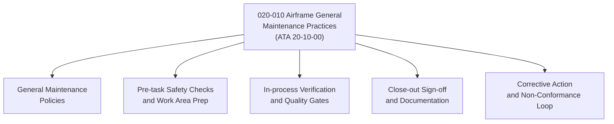

# ATLAS 020-029 · 02.020 · 020-010 — Airframe General Maintenance Practices

> **⚠ DEPRECATED / LEGACY COMPATIBILITY NODE** — See [`README.md`](./README.md) for migration guidance.

## 1. Purpose

Define the general maintenance practice framework for airframe systems within ATLAS subsection `020`, aligned to ATA SNS `20-10-00`. Establishes the overarching policies, procedural discipline, and quality assurance requirements applicable across all airframe maintenance tasks.

## 2. Scope

- Covers general airframe maintenance discipline: task initiation, procedure adherence, documentation standards, and corrective action loops.
- Defines the baseline maintenance culture standards including pre-task safety checks, work-area preparation, in-process verification, and close-out sign-off.
- Applies to all maintenance personnel, ground support contractors, and Q-Division engineering teams interfacing with airframe systems.
- Does not replace aircraft maintenance manual (AMM) task cards or certified ATA/S1000D data modules.

## 3. System Architecture

## 4. Footprint

| Metric | Value |
|---|---|
| Architecture | `ATLAS` — Aircraft Top Level Architecture Schema/System |
| Code range | `020-029` |
| Subsection | `020` — Standard Practices Airframe |
| Local section code | `020-010` |
| ATA SNS | `20-10-00` |
| Primary Q-Division | Q-GROUND |
| Governance class | `baseline` |
| Status | `deprecated` |
| Folder path | `Q+ATLANTIDE/000-099_ATLAS/020-029_Sistemas-Core-de-Aeronave/020_Standard-Practices-Airframe/` |
| Document | `020-010-Airframe-General-Maintenance-Practices.md` |

## 5. References

- ATA iSpec 2200 — Chapter 20-10, Standard Practices Airframe — General
- Subsection index [`./README.md`](./README.md)
- General [`./020-000-General.md`](./020-000-General.md)
