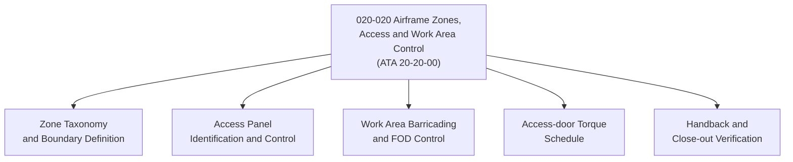

# ATLAS 020-029 · 02.020 · 020-020 — Airframe Zones, Access and Work Area Control

> **⚠ DEPRECATED / LEGACY COMPATIBILITY NODE** — See [`README.md`](./README.md) for migration guidance.

## 1. Purpose

Define the airframe zone classification, access panel and door management, and work-area control procedures within ATLAS subsection `020`, aligned to ATA SNS `20-20-00`. Establishes the spatial and procedural framework for controlled access to all airframe work zones.

## 2. Scope

- Defines airframe zone taxonomy (nose, fuselage station bands, wing, empennage, belly fairing) aligned to Q+ATLANTIDE coordinate frames.
- Covers access panel identification, opening/closure procedures, required tooling, and access-door torque schedules.
- Establishes work-area barricading, foreign object debris (FOD) control, and handback verification procedures.
- Applies to all airframe maintenance zones; does not replace aircraft maintenance manual (AMM) access panel task cards.

## 3. System Architecture

## 4. Footprint

| Metric | Value |
|---|---|
| Architecture | `ATLAS` — Aircraft Top Level Architecture Schema/System |
| Code range | `020-029` |
| Subsection | `020` — Standard Practices Airframe |
| Local section code | `020-020` |
| ATA SNS | `20-20-00` |
| Primary Q-Division | Q-GROUND |
| Governance class | `baseline` |
| Status | `deprecated` |
| Folder path | `Q+ATLANTIDE/000-099_ATLAS/020-029_Sistemas-Core-de-Aeronave/020_Standard-Practices-Airframe/` |
| Document | `020-020-Airframe-Zones-Access-and-Work-Area-Control.md` |

## 5. References

- ATA iSpec 2200 — Chapter 20-20, Standard Practices Airframe — Zones and Access
- Subsection index [`./README.md`](./README.md)
- General [`./020-000-General.md`](./020-000-General.md)
