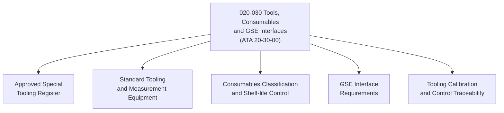

# ATLAS 020-029 · 02.020 · 020-030 — Tools, Consumables and GSE Interfaces

> **⚠ DEPRECATED / LEGACY COMPATIBILITY NODE** — See [`README.md`](./README.md) for migration guidance.

## 1. Purpose

Define the approved tool lists, consumables specifications, and ground support equipment (GSE) interface requirements within ATLAS subsection `020`, aligned to ATA SNS `20-30-00`. Establishes the standard tooling control framework for all airframe maintenance activities.

## 2. Scope

- Defines special tooling, standard tooling, and measurement equipment approved for airframe maintenance.
- Covers consumables classification (sealants, adhesives, lubricants, cleaning agents, thread-locking compounds) with shelf-life and storage controls.
- Establishes GSE interface requirements including jacking points, towing attachment, trestles, and maintenance platforms.
- Applies to all Q-GROUND and Q-MECHANICS maintenance activities; does not replace aircraft maintenance manual (AMM) tooling and consumables tables.

## 3. System Architecture

## 4. Footprint

| Metric | Value |
|---|---|
| Architecture | `ATLAS` — Aircraft Top Level Architecture Schema/System |
| Code range | `020-029` |
| Subsection | `020` — Standard Practices Airframe |
| Local section code | `020-030` |
| ATA SNS | `20-30-00` |
| Primary Q-Division | Q-GROUND |
| Governance class | `baseline` |
| Status | `deprecated` |
| Folder path | `Q+ATLANTIDE/000-099_ATLAS/020-029_Sistemas-Core-de-Aeronave/020_Standard-Practices-Airframe/` |
| Document | `020-030-Tools-Consumables-and-GSE-Interfaces.md` |

## 5. References

- ATA iSpec 2200 — Chapter 20-30, Standard Practices Airframe — Tooling and Consumables
- Subsection index [`./README.md`](./README.md)
- General [`./020-000-General.md`](./020-000-General.md)
