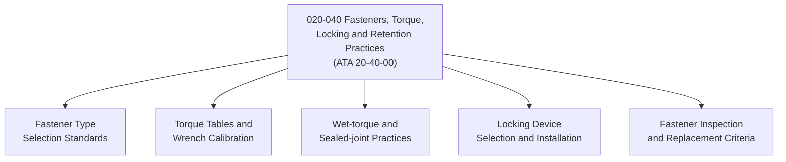

# ATLAS 020-029 · 02.020 · 020-040 — Fasteners, Torque, Locking and Retention Practices

> **⚠ DEPRECATED / LEGACY COMPATIBILITY NODE** — See [`README.md`](./README.md) for migration guidance.

## 1. Purpose

Define the fastener selection, torque specification, locking device, and retention practice standards within ATLAS subsection `020`, aligned to ATA SNS `20-40-00`. Establishes the controlled fastener engineering practices applicable across all airframe assembly and maintenance tasks.

## 2. Scope

- Covers fastener type selection (bolts, screws, rivets, hi-locks, cherry-max, blind fasteners) and installation standards.
- Defines torque tables, torque wrench calibration requirements, and wet-torque practices for sealed joints.
- Establishes locking device selection (castellated nuts and cotter pins, self-locking nuts, safety wire, thread-locking compounds, tab washers).
- Applies to all airframe structural fastening; does not replace aircraft structural repair manual (SRM) or AMM task-level torque tables.

## 3. System Architecture

## 4. Footprint

| Metric | Value |
|---|---|
| Architecture | `ATLAS` — Aircraft Top Level Architecture Schema/System |
| Code range | `020-029` |
| Subsection | `020` — Standard Practices Airframe |
| Local section code | `020-040` |
| ATA SNS | `20-40-00` |
| Primary Q-Division | Q-GROUND |
| Governance class | `baseline` |
| Status | `deprecated` |
| Folder path | `Q+ATLANTIDE/000-099_ATLAS/020-029_Sistemas-Core-de-Aeronave/020_Standard-Practices-Airframe/` |
| Document | `020-040-Fasteners-Torque-Locking-and-Retention-Practices.md` |

## 5. References

- ATA iSpec 2200 — Chapter 20-40, Standard Practices Airframe — Fasteners and Torque
- Subsection index [`./README.md`](./README.md)
- General [`./020-000-General.md`](./020-000-General.md)
