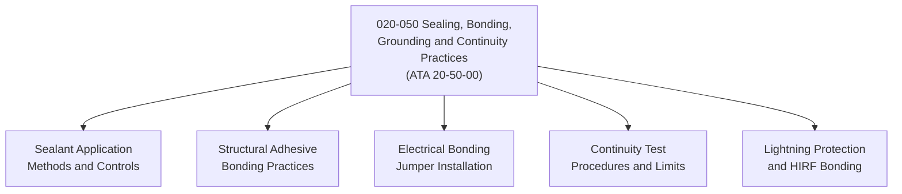

# ATLAS 020-029 · 02.020 · 020-050 — Sealing, Bonding, Grounding and Continuity Practices

> **⚠ DEPRECATED / LEGACY COMPATIBILITY NODE** — See [`README.md`](./README.md) for migration guidance.

## 1. Purpose

Define the sealing compound application, structural bonding, electrical bonding, grounding, and electrical continuity verification standards within ATLAS subsection `020`, aligned to ATA SNS `20-50-00`. Establishes the controlled practices applicable across all airframe sealing, adhesive bonding, and electrical grounding tasks.

## 2. Scope

- Covers sealant application methods (faying-surface sealing, fillet sealing, injection sealing) and cure-time controls.
- Defines structural adhesive bonding surface preparation, application, and proof-load acceptance criteria.
- Establishes electrical bonding jumper installation, resistance acceptance limits (≤ 2.5 mΩ typical), and continuity test procedures.
- Covers lightning protection zone bonding, static discharge paths, and HIRF protection continuity.
- Applies across all airframe zones; does not replace aircraft structural repair manual (SRM), AMM task cards, or electrical wiring interconnect system (EWIS) manuals.

## 3. System Architecture

## 4. Footprint

| Metric | Value |
|---|---|
| Architecture | `ATLAS` — Aircraft Top Level Architecture Schema/System |
| Code range | `020-029` |
| Subsection | `020` — Standard Practices Airframe |
| Local section code | `020-050` |
| ATA SNS | `20-50-00` |
| Primary Q-Division | Q-GROUND |
| Governance class | `baseline` |
| Status | `deprecated` |
| Folder path | `Q+ATLANTIDE/000-099_ATLAS/020-029_Sistemas-Core-de-Aeronave/020_Standard-Practices-Airframe/` |
| Document | `020-050-Sealing-Bonding-Grounding-and-Continuity-Practices.md` |

## 5. References

- ATA iSpec 2200 — Chapter 20-50, Standard Practices Airframe — Sealing and Bonding
- Subsection index [`./README.md`](./README.md)
- General [`./020-000-General.md`](./020-000-General.md)
