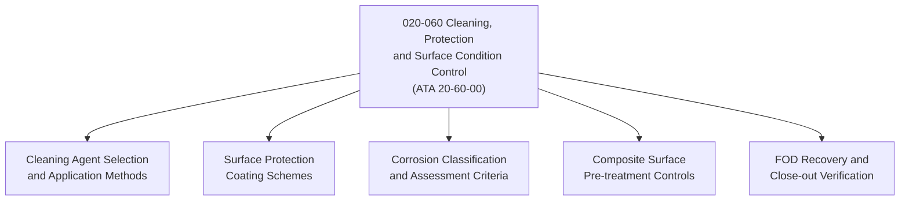

# ATLAS 020-029 · 02.020 · 020-060 — Cleaning, Protection and Surface Condition Control

> **⚠ DEPRECATED / LEGACY COMPATIBILITY NODE** — See [`README.md`](./README.md) for migration guidance.

## 1. Purpose

Define the cleaning procedures, surface protection schemes, and surface condition assessment standards within ATLAS subsection `020`, aligned to ATA SNS `20-60-00`. Establishes the controlled practices for maintaining airframe surface integrity across all maintenance events.

## 2. Scope

- Covers approved cleaning agent selection, application methods, and rinse-down procedures for metallic, composite, and coated surfaces.
- Defines surface protection coatings (corrosion inhibiting compounds, primers, topcoats, anodising, plating) and application controls.
- Establishes surface condition assessment criteria: paint condition grading, corrosion classification (levels I–IV), and acceptance/rejection thresholds.
- Covers pre-treatment of composite repair areas, surface cleaning prior to sealing, and FOD recovery after cleaning operations.
- Does not replace aircraft structural repair manual (SRM) corrosion repair task cards or AMM exterior cleaning procedures.

## 3. System Architecture

## 4. Footprint

| Metric | Value |
|---|---|
| Architecture | `ATLAS` — Aircraft Top Level Architecture Schema/System |
| Code range | `020-029` |
| Subsection | `020` — Standard Practices Airframe |
| Local section code | `020-060` |
| ATA SNS | `20-60-00` |
| Primary Q-Division | Q-GROUND |
| Governance class | `baseline` |
| Status | `deprecated` |
| Folder path | `Q+ATLANTIDE/000-099_ATLAS/020-029_Sistemas-Core-de-Aeronave/020_Standard-Practices-Airframe/` |
| Document | `020-060-Cleaning-Protection-and-Surface-Condition-Control.md` |

## 5. References

- ATA iSpec 2200 — Chapter 20-60, Standard Practices Airframe — Cleaning and Protection
- Subsection index [`./README.md`](./README.md)
- General [`./020-000-General.md`](./020-000-General.md)
