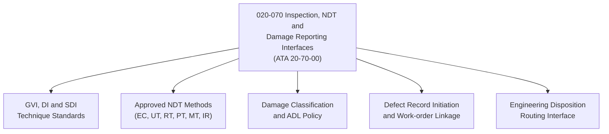

# ATLAS 020-029 · 02.020 · 020-070 — Inspection, NDT and Damage Reporting Interfaces

> **⚠ DEPRECATED / LEGACY COMPATIBILITY NODE** — See [`README.md`](./README.md) for migration guidance.

## 1. Purpose

Define the visual inspection protocols, non-destructive testing (NDT) method standards, and damage reporting interfaces within ATLAS subsection `020`, aligned to ATA SNS `20-70-00`. Establishes the standard inspection and defect reporting framework applicable across all airframe maintenance tasks.

## 2. Scope

- Covers general visual inspection (GVI), detailed inspection (DI), and special detailed inspection (SDI) technique standards.
- Defines approved NDT methods: eddy current (EC), ultrasonic (UT), radiographic (RT), penetrant inspection (PT), magnetic particle (MT), and thermography (IR).
- Establishes damage classification, reportable defect thresholds, and allowable damage limits (ADL) referencing policy.
- Defines the interface to the airframe damage reporting system: defect record initiation, work-order linkage, and engineering disposition routing.
- Does not replace structural repair manual (SRM) allowable damage tables, NDT procedures, or approved repair schemes.

## 3. System Architecture

## 4. Footprint

| Metric | Value |
|---|---|
| Architecture | `ATLAS` — Aircraft Top Level Architecture Schema/System |
| Code range | `020-029` |
| Subsection | `020` — Standard Practices Airframe |
| Local section code | `020-070` |
| ATA SNS | `20-70-00` |
| Primary Q-Division | Q-GROUND |
| Governance class | `baseline` |
| Status | `deprecated` |
| Folder path | `Q+ATLANTIDE/000-099_ATLAS/020-029_Sistemas-Core-de-Aeronave/020_Standard-Practices-Airframe/` |
| Document | `020-070-Inspection-NDT-and-Damage-Reporting-Interfaces.md` |

## 5. References

- ATA iSpec 2200 — Chapter 20-70, Standard Practices Airframe — Inspection and NDT
- Subsection index [`./README.md`](./README.md)
- General [`./020-000-General.md`](./020-000-General.md)
