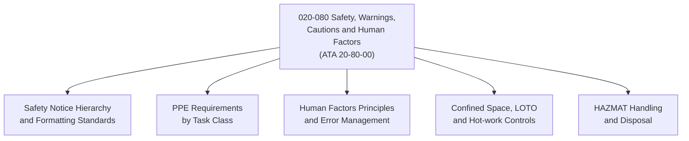

# ATLAS 020-029 · 02.020 · 020-080 — Safety, Warnings, Cautions and Human Factors

> **⚠ DEPRECATED / LEGACY COMPATIBILITY NODE** — See [`README.md`](./README.md) for migration guidance.

## 1. Purpose

Define the safety, warnings, cautions, notes, and human factors standards within ATLAS subsection `020`, aligned to ATA SNS `20-80-00`. Establishes the baseline safety communication and human factors framework applicable across all airframe maintenance documentation.

## 2. Scope

- Defines the hierarchy and formatting standards for safety notices: WARNING (risk of injury or death), CAUTION (risk of damage), NOTE (additional guidance).
- Covers personal protective equipment (PPE) requirements for airframe maintenance tasks: hearing protection, eye protection, respiratory protection, chemical-resistant gloves, and fall arrest.
- Establishes human factors principles: task saturation management, communication handover, shift-change briefing, error-likely conditions, and maintenance error decision aids (MEDA).
- Defines confined space entry procedures, electrical isolation (lock-out/tag-out), hazardous material (HAZMAT) handling, and hot-work permits.
- Does not replace aircraft maintenance manual (AMM) task-level warnings or company safety management system (SMS) procedures.

## 3. System Architecture

## 4. Footprint

| Metric | Value |
|---|---|
| Architecture | `ATLAS` — Aircraft Top Level Architecture Schema/System |
| Code range | `020-029` |
| Subsection | `020` — Standard Practices Airframe |
| Local section code | `020-080` |
| ATA SNS | `20-80-00` |
| Primary Q-Division | Q-GROUND |
| Governance class | `baseline` |
| Status | `deprecated` |
| Folder path | `Q+ATLANTIDE/000-099_ATLAS/020-029_Sistemas-Core-de-Aeronave/020_Standard-Practices-Airframe/` |
| Document | `020-080-Safety-Warnings-Cautions-and-Human-Factors.md` |

## 5. References

- ATA iSpec 2200 — Chapter 20-80, Standard Practices Airframe — Safety
- Subsection index [`./README.md`](./README.md)
- General [`./020-000-General.md`](./020-000-General.md)
