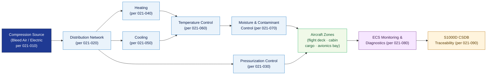

# ATLAS 020-029 · 02.021 — Air Conditioning and Pressurization · 021-000 General

## 1. Purpose

General entry-point for the *Air Conditioning and Pressurization* subsection (`021`) within ATLAS `020-029` — *Sistemas Core de Aeronave* — aligned to ATA 21-00-00. This section (`021-000`) introduces the Environmental Control System (ECS) architecture, its purpose within the Q+ATLANTIDE programme, and provides the normative foundation for all downstream sections (`021-010` through `021-090`).

This document is part of the **ATLAS-1000** register within the controlled **Q+ATLANTIDE** baseline[^baseline][^n001].

## 2. Scope

- Covers general principles, purpose, and architecture of the *Air Conditioning and Pressurization* system (ATA 21 / SNS 21-00-00) as applied to Q+ATLANTIDE programme aircraft.
- Inherits Q-Division authority and ORB support from the parent row in [`../../README.md` §3](../../README.md#3-architecture-table)[^archtable].
- Concepts in scope:
  - **System overview** — the ECS function: supplying conditioned air to the flight deck, cabin, cargo, and avionics bays at the correct temperature, pressure, humidity, and purity for personnel comfort, avionics cooling, and pressurisation safety.
  - **ECS architecture** — bleed-air or electrically-sourced airflow path from compression source through distribution, temperature and pressurisation control, moisture control, and exhaust/recirculation.
  - **System boundaries** — interfaces with pneumatic system (ATA 36), flight controls (ATA 27), oxygen system (ATA 35), and aircraft structure (ATA 53/57); exclusions from ECS scope.
  - **Normative references** — applicable regulatory and standards framework: EASA CS-25[^cs25], FAR 25[^far25], SAE AS8040[^as8040], ATA iSpec 2200[^ata2200], and S1000D[^s1000d].
  - **Applicability** — aircraft types, configurations, and variants of the Q+ATLANTIDE programme covered by this ATA 21 chapter.
- Downstream sections: `021-010` Compression · `021-020` Distribution · `021-030` Pressurization Control · `021-040` Heating · `021-050` Cooling · `021-060` Temperature Control · `021-070` Moisture and Air Contaminant Control · `021-080` ECS Monitoring and Diagnostics · `021-090` S1000D/CSDB Mapping.

## 3. Diagram — ECS Functional Architecture

Air from the compression source is conditioned (cooled, heated, humidity-controlled) and then distributed to aircraft zones; pressurisation control governs the differential pressure envelope.

## 4. Footprint

| Metric | Value |
|---|---|
| Architecture | `ATLAS` — Aircraft Top Level Architecture Schema/System (controlled term) |
| Master range | `000–099` |
| Code range | `020-029` |
| Section | `02` — Sistemas Core de Aeronave |
| Subsection | `021` — Air Conditioning and Pressurization |
| Local section code | `021-000` — General |
| ATA chapter | 21 |
| ATA SNS | 21-00-00 |
| Primary Q-Division | Q-AIR[^qdiv] |
| Support Q-Divisions | Q-MECHANICS, Q-DATAGOV, Q-GREENTECH |
| ORB support | ORB-PMO, ORB-LEG |
| Governance class | `baseline`[^gov] |
| Folder path | `Q+ATLANTIDE/000-099_ATLAS/020-029_Sistemas-Core-de-Aeronave/021_Air-Conditioning-and-Pressurization/` |
| Document | `021-000-General.md` (this file) |
| Parent subsection | [`README.md`](./README.md) |
| Parent architecture | [`../../README.md`](../../README.md) |
| Parent baseline | [`organization/Q+ATLANTIDE.md`](../../../../organization/Q+ATLANTIDE.md) |

## 5. References & Citations

[^baseline]: **Q+ATLANTIDE controlled baseline (v1.0.0)** — [`organization/Q+ATLANTIDE.md`](../../../../organization/Q+ATLANTIDE.md). Defines the controlled `000-999` architecture-band taxonomy and the ATLAS-1000 register subpart.

[^archtable]: **ATLAS §3 Architecture Table** — [`../../README.md` §3](../../README.md#3-architecture-table). Authoritative source for the `020-029` row (Section `02` — Sistemas Core de Aeronave, Primary Q-Division Q-AIR).

[^qdiv]: **Q-Division authority** — Q-Divisions provide technical authority over an architecture row (Q+ATLANTIDE Note N-002). See [`organization/Q+ATLANTIDE.md` §4](../../../../organization/Q+ATLANTIDE.md#4-notes).

[^gov]: **Governance class** — `baseline` denotes documents under controlled change management within the Q+ATLANTIDE baseline.

[^n001]: **Note N-001** — Q+ATLANTIDE (with its ATLAS-1000 register subpart) is a taxonomy and traceability ecosystem, not an organization chart. See [`organization/Q+ATLANTIDE.md` §4](../../../../organization/Q+ATLANTIDE.md#4-notes).

[^cs25]: **EASA CS-25 — Certification Specifications for Large Aeroplanes** — Subpart D (Design and Construction) and associated AMC covering pressurisation, ventilation, and ECS requirements.

[^far25]: **FAR Part 25 — Airworthiness Standards: Transport Category Airplanes** — §25.831 Ventilation, §25.841 Pressurized cabins — regulatory baseline for ECS design and airworthiness compliance.

[^as8040]: **SAE AS8040 — Minimum Performance Standard for Air Conditioning Systems** — Performance requirements for airborne air conditioning, pressurisation, and ventilation systems.

[^ata2200]: **ATA iSpec 2200 — Information Standards for Aviation Maintenance** — Governs ATA chapter numbering, section naming conventions, and data-module structure for ECS maintenance artefacts.

[^s1000d]: **S1000D Issue 6.0 — International specification for technical publications** — Common Source DataBase (CSDB) and Data Module Code (DMC) specification used for all Q+ATLANTIDE artefacts.

### Applicable standards

- EASA CS-25[^cs25]
- FAR Part 25[^far25]
- SAE AS8040[^as8040]
- ATA iSpec 2200[^ata2200]
- S1000D Issue 6.0[^s1000d]
